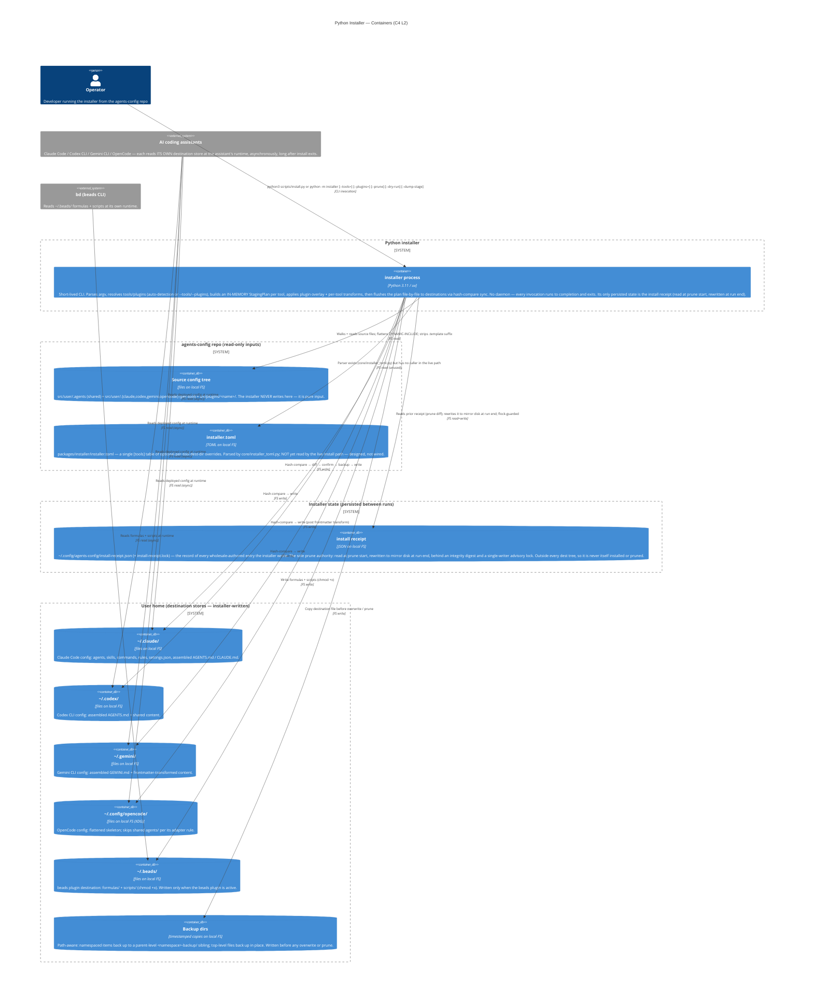

# Python Installer — C4 Level 2: Container

> **Up**: [index](index.md)
> **Next (reading order)**: [Sequences](sequences.md)
> **Source bead**: `agents-config-w1qls.9`
> **Source spec**: [`installer-design.md`](installer-design.md)

## Glossary

| Term | Meaning |
|---|---|
| Container (C4 sense) | A separately runnable process or persistent data store — NOT a Linux / Docker container. |
| Component | A code module inside a container; appears at C4 L3, not L2. |
| Source tree | The repo's `src/user/` (shared `.agents/` + per-tool `.claude/`, `.codex/`, `.gemini/`, `.opencode/`) and `src/plugins/<name>/`. The installer's **read-only** input. |
| Destination store | A per-tool config directory the installer writes into (`~/.claude/`, `~/.codex/`, `~/.gemini/`, `~/.config/opencode/`, `~/.beads/`). |
| `StagingPlan` | The installer's **in-memory** `dict[Path, StagedItem]`. It is process-internal state, NOT a container — it appears at L3 / [data-view](data-view.md), never on this diagram. `--dump-stage` materialises it to disk for debugging only. |
| `installer.toml` | The installer's structured config file — a single `[tools]` table of optional per-tool dest-dir overrides, parsed by `core/installer_toml.py`. **Designed, parsed, not yet wired**: nothing in the live install path calls the loader, so a declared override has no runtime effect — dest resolution always goes through `adapter.dest_dir(home)`. |
| Install receipt | `~/.config/agents-config/install-receipt.json` — the installer's persisted record of every wholesale-authored entry it wrote, plus its sibling `install-receipt.lock`. The sole prune authority; read at prune start, rewritten (mirrors disk) at run end. |
| Backup dir | A path-aware sibling directory where the installer copies a destination file before overwriting or pruning it. |

## Purpose

Open the `installer` system boundary and show its runnable / persistent units. Answers: *what runs, what does it read, what does it write, and who consumes the output?*

A **container** here is a C4 container: a separately runnable process or a persistent data store. The installer is a single short-lived **process**; everything else on this diagram is a **data store** it reads or writes. The `core/` engine, the per-tool adapters, the per-plugin adapters, and the merge strategies all live **inside** that one process and are therefore **components** — they appear at L3 ([`c4-l3-engine.md`](c4-l3-engine.md)), not here.

The single most important thing this diagram makes explicit: the installer's central artifact, the `StagingPlan`, is **in-memory** — it is built, merged, and transformed entirely in process memory and only ever touches disk when `sync` flushes individual files to their destinations. It is **not** a staging container on this diagram. (`install.sh` used a temp directory; the Python rewrite deliberately does not.)

## Diagram

## Element notes

### The installer process

The whole installer runs here. Every invocation is **terminal** — parse argv, build `Config`, build the `StagingPlan`(s), flush to disk, exit. There is no daemon and no background work; the one piece of state that *does* survive a run is the install receipt (read at prune start, rewritten at run end). Internally — at L3 — this process is composed of a tool-agnostic `core/` engine (`model`, `io_port`, `templates`, `staging`, `sync`, the receipt-based prune subsystem `run`/`receipt*`/`prune_hash`/`prune_flow`/`ownership`, `merge/*`), per-tool `tools/` adapters, per-plugin `plugins/` adapters, and a `cli`/`config`/`orchestrator` top layer. Those components are drawn in [`c4-l3-engine.md`](c4-l3-engine.md).

The installer's entry points are `python3 scripts/install.py` (a thin stub: `from installer.cli import main`) and the module form `python -m installer` (requires `packages/installer/__main__.py`); both invoke the same `installer.cli.main`.

### Read-only inputs

- **Source config tree** — `src/user/.agents/` (shared content installed to all tools), `src/user/.{claude,codex,gemini,opencode}/` (per-tool content), and `src/plugins/<name>/` (optional overlay content). The installer **never writes here**; this is the architectural guarantee that makes the source the single canonical authoring surface (the AGENTS.md "always edit source, never deployed artifacts" rule depends on it).
- **`installer.toml`** — a single `[tools]` table of optional per-tool dest-dir overrides, parsed by `core/installer_toml.py`. **Designed, parsed, but not yet wired**: nothing in the live install path calls the loader, so a declared override has no runtime effect today — dest resolution goes through `adapter.dest_dir(home)` everywhere (including the prune scan). This is the sole installer config file; pruning is **not** configured here (it is driven by the install receipt, below).

### Destination stores (installer-written)

One store per tool (`~/.claude`, `~/.codex`, `~/.gemini`, `~/.config/opencode`) plus `~/.beads` when the beads plugin is active. The installer writes each store via the hash-compare `sync` engine: unchanged files are skipped, changed files are diffed and (interactively) confirmed, and any file about to be overwritten is first copied to a **path-aware backup**. Which stores are written depends on tool auto-detection (claude always; others when their config dir exists or `--tools=` forces them) and plugin activation.

### Backup dirs

Not a single directory but a routing rule: a file inside a managed namespace (`commands` / `skills` / `agents` / `rules` / `formulas`) backs up to a parent-level `<namespace>-backup/` sibling — deliberately **outside** the namespace so the assistant's discovery walk does not pick the backup up as a real item — while a top-level file backs up in place. Backups are written before overwrite (`sync`) and before prune (`prune`).

### Install receipt (installer-owned, persisted between runs)

`~/.config/agents-config/install-receipt.json` is the installer's **one** piece of persisted state — a tool-neutral state dir deliberately outside every destination tree, so the receipt is never itself installed or pruned. It records every wholesale-authored entry the installer wrote (namespaced `commands`/`skills`/`agents`/`rules` + plugin route dests) and is the **sole prune authority**: a recorded entry no longer in this run's desired plan, in scope, is an orphan. The receipt is read at the start of the prune step, validated against its own `integrity` digest, and atomically rewritten to mirror disk at run end — the whole read → install → prune → write section held under a single-writer advisory lock (the sibling `install-receipt.lock`). It never records a merge-target (`settings.json`, the assembled instruction files), so it adds no new deletion surface.

### External consumers

The four AI coding assistants and the `bd` CLI are **external systems** that read their deployed stores at **their own runtime**, asynchronously, long after the installer has exited. The installer has no live relationship with them — it deposits files and leaves. This asynchrony is why the installer needs no notion of a running tool; it only needs to know each tool's destination path and content-shaping rules, both supplied by the `ToolAdapter`.

## Container-relationship discipline (worth memorising)

- **The source tree is read-only; the installer owns the writes to destinations.** There is exactly one writer of `~/.claude` et al. during install (the installer) and exactly one writer of `src/` (the human author, via the repo). The installer never crosses that line.
- **The `StagingPlan` is in-memory and never appears here.** It is built, overlaid, and transformed in process memory; only `sync` touches disk, file-by-file. The one exception, `--dump-stage <path>`, materialises the plan to a throwaway directory for debugging and exits without writing any real destination — it is a diagnostic, not the operational path.
- **Consumption is asynchronous.** The assistants read their stores whenever *they* run, not when the installer runs. The installer has no runtime coupling to any tool — only a path + content contract via the adapter.
- **`installer.toml` is config, not state — and not yet wired.** Its loader (`core/installer_toml.py`) has no caller in the live install path today; a declared `[tools]` override has no effect until a future story threads it into dest resolution. Once wired, it will be read, never written, by the install path. The installer's persisted *state* lives separately in the **install receipt** (`~/.config/agents-config/install-receipt.json`) — read at prune start and rewritten at run end — not in `installer.toml`.
- **Tool set and plugin set are resolved once, up front.** `resolve_tools`/`resolve_plugins` (auto-detection + argv) fix the tool/plugin set before staging begins; `installer.toml` plays no part in this today — its loader is unwired.

## What this diagram does NOT show

- **Components inside the installer process** — the `core/` engine, `tools/` + `plugins/` adapters, and merge strategies live in [`c4-l3-engine.md`](c4-l3-engine.md).
- **Execution order** — detect → stage → overlay → merge → sync → prune is the subject of [`sequences.md`](sequences.md).
- **The `StagingPlan` / `StagedItem` / `Config` data shapes** and the `(FileKind, namespace)` merge-dispatch table — see [`data-view.md`](data-view.md).
- **DYNAMIC-INCLUDE flattening + the Gemini frontmatter transform mechanics** — surfaced as components at L3; specified in `installer-design.md`.

## Cross-references

- **Next (reading order)**: [Sequences](sequences.md) — how one install invocation runs
- **Related**: [C4 L3 — Engine](c4-l3-engine.md) — the components inside the installer process
- **Companion source**: [`installer-design.md`](installer-design.md) §"Repo layout", §"Package layout", §"Configuration — installer.toml"
