# Python Installer — C4 Level 3: Engine

> **Up**: [index](index.md)
> **Previous (reading order)**: [Sequences](sequences.md)
> **Next (reading order)**: [Data View](data-view.md)
> **Source bead**: `agents-config-w1qls.9`
> **Source spec**: [`installer-design.md`](installer-design.md) — §"Package layout", §"Data model highlights"
> **Container**: the `installer` process (see [`c4-l2-container.md`](c4-l2-container.md))

## Glossary

| Term | Meaning |
|---|---|
| `core/` | The pure, tool-agnostic engine. Knows nothing about any specific tool; parameterised by a `ToolAdapter` and a source root. Fully unit-testable against a `FakeToolAdapter`. |
| `orchestrator` | `orchestrator.py`'s `stage_and_transform` — staging only: per detected tool, drives build_plan → plugin overlay → merge-on-collision → post-staging transforms, returning every tool's finished plan. `cli.py`, not `orchestrator.py`, is the true top-level controller — it calls `stage_and_transform` once, then separately drives sync and prune via `core/run.py`. |
| `ToolAdapter` | Protocol abstracting per-tool behaviour: `source_dir`, `dest_dir`, `is_detected`, `scoped_namespaces`, `should_install_namespace`, `post_staging_transforms`. One implementation per tool. |
| `PluginAdapter` | Protocol for an optional plugin overlay (e.g. beads). String-keyed registry; dynamically discovered by scanning `src/plugins/`. |
| `MergeStrategy` | Collision-resolution protocol; one class per strategy module; dispatched by the registry on `(FileKind, namespace)`. |
| `IOPort` | The single I/O abstraction. `TerminalIO` (real, via `rich`) and `ScriptedIO` (test fake) are the two implementations; no other module calls `print`/`input`. |
| Protocol seam | A `typing.Protocol` boundary (`ToolAdapter`, `PluginAdapter`, `MergeStrategy`, `IOPort`) across which tests substitute a fake. The four seams are what make the engine unit-testable in isolation. |

## Purpose

Open the `installer` process boundary and show its components. Answers: *what code inside the process actually does the work, how is the tool-agnostic core kept separate from tool/plugin specifics, and where are the seams a test substitutes a fake across?*

This is the most-detailed structural artifact in the set. It is the L3 zoom an implementer reads alongside the story they are wiring (e.g. C.1 staging, E.* merge strategies, F.2 plugin overlay).

## Diagram

```mermaid
C4Component
    title Python Installer — internal components (C4 L3)

    Person(operator, "Operator")

    Container_Boundary(proc, "installer process") {

        Component(cli, "cli.py", "Python", "The real top-level controller: resolve tools/plugins; load .installignore; drive orchestrator.stage_and_transform, then core/run.py's install_pipeline / install_plugin_routes / prune_pipeline / record_receipt directly. Wires IOPort (TerminalIO). Enforces --dump-stage vs --prune/--prune-only mutual exclusion; catches ConsentRequiredError as exit 1.")
        Component(config, "config.py", "Python", "Frozen Config dataclass (home, tools, auto_yes — the only fields today) plus resolve_tools / resolve_plugins for auto-detection, called once up front by cli.py. Does NOT load installer.toml — core/installer_toml.py's loader is parsed but unwired (see data-view.md).")
        Component(orch, "orchestrator.py", "Python", "stage_and_transform: per detected tool, build_plan -> overlay_plugins -> apply_extensions -> flatten DYNAMIC-INCLUDE -> adapter.post_staging_transforms; returns every tool's finished StagingPlan to cli.py in one call. Does NOT sync or prune — see sequences.md Sequence 1.")

        Container_Boundary(core, "core/ — pure, tool-agnostic engine") {
            Component(model, "model.py", "Python", "FileKind, StagedItem, StagingPlan, Provenance, Orphan, IncludeDirective (FileInclude | AllRulesInclude | NamedRulesInclude), Counters, Tool enum. No behaviour — pure data.")
            Component(ioport, "io_port.py", "Python", "IOPort protocol + TerminalIO (rich) + ScriptedIO (test). The only place stdin/stdout is touched.")
            Component(templates, "templates.py", "Python", "DYNAMIC-INCLUDE flattening: file form, ALL-RULES form, and named-subset form (sorted or listed-order, joined with --- separators).")
            Component(staging, "staging.py", "Python", "Source-walk -> StagingPlan, parameterised by a ToolAdapter. Strips .template suffix; scopes namespaces; consults .installignore; calls adapter.post_staging_transforms.")
            Component(ignore, "installignore.py", "Python", "Loads .installignore, the shared exclusion manifest staging.py and overlay.py both consult. Missing/unreadable/non-UTF-8 is a HARD ERROR (cli.py exit 2) — load-bearing policy, not an optional default.")
            Component(overlay, "overlay.py", "Python", "Phase 6: overlay_plugins — merges each active plugin's content onto the base plan, alphabetical plugin order. Carrier-merges a plugin's disjoint files into a shared_carrier skills/agents DIR; every other collision routes through the merge registry (DIR is fatal).")
            Component(sync, "sync.py", "Python", "Phase 7: require_consent guard -> hash-compare -> diff -> confirm -> path-aware backup -> write. Reports per-item InstallOutcome (WRITTEN / SKIPPED_IDENTICAL / DECLINED). Honours --dry-run.")
            Component(consent, "consent.py", "Python", "require_consent: hard-fails a non-interactive run (no TTY) that passes neither --yes nor --dry-run, before any write. Raises ConsentRequiredError, caught by cli.py as exit 1.")
            Component(run, "run.py", "Python", "Run-level composition, called directly by cli.py after staging finishes for every tool: install_pipeline + install_plugin_routes (the plugin-route analog, e.g. beads' ~/.beads/formulas + scripts) + prune_pipeline (diff -> partition -> run_prune) + record_receipt (mirrors disk).")
            Component(receipt, "receipt.py + receipt_store.py + receipt_lock.py", "Python", "Receipt / ReceiptEntry model + canonical serialization + integrity digest; read (MISSING vs CORRUPT) / atomic write; single-writer advisory flock.")
            Component(rdiff, "receipt_diff.py + receipt_build.py", "Python", "scope_owners + validate_entry + diff_orphans -> Orphan list; desired_staged_keys / desired_route_keys, entry builders, merge_receipt.")
            Component(phash, "prune_hash.py", "Python", "is_prunable + partition_file_orphans: hash/type-aware prune-vs-relinquish, re-checked at the deletion boundary (TOCTOU guard).")
            Component(pflow, "prune_flow.py", "Python", "run_prune — interactive backup + consent (all / one-by-one / cancel or --yes) + delete; revalidate callback at the destructive boundary.")
            Component(ownership, "ownership.py", "Python", "Wholesale-vs-merge-target classifier: which staged items the receipt records.")
            Component(mreg, "merge/registry.py", "Python", "(FileKind, namespace) -> MergeStrategy dispatch. Single lookup table.")
            Component(mbase, "merge/base.py", "Python", "MergeStrategy protocol: merge(existing, incoming) -> StagedItem.")
            Component(strat, "merge/strategies/* (5 modules)", "Python", "append_rules, fatal, json_union, last_wins_warn, last_wins_silent. One class + one test file each.")
        }

        Container_Boundary(tools, "tools/ — per-tool adapters") {
            Component(tbase, "base.py", "Python", "ToolAdapter protocol.")
            Component(tclaude, "claude.py", "Python", "Claude adapter.")
            Component(tcodex, "codex.py", "Python", "Codex adapter (placeholder extensions).")
            Component(tgemini, "gemini.py", "Python", "Gemini adapter — OWNS the frontmatter transform (post_staging_transforms).")
            Component(topencode, "opencode.py", "Python", "OpenCode adapter — XDG dest + 'skip shared agents/' rule.")
            Component(treg, "registry.py", "Python", "Tool-enum-keyed adapter registry.")
        }

        Container_Boundary(plugins, "plugins/ — per-plugin adapters") {
            Component(pbase, "base.py", "Python", "PluginAdapter protocol.")
            Component(pbeads, "beads.py", "Python", "beads adapter — ~/.beads dest, chmod +x on scripts.")
            Component(pext, "extensions.py", "Python", "apply_extensions(): YAML-patch base markdown assets post-staging (F.5).")
            Component(preg, "registry.py", "Python", "String-keyed plugin registry; dynamic discovery via src/plugins/ scan.")
        }
    }

    System_Ext(src_ext, "Source config tree", "src/user/ + src/plugins/ (read-only)")
    System_Ext(dest_ext, "Destination stores", "~/.claude, ~/.codex, ~/.gemini, ~/.config/opencode, ~/.beads")
    System_Ext(state_ext, "Install receipt", "~/.config/agents-config/install-receipt.json (+ .lock) — persisted prune authority")
    System_Ext(term_ext, "Terminal", "stdin / stdout — diffs + confirmations")

    Rel(operator, cli, "python3 scripts/install.py ...")
    Rel(cli, config, "resolve_tools / resolve_plugins")
    Rel(cli, ignore, "load .installignore (hard error if missing/unreadable)")
    Rel(cli, orch, "stage_and_transform(tools, plugins) -- builds every tool's plan, whole-fleet, before any sync")
    Rel(config, treg, "auto-detect tools")
    Rel(config, preg, "discover plugins")
    Rel(config, src_ext, "probe tool config dirs")

    Rel(orch, staging, "per tool: build_plan(adapter)")
    Rel(orch, overlay, "overlay_plugins(plan, plugins) -- Phase 6")
    Rel(orch, pext, "apply_extensions per tool plan")

    Rel(cli, run, "install_pipeline + install_plugin_routes (separate whole-fleet sync pass), then optional prune_pipeline + record_receipt")
    Rel(run, sync, "flush each tool's / plugin's plan to dest")
    Rel(cli, consent, "catches ConsentRequiredError -> exit 1")
    Rel(overlay, mreg, "collision -> strategy (plugin overlay)")
    Rel(overlay, ignore, "consult exclusion set for plugin namespace walk")

    Rel(staging, src_ext, "walk + read source")
    Rel(staging, templates, "flatten DYNAMIC-INCLUDE")
    Rel(staging, treg, "ToolAdapter behaviour (dest, namespaces, filter)")
    Rel(staging, tgemini, "post_staging_transforms (frontmatter)")
    Rel(staging, model, "build StagedItem / StagingPlan")
    Rel(staging, ignore, "consult exclusion set during namespace walk")
    Rel(staging, mreg, "collision -> strategy (base staging)")

    Rel(pext, preg, "resolve active plugin patches")
    Rel(mreg, strat, "dispatch")
    Rel(mreg, mbase, "protocol")
    Rel(strat, model, "merge StagedItem")

    Rel(sync, consent, "require_consent guard before any write")
    Rel(sync, ioport, "show_diff / confirm")
    Rel(sync, dest_ext, "backup + write")
    Rel(run, rdiff, "diff prior receipt vs desired plan -> orphans")
    Rel(run, phash, "partition orphans (hash/type-aware)")
    Rel(run, pflow, "run_prune confirmed orphans")
    Rel(run, receipt, "read prior / write new receipt (flock-guarded)")
    Rel(pflow, ioport, "confirm prune (three-way / per-item)")
    Rel(pflow, dest_ext, "backup + remove")
    Rel(receipt, state_ext, "read / atomic write install-receipt.json")
    Rel(ioport, term_ext, "stdin/stdout")

    Rel(tclaude, tbase, "implements")
    Rel(tcodex, tbase, "implements")
    Rel(tgemini, tbase, "implements")
    Rel(topencode, tbase, "implements")
    Rel(pbeads, pbase, "implements")

    UpdateLayoutConfig($c4ShapeInRow="3", $c4BoundaryInRow="2")
```

## Component notes

### Top layer — `cli` / `config` / `orchestrator`

- **`cli.py`** is the true top-level controller, not just argv parsing: it resolves tools/plugins (via `config.py`), loads `.installignore` (hard error if missing/unreadable — load-bearing policy), calls `orchestrator.stage_and_transform` **once** to build every tool's `StagingPlan` (a whole-fleet pass), builds the frozen `Config`, then drives `core/run.py`'s `install_pipeline` + `install_plugin_routes` — a **second, separate** whole-fleet pass that syncs every tool's / plugin's plan to disk — and, if requested, `prune_pipeline` + `record_receipt`, all under the single-writer receipt lock. It owns argv-level validation (the `--dump-stage` ⊕ `--prune`/`--prune-only` mutual exclusion) and catches `ConsentRequiredError` as exit 1.
- **`config.py`** resolves *what will be installed*: `resolve_tools` (auto-detection — claude always; others when their config dir exists or `--tools=` forces them — note this checks for config **directories**, not running binaries) and `resolve_plugins` (scan `src/plugins/`), both called once, up front, by `cli.py`. The frozen `Config` dataclass itself carries only `home`, `tools`, and `auto_yes` today — see [`data-view.md`](data-view.md) for the full field-by-field accounting, including `installer.toml`'s unwired loader.
- **`orchestrator.py`** (`stage_and_transform`) is staging only, not the full control flow: for each detected tool it builds that tool's `StagingPlan` (`core/staging.py`), overlays active plugins (`core/overlay.py`, Phase 6), applies plugin YAML extensions, flattens DYNAMIC-INCLUDE, and runs the tool's `post_staging_transforms` — returning every tool's finished plan to `cli.py` in one call. It does **not** sync or prune; those run directly from `cli.py` via `core/run.py`, as a separate whole-fleet pass over all tools **after** every tool has finished staging (see [`sequences.md`](sequences.md) Sequence 1).

### `core/` — the tool-agnostic engine

The engine knows nothing about any specific tool; it takes a `ToolAdapter` and a source root and runs. This is the load-bearing separation in the whole design — it is what lets ~80–100 unit tests exercise the engine through a `FakeToolAdapter` without any real tool present.

- **`model.py`** is pure data — the enums and dataclasses every other module passes around (detailed in [`data-view.md`](data-view.md)). No behaviour lives here.
- **`io_port.py`** is the I/O chokepoint. `sync` and `prune` reach the terminal only through the `IOPort` protocol; tests inject `ScriptedIO` to drive every prompt deterministically.
- **`templates.py`** does DYNAMIC-INCLUDE flattening. The file form inlines one fragment; the ALL-RULES form expands the staged rules collection sorted + `\n---\n`-joined. (The Gemini frontmatter conversion is invoked here in tests but **lives in `tools/gemini.py`** — the engine stays tool-agnostic.)
- **`staging.py`** walks the source, strips the `.template` suffix, scopes files into namespaces, consults `.installignore`, builds `StagedItem`s into the `StagingPlan`, and calls the adapter's `post_staging_transforms`. It is parameterised by the `ToolAdapter`, never branching on a tool name itself. A same-dest collision within base staging (shared + per-tool content) routes through the merge registry, same as plugin overlay.
- **`installignore.py`** loads `.installignore`, the shared exclusion manifest both `staging.py` and `overlay.py` consult while walking a namespace. A missing, unreadable, or non-UTF-8 file is a **hard error** (`cli.py` exit 2) — the manifest is load-bearing policy, not an optional default; a silent empty-exclusion fallback would re-leak namespace dev-docs identically on both installers, the failure mode the golden-master parity oracle can't see.
- **`overlay.py`** (`overlay_plugins`, Phase 6) merges each active plugin's `.<tool>/` (tool scope) and shared `.agents/` content onto the base plan, in alphabetical plugin order so last-wins collisions resolve deterministically. A plugin directory colliding with a `shared_carrier` skills/agents `DIR` carrier-merges when the two directories' file sets are disjoint (recording the plugin's files in `StagingPlan.dir_overrides`); every other collision — including a second plugin landing on an already-merged carrier — routes through the merge registry, where `FileKind.DIR` is fatal.
- **`sync.py`** is Phase 7: `require_consent` guards up front (hard-fails a non-interactive run with neither `--yes` nor `--dry-run`), then for each planned file, hash-compare against the destination; identical → skip; different → diff via `IOPort`, confirm, path-aware backup, write. It reports a per-item `InstallOutcome` (`WRITTEN` / `SKIPPED_IDENTICAL` / `DECLINED`, with the real `sha256`) so the receipt records only what was actually written as our bytes. `--dry-run` short-circuits before any write.
- **`consent.py`** (`require_consent`) is the non-interactive consent guard: raises `ConsentRequiredError` before any write when stdin is not a TTY and neither `--yes` nor `--dry-run` was passed. Called from `sync.py`'s `sync_plan`/`sync_routes`; `cli.py` catches the exception and exits 1.
- **The receipt-based prune subsystem** replaces the old glob scan. It is several small, independently-testable engine modules composed in `run.py`:
  - **`run.py`** is the run-level composition, called directly by `cli.py` (not `orchestrator.py`) once staging has finished for every tool — `install_pipeline` (walk every tool's plan to disk), `install_plugin_routes` (the plugin-side analog: walk every active plugin's bespoke routes, e.g. beads' `~/.beads/formulas` + `scripts`), `prune_pipeline` (diff → partition → `run_prune`), and `record_receipt` (mirror disk into the new receipt). `cli.main` holds the single-writer lock across all of it.
  - **`receipt.py` / `receipt_store.py` / `receipt_lock.py`** are the persisted-state layer: the `Receipt` / `ReceiptEntry` model with canonical serialization + `integrity` digest; the store that reads (distinguishing `MISSING` → bootstrap empty from `CORRUPT` → fail closed) and atomically writes; and the advisory `flock` that serializes the whole read → install → prune → write section.
  - **`receipt_diff.py`** finds orphans: `scope_owners` (resolved tools ∪ discovered plugins − tool names ∪ prior-receipt plugin owners), `validate_entry` (structural + symlink-aware containment + root legitimacy — live code for tools/discovered plugins, the `roots` allowlist for retired plugins), and `diff_orphans` (in scope ∧ not desired ∧ valid → `Orphan`).
  - **`receipt_build.py`** builds the plan-derived `desired_staged_keys` / `desired_route_keys` and the install-outcome-derived `ReceiptEntry` set, and `merge_receipt` produces the mirrors-disk `(prior − pruned − relinquished) | installed`.
  - **`prune_hash.py`** (`is_prunable` / `partition_file_orphans`) decides prune-vs-relinquish by on-disk hash (files) or type (dirs), evaluated against the live FS at scan time AND re-checked at the deletion boundary (TOCTOU guard).
  - **`prune_flow.py`** (`run_prune`) is the unchanged interactive executor: backup-before-delete always, three-way (all / one-by-one / cancel) or `--yes` consent, with a `revalidate` callback enforcing the boundary re-check.
  - **`ownership.py`** is the wholesale-vs-merge-target classifier deciding which staged items the receipt records (never `settings.json` or the assembled instruction files).
- **`merge/`** is the collision matrix: `registry.py` maps `(FileKind, namespace)` to a strategy; `base.py` is the `MergeStrategy` protocol; `strategies/` holds the five concrete classes, each in its own module with its own test.

### `tools/` — per-tool adapters

One module per tool behind the `ToolAdapter` protocol (`base.py`). Each adapter answers the engine's questions: where is this tool's source, where is its destination, is it detected, which namespaces does it scope, should this namespace be installed from this source, and what transforms run post-staging. The non-trivial adapters: **`gemini.py`** owns the frontmatter transform; **`opencode.py`** owns the XDG destination and the "skip shared `agents/`" rule. `registry.py` is the `Tool`-enum-keyed lookup.

### `plugins/` — per-plugin adapters

One module per plugin behind the `PluginAdapter` protocol (`base.py`), **string-keyed** in `registry.py` and discovered dynamically by scanning `src/plugins/` — adding a plugin requires no change to `model.py`. **`beads.py`** owns the `~/.beads` destination + `chmod +x`. **`extensions.py`** (`apply_extensions()`, story F.5) applies plugin-declared YAML patches to base markdown assets post-staging, once per enabled tool against that tool's plan.

### The four protocol seams

| Seam | Protocol module | What a test substitutes |
|---|---|---|
| Tool behaviour | `tools/base.py` `ToolAdapter` | `FakeToolAdapter` — exercises the core engine with no real tool |
| Plugin overlay | `plugins/base.py` `PluginAdapter` | synthetic test-plugin fixture (story F.1) |
| Collision resolution | `core/merge/base.py` `MergeStrategy` | swap a registry entry to assert dispatch |
| All I/O | `core/io_port.py` `IOPort` | `ScriptedIO` — drives prompts, records transcript |

Every cross-boundary dependency is one of these four protocols. That is the design's testability contract: no engine module hard-codes a tool, a plugin, a strategy, or a print statement.

## What this diagram does NOT show

- **Execution order across the components** — detect → stage → overlay → merge → sync → prune is the subject of [`sequences.md`](sequences.md).
- **The data shapes** the components pass around (`StagingPlan`, `StagedItem`, `Config`, …) and the merge-dispatch table — see [`data-view.md`](data-view.md).
- **The per-strategy merge mechanics** (append separator placement, JSON deep-union rules, fatal message format) — specified in `installer-design.md` §"Test architecture" and per-strategy in the E.* stories.
- **The container boundary + external stores at process granularity** — see [`c4-l2-container.md`](c4-l2-container.md).

## Cross-references

- **Previous (reading order)**: [Sequences](sequences.md) — the flows these components execute
- **Next (reading order)**: [Data View](data-view.md) — the data these components read / build / write
- **Companion structural view**: [`c4-l2-container.md`](c4-l2-container.md)
- **Source spec**: [`installer-design.md`](installer-design.md) §"Package layout", §"Data model highlights", §"IOPort protocol"
