# Python Installer — C4 Level 3: Engine

> **Up**: [index](index.md)
> **Previous (reading order)**: [Sequences](sequences.md)
> **Next (reading order)**: [Data View](data-view.md)
> **Source bead**: `agents-config-w1qls.9`
> **Source spec**: [`installer-design.md`](installer-design.md) — §"Package layout", §"Data model highlights"
> **Container**: the `installer` process (see [`c4-l2-container.md`](c4-l2-container.md))

## Glossary

| Term | Meaning |
|---|---|
| `core/` | The pure, tool-agnostic engine. Knows nothing about any specific tool; parameterised by a `ToolAdapter` and a source root. Fully unit-testable against a `FakeToolAdapter`. |
| `orchestrator` | The top-level controller. For each detected tool it drives staging → plugin overlay → merge → sync, then optional prune. Composes the core engines with the adapters. |
| `ToolAdapter` | Protocol abstracting per-tool behaviour: `source_dir`, `dest_dir`, `is_detected`, `scoped_namespaces`, `should_install_namespace`, `post_staging_transforms`. One implementation per tool. |
| `PluginAdapter` | Protocol for an optional plugin overlay (e.g. beads). String-keyed registry; dynamically discovered by scanning `src/plugins/`. |
| `MergeStrategy` | Collision-resolution protocol; one class per strategy module; dispatched by the registry on `(FileKind, namespace)`. |
| `IOPort` | The single I/O abstraction. `TerminalIO` (real, via `rich`) and `ScriptedIO` (test fake) are the two implementations; no other module calls `print`/`input`. |
| Protocol seam | A `typing.Protocol` boundary (`ToolAdapter`, `PluginAdapter`, `MergeStrategy`, `IOPort`) across which tests substitute a fake. The four seams are what make the engine unit-testable in isolation. |

## Purpose

Open the `installer` process boundary and show its components. Answers: *what code inside the process actually does the work, how is the tool-agnostic core kept separate from tool/plugin specifics, and where are the seams a test substitutes a fake across?*

This is the most-detailed structural artifact in the set. It is the L3 zoom an implementer reads alongside the story they are wiring (e.g. C.1 staging, E.* merge strategies, F.2 plugin overlay).

## Diagram

```mermaid
C4Component
    title Python Installer — internal components (C4 L3)

    Person(operator, "Operator")

    Container_Boundary(proc, "installer process") {

        Component(cli, "cli.py", "Python", "Parse argv; build Config; wire IOPort (TerminalIO); invoke orchestrator. Enforces --dump-stage vs --prune/--prune-only mutual exclusion.")
        Component(config, "config.py", "Python", "Frozen Config dataclass. Tool + plugin auto-detection; loads installer.toml. Resolves the tool set + plugin set ONCE, up front.")
        Component(orch, "orchestrator.py", "Python", "Top-level controller. Per detected tool: staging(adapter) -> plugin overlay -> merge-on-collision -> sync; then optional prune. Composes core engines + adapters.")

        Container_Boundary(core, "core/ — pure, tool-agnostic engine") {
            Component(model, "model.py", "Python", "FileKind, StagedItem, StagingPlan, Provenance, Orphan, IncludeDirective (FileInclude | AllRulesInclude), Counters, Tool enum. No behaviour — pure data.")
            Component(ioport, "io_port.py", "Python", "IOPort protocol + TerminalIO (rich) + ScriptedIO (test). The only place stdin/stdout is touched.")
            Component(templates, "templates.py", "Python", "DYNAMIC-INCLUDE flattening: file form + ALL-RULES form (sorted, joined with --- separators).")
            Component(staging, "staging.py", "Python", "Source-walk -> StagingPlan, parameterised by a ToolAdapter. Strips .template suffix; scopes namespaces; calls adapter.post_staging_transforms.")
            Component(sync, "sync.py", "Python", "Phase 7: hash-compare -> diff -> confirm -> path-aware backup -> write. Honours --dry-run.")
            Component(prune, "prune.py", "Python", "Orphan scan (dest vs plan + installer.toml retired globs) + interactive prune flow.")
            Component(mreg, "merge/registry.py", "Python", "(FileKind, namespace) -> MergeStrategy dispatch. Single lookup table.")
            Component(mbase, "merge/base.py", "Python", "MergeStrategy protocol: merge(existing, incoming) -> StagedItem.")
            Component(strat, "merge/strategies/* (5 modules)", "Python", "append_rules, fatal, json_union, last_wins_warn, last_wins_silent. One class + one test file each.")
        }

        Container_Boundary(tools, "tools/ — per-tool adapters") {
            Component(tbase, "base.py", "Python", "ToolAdapter protocol.")
            Component(tclaude, "claude.py", "Python", "Claude adapter.")
            Component(tcodex, "codex.py", "Python", "Codex adapter (placeholder extensions).")
            Component(tgemini, "gemini.py", "Python", "Gemini adapter — OWNS the frontmatter transform (post_staging_transforms).")
            Component(topencode, "opencode.py", "Python", "OpenCode adapter — XDG dest + 'skip shared agents/' rule.")
            Component(treg, "registry.py", "Python", "Tool-enum-keyed adapter registry.")
        }

        Container_Boundary(plugins, "plugins/ — per-plugin adapters") {
            Component(pbase, "base.py", "Python", "PluginAdapter protocol.")
            Component(pbeads, "beads.py", "Python", "beads adapter — ~/.beads dest, chmod +x on scripts.")
            Component(pext, "extensions.py", "Python", "apply_extensions(): YAML-patch base markdown assets post-staging (F.5).")
            Component(preg, "registry.py", "Python", "String-keyed plugin registry; dynamic discovery via src/plugins/ scan.")
        }
    }

    System_Ext(src_ext, "Source config tree", "src/user/ + src/plugins/ (read-only)")
    System_Ext(dest_ext, "Destination stores", "~/.claude, ~/.codex, ~/.gemini, ~/.config/opencode, ~/.beads")
    System_Ext(term_ext, "Terminal", "stdin / stdout — diffs + confirmations")

    Rel(operator, cli, "python3 scripts/install.py ...")
    Rel(cli, config, "build frozen Config")
    Rel(cli, orch, "invoke with Config + IOPort")
    Rel(config, treg, "auto-detect tools")
    Rel(config, preg, "discover plugins")
    Rel(config, src_ext, "probe installer.toml + tool dirs")

    Rel(orch, staging, "per tool: build StagingPlan(adapter)")
    Rel(orch, pext, "apply_extensions per tool plan")
    Rel(orch, mreg, "collision -> strategy")
    Rel(orch, sync, "flush plan to dest")
    Rel(orch, prune, "optional: scan + prune")

    Rel(staging, src_ext, "walk + read source")
    Rel(staging, templates, "flatten DYNAMIC-INCLUDE")
    Rel(staging, treg, "ToolAdapter behaviour (dest, namespaces, filter)")
    Rel(staging, tgemini, "post_staging_transforms (frontmatter)")
    Rel(staging, model, "build StagedItem / StagingPlan")

    Rel(pext, preg, "resolve active plugin patches")
    Rel(mreg, strat, "dispatch")
    Rel(mreg, mbase, "protocol")
    Rel(strat, model, "merge StagedItem")

    Rel(sync, ioport, "show_diff / confirm")
    Rel(sync, dest_ext, "backup + write")
    Rel(prune, ioport, "confirm prune (three-way / per-item)")
    Rel(prune, dest_ext, "scan + remove")
    Rel(ioport, term_ext, "stdin/stdout")

    Rel(tgemini, tbase, "implements")
    Rel(pbeads, pbase, "implements")

    UpdateLayoutConfig($c4ShapeInRow="3", $c4BoundaryInRow="2")
```

## Component notes

### Top layer — `cli` / `config` / `orchestrator`

- **`cli.py`** is the thin entry: parse argv, build the frozen `Config`, instantiate `TerminalIO`, hand both to the orchestrator. It owns argv-level validation — notably the `--dump-stage` ⊕ `--prune`/`--prune-only` mutual exclusion.
- **`config.py`** resolves *what will be installed* exactly once: tool auto-detection (claude always; others when their config dir exists or `--tools=` forces them — note this checks for config **directories**, not running binaries), plugin discovery (scan `src/plugins/`), and `installer.toml` load. `Config` is frozen thereafter; nothing downstream re-detects.
- **`orchestrator.py`** is the control flow. For each detected tool it builds that tool's `StagingPlan` (passing the tool's adapter into the staging engine), runs the plugin overlay + `apply_extensions`, resolves collisions through the merge registry, and flushes via `sync`. Prune, if requested, runs after the per-tool loop.

### `core/` — the tool-agnostic engine

The engine knows nothing about any specific tool; it takes a `ToolAdapter` and a source root and runs. This is the load-bearing separation in the whole design — it is what lets ~80–100 unit tests exercise the engine through a `FakeToolAdapter` without any real tool present.

- **`model.py`** is pure data — the enums and dataclasses every other module passes around (detailed in [`data-view.md`](data-view.md)). No behaviour lives here.
- **`io_port.py`** is the I/O chokepoint. `sync` and `prune` reach the terminal only through the `IOPort` protocol; tests inject `ScriptedIO` to drive every prompt deterministically.
- **`templates.py`** does DYNAMIC-INCLUDE flattening. The file form inlines one fragment; the ALL-RULES form expands the staged rules collection sorted + `\n---\n`-joined. (The Gemini frontmatter conversion is invoked here in tests but **lives in `tools/gemini.py`** — the engine stays tool-agnostic.)
- **`staging.py`** walks the source, strips the `.template` suffix, scopes files into namespaces, builds `StagedItem`s into the `StagingPlan`, and calls the adapter's `post_staging_transforms`. It is parameterised by the `ToolAdapter`, never branching on a tool name itself.
- **`sync.py`** is Phase 7: for each planned file, hash-compare against the destination; identical → skip; different → diff via `IOPort`, confirm, path-aware backup, write. `--dry-run` short-circuits before any write.
- **`prune.py`** scans the destination for orphans (present in dest, absent from plan, matching `installer.toml` retired globs) and runs the interactive prune flow (three-way + per-item) through `IOPort`.
- **`merge/`** is the collision matrix: `registry.py` maps `(FileKind, namespace)` to a strategy; `base.py` is the `MergeStrategy` protocol; `strategies/` holds the five concrete classes, each in its own module with its own test.

### `tools/` — per-tool adapters

One module per tool behind the `ToolAdapter` protocol (`base.py`). Each adapter answers the engine's questions: where is this tool's source, where is its destination, is it detected, which namespaces does it scope, should this namespace be installed from this source, and what transforms run post-staging. The non-trivial adapters: **`gemini.py`** owns the frontmatter transform; **`opencode.py`** owns the XDG destination and the "skip shared `agents/`" rule. `registry.py` is the `Tool`-enum-keyed lookup.

### `plugins/` — per-plugin adapters

One module per plugin behind the `PluginAdapter` protocol (`base.py`), **string-keyed** in `registry.py` and discovered dynamically by scanning `src/plugins/` — adding a plugin requires no change to `model.py`. **`beads.py`** owns the `~/.beads` destination + `chmod +x`. **`extensions.py`** (`apply_extensions()`, story F.5) applies plugin-declared YAML patches to base markdown assets post-staging, once per enabled tool against that tool's plan.

### The four protocol seams

| Seam | Protocol module | What a test substitutes |
|---|---|---|
| Tool behaviour | `tools/base.py` `ToolAdapter` | `FakeToolAdapter` — exercises the core engine with no real tool |
| Plugin overlay | `plugins/base.py` `PluginAdapter` | synthetic test-plugin fixture (story F.1) |
| Collision resolution | `core/merge/base.py` `MergeStrategy` | swap a registry entry to assert dispatch |
| All I/O | `core/io_port.py` `IOPort` | `ScriptedIO` — drives prompts, records transcript |

Every cross-boundary dependency is one of these four protocols. That is the design's testability contract: no engine module hard-codes a tool, a plugin, a strategy, or a print statement.

## What this diagram does NOT show

- **Execution order across the components** — detect → stage → overlay → merge → sync → prune is the subject of [`sequences.md`](sequences.md).
- **The data shapes** the components pass around (`StagingPlan`, `StagedItem`, `Config`, …) and the merge-dispatch table — see [`data-view.md`](data-view.md).
- **The per-strategy merge mechanics** (append separator placement, JSON deep-union rules, fatal message format) — specified in `installer-design.md` §"Test architecture" and per-strategy in the E.* stories.
- **The container boundary + external stores at process granularity** — see [`c4-l2-container.md`](c4-l2-container.md).

## Cross-references

- **Previous (reading order)**: [Sequences](sequences.md) — the flows these components execute
- **Next (reading order)**: [Data View](data-view.md) — the data these components read / build / write
- **Companion structural view**: [`c4-l2-container.md`](c4-l2-container.md)
- **Source spec**: [`installer-design.md`](installer-design.md) §"Package layout", §"Data model highlights", §"IOPort protocol"
