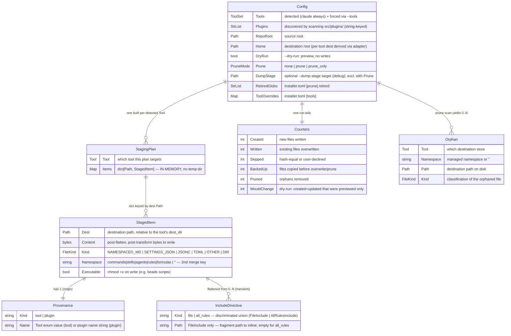
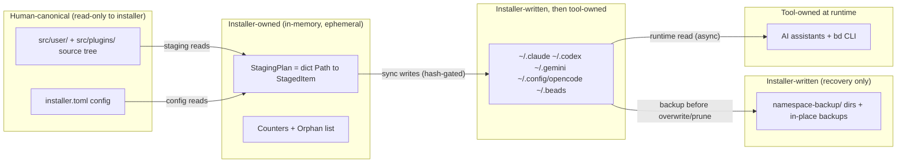

# Python Installer — Data View

> **Up**: [index](index.md)
> **Previous (reading order)**: [C4 L3 — Engine](c4-l3-engine.md)
> **Source bead**: `agents-config-w1qls.9`
> **Source spec**: [`installer-design.md`](installer-design.md) — §"Data model highlights", §"Configuration — installer.toml"

## Glossary

| Term | Meaning |
|---|---|
| `StagingPlan` | The aggregate root of the in-memory model: a `dict[Path, StagedItem]` (plus the target `Tool`). One is built per detected tool. **In-memory only** — it has no on-disk form in the operational path. |
| `StagedItem` | One planned destination file. The unit the merge + sync engines operate on. |
| `Provenance` | `(kind: "tool" | "plugin", name: str)` — preserves whether a `StagedItem` came from a tool's source tree or a plugin overlay, through the tool-vs-plugin registry asymmetry. |
| `FileKind` | The enum classifying a staged file. The **primary** merge-dispatch key. |
| Namespace | The managed sub-dir (`commands` / `skills` / `agents` / `rules` / `formulas`) or `""`. The **secondary** merge-dispatch key. |
| `IncludeDirective` | A discriminated union (`FileInclude` | `AllRulesInclude`) produced **transiently** while flattening DYNAMIC-INCLUDE markers; consumed during staging, not persisted on the `StagedItem`. |
| `Orphan` | A prune candidate: on disk, absent from the plan, matching a retired glob. |
| `Counters` | The per-run tally (created / written / skipped / backed-up / pruned …) surfaced in the exit summary. |
| Canonical ownership | Which actor is the source of truth for a piece of data: the human (source tree), the installer (plan + writes), or the tool (deployed store at runtime). |

## Purpose

Three complementary data views in one file:

1. **The in-memory model** (`Config`, `StagingPlan`, `StagedItem`, `Provenance`, `IncludeDirective`, `Orphan`, `Counters`) as an ER diagram — the shapes the engine builds and passes around. None of these persist; they live and die within one process invocation.
2. **The merge-dispatch table** — the `(FileKind, namespace)` → `MergeStrategy` lookup that the collision matrix is built on.
3. **The config + ownership boundaries** — the `installer.toml` schema, and which actor owns which data as it flows source → memory → disk → runtime.

The data view answers: *what shapes does the installer build in memory, what drives collision resolution, and who owns each piece of data along the way?*

## In-memory model ER diagram



### Cardinality + shape notes

- **`StagingPlan` is the aggregate root of the install path; `Config` is the run root.** One `Config` per invocation drives one `StagingPlan` per detected tool, one `Counters` tally, and (with `--prune`) a list of `Orphan`s. There are no cross-plan relationships — each tool's plan is independent.
- **`Items` is a `dict[Path, StagedItem]`, not a list.** The dest `Path` is the key, which is exactly why collisions are detectable: a second item mapping to a key already present triggers the merge dispatch (Sequence 2). The dict is **in-memory** — the single most load-bearing fact in this model. `install.sh` materialised this as a temp directory tree; the Python rewrite keeps it in process memory and only `sync` writes individual files.
- **`Provenance` carries the tool-vs-plugin asymmetry.** Tools are enum-keyed (`Tool` enum + adapter registry); plugins are string-keyed (dynamic discovery, no enum). `Provenance(kind, name)` lets a single `StagedItem` record either origin uniformly, so the merge engine can reason about "base asset vs plugin overlay" without caring which registry the item came from.
- **`IncludeDirective` is transient.** It is produced while `templates.py` flattens a `<!-- DYNAMIC-INCLUDE: … -->` marker (file form) or the ALL-RULES marker, then consumed immediately — the resulting flattened text lands in `StagedItem.Content`. It is modelled here because it is a named type in the data model (A.2), but it does not survive on the `StagedItem`. The `AllRulesInclude` variant carries no path: it expands the plan's already-staged rules collection, sorted and `\n---\n`-joined.
- **`FileKind` is an enum, not an entity.** Its six values are shown inline on `StagedItem.Kind`. It is the primary merge-dispatch key; `Namespace` is the secondary key (see the dispatch table).

## Merge-dispatch table — `(FileKind, namespace)` → `MergeStrategy`

The collision matrix, keyed exactly as `core/merge/registry.py` keys it. `NAMESPACED_MD` is the only kind whose namespace changes the strategy; for every other kind the namespace component is unused and the lookup degenerates to a `FileKind`-only key.

| FileKind | Namespace | Strategy | Behaviour on collision |
|---|---|---|---|
| `NAMESPACED_MD` | `rules` | `append_rules` | Join `existing + "\n---\n" + incoming` — rules compose. |
| `NAMESPACED_MD` | `commands` / `skills` / `agents` | `fatal` | **Raise** — two items with the same name is an authoring error; the message names both files. |
| `NAMESPACED_MD` | `formulas` | `last_wins_silent` | Replace (formulas are whole-file owned). |
| `SETTINGS_JSON` | — | `json_union` | Deep union: nested-dict precedence, array union + sort, type-mismatch surfaced. |
| `JSONC` | — | `last_wins_warn` | Replace, with a warning that an existing file was overwritten. |
| `TOML` | — | `last_wins_warn` | Replace, with a warning. |
| `OTHER` | — | `last_wins_silent` | Replace silently. |
| `DIR` | — | (n/a) | Directories are created, not merged. |

> The `formulas` row reflects whole-file ownership of formula TOMLs; if a future requirement needs formula-merge semantics it gets its own strategy + registry row. The dispatch is data — adding a `(FileKind, namespace)` row is a registry change, not an engine change.

## `installer.toml` schema

Structured config at `packages/installer/installer.toml`, replacing the legacy `scripts/prune-list` text file at the parity gate. Read once at `Config` build (read-only to the install path).

```toml
[prune]
# Retired paths (one glob per line) — matched against destination files during
# the prune scan. A destination file is an orphan only if it ALSO matches here.
retired = [
  "*/skills/condition-based-waiting",
  "claude/rules/git-commits.md",
]

[tools]
# Optional per-tool overrides — leave commented to use the built-in adapters.
# claude.dest = "~/.claude"
```

| Key | Type | Drives | Notes |
|---|---|---|---|
| `[prune].retired` | list[str] (globs) | `Config.RetiredGlobs` → `prune.py` | The orphan gate. A dest file absent from the plan is pruned **only** if it also matches one of these globs. |
| `[tools].<tool>.dest` | str (path) | `Config.ToolOverrides` → tool adapter | Override a tool's destination dir; commented out = built-in adapter default. |

## Canonical-ownership boundaries

Data flows source → memory → disk → runtime, and ownership hands off at each arrow. The installer never writes the source; the tools never read the plan; backups are write-only recovery.



### Ownership rules (worth memorising)

| Data | Owner | Lifetime | Notes |
|---|---|---|---|
| Source tree (`src/user/`, `src/plugins/`) | **Human** (via repo) | Permanent | Installer reads, NEVER writes. The "always edit source" guarantee. |
| `installer.toml` | **Human** | Permanent | Read-only to the install path. |
| `StagingPlan` / `StagedItem` | **Installer** | One invocation | In-memory; gone when the process exits. `--dump-stage` materialises a throwaway copy. |
| `Counters` / `Orphan` list | **Installer** | One invocation | Surfaced in the exit summary; not persisted. |
| Destination stores | **Installer** writes → **Tool** reads | Permanent on disk | Single writer at install time; consumed asynchronously at each tool's runtime. |
| Backups | **Installer** | Permanent on disk | Write-only recovery; never read back by the installer. |

### Explicit non-ownership

- The installer does **not** own source content — it copies and flattens it, but the human authoring the repo is canonical. A `StagedItem.Content` is a *derived* artifact (post-flatten, post-transform), not a source of truth.
- The installer does **not** own a tool's runtime interpretation of its store. It deposits files matching each tool's path + shape contract; how the tool loads them is the tool's concern.
- The installer does **not** persist any of its own state between runs. There is no installer database, no manifest, no lockfile of "what I installed last time" — the destination store *is* the record, and hash-compare is how the next run reconciles.

## What this diagram does NOT show

- **The components that build / read these shapes** — see [`c4-l3-engine.md`](c4-l3-engine.md).
- **The order** in which the shapes are built and flushed — see [`sequences.md`](sequences.md).
- **The per-strategy merge mechanics** (deep-union algorithm, append separator placement) — specified per-strategy in the E.* stories and `installer-design.md` §"Test architecture".
- **The golden-master / fixture data shapes** — test artifacts; see `installer-design.md` §"Fixture strategy".

## Cross-references

- **Previous (reading order)**: [C4 L3 — Engine](c4-l3-engine.md) — the components that read / build / write this data
- **Companion structural views**: [`c4-l2-container.md`](c4-l2-container.md), [`c4-l3-engine.md`](c4-l3-engine.md)
- **Companion flow view**: [`sequences.md`](sequences.md)
- **Source spec**: [`installer-design.md`](installer-design.md) §"Data model highlights", §"Configuration — installer.toml", §"--dump-stage flag"
