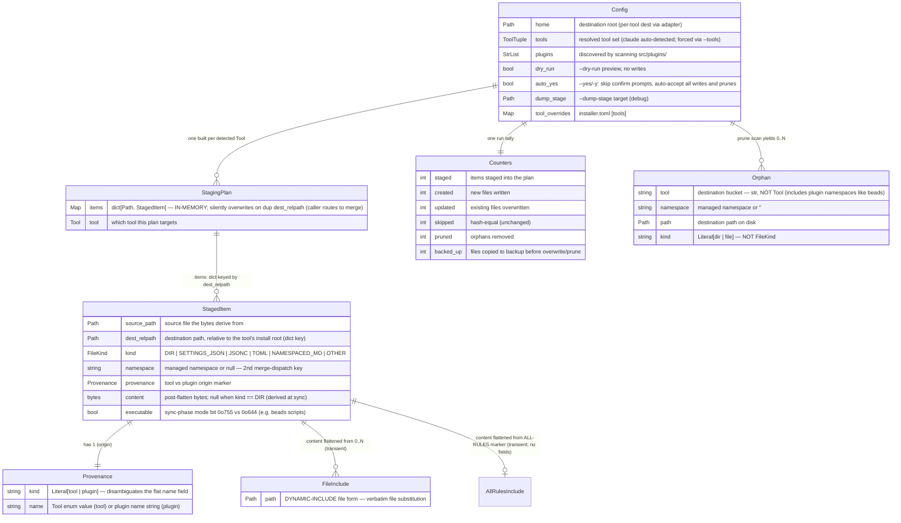
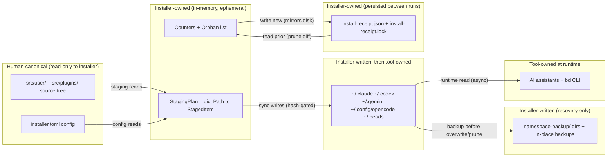

# Python Installer — Data View

> **Up**: [index](index.md)
> **Previous (reading order)**: [C4 L3 — Engine](c4-l3-engine.md)
> **Source bead**: `agents-config-w1qls.9`
> **Source spec**: [`installer-design.md`](installer-design.md) — §"Data model highlights", §"Configuration — installer.toml"

## Glossary

| Term | Meaning |
|---|---|
| `StagingPlan` | The aggregate root of the in-memory model: a `dict[Path, StagedItem]` (plus the target `Tool`). One is built per detected tool. **In-memory only** — it has no on-disk form in the operational path. |
| `StagedItem` | One planned destination file. The unit the merge + sync engines operate on. |
| `Provenance` | `(kind: "tool" \| "plugin", name: str)` — preserves whether a `StagedItem` came from a tool's source tree or a plugin overlay, through the tool-vs-plugin registry asymmetry. |
| `FileKind` | The enum classifying a staged file. The **primary** merge-dispatch key. |
| Namespace | The managed sub-dir (`commands` / `skills` / `agents` / `rules` / `formulas`) or `None` when the tool root itself owns the file. The **secondary** merge-dispatch key. |
| `IncludeDirective` | A discriminated union (`FileInclude` \| `AllRulesInclude`) produced **transiently** while flattening DYNAMIC-INCLUDE markers; consumed during staging, not persisted on the `StagedItem`. |
| `Orphan` | A prune candidate: a recorded receipt entry, in scope, no longer in the desired staged plan, that passes the path trust boundary. |
| `Receipt` / `ReceiptEntry` | The install receipt and its per-entry record — the persisted-between-runs prune authority (`~/.config/agents-config/install-receipt.json`). Distinct from the in-memory shapes: the receipt is the installer's only persistent state. |
| `Counters` | The per-run tally (`staged` / `created` / `updated` / `skipped` / `pruned` / `backed_up`) surfaced in the exit summary. |
| Canonical ownership | Which actor is the source of truth for a piece of data: the human (source tree), the installer (plan + writes), or the tool (deployed store at runtime). |

## Purpose

Three complementary data views in one file:

1. **The in-memory model** (`Config`, `StagingPlan`, `StagedItem`, `Provenance`, `IncludeDirective`, `Orphan`, `Counters`) as an ER diagram — the shapes the engine builds and passes around. None of these persist; they live and die within one process invocation.
2. **The merge-dispatch table** — the `(FileKind, namespace)` → `MergeStrategy` lookup that the collision matrix is built on.
3. **The config + persisted state + ownership boundaries** — the `installer.toml` schema, the install receipt (`Receipt` / `ReceiptEntry`) that persists between runs as the prune authority, and which actor owns which data as it flows source → memory → disk → runtime.

The data view answers: *what shapes does the installer build in memory, what drives collision resolution, and who owns each piece of data along the way?*

## In-memory model ER diagram

Field names mirror the target dataclasses in `packages/installer/src/installer/core/model.py` and `packages/installer/src/installer/config.py`. This represents target state, not necessarily current code — the ER is the design authority; implementation stories bring the code into alignment with it.



### Cardinality + shape notes

- **`StagingPlan` is the aggregate root of the install path; `Config` is the run root.** One `Config` per invocation drives one `StagingPlan` per detected tool, one `Counters` tally, and (with `--prune`) a list of `Orphan`s. There are no cross-plan relationships — each tool's plan is independent.
- **`Config` resolves the full run configuration.** `home` and `tools` anchor the tool-selection scope; `dry_run` and `auto_yes` control the interaction model (preview vs auto-accept); `plugins`, `dump_stage`, and `tool_overrides` complete the picture for plugins and `installer.toml` `[tools]` overrides. Pruning is **not** a `Config` field — it is driven by the argparse flags `args.prune` / `args.prune_only`, and the prune authority is the persisted install receipt, not a config-loaded glob list.
- **`items` is a `dict[Path, StagedItem]`, not a list.** The `dest_relpath` is the key, which is exactly why collisions are detectable: a second item mapping to a key already present triggers the merge dispatch (Sequence 2). The dict is **in-memory** — the single most load-bearing fact in this model. `install.sh` materialised this as a temp directory tree; the Python rewrite keeps it in process memory and only `sync` writes individual files. (The bare dict silently overwrites on a duplicate key; the staging caller checks `dest_relpath in items` and routes to the merge registry — collision detection is the caller's job, not the dataclass's.)
- **`Provenance` carries the tool-vs-plugin asymmetry.** Tools are enum-keyed (`Tool` enum + adapter registry); plugins are string-keyed (dynamic discovery, no enum). `Provenance(kind, name)` lets a single `StagedItem` record either origin uniformly — the `kind` discriminator disambiguates the flat `name` (a plugin named after a tool would otherwise be ambiguous), so the merge engine can reason about "base asset vs plugin overlay" without caring which registry the item came from.
- **`IncludeDirective` is a transient `TypeAlias` union.** `FileInclude | AllRulesInclude`, produced while `templates.py` flattens a `<!-- DYNAMIC-INCLUDE: … -->` marker (file form) or the ALL-RULES marker, then consumed immediately — the flattened text lands in `StagedItem.content`; the directive objects do not survive on the `StagedItem`. `FileInclude` carries the fragment `path`; `AllRulesInclude` carries no fields — it expands the plan's already-staged rules collection, sorted and joined with a `---` separator.
- **`FileKind` is an enum, not an entity.** Its six values are shown inline on `StagedItem.kind`. It is the primary merge-dispatch key; `namespace` is the secondary key (see the dispatch table). Note `Orphan.kind` is a *different*, coarser `Literal["dir", "file"]` — orphan classification only needs dir-vs-file, not the full merge taxonomy — and `Orphan.tool` is a plain `str` (not the `Tool` enum) because the orphan bucket includes plugin namespaces like `beads` that are not tools.

## Merge-dispatch table — `(FileKind, namespace)` → `MergeStrategy`

The collision matrix — the dispatch contract `core/merge/registry.py` implements (see `installer-design.md`). It keys on `(FileKind, namespace)`: `NAMESPACED_MD` is the only kind whose namespace changes the strategy; for every other kind the namespace component is unused and the lookup degenerates to a `FileKind`-only key. The strategy names below are the design's; the modules land in Epic E.

| FileKind | Namespace | Strategy | Behaviour on collision |
|---|---|---|---|
| `NAMESPACED_MD` | `rules` | `append_rules` | Join `existing + "\n---\n" + incoming` — rules compose. |
| `NAMESPACED_MD` | `commands` / `skills` / `agents` | `fatal` | **Raise** — two items with the same name is an authoring error; the message names both files. |
| `SETTINGS_JSON` | — | `json_union` | Deep union: nested-dict precedence, array union + sort, type-mismatch surfaced. |
| `JSONC` | — | `last_wins_warn` | Replace, with a warning that an existing file was overwritten. |
| `TOML` | — | `last_wins_warn` | Replace, with a warning. |
| `OTHER` | — | `last_wins_silent` | Replace silently. |
| `DIR` | — | (n/a) | Directories are created, not merged. |

> Formula files are `.toml`, so they classify as `FileKind.TOML` and route via `(TOML, —) → last_wins_warn`. `formulas` is a managed namespace for **backup / prune** routing (it is in the path-aware namespace set), NOT a `NAMESPACED_MD` merge namespace — the only `NAMESPACED_MD` namespaces that change the strategy are `rules` (append) and `commands`/`skills`/`agents` (fatal). The dispatch is data: adding a `(FileKind, namespace)` row is a registry change, not an engine change.

## `installer.toml` schema

Structured config at `packages/installer/installer.toml`. Read once at `Config` build (read-only to the install path). The only table is `[tools]` — pruning is **not** configured here; it is driven by the persisted install receipt (below), not a glob list.

```toml
[tools]
# Optional per-tool dest-dir overrides — leave commented to use the built-in adapters.
# claude.dest = "~/.claude"
```

| Key | Type | Drives | Notes |
|---|---|---|---|
| `[tools].<tool>.dest` | str (path) | `Config.tool_overrides` → tool adapter | Override a tool's destination dir; commented out = built-in adapter default. |

## Install receipt — the persisted prune authority

`~/.config/agents-config/install-receipt.json` is the installer's only state persisted **between runs**: a record of every wholesale-authored entry it wrote, so pruning can diff "what we installed" against "what we still want installed". It lives in a tool-neutral state dir outside every destination tree, so it is never itself installed or pruned. It is read at the start of the prune step, validated against its own `integrity` digest, and atomically rewritten (temp + `os.replace`) at the end of every non-dry-run install — the whole read → install → prune → write section held under a single-writer advisory lock (`install-receipt.lock`, `core/receipt_lock.py`).

```mermaid
erDiagram
    Receipt ||--o{ ReceiptEntry : "entries: 0..N wholesale-authored dests"

    Receipt {
        int    schema_version  "gates forward-compatible evolution; unknown -> CORRUPT"
        string integrity       "sha256: digest over canonical (schema_version + roots + entries); recomputed on read, mismatch -> CORRUPT"
        Roots  roots           "persisted install-root allowlist (prior | this run's live roots); retired-plugin root validation"
        Entry  entries         "the recorded wholesale-authored entries"
    }

    ReceiptEntry {
        Path   path    "HOME-relative dest path (the diff key)"
        string owner   "tool name (claude/codex/gemini/opencode) or plugin name (beads) — diff-scope tag"
        Path   root    "HOME-relative install root the entry lives under (.claude, .config/opencode, .beads)"
        string kind    "Literal[file | dir] — top-level skill/agent dirs are one dir entry"
        string sha256  "hex digest of a file's bytes (ownership-drift gate); null for a dir entry"
    }
```



- **It records only wholesale-authored entries** — namespaced `commands`/`skills`/`agents`/`rules` and plugin route dests (`~/.beads/...`). It **never** records a merge-target (`settings.json` via `JsonUnionStrategy`, the assembled `AGENTS.md`/`GEMINI.md`/`opencode.jsonc`): dropping a partial contribution must never delete the whole file. The `core/ownership.py` classifier (`is_prunable(StagedItem)`) makes this decision, keyed on the item's namespace and merge strategy.
- **`path` is the diff key, `owner` the scope tag.** Orphan detection is `{ e ∈ prior : e.owner ∈ scope ∧ (e.owner, e.path) ∉ desired_staged_keys ∧ validate_entry(e) }`. `desired_staged_keys` is the owned dest paths in this run's staging plan (built even under `--prune-only`) plus the active plugins' currently-shipped route files.
- **`sha256` is ownership-drift protection.** A file orphan whose on-disk bytes no longer match the recorded digest is the user's now — it is relinquished, not deleted. `dir` entries carry `sha256: null` (recursive content-drift protection is a deliberate v1 limitation, deferred).
- **`integrity` + `roots` make the receipt a trusted deletion-authority input.** `integrity` is recomputed on read; any accidental change fails closed (prune disabled, file untouched). `roots` is the persisted allowlist used to validate a *retired* plugin's recorded root (tool and discovered-plugin roots come from live code instead). See [`sequences.md`](sequences.md) §"Sequence 4 — Prune flow" for the full lifecycle.

## Canonical-ownership boundaries

Data flows source → memory → disk → runtime, and ownership hands off at each arrow. The installer never writes the source; the tools never read the plan; backups are write-only recovery.



### Ownership rules (worth memorising)

| Data | Owner | Lifetime | Notes |
|---|---|---|---|
| Source tree (`src/user/`, `src/plugins/`) | **Human** (via repo) | Permanent | Installer reads, NEVER writes. The "always edit source" guarantee. |
| `installer.toml` | **Human** | Permanent | Read-only to the install path. |
| `StagingPlan` / `StagedItem` | **Installer** | One invocation | In-memory; gone when the process exits. `--dump-stage` materialises a throwaway copy. |
| `Counters` / `Orphan` list | **Installer** | One invocation | Surfaced in the exit summary; not persisted. |
| Destination stores | **Installer** writes → **Tool** reads | Permanent on disk | Single writer at install time; consumed asynchronously at each tool's runtime. |
| Backups | **Installer** | Permanent on disk | Write-only recovery; never read back by the installer. |
| Install receipt (`install-receipt.json` + `.lock`) | **Installer** | Permanent on disk (between runs) | The installer's own persisted state — read at prune start, rewritten at run end (mirrors disk). Trusted state behind an `integrity` digest; held under a single-writer advisory lock. |

### Explicit non-ownership

- The installer does **not** own source content — it copies and flattens it, but the human authoring the repo is canonical. A `StagedItem.content` is a *derived* artifact (post-flatten, post-transform), not a source of truth.
- The installer does **not** own a tool's runtime interpretation of its store. It deposits files matching each tool's path + shape contract; how the tool loads them is the tool's concern.
- The installer persists exactly **one** piece of its own state between runs: the **install receipt** (plus its lockfile), its record of "what I authored wholesale last time". That record is the prune authority — the next run diffs it against the desired plan to find orphans. For *install* reconciliation the destination store is still the record (hash-compare decides skip vs overwrite); the receipt's job is the deletion side, which on-disk state alone cannot answer (a destination file the source no longer produces is indistinguishable from a user's own file without a record that the installer once wrote it).

## What this diagram does NOT show

- **The components that build / read these shapes** — see [`c4-l3-engine.md`](c4-l3-engine.md).
- **The order** in which the shapes are built and flushed — see [`sequences.md`](sequences.md).
- **The per-strategy merge mechanics** (deep-union algorithm, append separator placement) — specified per-strategy in the E.* stories and `installer-design.md` §"Test architecture".
- **The golden-master / fixture data shapes** — test artifacts; see `installer-design.md` §"Fixture strategy".

## Cross-references

- **Previous (reading order)**: [C4 L3 — Engine](c4-l3-engine.md) — the components that read / build / write this data
- **Companion structural views**: [`c4-l2-container.md`](c4-l2-container.md), [`c4-l3-engine.md`](c4-l3-engine.md)
- **Companion flow view**: [`sequences.md`](sequences.md)
- **Source spec**: [`installer-design.md`](installer-design.md) §"Data model highlights", §"Configuration — installer.toml", §"--dump-stage flag"
