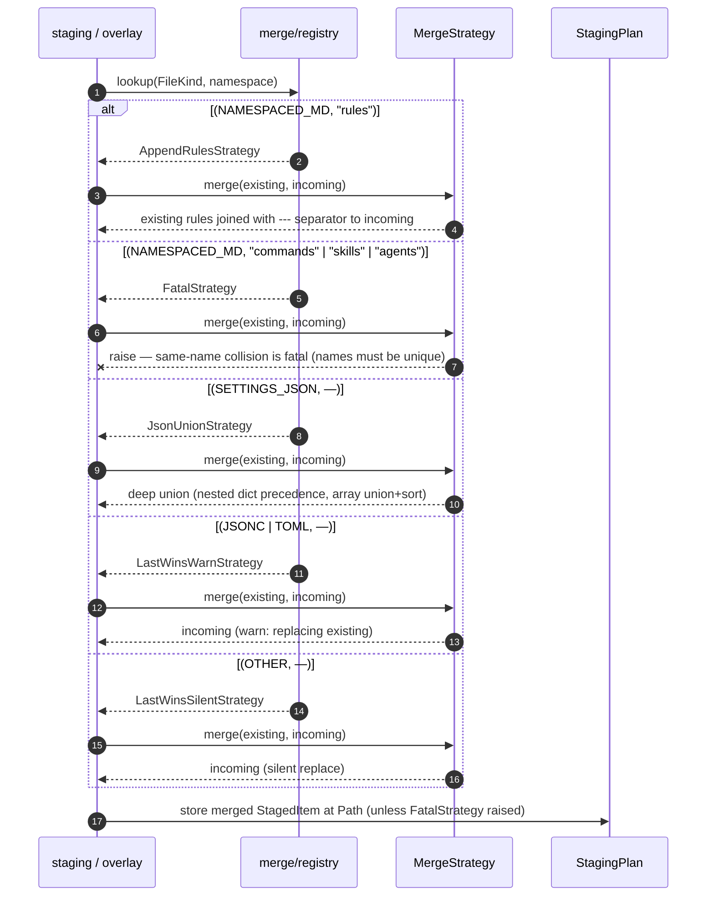
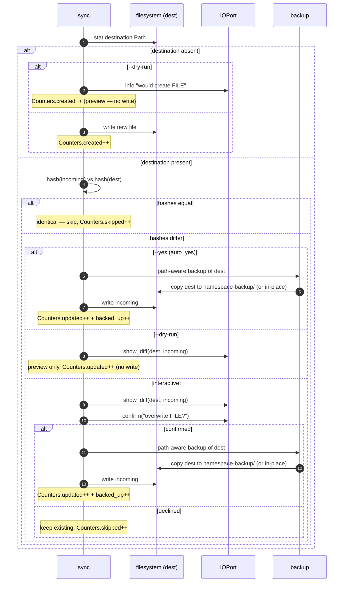
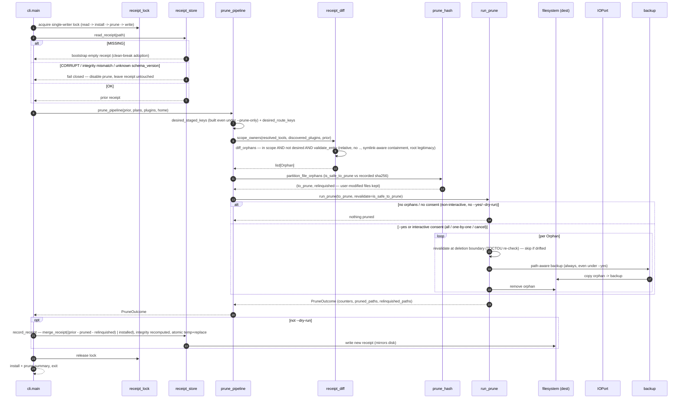

# Python Installer — Sequence Diagrams

> **Up**: [index](index.md)
> **Previous (reading order)**: [C4 L2 — Container](c4-l2-container.md)
> **Next (reading order)**: [C4 L3 — Engine](c4-l3-engine.md)
> **Source bead**: `agents-config-w1qls.9`
> **Source spec**: [`installer-design.md`](installer-design.md)

## Glossary

| Term | Meaning |
|---|---|
| `StagingPlan` | The in-memory `dict[Path, StagedItem]` built per tool. The `Stage` participant returns one; `Sync` consumes it. |
| Overlay | The plugin pass: plugin content is staged on top of the tool's plan, and `apply_extensions` applies plugin-declared YAML patches. Collisions route through the merge registry. |
| Collision | Two `StagedItem`s targeting the same destination `Path`. Resolved by the merge registry's `(FileKind, namespace)` dispatch. |
| Hash-compare | `Sync`'s skip test: if the incoming content hashes equal to the existing destination file, the file is left untouched. |
| Path-aware backup | Backup routing — namespaced files back up to a parent-level `<namespace>-backup/` sibling, top-level files back up in place — performed before any overwrite or prune. |
| Orphan | A recorded install-receipt entry whose owner is in scope and whose `(owner, path)` is no longer in this run's desired staged plan, and that passes the path trust boundary — a prune candidate. |
| Install receipt | `~/.config/agents-config/install-receipt.json` — the record of every wholesale-authored entry the installer wrote (namespaced commands/skills/agents/rules + plugin route dests), the sole prune authority. Carries an `integrity` digest and is held under a single-writer advisory lock across read → install → prune → write. |

## Purpose

Four sequence diagrams covering one install invocation and its three branching sub-flows:

1. **End-to-end install (happy path)** — detect → stage → overlay → merge → sync → exit.
2. **Collision merge dispatch** — how two `StagedItem`s for one path resolve through the `(FileKind, namespace)` registry.
3. **Sync per-item decision** — the hash-skip vs diff → confirm → backup → write branch, including `--dry-run`.
4. **Prune flow** — read prior receipt → diff against the desired plan → partition by on-disk hash → interactive prune → write new receipt.

Together they answer: *who calls whom, in what order, where does state live (in-memory plan vs disk), and where do the branches and confirmations sit?* Component structure lives in [`c4-l3-engine.md`](c4-l3-engine.md); data shapes in [`data-view.md`](data-view.md).

---

## Sequence 1 — End-to-end install (happy path)

One invocation: `python3 scripts/install.py --tools=claude,gemini`, with the beads plugin active. `cli.py` — not `orchestrator.py` — is the actual top-level driver: it resolves tools/plugins, then runs **two separate whole-fleet passes** over the detected tools — first build every tool's plan (staging + plugin overlay, via `orchestrator.stage_and_transform`), then sync every tool's finished plan to disk — rather than interleaving stage/overlay/sync per tool. The plan never touches disk except through `Sync`.

```mermaid
sequenceDiagram
    autonumber
    participant Op as Operator
    participant CLI as cli.py
    participant Cfg as config.py
    participant Orch as orchestrator.py
    participant Stage as staging
    participant Plug as plugin overlay
    participant Merge as merge registry
    participant Sync as sync (via run.py)
    participant FS as filesystem

    Op->>CLI: python3 scripts/install.py --tools=claude,gemini
    CLI->>Cfg: resolve_tools + resolve_plugins (auto-detect / --tools / --plugins)
    Cfg->>FS: probe tool config dirs
    FS-->>Cfg: detected tools, plugins
    Cfg-->>CLI: resolved tools + plugins
    CLI->>FS: load .installignore (hard error if missing/unreadable/non-UTF-8)

    rect rgb(245, 245, 255)
        Note over CLI,Merge: Phase 1 — build + overlay EVERY tool's plan (whole-fleet), before any sync
        CLI->>Orch: stage_and_transform(tools, plugins)
        loop per detected tool (claude, then gemini)
            Orch->>Stage: build_plan(adapter)
            Stage->>FS: walk + read source (shared .agents/ + per-tool)
            FS-->>Stage: source bytes
            Stage->>Stage: strip .template suffix, scope namespaces, consult .installignore
            Stage->>Merge: on collision (base staging): dispatch (FileKind, namespace)
            Stage-->>Orch: base StagingPlan
            Orch->>Plug: overlay_plugins(plan, plugins)
            Plug->>Merge: on collision (plugin overlay): dispatch (FileKind, namespace)
            Merge-->>Plug: merged StagedItem (see Sequence 2)
            Plug-->>Orch: overlaid StagingPlan
            Orch->>Orch: apply_extensions, flatten DYNAMIC-INCLUDE, adapter.post_staging_transforms (gemini: frontmatter)
        end
        Orch-->>CLI: dict[Tool, StagingPlan] — every tool's finished plan
    end

    CLI->>CLI: build frozen Config (home, tools, auto_yes); resolve adapters

    rect rgb(245, 255, 245)
        Note over CLI,FS: Phase 2 — sync EVERY tool's plan to disk (separate whole-fleet pass, via run.install_pipeline)
        loop per detected tool (claude, then gemini)
            CLI->>Sync: flush(plan) to destination
            loop per StagedItem in plan
                Sync->>FS: hash-compare vs destination (see Sequence 3)
                alt unchanged
                    Note over Sync: skip — Counters.skipped++
                else changed or new
                    Sync->>FS: backup (if overwrite) + write
                    Note over Sync: Counters.created++ or updated++ (+ backed_up++ on overwrite)
                end
            end
            Sync-->>CLI: Counters
        end
        Note over CLI,Sync: Plugin routes (e.g. beads' ~/.beads/formulas + scripts) sync next, via run.install_plugin_routes
        CLI->>Sync: flush plugin routes to destination
        Sync-->>CLI: Counters
    end

    opt --prune requested
        CLI->>CLI: prune flow (see Sequence 4)
    end

    CLI-->>Op: summary (created / updated / skipped / backed-up per tool), exit 0
```

### Notes on the happy path

- **The plan is in-memory for its whole life.** `Stage` returns a `dict[Path, StagedItem]`; overlay mutates it; only `Sync` writes to disk, one file at a time. There is no temp-dir staging tree (the deliberate departure from `install.sh`). `--dump-stage` is the sole path that materialises the plan, and it exits before any destination write (and before `Config` is even built).
- **Staging and sync are two separate whole-fleet passes, not one interleaved per-tool loop.** `orchestrator.stage_and_transform` builds and overlays every tool's plan first, returning the full `dict[Tool, StagingPlan]`; only after that does `cli.py` drive `run.install_pipeline` to sync every tool's plan. `orchestrator.py` never touches `sync.py` — it is staging only.
- **Tool order is the detection order; tools are independent within each pass.** Each tool gets its own plan and its own sync pass — there is no cross-tool state. A failure shaping one tool's plan does not corrupt another's.
- **Collisions happen in both base staging and overlay.** Within a single tool's plan, shared + per-tool content can collide (base staging, `staging.py`); the more common case is plugin content landing on a base asset (`overlay.py`). Both route through the same merge registry (Sequence 2), never through `Sync`.
- **`Config` is built between the two passes, not before the loop.** `resolve_tools` / `resolve_plugins` (pure functions in `config.py`) run once, up front; the frozen `Config` dataclass itself (`home`, `tools`, `auto_yes`) is constructed after staging finishes and before the sync pass begins. `installer.toml` plays no part in any of this — its loader is parsed but unwired (see [`data-view.md`](data-view.md)).

---

## Sequence 2 — Collision merge dispatch

Two `StagedItem`s target the same destination `Path` (typically a base asset + a plugin overlay, or shared + per-tool content). The caller (overlay or staging) asks the registry for the strategy keyed on `(FileKind, namespace)`; the strategy returns a single merged item or raises.



### Notes on the merge dispatch

- **The dispatch key is `(FileKind, namespace)`, not `FileKind` alone.** `NAMESPACED_MD` needs its parent-dir namespace to choose: `rules` append-merges (rules compose), but `commands` / `skills` / `agents` are **fatal** on same-name collision (two skills with the same name is an authoring error, not a merge). For non-namespaced kinds (`SETTINGS_JSON`, `JSONC`, `TOML`, `OTHER`, `DIR`) the namespace component is unused and the lookup degenerates to a `FileKind`-only key.
- **Fatal is a feature.** `FatalStrategy` raising is the design intent: it surfaces an authoring mistake loudly rather than silently picking a winner. The message names both colliding files.
- **Each strategy is one class, one module, one test file.** The registry holds the only knowledge of *which* strategy applies; the strategies hold the only knowledge of *how* to merge. Swapping a registry entry in a test is how dispatch is asserted.

---

## Sequence 3 — Sync per-item decision

The per-file branch inside `Sync`'s loop (the `hash-compare` step expanded from Sequence 1). Covers new-file, unchanged, changed-interactive, and `--dry-run`.



### Notes on the sync decision

- **Hash-compare is the skip gate.** Unchanged files are never rewritten, so re-running the installer is cheap and quiet — the common case (most files identical) produces no prompts and no backups.
- **Three modes govern the hashes-differ branch.** `--yes` (auto_yes): backup and write unconditionally, no diff or prompt. `--dry-run`: show diff, no write. Interactive: show diff, prompt, write only on confirmation.
- **`--dry-run` short-circuits before every write but still shows diffs.** It is the preview mode: the operator sees exactly what *would* change (created / updated counts + diffs) without touching disk. This is also the parity-gate smoke-test surface (`install.py --dry-run` vs `install.sh --dry-run`).
- **Backup precedes overwrite, always** — including under `--yes`. No destination file is overwritten without first being copied to its path-aware backup location. The backup routing keeps namespaced backups out of the assistant's discovery walk.
- **All prompting is through `IOPort`.** `show_diff` and `confirm` never call the terminal directly; `ScriptedIO` drives them in tests, so every branch above is unit-testable without a TTY.

---

## Sequence 4 — Prune flow

Runs after the install half when `--prune` (or standalone `--prune-only`) is requested. Pruning diffs the prior install receipt against this run's desired staged plan: a recorded entry no longer wanted, in scope, that passes the path trust boundary is an orphan. Orphans are partitioned by on-disk hash (a user-modified file is relinquished, not deleted), the survivors flow through the interactive prune flow (backup + consent + a TOCTOU re-check at the deletion boundary), and a fresh receipt is written to mirror disk. The whole read → install → prune → write section runs under a single-writer advisory lock (`receipt_lock`).



### Notes on the prune flow

- **The receipt is the sole prune authority.** An orphan is a *recorded* entry, in scope, no longer in the desired staged plan — there is no glob list. `scope_owners` = `resolved_tools ∪ (discovered_plugins − tool names) ∪ prior-receipt plugin owners`, so an untargeted tool is untouched, an excluded plugin's entries are pruned, and a *retired* plugin (source gone, no longer discovered) still gets its recorded route files pruned rather than left as litter. A like-named discovered plugin never pulls a tool's entries into scope.
- **Every orphan is path-validated before deletion (`validate_entry`).** `path` and `root` must be relative with no `..`; containment is checked on fully-resolved paths (symlink-aware, so a symlinked install root prunes within its real target but a symlink-escape is rejected); the root must be legitimate for the owner — tool/discovered-plugin roots come from live code, retired-plugin roots from the persisted `roots` allowlist behind the `integrity` gate. A failing entry is skipped, never emitted as an orphan, so a damaged receipt prunes less, never wild.
- **File pruning is hash-aware; directories are backup-and-delete.** A file orphan is pruned only while its on-disk bytes match the recorded `sha256` (or it is genuinely absent); a user-modified, unreadable, or now-a-directory file is **relinquished** — kept on disk, dropped from the receipt. A directory orphan still a real directory goes through backup-and-delete (recoverable from the path-aware backup); recursive directory **content-drift** protection is a deliberate v1 limitation, deferred. Cheap *type* drift (a recorded dir path that is now a file/symlink) is guarded — it relinquishes.
- **Backup-before-delete always, and a TOCTOU re-check at the boundary.** Every removal is preceded by a path-aware backup, including under `--yes`. The ownership decision is **re-validated immediately before backup/delete** (`revalidate` → `is_safe_to_prune`), so a path that drifted between the up-front partition and the actual delete (the interactive-confirm window) is skipped and left in place.
- **Missing bootstraps; corrupt fails closed.** A *missing* receipt bootstraps empty (clean-break adoption — no migration, no legacy sweep); a *corrupt* / integrity-mismatch / unknown-`schema_version` receipt disables pruning and is left untouched, so a scoped run never overwrites the central record with a partial view.
- **Single-writer over the whole mutation section.** An advisory `flock` (`receipt_lock`) is held across read → install → prune → write; a second concurrent run fails fast (`ReceiptLockBusy`). Locking only the receipt I/O would let a concurrent install resurrect a stale entry the lock exists to prevent.
- **`--dry-run` writes nothing.** No deletion and no receipt write — preview only. The receipt is otherwise written on **every** non-dry-run install (not only `--prune`), so the record never goes stale; pruning the diff stays gated behind `--prune`/`--prune-only`.

---

## What these diagrams do NOT show

- **The component structure** that executes these flows — see [`c4-l3-engine.md`](c4-l3-engine.md).
- **The data shapes** (`StagingPlan`, `StagedItem`, `Orphan`, `Counters`, `Config`) the participants pass — see [`data-view.md`](data-view.md).
- **DYNAMIC-INCLUDE flattening internals** (the three directive forms) and the **Gemini frontmatter transform** mechanics — referenced as steps here; specified in `installer-design.md`.
- **The golden-master parity harness** (`install.sh` vs `install.py` diff) — a test artifact, not an install-time flow; see `installer-design.md` §"Test architecture".

## Cross-references

- **Previous (reading order)**: [C4 L2 — Container](c4-l2-container.md)
- **Next (reading order)**: [C4 L3 — Engine](c4-l3-engine.md) — the components that run these sequences
- **Companion data view**: [`data-view.md`](data-view.md)
- **Source spec**: [`installer-design.md`](installer-design.md) §"--dump-stage flag", §"Data model highlights", §"CLI surface"
