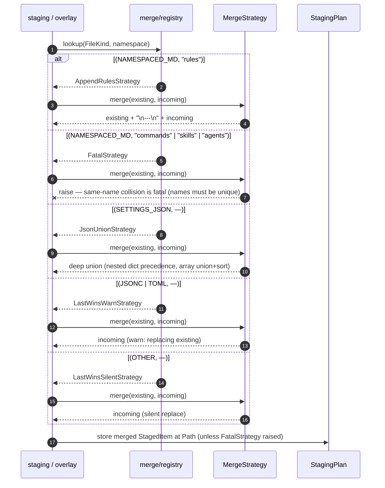
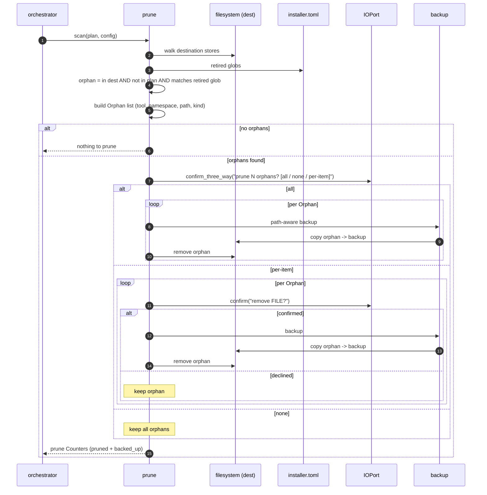

# Python Installer — Sequence Diagrams

> **Up**: [index](index.md)
> **Previous (reading order)**: [C4 L2 — Container](c4-l2-container.md)
> **Next (reading order)**: [C4 L3 — Engine](c4-l3-engine.md)
> **Source bead**: `agents-config-w1qls.9`
> **Source spec**: [`installer-design.md`](installer-design.md)

## Glossary

| Term | Meaning |
|---|---|
| `StagingPlan` | The in-memory `dict[Path, StagedItem]` built per tool. The `Stage` participant returns one; `Sync` consumes it. |
| Overlay | The plugin pass: plugin content is staged on top of the tool's plan, and `apply_extensions` applies plugin-declared YAML patches. Collisions route through the merge registry. |
| Collision | Two `StagedItem`s targeting the same destination `Path`. Resolved by the merge registry's `(FileKind, namespace)` dispatch. |
| Hash-compare | `Sync`'s skip test: if the incoming content hashes equal to the existing destination file, the file is left untouched. |
| Path-aware backup | Backup routing — namespaced files back up to a parent-level `<namespace>-backup/` sibling, top-level files back up in place — performed before any overwrite or prune. |
| Orphan | A destination file present on disk, absent from the freshly-built plan, AND matching an `installer.toml` retired glob — a prune candidate. |

## Purpose

Four sequence diagrams covering one install invocation and its three branching sub-flows:

1. **End-to-end install (happy path)** — detect → stage → overlay → merge → sync → exit.
2. **Collision merge dispatch** — how two `StagedItem`s for one path resolve through the `(FileKind, namespace)` registry.
3. **Sync per-item decision** — the hash-skip vs diff → confirm → backup → write branch, including `--dry-run`.
4. **Prune flow** — orphan scan → interactive prune → backup + remove.

Together they answer: *who calls whom, in what order, where does state live (in-memory plan vs disk), and where do the branches and confirmations sit?* Component structure lives in [`c4-l3-engine.md`](c4-l3-engine.md); data shapes in [`data-view.md`](data-view.md).

---

## Sequence 1 — End-to-end install (happy path)

One invocation: `python3 scripts/install.py --tools=claude,gemini` (equivalently `python -m installer --tools=claude,gemini` — the stub and the module form converge on the same process), with the beads plugin active. `Config` is resolved once; then the orchestrator loops per detected tool, building each tool's in-memory plan, overlaying plugins, and flushing to disk. The plan never touches disk except through `Sync`.

```mermaid
sequenceDiagram
    autonumber
    participant Op as Operator
    participant CLI as cli.py
    participant Cfg as config.py
    participant Orch as orchestrator
    participant Stage as staging
    participant Plug as plugin overlay
    participant Merge as merge registry
    participant Sync as sync
    participant FS as filesystem

    Op->>CLI: python3 scripts/install.py --tools=claude,gemini (or python -m installer ...)
    CLI->>Cfg: build Config
    Cfg->>FS: probe tool config dirs + load installer.toml
    FS-->>Cfg: detected tools, plugins, retired globs
    Cfg-->>CLI: frozen Config
    CLI->>Orch: run(config, io)

    loop per detected tool (claude, then gemini)
        rect rgb(245, 245, 255)
            Note over Orch,Stage: Build the in-memory StagingPlan for this tool
            Orch->>Stage: build StagingPlan(adapter)
            Stage->>FS: walk + read source (shared .agents/ + per-tool)
            FS-->>Stage: source bytes
            Stage->>Stage: strip .template suffix; scope namespaces
            Stage->>Stage: flatten DYNAMIC-INCLUDE (file form + ALL-RULES)
            Stage->>Stage: adapter.post_staging_transforms (gemini: frontmatter)
            Stage-->>Orch: StagingPlan = dict[Path, StagedItem]
        end

        rect rgb(255, 245, 245)
            Note over Orch,Merge: Plugin overlay — beads content + YAML extensions
            Orch->>Plug: overlay beads + apply_extensions(plan)
            Plug->>Merge: on collision: dispatch (FileKind, namespace)
            Merge-->>Plug: merged StagedItem (see Sequence 2)
            Plug-->>Orch: updated StagingPlan
        end

        rect rgb(245, 255, 245)
            Note over Orch,FS: Flush the plan to disk, file-by-file
            Orch->>Sync: flush(plan) to destination
            loop per StagedItem in plan
                Sync->>FS: hash-compare vs destination (see Sequence 3)
                alt unchanged
                    Note over Sync: skip — Counters.skipped++
                else changed or new
                    Sync->>FS: backup (if overwrite) + write
                    Note over Sync: Counters.created++ or updated++ (+ backed_up++ on overwrite)
                end
            end
            Sync-->>Orch: Counters
        end
    end

    opt --prune requested
        Orch->>Orch: prune flow (see Sequence 4)
    end

    Orch-->>Op: summary (created / updated / skipped / backed-up per tool); exit 0
```

### Notes on the happy path

- **The plan is in-memory for its whole life.** `Stage` returns a `dict[Path, StagedItem]`; overlay mutates it; only `Sync` writes to disk, one file at a time. There is no temp-dir staging tree (the deliberate departure from `install.sh`). `--dump-stage` is the sole path that materialises the plan, and it exits before any destination write.
- **Tool order is the detection order; tools are independent.** Each tool gets its own plan and its own sync pass — there is no cross-tool state. A failure shaping one tool's plan does not corrupt another's.
- **Overlay is where collisions happen.** Within a single tool's plan, shared + per-tool content rarely collide on the same path; the common collision is plugin content landing on a base asset. That collision is resolved by the merge registry (Sequence 2), not by `Sync`.
- **`Config` is frozen before the loop.** Detection, plugin discovery, and `installer.toml` load all happen once in `config.py`; nothing inside the loop re-detects.

---

## Sequence 2 — Collision merge dispatch

Two `StagedItem`s target the same destination `Path` (typically a base asset + a plugin overlay, or shared + per-tool content). The caller (overlay or staging) asks the registry for the strategy keyed on `(FileKind, namespace)`; the strategy returns a single merged item or raises.



### Notes on the merge dispatch

- **The dispatch key is `(FileKind, namespace)`, not `FileKind` alone.** `NAMESPACED_MD` needs its parent-dir namespace to choose: `rules` append-merges (rules compose), but `commands` / `skills` / `agents` are **fatal** on same-name collision (two skills with the same name is an authoring error, not a merge). For non-namespaced kinds (`SETTINGS_JSON`, `JSONC`, `TOML`, `OTHER`, `DIR`) the namespace component is unused and the lookup degenerates to a `FileKind`-only key.
- **Fatal is a feature.** `FatalStrategy` raising is the design intent: it surfaces an authoring mistake loudly rather than silently picking a winner. The message names both colliding files.
- **Each strategy is one class, one module, one test file.** The registry holds the only knowledge of *which* strategy applies; the strategies hold the only knowledge of *how* to merge. Swapping a registry entry in a test is how dispatch is asserted.

---

## Sequence 3 — Sync per-item decision

The per-file branch inside `Sync`'s loop (the `hash-compare` step expanded from Sequence 1). Covers new-file, unchanged, changed-interactive, and `--dry-run`.

```mermaid
sequenceDiagram
    autonumber
    participant Sync as sync
    participant FS as filesystem (dest)
    participant IO as IOPort
    participant Bak as backup

    Sync->>FS: stat destination Path
    alt destination absent
        alt --dry-run
            Sync->>IO: info "would create FILE"
            Note over Sync: Counters.created++ (preview — no write)
        else
            Sync->>FS: write new file
            Note over Sync: Counters.created++
        end
    else destination present
        Sync->>Sync: hash(incoming) vs hash(dest)
        alt hashes equal
            Note over Sync: identical — skip; Counters.skipped++
        else hashes differ
            Sync->>IO: show_diff(dest, incoming)
            alt --dry-run
                Note over Sync: preview only; Counters.updated++ (no write)
            else interactive
                Sync->>IO: confirm("overwrite FILE?")
                alt confirmed
                    Sync->>Bak: path-aware backup of dest
                    Bak->>FS: copy dest to namespace-backup/ (or in-place)
                    Sync->>FS: write incoming
                    Note over Sync: Counters.updated++ + backed_up++
                else declined
                    Note over Sync: keep existing; Counters.skipped++
                end
            end
        end
    end
```

### Notes on the sync decision

- **Hash-compare is the skip gate.** Unchanged files are never rewritten, so re-running the installer is cheap and quiet — the common case (most files identical) produces no prompts and no backups.
- **`--dry-run` short-circuits before every write but still shows diffs.** It is the preview mode: the operator sees exactly what *would* change (created / updated counts + diffs) without touching disk. This is also the parity-gate smoke-test surface (`install.py --dry-run` vs `install.sh --dry-run`).
- **Backup precedes overwrite, always.** No destination file is overwritten without first being copied to its path-aware backup location. The backup routing keeps namespaced backups out of the assistant's discovery walk.
- **All prompting is through `IOPort`.** `show_diff` and `confirm` never call the terminal directly; `ScriptedIO` drives them in tests, so every branch above is unit-testable without a TTY.

---

## Sequence 4 — Prune flow

Runs after the per-tool install loop when `--prune` (or standalone `--prune-only`) is requested. Finds destination files that the source no longer produces AND that match a retired glob, then removes them interactively (backing each up first).



### Notes on the prune flow

- **Prune is conservative by construction.** A file is only an orphan if it is on disk, absent from the freshly-built plan, **and** matches an `installer.toml` retired glob. A file the source simply doesn't produce (but that isn't on the retired list) is left alone — the retired-glob gate prevents the installer from deleting user-authored files it doesn't recognise.
- **Backup before remove, same as overwrite.** Every pruned file is recoverable from its path-aware backup; prune is reversible.
- **`--prune-only` skips staging + sync entirely.** It runs just the scan + interactive removal — and is mutually exclusive with `--dump-stage`.
- **Three-way then per-item.** The operator chooses bulk (`all` / `none`) or drops into per-file confirmation — all via `IOPort`, so the whole flow is scripted in tests.

---

## What these diagrams do NOT show

- **The component structure** that executes these flows — see [`c4-l3-engine.md`](c4-l3-engine.md).
- **The data shapes** (`StagingPlan`, `StagedItem`, `Orphan`, `Counters`, `Config`) the participants pass — see [`data-view.md`](data-view.md).
- **DYNAMIC-INCLUDE flattening internals** (the three directive forms) and the **Gemini frontmatter transform** mechanics — referenced as steps here; specified in `installer-design.md`.
- **The golden-master parity harness** (`install.sh` vs `install.py` diff) — a test artifact, not an install-time flow; see `installer-design.md` §"Test architecture".

## Cross-references

- **Previous (reading order)**: [C4 L2 — Container](c4-l2-container.md)
- **Next (reading order)**: [C4 L3 — Engine](c4-l3-engine.md) — the components that run these sequences
- **Companion data view**: [`data-view.md`](data-view.md)
- **Source spec**: [`installer-design.md`](installer-design.md) §"--dump-stage flag", §"Data model highlights", §"CLI surface"
