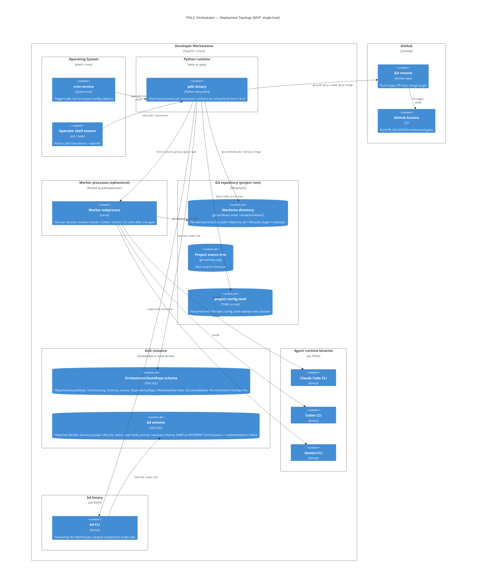

# PDLC Orchestrator — C4 Deployment View

> **Up**: [index](index.md)
> **Previous (reading order)**: [Data View](data-view.md)
> **Source bead**: `agents-config-wgclw.2.1`
> **Source spec**: [`2026-05-23-pdlc-orchestrator-core-design.md`](../../specs/2026-05-23-pdlc-orchestrator-core-design.md)

## Glossary

| Term | Meaning |
|---|---|
| Workstation | The single developer machine on which MVP runs; macOS or Linux. |
| Dolt | A SQL database with git-style branching, commits, and merges; the storage backend for both OrchestratorStateRepo and bd. |
| Per-tick branch checkpoint | A Dolt branch commit performed by PERSIST at the end of every successful tick; enables `dolt log` replay during crash recovery. |
| Worktree | A git worktree under `<project-root>/.claude/worktrees/`; per-attempt worker branches live here. |
| `config_hash` | Hash of the project-config TOML in effect at a tick; pinned on every Session at dispatch. |
| Session | One worker invocation; one Session = one attempt at one gate. See `CONTEXT.md > Session`. |
| Artifact directory | Supervisor-owned per-Session directory holding stdout/stderr, gate-evidence YAML, and any persona-emitted artifacts. |

## Purpose

Show *where* the L2 containers physically run for the MVP. Answers: *what host, what process, what data store, what file path?*

**MVP is single-host, single-user, single-operator-workstation.** Multi-host coordination, distributed locks, remote runners, and shared artifact stores are explicitly **post-MVP** per the [orchestrator core design spec's single-host constraint](../../specs/2026-05-23-pdlc-orchestrator-core-design.md#single-host-constraint-mvp) — tracked as bead `agents-config-89v77`.

## Diagram

## Topology notes

### Deployment unit: one developer workstation

Everything in the MVP runs on one machine, owned by one developer. Even cron is local cron — no remote scheduler, no central queue, no shared infrastructure. This is deliberate per the [single-host constraint](../../specs/2026-05-23-pdlc-orchestrator-core-design.md#single-host-constraint-mvp): the design proves out on one host before adding the cross-host complexity of distributed locks, shared artifact stores, and remote runners.

### Process lifetimes

| Process | Lifetime |
|---|---|
| `pdlc tick` invocation | Short — milliseconds to ~60s (tick-budget bounded for latency work; correctness ops bypass budget). Exits after each tick. |
| Operator-invoked `pdlc <command>` | Short — typically sub-second. Exits immediately. |
| Worker subprocess | Bounded by `deadline_ts`; cancelled via SIGTERM/SIGKILL if exceeded. Typically minutes to tens of minutes. One Worker per Session. |
| Dolt instance | Long-lived (embedded process or local Dolt server). Multiple `pdlc` invocations connect to the same instance. |
| bd CLI invocation | Short — per-call subprocess from the WorkTracker adapter. |
| cron service | Long-lived (system service). |
| Agent runtime CLI invocation | Short — per-Worker subprocess invocation. |

### Storage layout

- **OrchestratorStateRepo** — Dolt schema, owned by the orchestrator. Per-tick branch checkpoints enable `dolt log` replay for crash recovery. Tracker-domain data is NOT stored here.
- **bd schema** — Dolt schema, owned by bd. The orchestrator reads it via the WorkTracker adapter (via bd CLI); never directly via SQL. **MVP implementation choice**: same Dolt instance with separate schemas, or two separate Dolt instances. The architectural separation is the *contract* (Orchestrator owns lifecycle state, tracker owns structural state; they communicate only by Objective ID), not the physical deployment shape.
- **Worktrees** — git worktrees under `<project-root>/.claude/worktrees/`, per the project's worktree-location rule. Per-attempt branches.
- **project-config.toml** — versioned with the project source. `config_hash` is computed at tick start and pinned on every Session at dispatch.
- **Artifact directories** — supervisor-owned per-Session directories under `<project-root>/.pdlc/artifacts/<session_id>/` (location subject to implementation child review). Hold worker stdout/stderr, gate-evidence YAML, and any persona-emitted artifacts.

### Tooling on PATH

The MVP assumes the operator's PATH includes:

- `pdlc` — the orchestrator entry point itself
- `bd` — the Work Tracker CLI
- `claude` / `codex` / `gemini` — at least one of the AI agent runtime CLIs (which ones depend on persona configuration in project-config)
- `git`, `gh` — standard
- `dolt` — if Dolt is invoked CLI-style rather than embedded

Missing or under-versioned required tooling at tick start suppresses the DISPATCH phase. The tick still runs DISCOVER, RECONCILE, REAP, and PERSIST so affected Objectives are marked `needs_reconcile=true` with code `missing-toolchain:<binary>` (the same code covers both missing-binary and under-version cases). The orchestrator does not spawn workers until the toolchain is restored. See the *Tooling-failure handling* section of `state-machine.md` for the full mechanism.

### External coupling

- **GitHub** — remote git host; PR creation, merge, and webhook trigger for CI. The orchestrator talks to GitHub via `git` and `gh`.
- **GitHub Actions** — the assumed CI provider for the MVP. Other CI providers are out-of-scope for MVP but the contract surface (push → verdict polling) is provider-agnostic.

## Post-MVP markers

The following capabilities are explicitly **deferred** and would change the deployment topology significantly. Each carries an open bead.

| Capability | Bead | Topology impact |
|---|---|---|
| Multi-host / distributed execution | `agents-config-89v77` | Adds a shared lease store, remote runners, network coordination, shared artifact store |
| Containerised worker sandboxing v2 | `agents-config-5vxfw` | Adds a container runtime (Docker / Podman) per Worker; worker isolation boundary becomes container boundary |
| Rich dashboards / metrics endpoint | `agents-config-ak007` | Adds a long-lived metrics server, dashboard hosting (Grafana / equivalent) |
| Cryptographic hash-chain on TransitionLog | `agents-config-64ecc` | Tamper-evident layer over TransitionLog; minor schema addition, no new processes |
| v2 WorkTracker protocol expansions (Domains 4 / 5 / 7 in tracker) | `agents-config-o2oub` | Moves sidecar dependencies + metadata-overrides from OrchestratorStateRepo into the tracker schema |

None of these change the MVP shape. They are flagged here so that implementation children of `wgclw.2` do not lock the MVP into design choices that would block their later introduction.

## What this diagram does NOT show

- **Persona-internal flows** (Test-Author, Implementer, Reviewer, RCA) — those belong to `wgclw.3` / `wgclw.4` / `wgclw.6` HLD sets in their own subfolders.
- **Component-level internals of any container** — those live in [`c4-l3-tick-loop.md`](c4-l3-tick-loop.md) (for the tick loop) and the TODO stubs there (for the other containers).
- **Tick runtime behaviour** — see [`sequences.md`](sequences.md).
- **Data ownership and schema** — see [`data-view.md`](data-view.md).

## Cross-references

- **Up**: [C4 L2 — Container](c4-l2-container.md)
- **Companion source**: orchestrator core design spec §§ [The Process Model: CLI-driven Tick](../../specs/2026-05-23-pdlc-orchestrator-core-design.md#the-process-model-cli-driven-tick), [Single-host constraint (MVP)](../../specs/2026-05-23-pdlc-orchestrator-core-design.md#single-host-constraint-mvp), [Worktree Discipline](../../specs/2026-05-23-pdlc-orchestrator-core-design.md#worktree-discipline)
- **Worktree convention**: per the project worktree rule, all worktrees live under `<project-root>/.claude/worktrees/` (never elsewhere, never nested in subdirectories)
