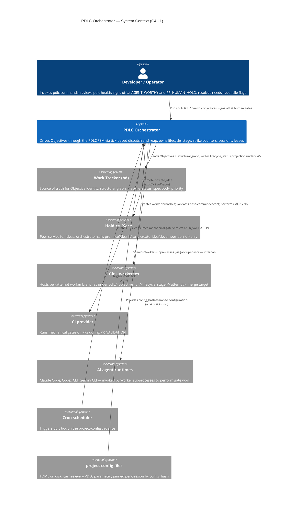

# PDLC Orchestrator — C4 Level 1: System Context

> **Up**: [index](index.md)
> **Source bead**: `agents-config-wgclw.2.1`
> **Source spec**: [`2026-05-23-pdlc-orchestrator-core-design.md`](../../specs/2026-05-23-pdlc-orchestrator-core-design.md)

## Purpose

Place the PDLC Orchestrator in its environment. Answers: *what is the system, who uses it, and what other systems does it talk to?* It is the most zoomed-out view in the artifact set — every other diagram drills deeper.

## Diagram

## Element notes

### People

- **Developer / Operator** — the human at the wheel. Three load-bearing interactions:
  - **Ad-hoc command invocations** (`pdlc tick`, `pdlc health`, `pdlc objectives show <id>`, `pdlc reconcile`, `pdlc objectives unfreeze`). The CLI is the entire user-facing surface; there is no daemon and no dashboard.
  - **Human signoffs** at the two human gates the FSM mandates: `CANDIDATE_UOW → AGENT_WORTHY` (Spec signoff) and `PR_HUMAN_HOLD → MERGING` (approval before merge).
  - **`needs_reconcile` disposition** when the Orchestrator surfaces an Objective it could not reconcile mechanically (terminal-disposition classifier ambiguous; fingerprint mismatch unresolved).

### External systems

- **Work Tracker (bd)** — the canonical authority on *what Objectives exist*. The Orchestrator never invents Objectives; it observes them via the Discovery Sweep and mirrors their structural graph. Reparenting, child creation, dependency edits, and spec-body changes flow through bd first; the Orchestrator picks them up on the next tick. Per Law L8, bd is the *reference adapter* for the WorkTracker protocol — future trackers conform to the protocol, not the other way around.

- **Holding Place** — a peer service for the pre-Objective Idea pipeline (Capture → Groom → Shape → Promote). The Orchestrator's interaction with it is restricted to **exactly two call types** (per CA-8 Option A): `promote(idea_id) → objective_id` and `create_idea(decomposition_of=container_id) → idea_id`. The Orchestrator never `tick`s the Holding Place; Ideas are a distinct primitive with qualitatively different mechanics.

- **Git + worktrees** — every Worker operates on its own branch named `pdlc/<objective_id>/<lifecycle_stage>/<attempt_number>`. Branches descend from a `worktree_base_commit` pinned at fork; reap validates descent before accepting work. The Orchestrator performs the merge itself at `MERGING`.

- **CI provider** — runs the mechanical gates on PRs during `PR_VALIDATION` (build, test, lint, coverage, security scan). The Orchestrator pushes the PR and consumes the verdicts; it does NOT re-implement CI gates inside its own tick loop.

- **AI agent runtimes** — Claude Code, Codex CLI, Gemini CLI. Workers (orchestrator-internal) shell out to these runtimes to perform the actual gate work (test-authoring, implementation, review, RCA). The Orchestrator does not care which runtime a Worker uses — the persona contract is what matters.

- **Cron scheduler** — production trigger for `pdlc tick`. Cadence lives in project-config. The cron-driven invocation is the same code path as a human-invoked tick; no daemon, no event loop.

- **project-config files** — versioned TOML on disk. Every PDLC parameter (tick budget, Reviewer Agent list, Sizing Gate weights and thresholds, coverage thresholds, retry budgets, `approval_required` defaults, aging-nag thresholds, cron cadence) lives here. Each tick computes a `config_hash` at start; every Session pins the hash at dispatch; reap validates the pin matches.

## What this diagram does NOT show

- Anything inside the PDLC Orchestrator boundary — those are containers (L2) and components (L3).
- The internal mechanics of any external system (bd's storage, the CI provider's pipelines, the agent runtimes' internals).
- Failure paths, retry behaviour, lifecycle-stage transitions. Those live in [`sequences.md`](sequences.md) and [`state-machine.md`](state-machine.md).
- Deployment topology (host count, process layout, filesystem layout). That lives in [`c4-deployment.md`](c4-deployment.md).

## Cross-references

- **Next**: [C4 L2 — Container](c4-l2-container.md) — opens the PDLC Orchestrator boundary
- **Companion source**: orchestrator core design spec §§ [Holding Place handoff](../../specs/2026-05-23-pdlc-orchestrator-core-design.md#holding-place-handoff), [State Ownership](../../specs/2026-05-23-pdlc-orchestrator-core-design.md#state-ownership), [The Process Model: CLI-driven Tick](../../specs/2026-05-23-pdlc-orchestrator-core-design.md#the-process-model-cli-driven-tick)
- **Glossary**: `CONTEXT.md` entries for *Objective*, *Idea*, *Holding Place*, *Work Tracker*
