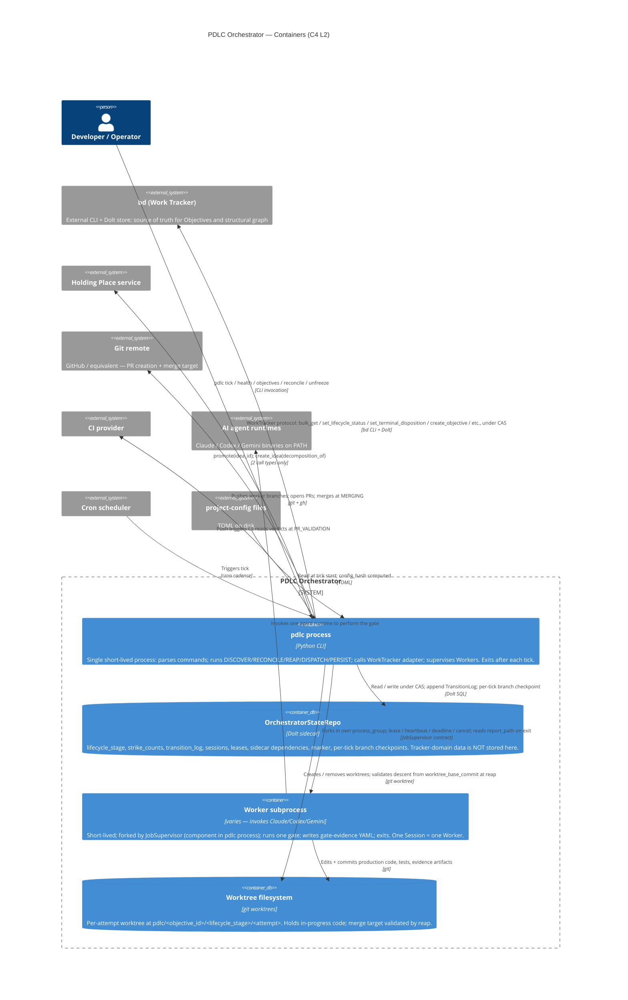

# PDLC Orchestrator — C4 Level 2: Container

> **Up**: [index](index.md)
> **Previous**: [C4 L1 — System Context](c4-l1-context.md)
> **Source bead**: `agents-config-wgclw.2.1`
> **Source spec**: [`2026-05-23-pdlc-orchestrator-core-design.md`](../../specs/2026-05-23-pdlc-orchestrator-core-design.md)

## Glossary

| Term | Meaning |
|---|---|
| Container (C4 sense) | A separately runnable process or data store — not a Linux/Docker container. |
| Component | A code module inside a container; appears at C4 L3, not L2. |
| Session | One worker invocation; one Session = one attempt at one gate. See `CONTEXT.md > Session`. |
| CAS (Compare-And-Swap) | Concurrency control: read with a version, write only if the version is unchanged; mismatch aborts the transition and re-reads. Every tracker write and every state-repo write carries one. |
| Gate-evidence YAML | Structured file the worker writes at `report_path` on exit; reap reads it, validates the schema, and (in MVP) re-runs the gate independently against the worker's commit SHA. The YAML carries pointers to supervisor-captured evidence (exit_code, stdout/stderr paths, start/end timestamps, commit_sha_at_end) that the worker process cannot fabricate — the JobSupervisor owns those file handles out-of-band. |
| `gate_trust_mode` | Project-config toggle (post-MVP, tracked as `agents-config-pdmkh`): `verify` (MVP default — re-run the gate) or `trust_evidence` (skip re-execution if supervisor-captured artifacts satisfy confidence predicates). |
| `worktree_base_commit` | Immutable git commit pinned on a Session at fork; reap validates the worker's commits descend from it via `git merge-base --is-ancestor`. |
| `config_hash` | Hash of the project-config in effect at a tick; pinned on every Session at dispatch; validated at reap. |
| Sidecar | A store the orchestrator owns that holds data not yet promoted to the WorkTracker protocol (MVP-scoped — see [c4-l3-state-repo.md](c4-l3-state-repo.md)). |

## Purpose

Open the PDLC Orchestrator boundary and show its deployable / runnable units. Answers: *what runs, where does state live, how do the running pieces talk to each other?*

A **container** here is a C4 container: a separately runnable process or data store. The CLI dispatch, tick loop, work-tracker adapter, JobSupervisor, and project-config loader all live inside the single `pdlc` Python process and are therefore **components** of that container, not containers themselves — they appear at L3. The same goes for the bd adapter: `bd` itself is the external Work Tracker; the adapter that calls it is a component inside `pdlc`.

This view replaces the "block diagram" the bead originally specified — same intent, properly stratified.

## Diagram

## Element notes

### Internal containers

#### `pdlc` process — Python CLI

The whole orchestrator runs here. Every invocation is short-lived: parse args, do the work, exit. There is no daemon, no background thread pool, no in-memory cache between invocations. State that must survive an invocation lives in **OrchestratorStateRepo** (orchestrator-owned) or **bd** (tracker-owned).

Internally — at L3 — this process is composed of:

- CLI dispatcher (subcommand routing)
- Tick loop (DISCOVER / RECONCILE / REAP / DISPATCH / PERSIST)
- WorkTracker adapter (bd-bound implementation of the protocol)
- JobSupervisor (process supervisor for Worker subprocesses)
- Lease manager (CAS-protected `Leases` table)
- CAS predicate evaluator (version-fingerprint discipline)
- Pre-strike triage classifier
- Sizing Gate calculator
- project-config loader + `config_hash` computer

Those components are drawn out in [`c4-l3-tick-loop.md`](c4-l3-tick-loop.md) for the tick loop; the other components carry **TODO stubs** in that file pending their own implementation children.

#### OrchestratorStateRepo — Dolt sidecar

A SQL store distinct from the tracker's store, holding everything the Orchestrator is canonical for:

- `ObjectiveLifecycleState` — lifecycle_stage, strike_counts, gate_pass_shas, frozen_branch_ref, terminal_disposition, needs_reconcile flag
- `TransitionLog` — append-only event log; the source of truth for *what the orchestrator did and why*
- `Sessions` — one row per worker invocation; lifecycle pending → running → exited → reaped (or crashed)
- `Leases` — tick lock + supervisor leases; CAS-protected via `(holder_id, fencing_token)`
- `DependencyEdges` (sidecar, MVP scope) — typed dependency edges between Objectives
- `MetadataOverrides` (sidecar, MVP scope) — per-Objective config overrides
- `DiscoveryMarker` — last-seen tracker watermark for the acceleration-path Discovery

**Dolt was chosen as the storage backend** specifically because its git-style branching enables per-tick branch checkpoints that allow `dolt log` replay during crash recovery. See [`sequences.md`](sequences.md) tick cycle for the persistence ordering and [`c4-l3-state-repo.md`](c4-l3-state-repo.md) for the per-table breakdown.

#### Worker subprocess

One Worker = one Session = one attempt at one gate. Forked by **JobSupervisor** (component inside the `pdlc` process), placed in its own process group for clean cancellation, run under a `deadline_ts`, and reported on via `terminal_status` after exit.

The Worker's job is bounded:

1. Read its assigned Spec / context
2. Invoke an AI agent runtime (Claude / Codex / Gemini) per the persona contract
3. Edit code in its assigned worktree branch
4. Run the gate command locally and capture results
5. Write a `gate-evidence YAML` to `report_path` inside the supervisor-owned `artifact_dir`
6. Exit

The Orchestrator's reap step does **not trust the Worker's verdict field** in the gate-evidence YAML — in MVP it re-runs the gate command itself against the Worker's commit SHA. This **independent gate verification** is the MVP security posture: every gate-pass claim is re-established, never inherited from the worker process.

**Optimisation path (post-MVP, `agents-config-pdmkh`).** Re-execution is the right MVP default but is not the only trustworthy stance. The JobSupervisor captures gate evidence (`gate_cmd`, `exit_code`, `start_ts`, `end_ts`, `stdout_path`, `stderr_path`, `commit_sha_at_end`) into the supervisor-owned `artifact_dir` out-of-band of the worker process — those artifacts cannot be fabricated by a confidently-wrong worker. A future `gate_trust_mode = "trust_evidence"` mode would have reap inspect those supervisor-owned artifacts and skip re-execution when confidence predicates pass (`exit_code == 0`, `commit_sha_at_end == HEAD`, `gate_cmd` matches the expected spec, no concurrent worktree mutation between `end_ts` and now). The trust anchor is the supervisor, never the worker report — the report only *points* to supervisor-owned paths. The road-paving for this lives in the worker-report contract today (see `data-view.md`'s *Worker → orchestrator (via filesystem)* pattern); the activation work is the `agents-config-pdmkh` bead.

#### Worktree filesystem

Standard git worktrees under the project's worktree directory. Per-attempt branches named `pdlc/<objective_id>/<lifecycle_stage>/<attempt_number>`. The `worktree_base_commit` is pinned on the Session record at fork; reap validates the Worker's commits descend from that base via `git merge-base --is-ancestor`. Worktree cleanup is idempotent and safe to retry across ticks (see *Worktree Discipline* in the core design spec).

### External systems (carried forward from L1)

- **bd (Work Tracker)** — at L1 this was a single "Work Tracker" box. At L2 we name the concrete tool: bd CLI plus its Dolt store. The WorkTracker adapter component (inside `pdlc`) is the only thing that talks to bd; nothing else does direct bd calls.
- **Git remote** — split out from L1's "Git + worktrees" because the local worktree filesystem is now internal (it's where Workers commit) while the remote is external (push / PR / merge target).
- **Holding Place, CI provider, AI agent runtimes, Cron scheduler, project-config files** — unchanged from L1.

## Container-relationship discipline (worth memorising)

- **Tracker writes are CAS-predicated.** Every write through the WorkTracker adapter carries a tracker-side version predicate; mismatch aborts the in-flight transition with `tracker-version-mismatch` and re-ticks from a re-read state.
- **State-repo writes are also CAS-predicated.** Every `ObjectiveLifecycleState` write carries a row-version predicate; mismatch aborts with `state-version-mismatch`. Both predicates are evaluated by the **CAS predicate evaluator** component at L3.
- **Worker → state is one-way during the Session.** The Worker writes the gate-evidence YAML to disk inside `artifact_dir`; the Orchestrator reads it back at reap. The Worker does **not** mutate `OrchestratorStateRepo` directly.
- **The Orchestrator owns worktree lifecycle.** Workers commit *into* the worktree but do not create or destroy the worktree itself. Create happens at DISPATCH; cleanup happens at reap (after gate-evidence is ingested) or at machine-wake recovery for crashed Sessions.
- **Holding Place is touched twice — that is the entire surface.** Any temptation to add a third call type is a contract violation. The Holding Place is a peer service with qualitatively different mechanics from the Orchestrator; the two-call boundary keeps that separation honest.

## What this diagram does NOT show

- Components inside the `pdlc` process — those live in [`c4-l3-tick-loop.md`](c4-l3-tick-loop.md).
- Tick ordering or sequence — see [`sequences.md`](sequences.md).
- Lifecycle stages and transition rules — see [`state-machine.md`](state-machine.md).
- Data schema and ownership boundary detail — see [`data-view.md`](data-view.md).
- Where these containers physically run — see [`c4-deployment.md`](c4-deployment.md).

## Cross-references

- **Previous**: [C4 L1 — System Context](c4-l1-context.md)
- **Next (reading order)**: [Sequences](sequences.md) — tick cycle + Objective happy path
- **Related**: [C4 L3 — Tick Loop](c4-l3-tick-loop.md) — components inside the `pdlc` process
- **Companion source**: orchestrator core design spec §§ [The Process Model: CLI-driven Tick](../../specs/2026-05-23-pdlc-orchestrator-core-design.md#the-process-model-cli-driven-tick), [The Session Primitive](../../specs/2026-05-23-pdlc-orchestrator-core-design.md#the-session-primitive), [State Ownership](../../specs/2026-05-23-pdlc-orchestrator-core-design.md#state-ownership), [Worktree Discipline](../../specs/2026-05-23-pdlc-orchestrator-core-design.md#worktree-discipline)
