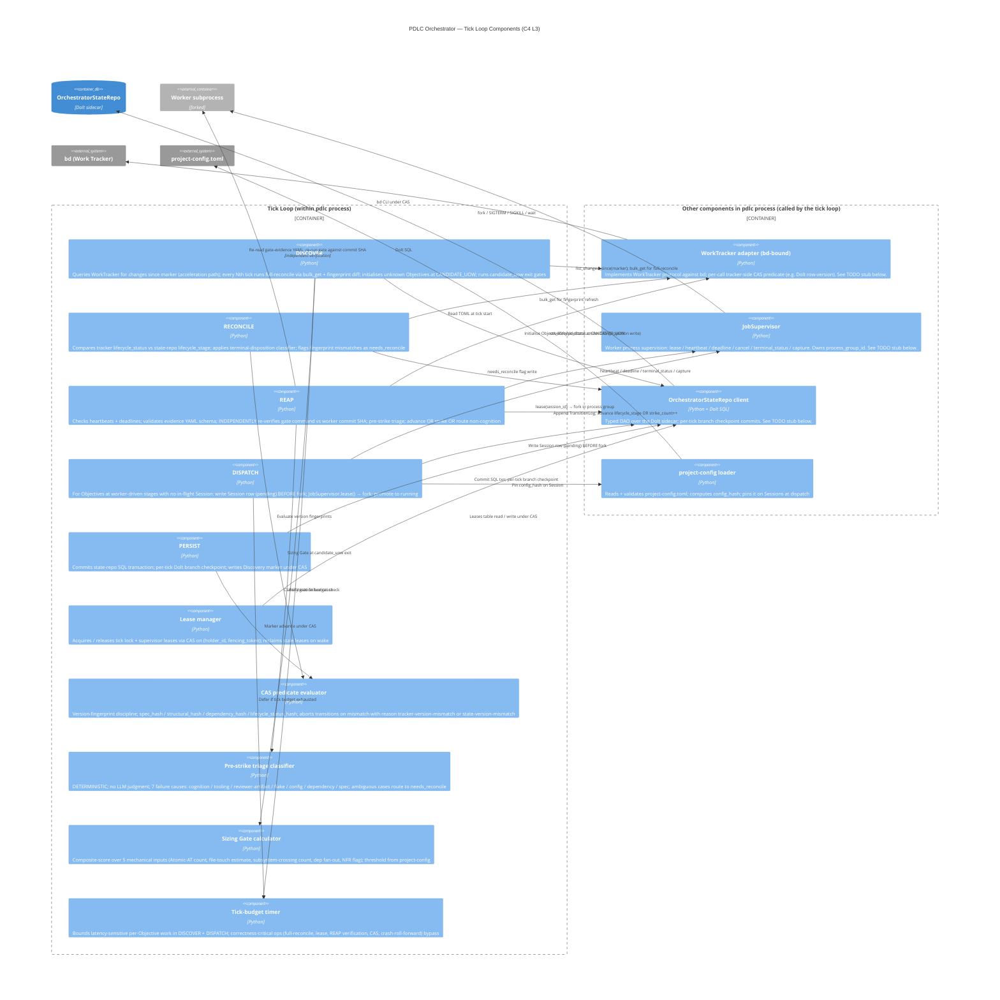

# PDLC Orchestrator — C4 Level 3: Tick Loop Components

> **Up**: [index](index.md)
> **Previous (reading order)**: [State Machine](state-machine.md)
> **Source bead**: `agents-config-wgclw.2.1`
> **Source spec**: [`2026-05-23-pdlc-orchestrator-core-design.md`](../../specs/2026-05-23-pdlc-orchestrator-core-design.md)

## Glossary

| Term | Meaning |
|---|---|
| `lifecycle_stage` | Where an Objective is in the PDLC FSM — one of the [named Lifecycle Stage Constants](index.md#conventions). Orchestrator-owned. |
| Session | One worker invocation; one Session = one attempt at one gate. See `CONTEXT.md > Session`. |
| CAS (Compare-And-Swap) | Concurrency control: read with a version, write only if the version is unchanged. Mismatch aborts the transition and re-reads. Every tracker write and every state-repo write carries one. |
| Version fingerprint | Per-Objective hash (`spec_hash`, `structural_hash`, `dependency_hash`, `lifecycle_status_hash`) used to detect mid-flight tracker edits during RECONCILE. |
| Lease | A CAS-protected claim — either the per-host tick lock or a per-Session supervisor lease. Carries a fencing token. |
| Fencing token | Monotonic counter attached to a lease; CAS-predicate-evaluated on every write so a stale lease cannot mutate state under a newer holder. |
| Pre-strike triage | Classifier that decides *what kind* of failure a gate failure is (cognition / tooling / reviewer-artifact / flake / config / dependency / spec) before charging a strike. Deterministic Python; never LLM-judged. |
| Sizing Gate | Mechanical composite-score computation that decides Sized (Executable) vs Oversized (Container) at the `CANDIDATE_UOW → AGENT_WORTHY` exit. |
| `needs_reconcile` | An Orchestrator-only flag (NOT a lifecycle stage) raised when the reconcile step cannot determine the correct terminal mapping for an Objective; surfaces on `pdlc health` for human disposition. |
| `terminal_disposition` | Tracker-owned typed metadata field carrying the *why* of an Objective's terminal state (`killed`, `manually-merged`, `duplicate`, `superseded`, `abandoned`); the orchestrator reads it to map into a terminal lifecycle stage. |
| `config_hash` | Hash of the project-config in effect at a tick; pinned on every Session at dispatch; validated at reap. |
| `worktree_base_commit` | Immutable git commit pinned on a Session at fork; reap validates the worker's commits descend from it. |

## Purpose

Zoom into the `pdlc process` container from [C4 L2](c4-l2-container.md). Show the components that make up the **tick loop** — the heart of the Orchestrator — and the adjacent components inside the same process that the tick loop calls.

The tick loop's five named phases (DISCOVER, RECONCILE, REAP, DISPATCH, PERSIST) are each drawn as components, along with the cross-cutting machinery they depend on (lease management, CAS predicate evaluation, pre-strike triage, the Sizing Gate calculator, and the tick-budget timer).

**Scope note**: only the tick loop is fully decomposed here. The other containers from L2 — **WorkTracker adapter**, **JobSupervisor**, **OrchestratorStateRepo** — carry **TODO stubs** at the bottom of this file. They will be filled in when their respective implementation children (under `wgclw.2`) open and have something concrete to draw. Stubbing them now establishes the home; expanding them prematurely would lock in design before it has been ratified.

## Diagram — Tick loop components

## Element notes — tick loop phases

### DISCOVER

Two execution paths in one component:

- **Acceleration path (every tick)** — `WorkTracker.list_changed_since(marker)` returns Objectives that have changed since the last successful tick. Cheap; processes only the delta.
- **Full-reconcile path (every Nth tick, project-config default N=10)** — `bulk_get` of all Objectives plus per-object fingerprint diff against `OrchestratorStateRepo`. This is a **correctness mechanism**, not a latency-sensitive one — it is therefore **not budget-bounded** and runs to completion regardless of the tick budget.

For each unknown Objective, DISCOVER initialises an `ObjectiveLifecycleState` at `CANDIDATE_UOW` and runs the candidate_uow exit gates (Atomic-AT lint, DoD application, Sizing Gate). Per-iteration budget check at the top of the loop emits `budget-exhausted-in-discover` when the tick budget fires; un-processed Objectives wait for the next tick.

### RECONCILE

Compares the tracker's coarse `lifecycle_status` against the state-repo's fine `lifecycle_stage` per Objective known to both stores. The **terminal-disposition classifier** reads the tracker's typed `terminal_disposition` field and maps each value to the appropriate terminal lifecycle stage. Ambiguous or absent dispositions raise `needs_reconcile=true` — an Orchestrator-only flag, NOT a lifecycle stage — which surfaces on `pdlc health` for human disposition. The classifier never silently collapses semantically-distinct closures (a tracker-side `close` could mean `killed`, `manually-merged`, `duplicate`, `superseded`, or `abandoned` — the human picks if the typed field is absent).

Fingerprint mismatches (`spec_hash`, `structural_hash`, `dependency_hash`, `lifecycle_status_hash`) also raise `needs_reconcile`. RECONCILE never silently mutates terminal state.

### REAP

The most operationally consequential phase. For each Session with `status=running`:

1. Check the JobSupervisor's heartbeat and deadline. Silent past `deadline_ts` → cancel + record strike (subject to pre-strike triage).
2. If supervisor reports `exited` and report present:
   - Validate the gate-evidence YAML schema.
   - **Independently re-run the gate command** against the worker's commit SHA. Reap never trusts the worker's `verdict` field; it re-establishes the claim itself.
   - Validate `config_hash` matches the live config. Mismatch routes the Session to the **config-version-divergence handler**: the Session continues to reap under its original `config_hash`, but no new Session is dispatched against the divergent config until the operator resolves it.
   - Validate worktree state (descended from `worktree_base_commit`, `git status --porcelain` clean).
   - Run **Pre-strike triage** to classify the failure cause.
   - Advance `lifecycle_stage` OR record a cognition strike OR route the non-cognition failure.
   - On 3rd cognition strike: route to `AUTOPSY` (freeze branch; spawn RCA Sessions).

### DISPATCH

For each Objective at a worker-driven `lifecycle_stage` (`TEST_AUTHORING`, `IMPLEMENTING`, `REVIEWING`, `PR_VALIDATION`, `AUTOPSY`) with no in-flight Session:

1. Check tick-budget remaining; defer to next tick if exhausted.
2. **Write the Session row to `OrchestratorStateRepo.Sessions` with `status=pending` BEFORE fork** — so a crash between write and fork leaves a reconcilable record (Crash-Recovery point (a)).
3. Pin `config_hash` on the Session record.
4. Call `JobSupervisor.lease(session_id)` to fork the Worker in its own process group.
5. Promote the Session to `running` and populate `supervisor_id`, `lease_token`, `process_group_id`, `artifact_dir`, `worktree_base_commit`, `deadline_ts`.

Degraded **reap-only mode** (active during config-version divergence or `tracker_unreachable`) SKIPS dispatch but still reaps in-flight Sessions to completion.

### PERSIST

Commits the SQL transaction for the tick's accumulated state-repo writes. Performs the **per-tick Dolt branch checkpoint commit** that enables `dolt log` replay for crash recovery. Writes the new Discovery marker under CAS against the prior marker (marker monotonicity invariant). Releases the tick lease; exits with status code reflecting nominal / degraded.

## Element notes — cross-cutting machinery

### Lease manager

Two leases in play per tick: the **tick lock** (one per host; prevents concurrent ticks corrupting state) and **per-Session supervisor leases** (one per running Worker; fencing-token CAS). A fast-path file lock at `.pdlc/tick.lock` is an *optimisation only* — the authoritative lease lives in `OrchestratorStateRepo.Leases`. Stale-lease detection on machine-wake reclaims abandoned leases.

### CAS predicate evaluator

The heart of the orchestrator's correctness story. Every tracker write carries a tracker-side version predicate (e.g. bd's Dolt row-version); every state-repo write carries a row-version predicate. Mismatch aborts the in-flight transition with `tracker-version-mismatch` or `state-version-mismatch`, and the tick re-reads + re-ticks the affected Objective. The four named fingerprints — `spec_hash`, `structural_hash`, `dependency_hash`, `lifecycle_status_hash` — are computed per-Objective and compared at the read-version step of the transition discipline.

### Pre-strike triage classifier

Strict deterministic Python. Seven failure causes (see [`state-machine.md`](state-machine.md) for the routing): **cognition** (charge strike), **tooling** (no strike — Autopsy route v), **reviewer-artifact** (no strike — tooling escalation), **flake** (retry then strike), **config** (no strike — divergence handler), **dependency** (no strike — park via route iv), **spec** (no strike — Specification RCA). **LLM judgment is forbidden in failure-cause assignment** — the classifier inputs are gate-evidence YAML, exit code, reviewer-artifact validation, `config_hash` check, dependency check, and worktree state check; nothing else. Ambiguous cases route to `needs_reconcile=true` for human disposition rather than guessing.

### Sizing Gate calculator

Mechanical composite-score computation at `CANDIDATE_UOW → AGENT_WORTHY` exit. Five mechanical inputs (Atomic-AT count, file-touch estimate, subsystem-crossing count, dependency fan-out, NFR-escalation flag), each normalised and weighted from project-config. Score < threshold → **Sized** (Executable); score ≥ threshold → **Oversized** (Container). If a project's adoption demands an LLM-judgment axis (e.g. "architectural risk"), that axis MUST be marked `human-mechanical` and require an explicit recorded operator override — the orchestrator does not silently accept LLM-judgment inputs into the Sizing Gate.

### Tick-budget timer

Bounds latency-sensitive per-Objective work at two checkpoints: inside DISCOVER (before evaluating Candidate UoW exit gates for each unknown Objective) and inside DISPATCH (before forking a new worker Session). **Correctness-critical operations bypass the budget**: full-reconcile, lease acquisition/release, REAP heartbeat/deadline checks and worker-report verification, CAS predicate evaluation, Crash-Recovery roll-forward. Budgeting these would trade correctness for latency — the wrong trade.

## Other containers' L3 views

The other L2 containers — **WorkTracker adapter**, **JobSupervisor**, and **OrchestratorStateRepo** — have their own L3 component diagrams in this folder. They are currently **stubs**, to be filled in when their respective implementation children (under `wgclw.2`) open and have ratified design decisions to draw against:

- [c4-l3-worktracker-adapter.md](c4-l3-worktracker-adapter.md) — **STUB** — expected components: protocol-method groupings, bd CLI invocation, CAS predicate computation, fingerprint computation, error translation, Discovery marker management
- [c4-l3-jobsupervisor.md](c4-l3-jobsupervisor.md) — **STUB** — expected components: lease lifecycle, heartbeat reporter, deadline enforcer, terminal-status collector, capture handles, cancellation handler, crash-recovery roll-forward
- [c4-l3-state-repo.md](c4-l3-state-repo.md) — **STUB** — expected components: schema migrations, per-table DAOs, branch-checkpoint mechanism, CAS predicate API, read-only-cache fallback, retention policy

Each stub file lists its expected components, its when-to-fill trigger, and its source-spec pointer. Establishing the homes now means future contributors don't have to invent folder structure mid-stride.

## What this diagram does NOT show

- The **runtime ordering** of the five phases — that lives in [`sequences.md`](sequences.md) tick cycle.
- The **lifecycle stages** the tick loop transitions Objectives through — that lives in [`state-machine.md`](state-machine.md).
- The **table-level data layout** of `OrchestratorStateRepo` — that lives in [`data-view.md`](data-view.md).
- The **physical layout** of where these components run — that lives in [`c4-deployment.md`](c4-deployment.md).
- Components inside the Worker subprocess (persona-specific; out of orchestrator scope).

## Cross-references

- **Up**: [C4 L2 — Container](c4-l2-container.md) — the `pdlc process` container being zoomed
- **Companion sequence**: [`sequences.md`](sequences.md) — runtime ordering of these components
- **Companion source**: orchestrator core design spec §§ [Tick algorithm (high-level)](../../specs/2026-05-23-pdlc-orchestrator-core-design.md#tick-algorithm-high-level), [Transition execution discipline](../../specs/2026-05-23-pdlc-orchestrator-core-design.md#transition-execution-discipline), [Pre-strike triage](../../specs/2026-05-23-pdlc-orchestrator-core-design.md#pre-strike-triage), [Sizing Gate decision table](../../specs/2026-05-23-pdlc-orchestrator-core-design.md#sizing-gate-decision-table)
