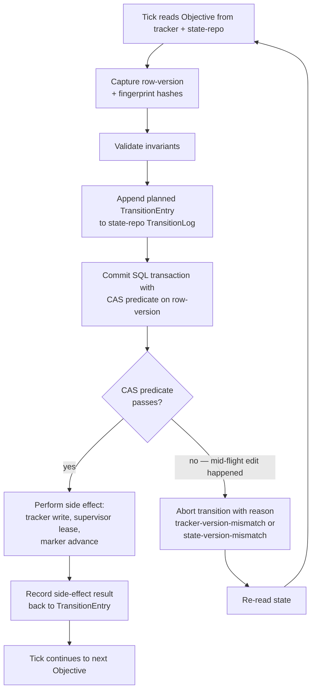

# PDLC Orchestrator — Data View

> **Up**: [index](index.md)
> **Previous (reading order)**: [C4 L3 — Tick Loop](c4-l3-tick-loop.md)
> **Next (reading order)**: [C4 Deployment](c4-deployment.md)
> **Source bead**: `agents-config-wgclw.2.1`
> **Source spec**: [`2026-05-23-pdlc-orchestrator-core-design.md`](../../specs/2026-05-23-pdlc-orchestrator-core-design.md)

## Glossary

| Term | Meaning |
|---|---|
| Canonical authority | The store that "wins" on writes for a given domain. Conflicts in non-canonical stores are resolved by re-reading from the canonical authority. |
| Tracker domain | Data canonically owned by the Work Tracker (bd): Objective identity, structural graph, lifecycle_status, spec body, priority, terminal_disposition. |
| Orchestrator domain | Data canonically owned by the Orchestrator's sidecar (OrchestratorStateRepo): lifecycle_stage, strike_counts, transition_log, sessions, leases, sidecar dependencies and metadata, discovery marker. |
| Filesystem domain | Data on disk: worktrees, artifact directories, gate-evidence YAML, project-config TOML. |
| CAS (Compare-And-Swap) | Concurrency control: read with a version, write only if the version is unchanged; mismatch aborts the transition. |
| Version fingerprint | Per-Objective hash (`spec_hash`, `structural_hash`, `dependency_hash`, `lifecycle_status_hash`) used to detect mid-flight tracker edits. |
| Discovery marker | Per-adapter watermark recording the last successful tick's position in the tracker's change stream; monotonic. |
| Sidecar | A store the Orchestrator owns that holds data not yet promoted to the WorkTracker protocol (MVP-scoped). |

## Purpose

Show what data lives where, who owns it canonically, how mid-flight edits are detected and reconciled, and what the data-flow looks like across the three stores. Answers: *if I want to know X, which store do I ask, and what guarantees do I get?*

## Ownership boundaries

> **Build status: OrchestratorStateRepo is in-memory, not Dolt.** The "Orchestrator domain" store below is Dolt-backed in the intended design; the current implementation (`packages/pdlc/src/pdlc/state_repo.py:33-89`) is a plain in-memory `dict`, dropped on process exit — no branching, no CAS, no cross-process persistence. Treat the Dolt sidecar as the target, not shipped state.

```mermaid
flowchart LR
    subgraph Tracker [Tracker domain — canonical: bd / Dolt]
        T1[Objective identity:<br/>id, type, title]
        T2[Structural graph:<br/>parent_id, children_ids]
        T3[Lifecycle status:<br/>open / in_progress / closed / blocked / deferred]
        T4[Spec content:<br/>Draft Spec body,<br/>Decomposition Plan]
        T5[Priority:<br/>PriorityLevel 0-4]
        T6[Terminal disposition:<br/>killed / manually-merged /<br/>duplicate / superseded / abandoned]
        T7[Audit notes:<br/>append-only human trail]
    end

    subgraph Orch [Orchestrator domain — canonical: OrchestratorStateRepo / Dolt sidecar]
        O1[Lifecycle stage:<br/>CANDIDATE_UOW / IMPLEMENTING / ...]
        O1b[Terminal disposition projection:<br/>mirrored from tracker<br/>for terminal stage mapping]
        O2[Strike counters:<br/>per gate per Objective]
        O3[Transition log:<br/>append-only event log]
        O4[Frozen-branch markers:<br/>set on AUTOPSY entry]
        O5[Gate-pass SHAs:<br/>per gate, commit SHA at last pass]
        O6[Sessions:<br/>one row per worker invocation]
        O7[Leases:<br/>tick lock + supervisor leases]
        O8[Dependencies sidecar:<br/>typed blocker_id, blocked_id<br/>MVP scope]
        O9[Metadata overrides sidecar:<br/>per-Objective config overrides<br/>MVP scope]
        O10[Discovery marker:<br/>per-adapter watermark]
        O11[needs_reconcile flag:<br/>per Objective]
    end

    subgraph FS [Filesystem domain]
        F1[Worktrees:<br/>per-attempt branches under<br/>.claude/worktrees/]
        F2[Artifact directories:<br/>per-Session under .pdlc/artifacts/]
        F3[Gate-evidence YAML:<br/>worker-written;<br/>orchestrator re-verifies]
        F4[project-config.toml:<br/>versioned with repo;<br/>config_hash pinned per-Session]
    end

    Tracker -->|Discovery sweep<br/>list_changed_since + bulk_get| Orch
    Orch -->|set_lifecycle_status<br/>set_terminal_disposition<br/>under CAS| Tracker
    Orch -->|Sessions reference worktree_base_commit| FS
    FS -->|REAP reads gate-evidence;<br/>re-runs gate independently| Orch
```



## Canonical-ownership rule

The orchestrator never writes tracker-domain data directly, and the tracker never writes orchestrator-domain data directly. The boundary is enforced by code, not policy. Resolution rules when the two views disagree:

- **Tracker wins on structural edits.** Reparenting, child creation, dependency add/remove, spec body changes — the tracker is authoritative. The Orchestrator mirrors these via the Discovery Sweep on the next tick.
- **Orchestrator wins on `objective_lifecycle_state`.** Lifecycle-stage advancement, strike increments, frozen-branch markers, gate-pass SHAs — these live only in the OrchestratorStateRepo. The tracker carries a coarse projection (`open` / `in_progress` / `closed`) the Orchestrator writes back during reconcile.
- **Conflicts that aren't mechanically resolvable** raise `needs_reconcile=true` and surface on `pdlc health` for human disposition. The orchestrator never guesses.

## Concurrency control — Compare-And-Swap (CAS)

Every cross-store write carries a version predicate. Mismatch aborts the in-flight transition and re-reads.



### Version fingerprints

In addition to row-version CAS, the orchestrator computes four per-Objective fingerprints used by the Discovery Sweep's full-reconcile pass and by RECONCILE's mismatch detection:

| Fingerprint | Inputs | Used for |
|---|---|---|
| `spec_hash` | Spec body (canonical-form serialised) | Detect spec mutations mid-flight (`TEST_AUTHORING` / `IMPLEMENTING` / `REVIEWING` / `PR_VALIDATION`) |
| `structural_hash` | `parent_id`, `children_ids`, `type_stamp`, `is_container` | Detect mid-flight reparenting / child-creation |
| `dependency_hash` | Sorted set of `(blocker_id, blocked_id, reason)` tuples | Detect dependency edge mutations |
| `lifecycle_status_hash` | Tracker's coarse `lifecycle_status` + `terminal_disposition` | Detect mid-flight tracker closures |

Fingerprint mismatch between successive ticks → mark `needs_reconcile=true`. The fingerprints themselves are computed by the WorkTracker adapter; the algorithm is adapter-internal (each adapter must produce stable hashes for its tracker's storage shape).

## Marker semantics — Discovery watermark

The Discovery marker is the orchestrator's pointer into the tracker's change stream. Its semantics are:

- **Per-adapter** — each WorkTracker adapter defines its own marker shape (bd's adapter uses a Dolt commit hash; future adapters synthesise an equivalent — `updated_ts` cursor, sequence number, etc.).
- **Monotonic** — the marker only moves forward. A successful tick's marker is ≥ the prior marker per the adapter's comparator.
- **Backward only by explicit operator command** — `pdlc reconcile --reset-marker` is the only path to roll the marker back; useful for forensic re-replay after a tracker corruption recovery.
- **Updated under CAS** — PERSIST writes the new marker with a CAS predicate against the prior marker.
- **Surfaced on health** — the time since the last full-reconcile pass and the diff count from the last full-reconcile both appear on `pdlc health` for drift monitoring.

## Filesystem-domain data

The three filesystem stores are simpler than the two SQL stores but warrant explicit ownership notes.

### Worktrees (`<project-root>/.claude/worktrees/`)

- One per attempt. Branch name: `pdlc/<objective_id>/<lifecycle_stage>/<attempt_number>`.
- `worktree_base_commit` pinned on the Session row at fork; reap validates the worker's commits descend from this base via `git merge-base --is-ancestor`.
- Cleanup is idempotent: first call removes the worktree (`git worktree remove --force`) and deletes the branch (`git branch -D`); subsequent calls no-op.
- The orchestrator owns worktree lifecycle (create at DISPATCH; cleanup at reap or wake-recovery). Workers commit *into* the worktree but never create or destroy it.

### Artifact directories (`<project-root>/.pdlc/artifacts/<session_id>/`)

> *Note: path is the orchestrator's reasonable default; the implementation child for the JobSupervisor may pin it elsewhere. The path is supervisor-internal; orchestrator code reads through `Session.artifact_dir`, not via a hard-coded path.*

- One per Session.
- Holds worker stdout, stderr, the gate-evidence YAML at `report_path`, and any persona-emitted artifacts (lint reports, coverage reports, profiler output).
- Supervisor-owned; lives across Session boundary for forensic preservation; pruning policy is post-MVP.

### Gate-evidence YAML

- Written by the worker at the path `Session.report_path` inside `artifact_dir`.
- Schema-validated by reap on the next tick after worker exit.
- The worker's `verdict` field is read but **not trusted** — in MVP, reap re-runs the gate command independently against the worker's commit SHA and re-establishes the verdict itself.
- The YAML carries a `gate_evidence` block of *pointers* to supervisor-owned files (`stdout_path`, `stderr_path`, `gate_cmd`, `exit_code`, `start_ts`, `end_ts`, `commit_sha_at_start`, `commit_sha_at_end`). The worker emits the pointers; the **JobSupervisor's gate-evidence collector** is what actually owns and writes those files (see [`c4-l3-jobsupervisor.md`](c4-l3-jobsupervisor.md)). The worker process cannot fabricate the underlying evidence because it doesn't own the file handles.
- On schema-validation failure: classified as `tooling` by pre-strike triage (worker died mid-report); no cognition strike charged.
- **Post-MVP `gate_trust_mode = "trust_evidence"`** (tracked as `agents-config-pdmkh`): reap inspects the supervisor-owned evidence files referenced by the pointers and skips re-execution when `exit_code == 0`, `commit_sha_at_end == HEAD`, `gate_cmd` matches the expected spec, and no concurrent worktree mutation has happened between `end_ts` and now.

### project-config.toml

- Versioned with the project source tree.
- Read at tick start by the project-config loader; `config_hash` computed at that point.
- Pinned on every Session at dispatch (`Session.config_hash`).
- Reap validates the live `config_hash` matches the Session's pinned hash; mismatch routes the Session through the config-version-divergence handler.

## Data-flow patterns

### Discovery (tracker → orchestrator)

```
WorkTracker.list_changed_since(marker)  →  delta of changed Objectives
WorkTracker.bulk_get(ids)               →  full Objective records + fingerprints
                                         (every Nth tick — correctness pass)
```

The orchestrator never writes tracker data during Discovery. It reads, mirrors, and computes fingerprints.

### Reconcile (orchestrator → tracker on lifecycle projection)

```
OrchestratorStateRepo.ObjectiveLifecycleState.lifecycle_stage  ⇒  coarse projection
                                                              ⇒  open / in_progress / closed / blocked
WorkTracker.set_lifecycle_status(id, status, version_predicate)
```

This is the only orchestrator → tracker write for in-flight Objectives. CAS via `version_predicate`.

### Terminal disposition (orchestrator → tracker on Autopsy kill)

```
At Autopsy route (iii): WorkTracker.set_terminal_disposition(id, killed)
                       + WorkTracker.set_lifecycle_status(id, closed)
```

Sets the typed `terminal_disposition` field the reconcile-side classifier reads back.

The orchestrator only WRITES `terminal_disposition` for terminations it initiates via Autopsy. The other enumerated values (`manually-merged`, `duplicate`, `superseded`, `abandoned`) are written by the operator or other tooling outside the orchestrator's normal path; the orchestrator READS them during reconcile to map into the corresponding terminal lifecycle stage.

### Happy-path close (orchestrator → tracker on MERGED)

```
At MERGING success: WorkTracker.set_lifecycle_status(id, closed) under CAS
```

The happy-path merge writes only the coarse `lifecycle_status` projection. No `terminal_disposition` value is written — the orchestrator's own `lifecycle_stage=MERGED` is the source of truth for "this merged via the normal pipeline". Reconcile on a future tick reads `lifecycle_stage` and sees no ambiguity.

### Worker → orchestrator (via filesystem)

```
JobSupervisor owns:  Session.artifact_dir/<gate-evidence files>
                     (gate_cmd, exit_code, stdout, stderr,
                      start_ts, end_ts, commit_sha_at_start, commit_sha_at_end)
Worker writes:       Session.report_path (gate-evidence YAML with POINTERS
                                          into the supervisor-owned files)
Worker exits
Next tick REAP reads: gate-evidence YAML; resolves pointers to supervisor-owned files;
                     MVP: re-runs gate against worker commit SHA
                     post-MVP (gate_trust_mode=trust_evidence): inspects supervisor
                       artifacts and skips re-execution if predicates pass
                       (see agents-config-pdmkh)
```

There is no direct Worker → OrchestratorStateRepo write path. All worker output flows through the supervisor-owned artifact directory. The split between supervisor-owned evidence files and worker-emitted YAML pointers is the **trust boundary** — the worker can lie in the YAML but cannot tamper with the underlying evidence the supervisor captured around it.

## MVP scope notes — what's in the sidecar vs the tracker

For MVP, two data domains live in the **OrchestratorStateRepo sidecar** even though they could conceptually belong in the tracker:

- **Dependency edges** — typed `(blocker_id, blocked_id, reason, created_ts)` rows. Live in `OrchestratorStateRepo.DependencyEdges`. Promoting this to the WorkTracker protocol is deferred (see bead `agents-config-o2oub` for v2 protocol expansions).
- **Per-Objective metadata overrides** — config knobs applied to individual Objectives. Live in `OrchestratorStateRepo.MetadataOverrides`. Same deferral.

These are sidecar-MVP for two reasons: bd's typed metadata surface for these domains isn't ratified yet, and the orchestrator's needs in these areas are still being shaped by implementation feedback. When v2 lands, they migrate to the tracker schema and the sidecar tables are retired.

## What this diagram does NOT show

- **Per-table schema details** (column types, indices, foreign keys). Those belong to [`c4-l3-state-repo.md`](c4-l3-state-repo.md), which is currently a stub pending the OrchestratorStateRepo implementation child.
- **The Worker subprocess's internal data model.** That's persona-specific and out of orchestrator scope.
- **Backup / archive / pruning policy.** Long-term retention is post-MVP; the cryptographic hash-chain on `TransitionLog` (`agents-config-64ecc`) would precede pruning.
- **Holding Place data.** That's a peer service with its own data model; the orchestrator only sees Objectives via the two-call boundary.

## Cross-references

- **Companion structural views**: [`c4-l2-container.md`](c4-l2-container.md), [`c4-l3-tick-loop.md`](c4-l3-tick-loop.md)
- **State-repo stub**: [`c4-l3-state-repo.md`](c4-l3-state-repo.md) — the eventual home of per-table schema detail
- **Source spec**: orchestrator core design §§ [State Ownership](../../specs/2026-05-23-pdlc-orchestrator-core-design.md#state-ownership), [Transition log event schema](../../specs/2026-05-23-pdlc-orchestrator-core-design.md#transition-log-event-schema), [Compare-and-swap on tracker writes](../../specs/2026-05-23-pdlc-orchestrator-core-design.md#compare-and-swap-on-tracker-writes), [Out-of-band edit reconciliation](../../specs/2026-05-23-pdlc-orchestrator-core-design.md#out-of-band-edit-reconciliation)
