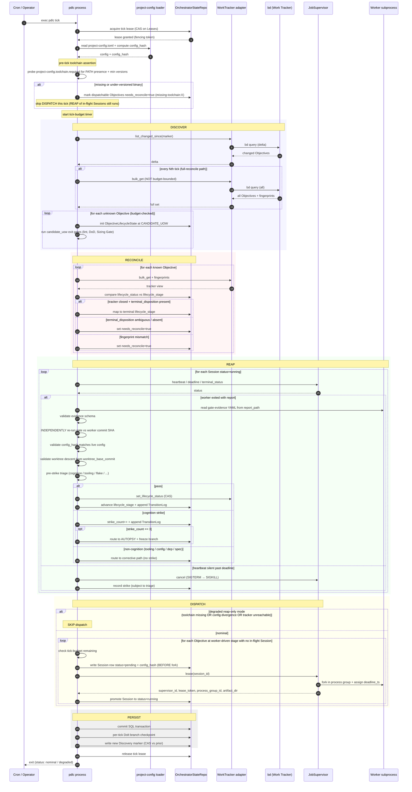
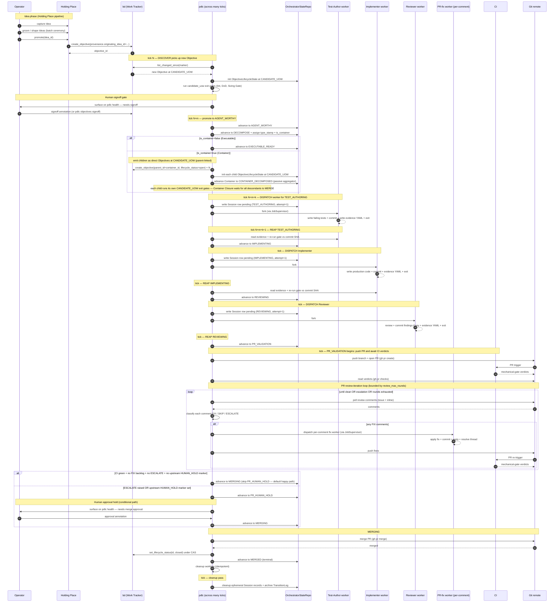

# PDLC Orchestrator — Sequence Diagrams

> **Up**: [index](index.md)
> **Previous (reading order)**: [C4 L2 — Container](c4-l2-container.md)
> **Next (reading order)**: [State Machine](state-machine.md)
> **Source bead**: `agents-config-wgclw.2.1`
> **Source spec**: [`2026-05-23-pdlc-orchestrator-core-design.md`](../../specs/2026-05-23-pdlc-orchestrator-core-design.md)

## Glossary

| Term | Meaning |
|---|---|
| Tick | One end-to-end run of the orchestrator's DISCOVER → RECONCILE → REAP → DISPATCH → PERSIST cycle; one `pdlc tick` invocation = one tick. |
| Session | One worker invocation; one Session = one attempt at one gate. |
| Gate | A discrete pass/fail checkpoint inside a lifecycle stage (e.g. red-tests gate, green-gate, reviewer-gate, PR-validation gate). |
| Reap | The phase where the orchestrator collects results from completed Worker Sessions and decides what to do next. |
| Dispatch | The phase where the orchestrator decides which Objectives need new Worker Sessions and forks them. |
| CAS (Compare-And-Swap) | Concurrency control: read with a version, write only if the version is unchanged; mismatch aborts the transition and re-reads. |
| `config_hash` | Hash of project-config in effect at tick start; pinned on every Session at dispatch; validated at reap. |
| Independent gate verification | Reap re-runs the gate command itself against the worker's commit SHA; the worker's claimed verdict is never trusted. |

## Purpose

Two sequence diagrams covering the orchestrator's behaviour at two complementary timescales:

1. **Single tick cycle** — what happens during one `pdlc tick` invocation; spans seconds to ~60s
2. **Objective happy path** — what happens to one Objective from Idea capture through to merge; spans many ticks (often days)

Together they answer: *who calls whom, in what order, with what concurrency control, and where do the failure branches live?*

---

## Sequence 1 — Single tick cycle

One invocation of `pdlc tick`. The same code path serves cron-driven and human-invoked ticks. Phases run sequentially within a single tick; the lease prevents concurrent ticks from corrupting state.

### Notes on the tick cycle

- **Phase ordering is fixed**: DISCOVER → RECONCILE → REAP → DISPATCH → PERSIST. Inverting REAP and DISPATCH would risk dispatching against state the just-completed worker had already mutated.
- **Per-tick lease** is acquired first and released last. A fast-path file lock at `.pdlc/tick.lock` is an optimisation; the authoritative lease lives in `OrchestratorStateRepo.Leases`.
- **Full-reconcile** (the every-Nth-tick `bulk_get` path) is **not budget-bounded** — it runs to completion. Budgeting it would trade correctness for latency.
- **Independent gate verification** at REAP is non-negotiable: the orchestrator never trusts the worker's `verdict` claim in the evidence YAML.
- **Pending-before-fork** ordering at DISPATCH means a crash between Session-write and fork leaves a reconcilable record (next tick sees a stale `pending` Session and cleans it up).
- **Degraded reap-only mode** preserves the ability to complete in-flight workers even when dispatch is unsafe (config divergence, tracker unreachable, **missing required toolchain**). The pre-tick toolchain assertion gates entry to this mode for the missing-toolchain case; once the operator restores tooling, the next tick proceeds normally.
- **Non-transient tooling failures are bounded.** The pre-tick toolchain assertion catches the common case (declared binary not on `PATH`) before any worker forks. For failures it cannot statically detect, the orchestrator maintains a `tooling_strike_count` per `(objective_id, lifecycle_stage, error_signature)`; on `project-config.tooling_max_strikes` recurrence the Objective is marked `needs_reconcile=true` and dispatch halts. Detail: [`state-machine.md` § Tooling-failure handling](state-machine.md#tooling-failure-handling-pre-tick-assertion--bounded-retry).

---

## Sequence 2 — Objective happy path

One Objective traversing the FSM from initial capture through to merge. **Multiple ticks** span this sequence — each `pdlc tick` invocation advances the Objective by at most one stage per gate-pass. Worker Sessions sit between ticks; they may run for minutes to tens of minutes.

This diagram shows the happy path only — failure branches (strikes, autopsy routing, container divergence) live in [`state-machine.md`](state-machine.md). It also collapses the tick-cycle internals (already shown in Sequence 1) into single arrows where applicable.

### Notes on the happy path

- **The sequence spans many ticks.** Each `pdlc tick` advances the Objective by at most one gate-pass. Between ticks, Workers run (minutes to tens of minutes) and humans signoff (asynchronous).
- **Idea creation is operator-driven, NOT orchestrator-driven.** Operators capture Ideas in the Holding Place and either promote them (Holding Place path) or create Idea-less Objectives directly in bd. The orchestrator observes the result on the next DISCOVER.
- **DECOMPOSE for Containers emits direct Objectives at `CANDIDATE_UOW`.** Children of an oversized Container are created directly in the tracker with `parent_id=<container_id>`; each runs its own `CANDIDATE_UOW` exit gates (Atomic-AT lint + DoD + Sizing Gate + human signoff) before advancing. The Container becomes a passive aggregator at `CONTAINER_DECOMPOSED` and reaches `MERGED` only when every descendant has reached `MERGED`.
- **Container Closure bubbles upward.** A Container reaches `MERGED` only when every descendant has merged, every Container-Level AT passes, and every Scaffold AT has been paired with a successful Cleanup AT.
- **Human gates.** One always-present: `CANDIDATE_UOW → AGENT_WORTHY` (per-Objective Spec signoff — applies to every Objective, including decomposer-originated children). One conditional: `PR_HUMAN_HOLD → MERGING` (merge approval), engaged only when the Objective carries an upstream HUMAN_HOLD marker OR PR review iteration raised an `ESCALATE` classification. The happy path with no escalation flows `PR_VALIDATION → MERGING` directly.
- **PR review iteration is non-cognition.** The `FIX / SKIP / ESCALATE` classification loop inside `PR_VALIDATION` does not charge cognition strikes — it is bounded by `review_max_rounds` from project-config. Only CI failures inside `PR_VALIDATION` charge strikes.
- **Cleanup is idempotent.** `cleanup_worktree(session_id)` is safe to call multiple times; first call removes the worktree and deletes the branch, subsequent calls no-op. This makes crash-recovery's worktree cleanup safe to retry across ticks.

## What these diagrams do NOT show

- **Strike and autopsy routing.** A cognition strike loops back to the same lifecycle stage with `attempt_number++`; on the 3rd strike, the Objective routes to `AUTOPSY`. See [`state-machine.md`](state-machine.md).
- **Non-cognition failure routes** (tooling, config, dependency, spec). Each has its own corrective path; none charge a cognition strike. See [`state-machine.md`](state-machine.md).
- **CAS aborts and retries.** Mid-tick edits to the tracker fail the CAS predicate at the write step; the orchestrator re-reads and re-ticks. Not drawn for brevity; covered in [the orchestrator core design spec's transition execution discipline](../../specs/2026-05-23-pdlc-orchestrator-core-design.md#transition-execution-discipline).
- **Container-decomposition divergence beyond the single CONTAINER_DECOMPOSED stop.** Container Closure conditions and Scaffold/Cleanup pairing live in [`state-machine.md`](state-machine.md).
- **Component-level mechanics inside the pdlc process.** See [`c4-l3-tick-loop.md`](c4-l3-tick-loop.md) for the components that execute these sequences.

## Cross-references

- **Companion structural views**: [`c4-l2-container.md`](c4-l2-container.md), [`c4-l3-tick-loop.md`](c4-l3-tick-loop.md)
- **Companion state view**: [`state-machine.md`](state-machine.md)
- **Companion data view**: [`data-view.md`](data-view.md)
- **Source spec**: orchestrator core design §§ [Tick algorithm](../../specs/2026-05-23-pdlc-orchestrator-core-design.md#tick-algorithm-high-level), [Transition execution discipline](../../specs/2026-05-23-pdlc-orchestrator-core-design.md#transition-execution-discipline), [Crash-Recovery](../../specs/2026-05-23-pdlc-orchestrator-core-design.md#crash-recovery)
