# PDLC Orchestrator — State Machine

> **Up**: [index](index.md)
> **Previous (reading order)**: [Sequences](sequences.md)
> **Next (reading order)**: [C4 L3 — Tick Loop](c4-l3-tick-loop.md)
> **Source bead**: `agents-config-wgclw.2.1`
> **Source specs**:
> - [`2026-05-19-pdlc-state-machine-design.md`](../../specs/2026-05-19-pdlc-state-machine-design.md) — the FSM design (prose; this artifact is the visual companion)
> - [`2026-05-23-pdlc-orchestrator-core-design.md`](../../specs/2026-05-23-pdlc-orchestrator-core-design.md) — the orchestrator core design

## Glossary

| Term | Meaning |
|---|---|
| Lifecycle Stage | The Orchestrator-owned position of an Objective in the FSM. Named English constants only — see the [Lifecycle Stage Constants table](#lifecycle-stage-constants-reference) below. |
| Gate | A pass/fail checkpoint inside a stage. A stage may have multiple gates; the stage advances only when its exit gates pass. |
| Strike | A failed *cognition* attempt at a stage. Each cognition failure increments `strike_count` for that stage; 3 strikes routes to `AUTOPSY`. Non-cognition failures (tooling, flake, config, dependency, spec) do NOT charge a strike. |
| Container vs Executable | An Objective's type at `DECOMPOSE`: a Container has children; an Executable does not. Containers are passive aggregators after decomposition; only Executables execute. |
| Container Closure | The rule that a Container reaches `MERGED` only when every descendant is `MERGED`, every Container-Level AT passes, and every Scaffold AT has been paired with a Cleanup AT. |
| `needs_reconcile` | An Orchestrator-only flag (NOT a state) raised when reconcile cannot mechanically map a tracker-side closure or fingerprint mismatch; surfaces on `pdlc health` for human disposition. |
| Autopsy route | One of a closed taxonomy of resolutions for an Autopsy: (i) re-attempt with corrected spec, (ii) re-decompose, (iii) kill with epitaph, (iv) park (blocked on dep), (v) tooling escalation. |
| Frozen branch | The git branch state at the moment of Autopsy entry; preserved forensically; lifted only on `pdlc objectives unfreeze`. |

## Purpose

The complete lifecycle-stage graph for one Objective. Every transition the Orchestrator can perform, including:

- The forward happy-path edges (already in [`sequences.md`](sequences.md))
- The retry edges (cognition strike loops within a stage)
- The 3-strike → `AUTOPSY` route
- The Container-vs-Executable divergence at `DECOMPOSE`
- The Container Closure aggregation edge
- The terminal states (`MERGED`, `KILLED`, `PARKED`)
- The non-cognition failure routes (no strike charged)
- The `needs_reconcile` annotation surface (NOT a state — a flag)

## Diagram

```mermaid
stateDiagram-v2
    direction TB

    [*] --> CANDIDATE_UOW : create_objective<br/>(per Law L6 — universal entry point)

    state CANDIDATE_UOW {
        [*] --> spec_authoring
        spec_authoring --> exit_gates : Atomic-AT lint<br/>DoD application<br/>Sizing Gate
        exit_gates --> [*] : pass
        exit_gates --> spec_authoring : fail<br/>(strike against Spec author)
    }
    CANDIDATE_UOW --> AGENT_WORTHY : exit gates pass<br/>+ human signoff

    AGENT_WORTHY --> DECOMPOSE : Sizing Gate result applied

    state DECOMPOSE <<choice>>
    DECOMPOSE --> EXECUTABLE_READY : is_container=false<br/>(Sized)
    DECOMPOSE --> CONTAINER_DECOMPOSED : is_container=true<br/>(Oversized)<br/>+ emit children as Objectives<br/>at CANDIDATE_UOW

    CONTAINER_DECOMPOSED --> MERGED : Container Closure conditions met<br/>(all descendants MERGED<br/>+ Container ATs pass<br/>+ Scaffold/Cleanup paired)

    EXECUTABLE_READY --> TEST_AUTHORING : dispatch Test-Author

    state TEST_AUTHORING {
        [*] --> ta_attempt
        ta_attempt --> ta_gate : red-tests gate
        ta_gate --> [*] : pass
        ta_gate --> ta_attempt : cognition strike<br/>(strike_count++)
    }
    TEST_AUTHORING --> IMPLEMENTING : red-tests pass
    TEST_AUTHORING --> AUTOPSY : 3rd cognition strike

    state IMPLEMENTING {
        [*] --> impl_attempt
        impl_attempt --> impl_gate : green-gate
        impl_gate --> [*] : pass
        impl_gate --> impl_attempt : cognition strike
    }
    IMPLEMENTING --> REVIEWING : green-gate pass
    IMPLEMENTING --> AUTOPSY : 3rd cognition strike

    state REVIEWING {
        [*] --> rev_attempt
        rev_attempt --> rev_gate : reviewer-gate
        rev_gate --> [*] : pass
        rev_gate --> rev_attempt : cognition strike
    }
    REVIEWING --> PR_VALIDATION : reviewer-gate pass
    REVIEWING --> AUTOPSY : 3rd cognition strike

    state PR_VALIDATION {
        [*] --> pv_push
        pv_push --> pv_ci_gate : push branch<br/>+ open PR<br/>+ await CI
        pv_ci_gate --> pv_review_ingest : CI green
        pv_ci_gate --> pv_push : cognition strike on CI
        pv_review_ingest --> pv_fix_dispatch : addressable FIX comments
        pv_review_ingest --> [*] : clean<br/>(no FIX backlog,<br/>no ESCALATE,<br/>no upstream HOLD marker)
        pv_fix_dispatch --> pv_push : commit fixes<br/>(bounded by review_max_rounds)
    }
    PR_VALIDATION --> MERGING : clean exit<br/>(default happy path)
    PR_VALIDATION --> PR_HUMAN_HOLD : exit with hold<br/>(ESCALATE comment raised<br/>OR upstream HUMAN_HOLD marker set)
    PR_VALIDATION --> AUTOPSY : 3rd cognition strike on CI

    PR_HUMAN_HOLD --> MERGING : human approval

    MERGING --> MERGED : merge succeeds
    MERGING --> MERGING : merge conflict<br/>(raises needs_reconcile flag —<br/>routes to Human Escalation Path,<br/>NOT Autopsy)

    state AUTOPSY {
        [*] --> rca_dispatch
        rca_dispatch --> route_choice : Spec RCA + Architecture-Health RCA<br/>complete
        state route_choice <<choice>>
        route_choice --> route_i : (i) re-attempt with corrected spec
        route_choice --> route_ii : (ii) re-decompose
        route_choice --> route_iii : (iii) kill (Epitaph)
        route_choice --> route_iv : (iv) park (blocked on dep)
        route_choice --> route_v : (v) tooling escalation
    }
    AUTOPSY --> CANDIDATE_UOW : route (i) — corrected spec
    AUTOPSY --> DECOMPOSE : route (ii) — re-decompose
    AUTOPSY --> KILLED : route (iii) — kill with Epitaph
    AUTOPSY --> PARKED : route (iv) — blocked on dep
    AUTOPSY --> EXECUTABLE_READY : route (v) — tooling escalation resolved<br/>(re-dispatch the same stage)

    PARKED --> EXECUTABLE_READY : blocking dep resolved<br/>(operator-initiated unpark — resurrection —<br/>creates NEW TransitionEntry, not a stage rewind)

    MERGED --> [*]
    KILLED --> [*]

    note right of CONTAINER_DECOMPOSED
        Passive aggregator.
        Children traverse the FSM
        independently; Container
        Closure rolls them up.
    end note

    note right of AUTOPSY
        Branch is frozen on entry;
        lifted only via
        `pdlc objectives unfreeze`.
    end note

    note right of MERGING
        needs_reconcile is a FLAG, not a state.
        Raised when a merge conflict (world-state
        failure) requires human escalation; the
        Objective stays at MERGING; surfaces on
        `pdlc health` for human disposition.
        Does NOT auto-transition.
    end note
```

## Lifecycle Stage Constants (reference)

| Constant | Ordering hint | Conversational name |
|---|---|---|
| `CANDIDATE_UOW` | 3 | Candidate UoW (Draft Spec) |
| `AGENT_WORTHY` | 4 | Agent-Worthy |
| `DECOMPOSE` | 5 | (in Decomposition) |
| `EXECUTABLE_READY` | 6 | Agent-Ready Executable |
| `CONTAINER_DECOMPOSED` | 6′ | Decomposed Container |
| `TEST_AUTHORING` | 7 | Test-Authoring |
| `IMPLEMENTING` | 8 | Implementation |
| `REVIEWING` | 9 | Review |
| `PR_VALIDATION` | 10A | PR Mechanical Validation |
| `PR_HUMAN_HOLD` | 10B | Human Approval Hold |
| `MERGING` | 10C | Merge + Cleanup |
| `AUTOPSY` | 11 | Autopsy |
| `MERGED` | terminal | Merged (happy) |
| `KILLED` | terminal | Killed (with Epitaph) |
| `PARKED` | terminal-ish | Parked in Library awaiting blocking dep |

Numeric ordering hints are for human orientation only. They do NOT appear in code, data, persistent diagrams, or logs.

## Routing rules

### Cognition strikes vs non-cognition failures

The pre-strike triage classifier decides whether a gate failure charges a cognition strike. **Only cognition failures charge a strike**; everything else routes to its own corrective path. The seven failure causes and their routings:

| Cause | Symptom | Strike charged? | Routing |
|---|---|---|---|
| **cognition** | Worker's logic / output failed the gate's correctness check | YES | Loop within stage; 3rd strike → `AUTOPSY` |
| **tooling** | Test runner crashed, lint binary missing, supervisor reported infra error | NO | `AUTOPSY` route (v) — bounded tooling retry; on `tooling_max_strikes`, `needs_reconcile=true` and halt dispatch. See *Tooling-failure handling* below |
| **reviewer-artifact** | A reviewer-added artifact failed its own validator | NO | Tooling escalation (same bounded-retry mechanics as `tooling`) |
| **flake** | Intermittent failure; re-run produces different verdict | NO (until retries exhausted) | Retry up to project-config retry-budget |
| **config** | `config_hash` mismatch or schema-validation failure | NO | Config-version-divergence handler |
| **dependency** | Blocking dep not satisfied at run time | NO | `AUTOPSY` route (iv) — park as PARKED |
| **spec** | Spec contradictions surface mid-execution (untestable AT, missing context) | NO | Specification RCA |

### Container vs Executable divergence at DECOMPOSE

`DECOMPOSE` is a choice node, not a long-lived stage:

- **`is_container=false`** (Sized): the Objective is an Executable. Move to `EXECUTABLE_READY` and queue for the Test-Author.
- **`is_container=true`** (Oversized): the Objective is a Container. Emit children **as direct Objectives at `CANDIDATE_UOW`** in the tracker, each carrying `parent_id=<container_id>`. Then advance the Container to `CONTAINER_DECOMPOSED` as a passive aggregator. Each child runs its own `CANDIDATE_UOW` exit gates (Atomic-AT lint + DoD + Sizing Gate + human signoff) before advancing — children inherit the parent's *worth-pursuing* signoff but not the per-child gate pass.

### Tooling-failure handling: pre-tick assertion + bounded retry

Two-layer defence against non-cognition tool failures (linter binary missing, test runner crashed, supervisor reported infra error). Both layers prevent infinite-loop dispatch on non-transient failures; neither charges a cognition strike.

**Layer 1 — Pre-tick toolchain assertion (preventative).** At tick start, the orchestrator probes each binary declared in `project-config.toolchain.required` for presence on `PATH` (and, where the manifest specifies, a minimum version check). A missing or under-versioned binary aborts the tick before DISPATCH: every Objective that would have dispatched gets `needs_reconcile=true` with code `missing-toolchain:<binary>`; the condition surfaces on `pdlc health`. Reap and persist still run on already-in-flight Sessions; only new dispatch is suppressed. Workers are never forked against a known-broken environment.

**Layer 2 — Bounded tooling-strike counter (recoverable).** For failures the pre-tick assertion can't catch (mid-run binary disappearance, version-edge incompatibility, supervisor-reported infra error during a Session), the orchestrator maintains `tooling_strike_count` per `(objective_id, lifecycle_stage, error_signature)` where `error_signature` is a stable hash of the classified failure (binary name + exit-code class + supervisor error class). Each recurrence increments. At `project-config.tooling_max_strikes` (default 3) the counter trips: `needs_reconcile=true` is set with code `tooling-persistent`, dispatch on that Objective halts, the condition surfaces on `pdlc health`. Cognition strikes remain unaffected.

**Why two layers.** Layer 1 prevents the most common failure shape (declared tool simply not installed) from ever consuming a worker; Layer 2 catches everything Layer 1 cannot statically detect and bounds the retry. Together they guarantee that no non-transient tooling failure loops indefinitely.

**Out of scope for MVP — autonomous remediation.** A "ToolingFixer" persona that attempts to install missing tooling (`npm install`, `pip install -r requirements.txt`, etc.) is a known post-MVP extension. It would slot in between Layers 1 and 2 — dispatched on the first tooling-strike, allowed a closed taxonomy of remediation operations gated by `project-config.toolchain.auto_install_permitted`. Until then, persistent tooling failures escalate to humans via Layer 2.

### PR_HUMAN_HOLD engagement criteria

`PR_HUMAN_HOLD` is **not** a mandatory step on the happy path. The default exit from `PR_VALIDATION` is `→ MERGING`. The orchestrator diverts to `PR_HUMAN_HOLD` only when either of:

- **Upstream HUMAN_HOLD marker** — a flag set during spec authoring (or by an Autopsy resolution) marking the Objective as requiring human merge approval. Used for security-sensitive changes, irreversible migrations, regulated-domain code, or anything the author or operator decided up-front cannot merge unattended.
- **ESCALATE classification raised during PR review iteration** — at least one PR review comment was classified `ESCALATE` (not `FIX` or `SKIP`) during the `PR_VALIDATION` review-iteration loop. The orchestrator does not attempt to auto-disposition an `ESCALATE` comment; it diverts to `PR_HUMAN_HOLD` and surfaces the comment for human merge approval (or refusal).

The PR review iteration loop itself is bounded by `review_max_rounds` from project-config. `FIX` comments dispatch per-comment fix workers; `SKIP` are recorded as reviewed-and-acknowledged; `ESCALATE` aborts the loop and routes to `PR_HUMAN_HOLD`. None of these classifications charge a cognition strike — review iteration is a non-cognition failure mode.

### Container Closure

`CONTAINER_DECOMPOSED → MERGED` requires all three:

1. Every descendant Objective is `MERGED`
2. Every Container-Level AT (declared on the Container's own spec) passes
3. Every Scaffold AT has been paired with a successful Cleanup AT

Failure to satisfy any of the three leaves the Container at `CONTAINER_DECOMPOSED`; humans see "Container blocked on closure" on `pdlc health`.

### Autopsy routes (closed taxonomy)

After both the Spec RCA and Architecture-Health RCA complete, the Autopsy outcome is exactly one of:

- **(i) Re-attempt with corrected spec** — Spec defect identified; return to `CANDIDATE_UOW` for re-authoring under L6 (the universal entry point — *every* re-attempt re-runs the exit gates, including the human signoff)
- **(ii) Re-decompose** — Decomposition was wrong; return to `DECOMPOSE`
- **(iii) Kill with Epitaph** — abandon the Objective; terminal `KILLED` with `terminal_disposition` carrying the reason
- **(iv) Park** — blocked on a dependency that isn't resolvable in the current cycle; terminal-ish `PARKED`; can be unparked when the dep resolves
- **(v) Tooling escalation** — the failure was infrastructure, not cognition. The orchestrator increments `tooling_strike_count` for `(objective_id, lifecycle_stage, error_signature)` and re-dispatches the same lifecycle stage. At `project-config.tooling_max_strikes` (default 3), the count threshold trips: `needs_reconcile=true` is set with code `tooling-persistent`, dispatch on that Objective halts, and the condition surfaces on `pdlc health` for human disposition. No cognition strike is ever charged. See *Tooling-failure handling* below for the full mechanism, including the complementary pre-tick toolchain assertion that prevents the most common failure mode before any worker forks

### Terminal-disposition mapping

Closures arrive at terminal states with a tracker-supplied `terminal_disposition` field. The classifier maps:

| `terminal_disposition` | Terminal stage |
|---|---|
| `killed` | `KILLED` |
| `manually-merged` | `MERGED` (merged outside the orchestrator) |
| `duplicate` | `KILLED` (Epitaph: duplicate-of) |
| `superseded` | `KILLED` (Epitaph: superseded-by) |
| `abandoned` | `KILLED` (Epitaph: abandoned) |

Absent or ambiguous `terminal_disposition` raises `needs_reconcile=true`; the human picks. The classifier never silently collapses semantically-distinct closures.

### Resurrection

Terminal states (`MERGED`, `KILLED`, `PARKED`) are **absorbing for the lifecycle stage**. The only way out is the explicit **resurrection operation**, which creates a NEW `TransitionEntry` (it is not a stage rewind) and requires an audit-logged operator command. Resurrection re-binds the Objective to a new lifecycle stage; the prior terminal record stays in the TransitionLog as historical fact.

## What this diagram does NOT show

- **Per-tick mechanics.** How the orchestrator actually moves an Objective from one state to the next within a tick lives in [`sequences.md`](sequences.md) and [`c4-l3-tick-loop.md`](c4-l3-tick-loop.md).
- **Idea-stage states.** Ideas live in the Holding Place under a separate `Idea` primitive; the orchestrator only sees Objectives, never Ideas. The Capture / Groom / Shape / Promote lifecycle is the Holding Place's responsibility.
- **Container-Level vs Executable-Level AT details.** See the [orchestrator core design spec's Sizing Gate decision table](../../specs/2026-05-23-pdlc-orchestrator-core-design.md#sizing-gate-decision-table).
- **Crash-recovery state restoration.** The state machine here represents the *intended* lifecycle of an Objective. Crash recovery rebuilds in-flight state by walking the TransitionLog forward; see [the orchestrator core design's Crash-Recovery section](../../specs/2026-05-23-pdlc-orchestrator-core-design.md#crash-recovery).

## Cross-references

- **Companion sequence**: [`sequences.md`](sequences.md) — runtime ordering of these transitions
- **Companion structure**: [`c4-l3-tick-loop.md`](c4-l3-tick-loop.md) — components that execute transitions
- **Companion data**: [`data-view.md`](data-view.md) — where the strike counters and transition log live
- **Prose source**: [the PDLC state-machine design spec](../../specs/2026-05-19-pdlc-state-machine-design.md) (this artifact is the visual companion to that prose; the spec carries the per-stage discussion of personas, gates, and routing rules)
