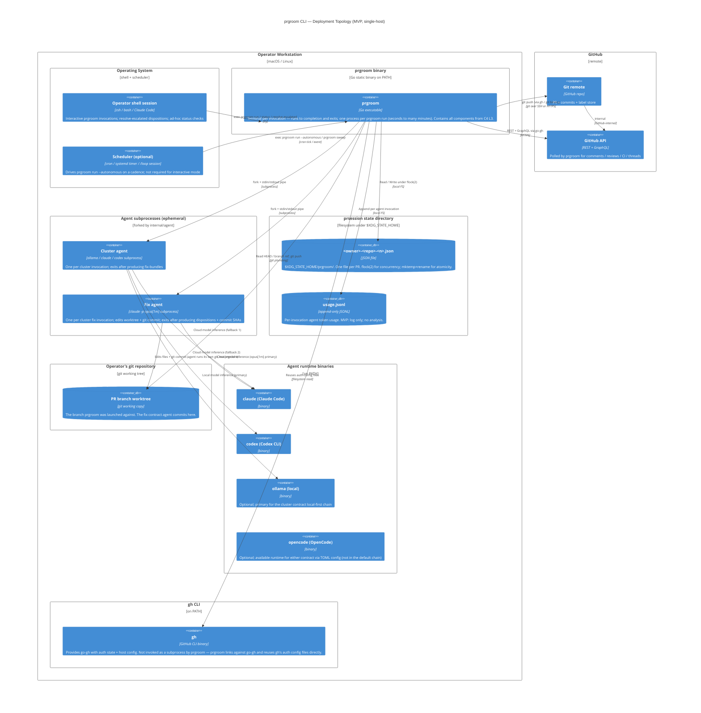

# prgroom CLI — C4 Deployment View

> **Up**: [index](index.md)
> **Previous (reading order)**: [Data View](data-view.md)
> **Source bead**: `agents-config-fca6.12`
> **Source spec**: [`docs/plans/2026-05-12-prgroom-cli-design.md`](../../plans/2026-05-12-prgroom-cli-design.md)

## Glossary

| Term | Meaning |
|---|---|
| Workstation | The single developer machine on which MVP runs; macOS or Linux. |
| Scheduler | Whatever drives autonomous runs: cron, systemd timer, GitHub Actions, an outer `prgroom sweep` loop, or a `/loop` Claude Code session. prgroom does not care which. |
| `$XDG_STATE_HOME` | The XDG-spec state directory; defaults to `~/.local/state` on Linux, `~/.local/state` (overridden by `$XDG_STATE_HOME` if set) on macOS. The `prsession.Store` file adapter writes here. |
| Per-PR lock | The `flock(2)` advisory lock on the state file; one-at-a-time per PR. Auto-released on process death. |
| Wrapping skill | The `monitor-pr` supervisor skill (§6) that calls `prgroom run` as a subprocess and reads its exit code + JSON. prgroom drives the full fix→push→reply→resolve loop itself — the wrapper adds no separate reply-later stage. From the deployment view, indistinguishable from a human operator shell. |

## Purpose

Show *where* the L2 containers physically run for the MVP. Answers: *what host, what process, what data store, what file path?*

**MVP is single-host, single-user, single-operator-workstation.** Cross-host coordination, distributed locks, and remote runners are explicitly **post-MVP**, gated behind the v2 `bd` adapter for `prsession.Store` (forward-context per [`c4-l1-context.md`](c4-l1-context.md)). The GHA variant is single-runner; multi-runner concurrency on the same PR is post-MVP for the same lock-coordination reason.

## Diagram

## Topology notes

### Deployment unit: one operator workstation

Everything in the MVP runs on one machine, owned by one operator. The "operator" can be a human at a terminal OR a wrapping AI agent (the `monitor-pr` supervisor skill); from the deployment view they're indistinguishable — both fork `prgroom` as a subprocess and read its exit code + stdout JSON. prgroom owns the full fix→push→reply→resolve loop regardless of caller.

This is deliberate: cross-host coordination, distributed locks, and shared state stores are explicitly **post-MVP** — gated behind the v2 `bd` adapter for `prsession.Store`. The design proves out on one host before adding cross-host complexity.

### Process lifetimes

| Process | Lifetime |
|---|---|
| `prgroom run --autonomous` invocation | Long — minutes to hours; blocks until quiescence, hard cap, or signal-cancel. Holds the per-PR `flock(2)` for the duration. |
| `prgroom run --interactive` invocation | Same — blocks until terminal. |
| `prgroom poll` / `cluster` / `fix` / `push` / `reply` / `resolve` / `rereview` / `resolve-escalated` invocation | Short — seconds. Acquires the lock, does one verb, releases. |
| `prgroom status` invocation | Sub-second. Lock-free read by design (§3.3 carve-out). |
| Cluster agent subprocess | Short — seconds to ~30s; one per cluster invocation. |
| Fix agent subprocess | Variable — tens of seconds to minutes; one per cluster fix invocation; the agent decides AND implements. |
| Scheduler (cron / systemd timer / `/loop` session) | Long-running; outside prgroom's awareness. |

### Per-PR concurrency

The `flock(2)` advisory lock on the state file is the single concurrency primitive. One `prgroom` invocation per PR at a time on the workstation. A second invocation against the same PR (whether started by the operator or by the scheduler or by the wrapping skill) exits immediately with `PRECONDITION_LOCK_HELD` (exit 75); the scheduler treats 75 as a transient retry signal.

`prgroom sweep` (cross-PR aggregator) iterates open PRs **serially**, acquiring one PR's lock at a time. There is no store-wide lock; another process can run `prgroom run <other-pr>` against a different PR concurrently. Failures are isolated per-PR — a non-zero exit on one PR does NOT abort the sweep.

### State store boundary

Three persistent stores on the workstation:

1. **prsession state file** (`$XDG_STATE_HOME/prgroom/<owner>-<repo>-<n>.json`) — owned by prgroom. One file per PR. Survives prgroom process exits, machine reboots (locks self-clear via `flock(2)`).
2. **token-usage JSONL log** (`$XDG_STATE_HOME/prgroom/usage.jsonl`) — append-only audit log of agent invocations. MVP captures; no analysis.
3. **git worktree** (the operator's working tree, wherever they cloned it) — owned by the operator. prgroom reads HEAD / branch ref; the fix contract agent commits here. prgroom does NOT manage the worktree lifecycle.

No databases. No shared volumes. No remote stores. The MVP boundary is "what fits on one workstation".

### gh auth coupling

`prgroom` does not store credentials of its own. It links against `github.com/cli/go-gh/v2`, which reads `gh`'s auth config files directly (`~/.config/gh/hosts.yml` and related). If the operator can run `gh pr view <pr>`, `prgroom` can talk to GitHub. If `gh auth login` is missing, `prgroom` trips `PRECONDITION_NO_AUTH` at startup (exit 2 `EX_USAGE`).

### Scheduler integration is opaque

`prgroom` makes no assumptions about how it's triggered. Three common modes:

- **Interactive** — human runs `prgroom run --interactive <pr>` from the shell; lives in the foreground until exit.
- **Cron / systemd timer** — `crontab -e` entry like `*/5 * * * * cd /path/to/repo && prgroom run --autonomous <pr>`. The next cron tick re-invokes if the prior exited 75 (lock held by still-running prior); each tick is a fresh process.
- **GitHub Actions** — `.github/workflows/groom.yml` with a `schedule: cron:` trigger or `pull_request: opened/synchronize`. Runs on a GitHub-hosted runner; `prgroom` state is GHA-cache-or-artifact-managed (operator's responsibility).
- **`/loop` Claude Code session** — `/loop 10m prgroom run --autonomous <pr>` inside a long-lived Claude Code session.

All four reduce to "exec `prgroom` and read its exit code." Scheduler-side retry policy on exit 75 is the scheduler's job, not prgroom's.

## Failure surfaces (deployment perspective)

| Failure | Surface |
|---|---|
| `prgroom` binary missing on PATH | `exec: command not found` from the scheduler / shell — outside prgroom's domain |
| `gh auth login` missing | `PRECONDITION_NO_AUTH` (exit 2) — operator runs `gh auth login` and re-invokes |
| Agent CLI missing on PATH | `RUNTIME_AGENT_UNAVAILABLE` (exit 75) after primary + fallback both miss; scheduler retries on next cadence |
| State file FS unwritable (disk full, perms) | `STATE_CORRUPT` (exit 78) — operator inspects |
| Network outage to GitHub | `RUNTIME_GH_TRANSIENT` (exit 75); scheduler retries |
| Process killed mid-`waitLocked` | `flock(2)` self-clears; next invocation re-evaluates timeouts from stored UTC timestamps (Sequence 4); no recovery code needed |
| Operator runs prgroom from inside `.claude/worktrees/<branch>/` while git operations target the main repo tree | This is a known coordination hazard per the project's `worktrees.md` rule — out of prgroom's enforcement scope, but documented for awareness |

## Post-MVP markers

These shapes are explicitly out of scope for MVP and would require a deliberate design pass:

- **Cross-host coordination** — multiple workstations grooming the same PR. Requires the v2 `bd` adapter for `prsession.Store` to provide a shared lock + shared state. The interface is forward-compatible; the work is the adapter + the bd-side lock-label semantics.
- **Multi-runner GHA concurrency** — same PR groomed by two GHA jobs in parallel. Same constraint as cross-host; same fix.
- **Remote agent runners** — `claude -p` / `codex exec` invoked on a remote machine instead of the operator's workstation. Would require a transport (SSH? gRPC? HTTPS RPC?) and credential propagation; deferred.
- **Shared token-usage aggregation** — across operators / runners. The local JSONL log is the raw data; an aggregator is a future analysis tool, not an MVP capability.

## What this diagram does NOT show

- **Internal Go module structure of the `prgroom` binary.** That's a C4 L3 concern; see [`c4-l3-lifecycle.md`](c4-l3-lifecycle.md), [`c4-l3-prsession.md`](c4-l3-prsession.md), [`c4-l3-agent-dispatch.md`](c4-l3-agent-dispatch.md).
- **Network paths between the workstation and GitHub.** Standard HTTPS + git-over-SSH-or-HTTPS; nothing prgroom-specific.
- **GHA runner topology when prgroom runs in CI.** The GHA runner is just another single-host workstation from prgroom's perspective.
- **bd-adapter v2 deployment.** Marked as post-MVP; not drawn.

## Cross-references

- **Previous**: [Data View](data-view.md)
- **Related**: [C4 L1 — System Context](c4-l1-context.md), [C4 L2 — Container](c4-l2-container.md)
- **Source spec**: [Section 1 — Architecture overview](../../plans/2026-05-12-prgroom-cli-design.md), [Section 2 — `prsession.Store` interface](../../plans/2026-05-12-prgroom-cli-design.md), [Section 5 — Agent dispatch internals](../../plans/2026-05-12-prgroom-cli-design.md)
