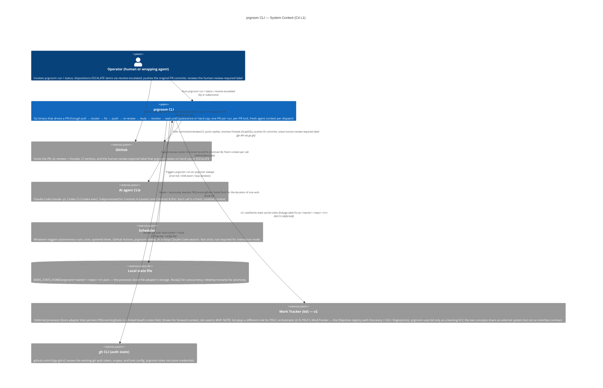

# prgroom CLI — C4 Level 1: System Context

> **Up**: [index](index.md)
> **Next (reading order)**: [C4 L2 — Container](c4-l2-container.md)
> **Source bead**: `agents-config-fca6.12`
> **Source spec**: [`docs/plans/2026-05-12-prgroom-cli-design.md`](../../plans/2026-05-12-prgroom-cli-design.md)

## Glossary

| Term | Meaning |
|---|---|
| prgroom | The PR-grooming CLI — a single static Go binary that absorbs the legacy `wait-for-pr-comments` + `reply-and-resolve-pr-threads` skills into deterministic code. |
| Operator | The human (or wrapping AI agent) that invokes `prgroom run` against a PR; reviews `prgroom status`; dispositions `ESCALATE`d items via `prgroom resolve-escalated`. |
| Work Tracker | The state-persistence backend behind the `prsession.Store` interface (§2). MVP default is the `file` adapter on the local filesystem. The `bd` adapter is deferred to v2. |
| Agent CLI | One of the AI agent command-line tools (`claude -p`, `codex exec`) that prgroom subprocesses for Contract A (cluster) and Contract B (fix). Each invocation gets a fresh context. |
| Scheduler | Whatever drives autonomous prgroom runs: cron, systemd timer, GitHub Actions, an outer `prgroom sweep` loop, or a `/loop` Claude Code session. prgroom does not care which. |
| Quiescence | The condition under which prgroom may safely stop watching a PR — no further bot or human reviewer activity is expected. Defined in §4 of the source spec. |
| Disposition | The Contract B agent's per-comment classification: `fixed` / `already_addressed` / `skipped` / `deferred` / `wont_fix` / `escalated` / `failed`. |

## Purpose

Place prgroom in its environment. Answers: *what is the system, who uses it, and what other systems does it talk to?* It is the most zoomed-out view in the artifact set — every other diagram drills deeper.

## Diagram

## Element notes

### People

- **Operator (human or wrapping agent)** — the actor at the wheel. Three load-bearing interactions:
  - **Original PR push** — the operator (or an upstream agent / skill) creates the PR being groomed. prgroom does NOT create PRs; that responsibility stays with `finishing-a-development-branch` and equivalents per the MVP scope decision in §1.
  - **`prgroom run` invocation** — the entry point for grooming a single PR through to quiescence. The same code path serves the interactive `--interactive` flag (operator-at-tty) and the autonomous `--autonomous` flag (scheduler-driven). The CLI is the entire user-facing surface; there is no daemon and no dashboard.
  - **`resolve-escalated` disposition** — when Contract B classifies a review comment as `escalated`, prgroom surfaces it via the `EscalationSink` and stops attempting to auto-disposition it. The operator picks a terminal disposition (`fixed` / `already_addressed` / `skipped` / `deferred` / `wont_fix`) via `prgroom resolve-escalated <pr> <item-id> --as <disposition>` and the lifecycle continues. This is the only feedback path from human back into prgroom mid-run.

  "Operator" includes a *wrapping AI agent* — the thinned `wait-for-pr-comments` skill (Phase 1) and `reply-and-resolve-pr-threads` skill (Phase 2) call prgroom as subprocesses, and the operator interaction shape is the same whether the caller is a human in a terminal or an upstream agent in a chat session.

### External systems

- **GitHub** — the canonical authority on the PR being groomed. prgroom never invents PR state; it polls reviews + threads + comments + CI verdicts via `gh` API (using `github.com/cli/go-gh/v2`), posts replies, resolves threads via GraphQL `resolveReviewThread`, pushes fix commits the Contract B agent produced, and raises a `human-review-required` label on hard-cap or `escalated` items. The PR itself stays where it is — prgroom never opens or merges PRs (those are out of MVP scope).

- **AI agent CLIs** — `claude -p` and `codex exec`. prgroom shells out to these as subprocesses with a fresh context per call. Two contract types per §5:
  - **Contract A — `cluster`**: cheap grouping of unprocessed review items into fix-bundles. Local-first chain: ollama+Gemma → claude haiku → codex-mini. No per-item disposition decided here.
  - **Contract B — `fix`**: a `sonnet[1m]` orchestrator that decides per-comment disposition AND implements the fix in the working tree. The output is a set of commits + a per-comment disposition manifest.
  prgroom does not care which runtime a contract uses; the contract is the API. Per-contract provider chains live in TOML config.

- **Scheduler** — production trigger for autonomous mode. prgroom does not embed a scheduler; the operator picks (cron, systemd timer, GitHub Actions on a schedule, `prgroom sweep` driving a serial loop, or a `/loop` Claude Code session). The interactive code path and the scheduler-driven code path are the same — there is no daemon and no event loop inside prgroom. The §4 quiescence model deliberately blocks on `waitLocked` rather than re-arming externally; a sibling sub-design (fca6.11) is open to rework this to a tick-based model.

- **Local state file** — `$XDG_STATE_HOME/prgroom/<owner>-<repo>-<n>.json` (fallback `~/.local/state/prgroom/`). The `prsession.Store` file adapter's storage. Concurrency control is `flock(2)` on the file; atomicity is `mktemp` + `rename(2)` on the same filesystem. The state file is the *only* persistent prgroom data — there is no database, no cache, no shared volume.

- **Work Tracker (bd) — v2** — a deferred `prsession.Store` adapter that would persist `PRGroomingState` in a linked bead's `notes` field, with a linkage label `for-pr-<owner>-<repo>-<n>`. Shown here for forward context because the `prsession.Store` interface is intentionally adapter-pluggable, but it does not ship in MVP. v2 unlocks survival of operator-machine churn and cross-session visibility via `bd`.

- **gh CLI (auth state)** — prgroom reuses the existing `gh` auth token, scopes, and host config via `github.com/cli/go-gh/v2`. It does NOT store credentials of its own. If the operator can `gh pr view <pr>`, prgroom can talk to GitHub.

## What this diagram does NOT show

- Anything inside the prgroom boundary — those are containers (L2) and components (L3).
- The internal mechanics of any external system (GitHub's API internals, the agent CLIs' model dispatch, `gh`'s auth flow).
- Failure paths, retry behaviour, hard-cap escalation, quiescence sub-states. Those live in [`sequences.md`](sequences.md) and [`state-machine.md`](state-machine.md).
- Deployment topology (host count, scheduler integration, filesystem layout). That lives in [`c4-deployment.md`](c4-deployment.md).
- Data shapes — `PRGroomingState`, the §4.6 `status` output, the §5 escalation event JSON. Those live in [`data-view.md`](data-view.md).

## Cross-references

- **Next**: [C4 L2 — Container](c4-l2-container.md) — opens the prgroom system boundary
- **Companion source**: source spec §§ [Section 1 — Architecture overview](../../plans/2026-05-12-prgroom-cli-design.md), [Section 5 — Agent dispatch internals](../../plans/2026-05-12-prgroom-cli-design.md)
- **Glossary**: [index](index.md#glossary-subsystem-wide-terms-used-across-this-artifact-set)
