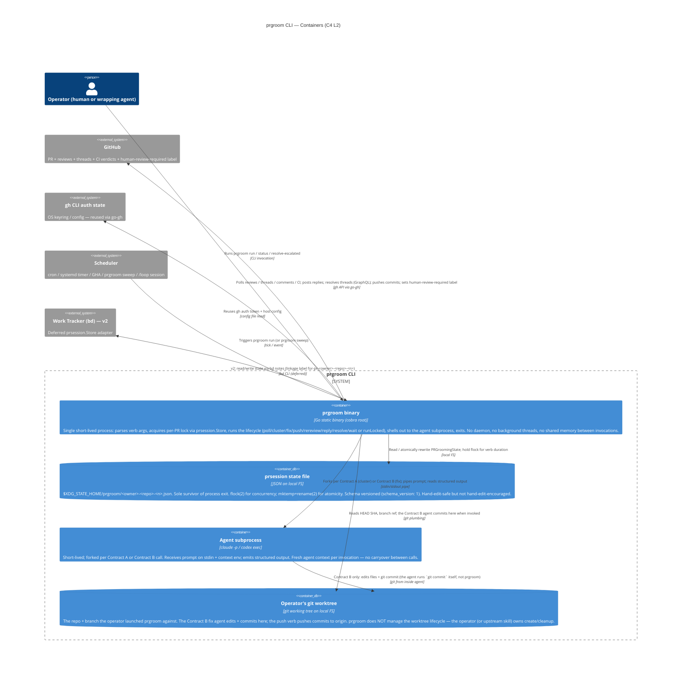

# prgroom CLI — C4 Level 2: Container

> **Up**: [index](index.md)
> **Previous**: [C4 L1 — System Context](c4-l1-context.md)
> **Next (reading order)**: [Sequences](sequences.md)
> **Source bead**: `agents-config-fca6.12`
> **Source spec**: [`docs/plans/2026-05-12-prgroom-cli-design.md`](../../plans/2026-05-12-prgroom-cli-design.md)

## Glossary

| Term | Meaning |
|---|---|
| Container (C4 sense) | A separately runnable process or persistent data store — not a Linux / Docker container. |
| Component | A code module inside a container; appears at C4 L3, not L2. |
| `runLocked` | The lifecycle aggregator inside the binary that holds the per-PR lock for the duration of a full grooming cycle and chains the per-verb `*Locked` lifecycle steps. Defined in source spec §3.3. |
| Contract A | The agent-dispatch contract for `cluster` — cheap grouping of unprocessed review items. Local-first provider chain: ollama+Gemma → claude haiku → codex-mini. Source spec §5. |
| Contract B | The agent-dispatch contract for `fix` — `sonnet[1m]` orchestrator that decides per-comment disposition AND implements the fix. Source spec §5. |
| Fix commit | A commit produced by the Contract B agent inside the operator's working tree, then pushed to the PR branch by the `push` verb. |
| Quiescence | A definite end-state where no further reviewer activity is expected; the `wait` verb returns on observing quiescence (or hard cap). Source spec §4. |

## Purpose

Open the `prgroom` system boundary and show its deployable / runnable units. Answers: *what runs, where does state live, how do the running pieces talk to each other?*

A **container** here is a C4 container: a separately runnable process or persistent data store. The CLI dispatcher, lifecycle aggregator (`runLocked`), prsession store, agent-dispatch contracts, GitHub adapter, and escalation sink all live inside the single `prgroom` Go binary and are therefore **components** of that container, not containers themselves — they appear at L3. The same goes for the bd adapter (v2): `bd` itself is the external Work Tracker; the adapter that would call it is a component inside `prgroom`.

## Diagram

## Element notes

### Internal containers

#### `prgroom` binary — Go static binary

The whole CLI runs here. Every invocation is short-lived: parse args, acquire the per-PR lock, do the work, release the lock, exit. There is no daemon, no background goroutine pool, no in-memory cache between invocations. State that must survive an invocation lives in the **prsession state file** (process-owned) or on the PR itself (GitHub-owned).

Internally — at L3 — this binary is composed of:

- `cmd/prgroom/` — cobra root + per-verb command files
- `internal/lifecycle/` — verb implementations (`pollLocked`, `clusterLocked`, `fixLocked`, `pushLocked`, `rereviewLocked`, `replyLocked`, `resolveLocked`, `waitLocked`), the `runLocked` aggregator, and the `quiescencePredicate` (§4.1 pure function — lives here, not in a separate package)
- `internal/prsession/` — `Store` interface + `file` adapter + `memory` adapter (tests) + (v2) `bd` adapter
- `internal/agent/` — Contract A and Contract B dispatch with per-contract provider chains
- `internal/gh/` — GitHub adapter (wraps `github.com/cli/go-gh/v2`)
- `internal/git/` — git plumbing (worktree-aware reads of HEAD / branch ref)
- `internal/escalation/` — `EscalationSink` interface + stderr / file / (later) bd adapters
- `internal/config/` — TOML loader for per-contract provider chains, hard-cap, reviewer timeouts

These components are drawn out at L3 — `c4-l3-lifecycle.md` is the core view; `c4-l3-prsession.md` and `c4-l3-agent-dispatch.md` are stubs awaiting their implementation children.

#### prsession state file — JSON on local FS

A single per-PR JSON file at `$XDG_STATE_HOME/prgroom/<owner>-<repo>-<n>.json` (fallback `~/.local/state/prgroom/`). Carries `PRGroomingState` (per the §2 schema): the round counter, per-reviewer state, per-comment disposition, last-poll SHA, last-pushed-head SHA, quiescence state, human-review-label flag, and the last error. Schema is versioned via `schema_version`; unknown versions surface as `STATE_SCHEMA_UNKNOWN`.

Concurrency: `flock(2)` on the file for the verb's duration (the `run` verb holds it for the whole grooming cycle). Atomicity: `mktemp` + `rename(2)` on the same filesystem — readers always observe either the complete prior file or the complete new file; no partial / corrupt JSON from a race. The `status` verb is the **single exception** to the lock-acquire rule (it does an unlocked `Read` to stay responsive under long-running `run --autonomous`).

#### Agent subprocess — `claude -p` / `codex exec`

Forked per agent dispatch. Two contracts share the subprocess mechanism:

- **Contract A (`cluster`)** — cheap. Local-first provider chain: ollama+Gemma, falling back to claude haiku, falling back to codex-mini. Bundles unprocessed review items into fix-clusters; no per-item disposition decided here.
- **Contract B (`fix`)** — strong. `sonnet[1m]` orchestrator that decides per-comment disposition (`fixed` / `already_addressed` / `skipped` / `deferred` / `wont_fix` / `escalated` / `failed`) AND implements the fix in the worktree. The agent does its own `git commit`; prgroom does the subsequent `git push`.

Each invocation is a **fresh context** — no conversation memory between calls. Per-call token-usage is logged to JSONL (`internal/agent/` emits this) for later baseline analysis; MVP does no aggregation.

#### Operator's git worktree

The repo + branch the operator launched prgroom against. The Contract B agent edits + commits here; the `push` verb pushes commits to origin. **prgroom does NOT manage the worktree lifecycle** — the operator (or upstream skill like `finishing-a-development-branch`) owns create / cleanup. This is a deliberate scope decision per source spec §1 non-goals.

### External systems (carried forward from L1)

- **GitHub** — at L1 this was a single "GitHub" box. At L2 the relationship list expands but the box stays singular; the components inside `prgroom` (`internal/gh`, `internal/lifecycle/{poll,push,reply,resolve,rereview}`) split the GitHub interactions into REST + GraphQL + label-mutation slices, but those splits live at L3.
- **gh CLI auth state** — unchanged from L1. `prgroom` does not store credentials; it reuses what `gh auth` already established.
- **Scheduler** — unchanged from L1. Whatever drives autonomous mode (cron, systemd timer, GitHub Actions, `prgroom sweep`, a `/loop` Claude Code session) is opaque to `prgroom`.
- **Work Tracker (bd) — v2** — unchanged from L1. The `bd` adapter for `prsession.Store` is deferred; in MVP this box is "drawn for context, not wired".

## Container-relationship discipline (worth memorising)

- **One prsession lock per PR.** Every verb acquires `prsession.Store.Lock(prRef)` before doing work; the `run` verb holds the lock for the entire grooming cycle. Concurrent invocations on the same PR exit immediately with `PRECONDITION_LOCK_HELD` (exit 75). The `status` verb is the sole carve-out: an unlocked `Read` returns a stale-but-atomic snapshot for diagnostic polling.
- **Fresh agent context per dispatch.** The agent subprocess receives only what `prgroom` pipes in. No carryover state, no agent memory between calls. This is what makes the contracts deterministic from the orchestrator's perspective.
- **prgroom owns the prsession state file; the agent owns the worktree edits.** `prgroom` writes the state file from inside `runLocked`. The Contract B agent writes files + runs `git commit` inside the worktree itself. `prgroom` never commits; the agent never reads / writes the prsession state file.
- **GitHub is the source of truth for review state.** `prsession` mirrors the relevant slice (per-comment disposition, per-reviewer status) but is not authoritative — if `prsession` and GitHub disagree (e.g., operator hand-resolved a thread), the next `poll` reconciles toward GitHub.
- **No daemon, no shared memory.** Crash recovery = re-invoke. The state file plus the PR's GitHub state are sufficient to resume any in-flight cycle. Resumability is a §4 invariant (UTC timestamps; reviewer-timeout evaluated against now, not against process-start).

## What this diagram does NOT show

- Components inside the `prgroom` binary — those live in [`c4-l3-lifecycle.md`](c4-l3-lifecycle.md) (drawn), [`c4-l3-prsession.md`](c4-l3-prsession.md) (stub), and [`c4-l3-agent-dispatch.md`](c4-l3-agent-dispatch.md) (stub).
- Verb ordering or sequence — see [`sequences.md`](sequences.md) for the four canonical flows.
- Phase transitions and the §4 quiescence sub-states — see [`state-machine.md`](state-machine.md).
- Data schema (`PRGroomingState`, `ReviewItem`, etc.) and the §4.6 status output / §5 escalation event JSON contracts — see [`data-view.md`](data-view.md).
- Where these containers physically run + scheduler integration — see [`c4-deployment.md`](c4-deployment.md).

## Cross-references

- **Previous**: [C4 L1 — System Context](c4-l1-context.md)
- **Next (reading order)**: [Sequences](sequences.md) — the four canonical PR-grooming flows
- **Related**: [C4 L3 — Lifecycle](c4-l3-lifecycle.md) — components inside the `prgroom` binary
- **Companion source**: source spec §§ [Section 1 — Architecture overview](../../plans/2026-05-12-prgroom-cli-design.md), [Section 2 — `prsession.Store` interface + state schema](../../plans/2026-05-12-prgroom-cli-design.md), [Section 5 — Agent dispatch internals](../../plans/2026-05-12-prgroom-cli-design.md)
