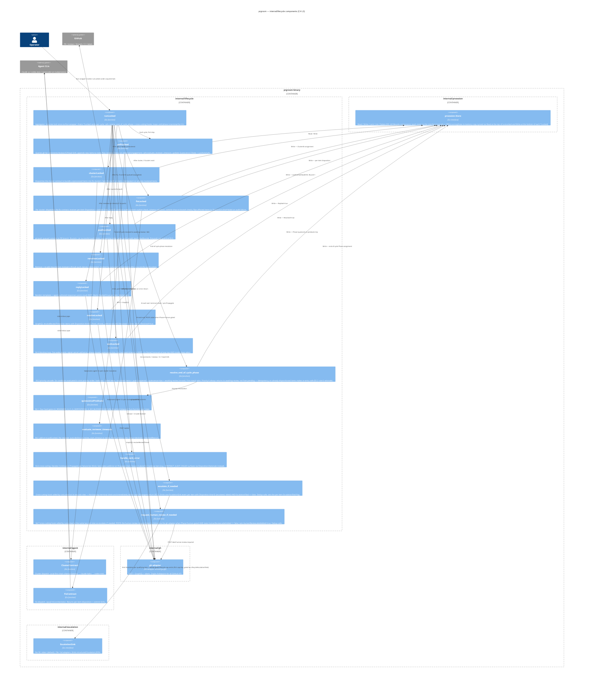

# prgroom CLI — C4 Level 3: Lifecycle

> **Up**: [index](index.md)
> **Previous (reading order)**: [State Machine](state-machine.md)
> **Next (reading order)**: [Data View](data-view.md)
> **Source bead**: `agents-config-fca6.12`
> **Source spec**: [`docs/plans/2026-05-12-prgroom-cli-design.md`](../../plans/2026-05-12-prgroom-cli-design.md) — Section 3 (lifecycle) + Section 4 (quiescence) + Section 5 (agent dispatch)
> **Container**: `internal/lifecycle/` inside the prgroom binary (see [`c4-l2-container.md`](c4-l2-container.md))

## Glossary

| Term | Meaning |
|---|---|
| `runLocked` | The lifecycle aggregator (§3.3). Acquires the per-PR lock once, chains the per-verb `*Locked` lifecycle steps, calls the end-of-cycle resolver, loops until terminal-for-CLI. |
| `*Locked` | A lock-assuming internal function. Public verbs are thin wrappers that acquire the lock then call the `*Locked` counterpart; `runLocked` chains the `*Locked` functions directly without nested lock acquisitions (§3.3 line 814). |
| End-of-cycle resolver | `resolve_end_of_cycle_phase(state)` — the priority-cascade function (§3.2) that picks the next phase from `fixes-pending` after each cycle. |
| `handle_verb_error` | The cross-cutting error handler called after each `*Locked` invocation (§3.3). Decides whether to Continue (cycle proceeds) or Propagate (cycle exits with that tier's outcome). |
| `escalate_if_needed` | Cross-cutting hook that emits one `EscalationSink` event per item whose `Disposition.Kind ∈ {escalated, failed}` AND `EscalationFiled == false` (plus the lifecycle hard-cap emit, gated by `LifecycleEscalationFiled`). Called at the two `runLocked` exit sites — the loop-top terminal check and immediately before each Propagate-return; dedup-safe. Per §3.3. |
| `request_human_review_if_needed` | Cross-cutting hook (§4.7) called at the same two `runLocked` exit sites as `escalate_if_needed`. POSTs the `human-review-required` label via the gh adapter when `Phase=human-gated` AND `state.HumanReviewLabelAdded == false`; sets the flag. Dedup-safe. |
| Cluster contract | Cluster-bundling agent dispatch (§5). Cheap; local-first chain ollama → claude haiku → codex-mini. |
| Fix contract | Per-cluster fix agent dispatch (§5). `opus[1m]` orchestrator that decides per-comment disposition AND implements. |

## Purpose

Open the `internal/lifecycle/` container boundary and show its components. Answers: *what code inside the prgroom binary actually runs the cycle? Where do the cross-cutting hooks (`escalate_if_needed`, `request_human_review_if_needed`) attach? Where do the lifecycle components reach for their collaborators in `internal/gh`, `internal/agent`, `internal/prsession`, `internal/escalation`?*

This is the most-detailed structural artifact in the set. It is the L3 zoom that an implementer reads alongside fca6.10 (the [Impl] Section 3 bead) when wiring `runLocked`.

## Diagram



## Component notes

### Lifecycle aggregator

**`runLocked`** is the entire control flow for one PR-grooming session. Its pseudocode skeleton (cleaned up from source spec §3.3):

```
function runLocked(pr, mode) (*PRGroomingState, error):
    state := store.Read(pr)            # bootstrap zero-value if ErrNotFound

    # Cross-cutting flush — called at EVERY exit from runLocked. Per §3.3 the two
    # hooks fire at exactly two sites: the loop-top terminal check (clean phase
    # transitions) and immediately before each Propagate-return (terminal-error
    # transitions). Both are dedup-safe (per-item EscalationFiled, lifecycle
    # LifecycleEscalationFiled, and HumanReviewLabelAdded flags), so funnelling
    # every return through this helper is a no-op on the second pass.
    exit := func(s, err):
        s = escalate_if_needed(s)              # emit EscalationSink per qualifying item (§3.3)
        s = request_human_review_if_needed(s)  # POST human-review-required label if Phase=human-gated (§4.7)
        return s, err

    for {
        # Loop-top terminal check — flushes the hooks, then exits cleanly.
        if state.Phase in {quiesced, human-gated, merged}:
            return exit(state, nil)

        # The cycle: each *Locked runs under handle_verb_error.
        # ⚠ ILLUSTRATIVE ONLY — this linearises the spec's §3.2 phase-dispatch (which
        # branches on state.Phase, and elides the entry-time external-transition probe —
        # which also performs the §3.5 cap re-arm: from human-gated, a raised --max-rounds
        # clears LIFECYCLE_HARD_CAP_EXCEEDED and re-enters the cycle)
        # AND repeats the (call → handle_verb_error → maybe-Propagate) guard per verb,
        # both purely for readability. Do NOT copy either shape into Go: the guard
        # belongs in ONE place via a verb-step pipeline, and the dispatch belongs on
        # state.Phase. See "Implementation guidance" after this block.
        state, err = pollLocked(pr, state);            if r := handle_verb_error(err); r.Propagate { return exit(state, err) }
        state, err = clusterLocked(pr, state);         if r := handle_verb_error(err); r.Propagate { return exit(state, err) }
        state, err = fixLocked(pr, state);             if r := handle_verb_error(err); r.Propagate { return exit(state, err) }
        state, err = pushLocked(pr, state);            if r := handle_verb_error(err); r.Propagate { return exit(state, err) }
        if push_uploaded_commits_this_cycle(state):
            state, err = rereviewLocked(pr, state);    if r := handle_verb_error(err); r.Propagate { return exit(state, err) }
        state, err = replyLocked(pr, state);           if r := handle_verb_error(err); r.Propagate { return exit(state, err) }
        state, err = resolveLocked(pr, state);         if r := handle_verb_error(err); r.Propagate { return exit(state, err) }

        # End-of-cycle phase resolution. NO hook calls here — they fire only at the two
        # exit sites above. A human-gated resolution is flushed (label POSTed) by the
        # loop-top terminal check on the next iteration.
        state.Phase = resolve_end_of_cycle_phase(state)
        store.Write(pr, state)

        # Wait if the resolver landed in awaiting-review / idle
        if state.Phase in {awaiting-review, idle}:
            state, err = waitLocked(pr, state);         if r := handle_verb_error(err); r.Propagate { return exit(state, err) }

        # Loop back to terminal check (which flushes the hooks before any clean return)
    }
```

The lock is acquired by the public `Run` wrapper (one level up); `runLocked` assumes it's held. The lock is released exactly when `runLocked` returns — at any of the terminal-for-CLI exits or on a Propagate failure.

> **Implementation guidance — factor the cycle, don't transcribe it.** The pseudocode above spells out each `*Locked` call with its own inline `handle_verb_error` guard purely for readability. Do **not** carry that per-verb repetition into Go — it duplicates the error-handling contract on every line and makes adding or reordering a verb a six-line copy-paste. Model the cycle instead as an ordered **pipeline of verb steps** — e.g. a `[]verbStep` where `type verbStep struct { name string; run func(ctx, deps, *PRGroomingState) (*PRGroomingState, error); guard func(*PRGroomingState) bool }` — and iterate it once, applying the shared `handle_verb_error` → `{Continue, Propagate}` logic in exactly **one** place. Conditional verbs become a `guard` predicate (`rereviewLocked.guard = push_uploaded_commits_this_cycle`), not an `if` in straight-line code. This keeps the §3.6 tier→decision mapping defined once and turns "add a verb" into a data change. (A strategy / pipeline pattern; the exact shape is settled during implementation of `internal/lifecycle`, not in this diagram.)

### Per-verb components

Each `*Locked` function:

1. Is idempotent on its inputs — re-invocation against the same state is safe.
2. Atomically writes state via `prsession.Store.Write` before returning (§3.3 atomicity contract).
3. Classifies its failures per §3.6 into one of the seven tiers and returns a tagged error.

The dependencies between them are linear (the order in `runLocked`'s for-loop) — there is no fan-out, no parallel verb dispatch in MVP. **Cluster + fix do fan out across clusters within a single verb invocation** (each cluster is one cluster contract or fix contract subprocess), but the per-verb loops over clusters serialise.

### Cross-cutting components

- **`escalate_if_needed`** fires at the two `runLocked` exit sites — the loop-top terminal check (clean transitions) and immediately before each Propagate-return (terminal-error transitions). It iterates `state.Items` once and emits a single `Escalation` per item whose `Disposition.Kind ∈ {escalated, failed}` AND `EscalationFiled == false`, then sets the per-item flag (plus the lifecycle hard-cap emit, gated by `LifecycleEscalationFiled`). It dedupes on all three flags, so funnelling every return through it is safe — an item already escalated in a prior cycle does not re-fire.
- **`request_human_review_if_needed`** fires at the same two exit sites as `escalate_if_needed`. When `Phase=human-gated` AND `state.HumanReviewLabelAdded` is still false, it POSTs the `human-review-required` label via the gh adapter and sets the flag. A human-gated phase written by `resolve_end_of_cycle_phase` is flushed (label POSTed) by the loop-top terminal check on the next iteration. The flag is reset on the next end-of-cycle resolution that writes a non-`human-gated` phase, so subsequent gates re-add the label.
- **`handle_verb_error`** is the cross-cutting error policy. It maps each failure-tier to a `{Continue, Propagate}` decision and decides whether to write `state.LastError`. The most subtle case: `CONTRACT_AUDIT_FAILED` returns Continue (the run loop continues) AND does NOT write `state.LastError` — the per-item `Disposition.Rationale` carries the cause for that case. End-of-cycle resolver priority 2 then promotes phase to `human-gated` on the next iteration.

### Quiescence components

- **`quiescencePredicate`** is a pure function over state. No I/O. No side effects. Called by `resolve_end_of_cycle_phase` at priority 5 and by `waitLocked` on every loop iteration.
- **`evaluate_reviewer_timeouts`** is an in-place state mutator called inline by `pollLocked` post-fetch. It iterates `state.Reviewers` and applies the §4.1 auto-decline rules. Deadlines are derived per-evaluation (`now() - LastRequestAt > review_start_timeout`), never stored — this is what makes resumability across crash gaps work (Sequence 4).

### Dependencies on sibling packages

`internal/lifecycle` depends on four sibling packages, each through a single interface:

| Sibling package | Interface | What lifecycle uses it for |
|---|---|---|
| `internal/prsession` | `Store` | Per-PR state Read / Write / Lock |
| `internal/agent` | `ClusterContract` + `FixContract` | Cluster / fix subprocess dispatch |
| `internal/gh` | `GitHub` (adapter) | All GitHub REST + GraphQL + label I/O |
| `internal/escalation` | `EscalationSink` | Surface `escalated` / `failed` / `lifecycle-cap` events |

Lifecycle does NOT depend on `internal/config`, `internal/git`, or `cmd/prgroom` directly — config is loaded once by `cmd/prgroom` and passed in via a struct; git plumbing for HEAD/branch reads is wrapped inside `internal/gh`; `cmd/prgroom` is upstream of `runLocked` (it's the cobra entry that builds the deps surface and calls `Run`).

## Testability notes

Per source spec §1 testability priority: every cross-module dependency goes behind an interface so `*Locked` functions can be unit-tested against fakes. The wiring shape:

```
type runDeps struct {
    Store     prsession.Store
    GH        gh.Client
    Cluster   agent.ClusterContract
    Fix       agent.FixContract
    Sink      escalation.Sink
    Clock     func() time.Time           // for §4 deadline derivation in tests
    Random    *rand.Rand                 // (none used in MVP)
}
```

`runLocked(ctx, deps, pr, mode)` is the testable entry. The `Run` public wrapper composes the deps + acquires the lock + calls `runLocked` + releases. Tests inject fakes for `Store` (the `memory` adapter), `GH` (HTTP-recorded gh responses via `gock` or equivalent), `Cluster` and `Fix` (canned-disposition closures), and `Sink` (in-memory event collector). No production code is mocked of itself.

## What this diagram does NOT show

- **Per-verb `Item` and `Reviewer` micro-state machines.** Each `Items[*].Disposition.Kind` and `Reviewers[r].Status` has its own progression; not drawn here. See [`data-view.md`](data-view.md) for the schema.
- **The detailed §3.7 error-code registry.** This diagram shows the `handle_verb_error` cross-cutting hook; the code list (`PRECONDITION_*`, `RUNTIME_*`, `CONTRACT_*`, `STATE_*`, `LIFECYCLE_*`) lives in source spec §3.7.
- **Cluster contract / Fix contract internals.** This diagram surfaces them as components inside `internal/agent`; the per-contract provider chains, prompt templates, token-usage JSONL emitter, and audit-rule mechanics live in [`c4-l3-agent-dispatch.md`](c4-l3-agent-dispatch.md) (stub). A pending RCA / issue-analysis pass (under design, not yet ratified) may insert an analysis step between `clusterLocked` and `fixLocked` — see that stub for the forward note.
- **`prsession.Store` adapter selection logic.** This diagram surfaces the `Store` interface; the file / memory / bd adapter selection + transactional commit model live in [`c4-l3-prsession.md`](c4-l3-prsession.md) (stub).
- **The `gh` adapter's go-gh wrapping detail.** Components inside `internal/gh` aren't broken out at L3 in MVP — the adapter is a single chokepoint; if it grows multiple modules (REST vs GraphQL vs label-mutation), a `c4-l3-gh.md` follows.

## Cross-references

- **Previous**: [State Machine](state-machine.md) — the phase graph these components implement
- **Next (reading order)**: [Data View](data-view.md) — the state shape these components read / write
- **Companion structural views**: [`c4-l2-container.md`](c4-l2-container.md), [`c4-l3-prsession.md`](c4-l3-prsession.md) (stub), [`c4-l3-agent-dispatch.md`](c4-l3-agent-dispatch.md) (stub)
- **Source spec**: [Section 3.3 `run` aggregate verb algorithm](../../plans/2026-05-12-prgroom-cli-design.md), [Section 4.2 `waitLocked` internals](../../plans/2026-05-12-prgroom-cli-design.md), [Section 4.7 Auto-request human review](../../plans/2026-05-12-prgroom-cli-design.md), [Section 5 Agent dispatch internals](../../plans/2026-05-12-prgroom-cli-design.md)
