# prgroom CLI — C4 Level 3: Lifecycle

> **Up**: [index](index.md)
> **Previous (reading order)**: [State Machine](state-machine.md)
> **Next (reading order)**: [Data View](data-view.md)
> **Source bead**: `agents-config-fca6.12`
> **Source design**: [design.md](design.md) — §3 (lifecycle + pipeline), §4 (quiescence), §5 (agent dispatch), §7 (PR memory); the verify step, the fix↔verify convergence loop, and the two retry caps live in §3.4–§3.5 + §6, with the full fix↔verify component view in [c4-l3-verify.md](c4-l3-verify.md)
> **Container**: `src/prgroom/lifecycle/` inside the prgroom package (see [`c4-l2-container.md`](c4-l2-container.md))

## Glossary

| Term | Meaning |
|---|---|
| `run()` / `_run` | The lifecycle aggregator (§3.3). The public `run(pr, mode)` wrapper acquires the per-PR lock once; the lock-held `_run` chains the per-verb `_`-prefixed lifecycle steps, calls the end-of-cycle resolver, loops until terminal-for-CLI. |
| `_`-prefixed internal | A lock-assuming internal method whose docstring states `Caller must hold the per-ref lock (see lock()).` Public verbs are thin wrappers that acquire the lock then call the `_`-prefixed counterpart; `_run` chains the `_`-prefixed internals directly without nested lock acquisitions (§3.3). |
| End-of-cycle resolver | `resolve_end_of_cycle_phase(state)` — the priority-cascade function (§3.2) that picks the next phase from `fixes-pending` after each cycle. |
| `handle_verb_error` | The cross-cutting error handler called after each `_`-prefixed verb (§3.3). Decides whether to Continue (cycle proceeds) or Propagate (cycle exits with that tier's outcome). |
| `escalate_if_needed` | Cross-cutting hook that emits one `EscalationSink` event per item whose `disposition.kind ∈ {escalated, failed}` AND `escalation_filed == False` (plus the lifecycle retry-cap emit — `LIFECYCLE_PR_REVIEW_EXHAUSTED` / `LIFECYCLE_FIX_VERIFY_EXHAUSTED` — gated by `lifecycle_escalation_filed`). Called at the two `_run` exit sites — the loop-top terminal check and immediately before each Propagate re-raise; dedup-safe. Per §3.3. |
| `request_human_review_if_needed` | Cross-cutting hook (§4.6) called at the same two `_run` exit sites as `escalate_if_needed`. POSTs the `human-review-required` label via the gh adapter when `phase=human-gated` AND `state.human_review_label_added == False`; sets the flag. Dedup-safe. |
| Cluster contract | Cluster-bundling agent dispatch (§5). Cheap; local-first chain ollama → claude haiku → codex-mini. |
| Fix contract | Per-cluster fix agent dispatch (§5). `opus[1m]` orchestrator that decides per-comment disposition AND implements; emits a required `verify_checklist` claim (trust-but-verify). |
| `cap_guard` | The pre-push retry-budget guard (between `_fix` and `_push`), built today via `_cap_guard_step` in `_build_pipeline`. No-ops unless commits are queued AND `pr_review_retries_used >= pr_review_retries`; then sets `phase=HUMAN_GATED` + `LIFECYCLE_PR_REVIEW_EXHAUSTED`, refusing the push. |
| `_verify` | **DESIGNED, NOT YET IMPLEMENTED** — see [`c4-l3-verify.md`](c4-l3-verify.md). The designed pre-push mechanical gate (between `_fix` and `cap_guard`) that would run the operator-configured tier command (`proc.CommandRunner`, whole-branch, strongest `GateStrength`) and own a bounded fix↔verify convergence loop; would refuse the push on `fix_verify_retries` exhaustion via `phase=HUMAN_GATED` + `LIFECYCLE_FIX_VERIFY_EXHAUSTED`. None of `verify`, `GateStrength`, `VerifyVerdict`, or these two error codes exist in `packages/prgroom/src/` today. |
| Retry caps | **Built today**: the outer PR-review retry budget, `pr_review_retries` (default 5; `.prgroom.toml` / `PRGROOM_PR_REVIEW_RETRIES` / `--pr-review-retries`) bounds fix-push retries across cycles via the 0-indexed `pr_review_retries_used` counter → `LIFECYCLE_PR_REVIEW_EXHAUSTED`. **Designed, not yet implemented**: the inner `fix_verify_retries` budget (fix↔verify convergence loop → `LIFECYCLE_FIX_VERIFY_EXHAUSTED`) — see [`c4-l3-verify.md`](c4-l3-verify.md). Both are `LIFECYCLE_CAP` tier / exit 0, and re-arm by raising the relevant budget (entry-probe) or `poll` observing an external fix. |

## Purpose

Open the `src/prgroom/lifecycle/` container boundary and show its components. Answers: *what code inside the prgroom package actually runs the cycle? Where do the cross-cutting hooks (`escalate_if_needed`, `request_human_review_if_needed`) attach? Where do the lifecycle components reach for their collaborators in `src/prgroom/gh`, `src/prgroom/git`, `src/prgroom/agent`, `src/prgroom/prsession`?*

This is the most-detailed structural artifact in the set. It is the L3 zoom that an implementer reads alongside fca6.10 (the [Impl] Section 3 bead) when wiring `_run`.

## Diagram

```mermaid
C4Component
    title prgroom — src/prgroom/lifecycle components (C4 L3)

    Person(operator, "Operator")

    Container_Boundary(pkg, "prgroom package") {

        Container_Boundary(lifecycle, "src/prgroom/lifecycle") {
            Component(run, "_run", "Python function", "Aggregator. Acquires lock once via the run() wrapper; chains _-prefixed verbs per cycle; calls resolve_end_of_cycle_phase + cross-cutting hooks; loops until phase is terminal-for-CLI.")
            Component(poll, "_poll", "Python function", "Queries gh for comments/reviews/CI/head-SHA; appends new items to state; flips reviewer status on observed engagement; calls evaluate_reviewer_timeouts; updates quiescence.ci_state + last_activity_at.")
            Component(cluster, "_cluster", "Python function", "Dispatches the cluster contract to bundle unprocessed items into fix-clusters. Sets cluster_id on items. Idempotent on already-clustered items.")
            Component(fix, "_fix", "Python function", "Per cluster: assembles the complete-PR snapshot (PR body incl. Decisions block, labels, all threads w/ full reply-chains, prior-round dispositions + computed per-item recurrence; §7.1) immediately before dispatch; dispatches the fix contract; receives per-item disposition + commit SHAs + optional classified memory channel (§7.3) + a required verify_checklist claim; runs §5 contract-audit (orphan check, schema, shas-on-branch, memory classification + memory_dir containment §7.6, verify_checklist presence on FIXED items, typed Disposition.gate); flips affected items to disposition.kind=failed on audit failure.")
            Component(cap_guard, "cap_guard", "Python function (VerbStep closure)", "Pre-push retry-budget guard (§3.5), built in _build_pipeline. No-op unless commits are queued AND pr_review_retries_used >= pr_review_retries; then sets phase=HUMAN_GATED + LIFECYCLE_PR_REVIEW_EXHAUSTED (clears lifecycle_escalation_filed for one Sink flush) so the push is never reached. DESIGNED, NOT YET IMPLEMENTED: a verify mechanical-gate step is planned to slot between fix and cap_guard — see c4-l3-verify.md.")
            Component(push, "_push", "Python function", "git push queued commits to PR branch. pr_review_retries_used++ on successful non-initial push (the first review-eliciting push is free, §3.4). Emits cap-warning stderr when push would reach the pr_review_retries budget. Pre-push PR-review-retry cap guard at §3.5.")
            Component(rereview, "_rereview", "Python function", "Remove + re-add required bot reviewers (the gh quirk dance). Idempotent. Runs LAST in the cycle (after _reply/_resolve close out the round); guarded by push_awaiting_rereview (last_review_invalidated_sha != last_rereviewed_sha) AND has_required_reviewers_to_refresh, and stamps last_rereviewed_sha = last_review_invalidated_sha on success so the trigger is resumable across a failed reply/resolve and fires for external pushes too (last_review_invalidated_sha is stamped by both _push and _poll).")
            Component(reply, "_reply", "Python function", "Renders canonical per-disposition template replies (template-only; the agent's long-form `response_path` prose is deferred); posts via gh REST. Also routes the fix output's CONTEXTUAL memory (§7.3): thread-tied entries as thread replies, thread-less PR-wide decisions PATCHed into the sentinel-bounded Decisions block in the PR body (gh API edit, NOT a git commit). Marks replied=True per item. Drains+clears the persisted state.pending_memory (durability across cap-trip / transient failure). Decisions-block ROUTING dedup stays flagless — keyed by (retry, source-item), rewritten wholesale; the persisted pending_memory guarantees no entry is LOST, not POST idempotency.")
            Component(resolve, "_resolve", "Python function", "GraphQL resolveReviewThread for items with disposition.kind ∈ {fixed, already_addressed} AND resolved == False. Marks resolved=True.")
            Component(wait, "_wait", "Python function", "§4.2 blocking loop. Five wake events: signal-cancel, poll-error, phase-moved, quiescence-trips, (no hard wait-timeout in MVP). The cancel-token threading.Event is honored at loop top AND inside the interruptible sleep (Event.wait(timeout=...)).")

            Component(resolver, "resolve_end_of_cycle_phase", "Python function", "§3.2 priority cascade. Six conditions evaluated in strict priority order: PR-review-retry-cap > failed items > escalated items > push-happened > quiescence-trips > awaiting-review (re-wait). First match wins. Priority 6 always returns to awaiting-review, not fixes-pending — idempotency on already-dispositioned items makes re-entry safe (§3.2 rule-6 rationale).")
            Component(quiescence, "quiescence_predicate", "Python function", "§4.1. Four hard gates (G_REVIEWERS, G_CI, G_DISPOSITIONS, G_NO_BLOCKERS) AND idle_threshold elapsed. Pure function over state.")
            Component(timeouts, "evaluate_reviewer_timeouts", "Python function", "§4.1 add-on to _poll. Per-reviewer auto-decline on review_start_timeout or review_finish_timeout. Sets status=declined + declined_reason.")
            Component(verb_err, "handle_verb_error", "Python function", "§3.3 cross-cutting. Decides Continue vs Propagate per failure-tier (§3.6). Sets state.last_error on Propagate tiers; leaves it alone for Continue tiers (e.g., CONTRACT_AUDIT_FAILED surfaces via disposition.rationale instead).")

            Component(escalate_hook, "escalate_if_needed", "Python function", "Cross-cutting hook called by _run at its two exit sites — the loop-top terminal check and immediately before each Propagate re-raise (§3.3). Emits one EscalationSink event per item with disposition.kind ∈ {escalated, failed} AND escalation_filed == False, plus the lifecycle retry-cap emit (PR-review / fix↔verify exhaustion, gated by lifecycle_escalation_filed). Dedup-safe; sets the per-item escalation_filed flag.")
            Component(humanreq_hook, "request_human_review_if_needed", "Python function", "§4.6 cross-cutting hook called by _run at the same two exit sites as escalate_if_needed. POSTs the human-review-required label to GitHub via the gh adapter when phase=human-gated AND state.human_review_label_added == False; sets human_review_label_added=True. Dedup-safe.")

            Component(sink_iface, "EscalationSink", "Python Protocol", "Per §5: StderrSink is the wired production default (cli.py::_build_sink); FileSink (JSONL) is implemented in escalation.py but not yet exposed via a CLI flag; a bd adapter is deferred to v2 and does not exist in code. Emits structured Escalation JSON. Lifecycle-internal — the §1 layout gives escalation no dedicated module and escalate_if_needed is its sole emitter.")
        }

        Container_Boundary(prsession_pkg, "src/prgroom/prsession") {
            Component(store_iface, "prsession.Store", "Python Protocol", "read / write / lock / list_refs / delete (§2). All lifecycle components reach state via this Protocol (typically a PRGroomingState in-memory copy synced via read at the top of _run and write at the bottom of each _-prefixed verb).")
        }

        Container_Boundary(agent_pkg, "src/prgroom/agent") {
            Component(contract_a, "ClusterContract", "Python Protocol", "Cluster dispatch. Local-first chain ollama+Gemma → claude haiku → codex-mini.")
            Component(contract_b, "FixContract", "Python Protocol", "Fix dispatch. opus[1m] orchestrator. Returns per-item disposition + commit SHAs.")
        }

        Container_Boundary(gh_pkg, "src/prgroom/gh") {
            Component(gh_adapter, "gh adapter", "Python wrapper around gh subprocess", "REST + GraphQL + labels via the gh subprocess. Single chokepoint for all GitHub I/O.")
        }

        Container_Boundary(git_pkg, "src/prgroom/git") {
            Component(git_adapter, "git adapter", "Python wrapper around git subprocess", "Worktree-aware git ops: push fix commits to the PR branch; commit-reachability reads for the §5 fix audit (orphan + shas-on-branch checks).")
        }

        Container_Boundary(proc_pkg, "src/prgroom/proc") {
            Component(cmd_runner, "proc.CommandRunner", "Python subprocess wrapper", "The command-runner Protocol injected into gh_adapter's and git_adapter's subprocess wrappers today (SubprocessRunner in prod). DESIGNED, NOT YET IMPLEMENTED: a future verify mechanical-gate step is planned to run operator-configured tier commands (lite/full) whole-branch through this Protocol — see c4-l3-verify.md.")
        }
    }

    System_Ext(github_ext, "GitHub", "PR / reviews / threads / CI / labels")
    System_Ext(agent_ext, "Agent CLIs", "claude -p / codex exec / opencode run (subprocess)")

    Rel(operator, run, "run() wrapper invokes _run under acquired lock")

    Rel(run, poll, "Each cycle, first step")
    Rel(run, cluster, "After poll, if items unclustered")
    Rel(run, fix, "After cluster, if clusters exist")
    Rel(run, cap_guard, "After fix, if commits queued (pre-push hard-cap guard)")
    Rel(run, push, "After cap-guard, if commits queued (refused when pr_review_retries_used >= pr_review_retries)")
    Rel(run, reply, "After push: per-item replies + drain pending_memory")
    Rel(run, resolve, "After reply: resolve FIXED threads")
    Rel(run, rereview, "Last: if push_awaiting_rereview AND required reviewers stale")
    Rel(run, resolver, "End-of-cycle phase resolution")
    Rel(run, wait, "If end-of-cycle resolved to awaiting-review / idle")

    Rel(run, escalate_hook, "At each exit: terminal check + pre-Propagate")
    Rel(run, humanreq_hook, "At each exit; POSTs label when phase=human-gated")
    Rel(run, verb_err, "After each _-prefixed verb, on raised error")

    Rel(poll, timeouts, "Inline, post-fetch (§4.1 add-on)")
    Rel(resolver, quiescence, "Priority 5 evaluation")

    Rel(cluster, contract_a, "Subprocess agent CLI per cluster invocation")
    Rel(fix, contract_b, "Subprocess agent CLI per cluster invocation")

    Rel(poll, gh_adapter, "list comments / reviews / CI / head SHA")
    Rel(push, git_adapter, "git push fix commits")
    Rel(fix, git_adapter, "commit-reachability audit (orphan + shas-on-branch)")
    Rel(fix, gh_adapter, "assemble complete-PR snapshot pre-dispatch (§7.1)")
    Rel(rereview, gh_adapter, "remove + re-add reviewer")
    Rel(reply, gh_adapter, "POST replies + PATCH Decisions block in PR body (§7.3)")
    Rel(resolve, gh_adapter, "GraphQL resolveReviewThread")
    Rel(humanreq_hook, gh_adapter, "POST label human-review-required")

    Rel(escalate_hook, sink_iface, "Emit Escalation per qualifying item + dedup-gated lifecycle retry-cap emits (PR-review / fix↔verify exhaustion, gated by lifecycle_escalation_filed)")

    Rel(poll, store_iface, "read / write")
    Rel(cluster, store_iface, "write — cluster_id assignment")
    Rel(fix, store_iface, "read prior dispositions for snapshot (§7.1); write per-item disposition")
    Rel(cap_guard, store_iface, "write — phase=human-gated + last_error=LIFECYCLE_PR_REVIEW_EXHAUSTED on pr_review_retries_used >= pr_review_retries")
    Rel(push, store_iface, "write — last_pushed_head_sha; pr_review_retries_used++ on non-initial push (§3.4)")
    Rel(reply, store_iface, "write — replied=True")
    Rel(resolve, store_iface, "write — resolved=True")
    Rel(wait, store_iface, "write — phase=quiesced on predicate trip")
    Rel(resolver, store_iface, "write — end-of-cycle phase assignment")

    Rel(contract_a, agent_ext, "stdin/stdout pipe")
    Rel(contract_b, agent_ext, "stdin/stdout pipe")
    Rel(gh_adapter, github_ext, "REST + GraphQL")

    UpdateLayoutConfig($c4ShapeInRow="3", $c4BoundaryInRow="2")
```



## Component notes

### Lifecycle aggregator

**`_run`** is the entire control flow for one PR-grooming session. Its pseudocode skeleton (cleaned up from the design reference §3.3):

```python
def _run(pr, mode) -> PRGroomingState:     # caller holds the per-PR lock
    state = store.read(pr)                 # bootstrap zero-value if StateNotFoundError

    # Cross-cutting flush — applied at EVERY exit from _run. Per §3.3 the two
    # hooks fire at exactly two sites: the loop-top terminal check (clean phase
    # transitions) and immediately before each Propagate re-raise (terminal-error
    # transitions). Both are dedup-safe (per-item escalation_filed, lifecycle
    # lifecycle_escalation_filed, and human_review_label_added flags), so funnelling
    # every exit through this helper is a no-op on the second pass.
    def flush(s):
        s = escalate_if_needed(s)              # emit EscalationSink per qualifying item (§3.3)
        s = request_human_review_if_needed(s)  # POST human-review-required label if phase=human-gated (§4.6)
        return s

    while True:
        # Loop-top terminal check — flushes the hooks, then returns cleanly.
        if state.phase in {PRPhase.QUIESCED, PRPhase.HUMAN_GATED, PRPhase.MERGED}:
            return flush(state)

        # The cycle: each _-prefixed verb runs under handle_verb_error.
        # ⚠ ILLUSTRATIVE ONLY — this linearises the spec's §3.2 phase-dispatch (which
        # branches on state.phase, and elides the entry-time external-transition probe —
        # which also performs the retry-budget re-arm: from human-gated, a raised
        # --pr-review-retries clears LIFECYCLE_PR_REVIEW_EXHAUSTED, re-entering the
        # cycle. The design also calls for a sibling --fix-verify-retries re-arm for
        # the inner budget (DESIGNED, NOT YET IMPLEMENTED — see c4-l3-verify.md); only
        # the built outer --pr-review-retries budget exists today)
        # AND repeats the (call → handle_verb_error → maybe-Propagate) guard per verb,
        # both purely for readability. Do NOT copy either shape into the implementation:
        # the guard belongs in ONE place via a verb-step pipeline, and the dispatch
        # belongs on state.phase. See "Implementation guidance" after this block.
        #
        # cap_guard sits between _fix and _push: it no-ops unless commits are queued AND
        # pr_review_retries_used >= pr_review_retries, in which case it refuses the push by
        # setting phase=HUMAN_GATED (LIFECYCLE_PR_REVIEW_EXHAUSTED), which the loop-top
        # terminal check then breaks on
        # before _push/_reply/_resolve run. DESIGNED, NOT YET IMPLEMENTED: a verify
        # mechanical-gate step is planned to slot between _fix and cap_guard — see
        # c4-l3-verify.md; it does not exist in _build_pipeline today.
        for verb in (_poll, _cluster, _fix, cap_guard, _push, _reply, _resolve):
            try:
                state = verb(pr, state)
            except TaggedError as err:
                if handle_verb_error(err, state) is VerbDisposition.PROPAGATE:
                    state = flush(state)       # flush the hooks, then
                    raise                      # propagate — the run() wrapper maps the tier to an exit code
        # _rereview runs LAST (reply/resolve close out the round; rereview kicks off the
        # next). Its guard is the PERSISTED push_awaiting_rereview (last_review_invalidated_sha !=
        # last_rereviewed_sha) — NOT the cycle-relative push_uploaded_commits_this_cycle —
        # so a push that succeeded in a PRIOR cycle whose reply/resolve then Propagated is
        # still rereviewed on resume. _rereview stamps last_rereviewed_sha on success.
        if push_awaiting_rereview(state) and has_required_reviewers_to_refresh(state):
            try:
                state = _rereview(pr, state)
            except TaggedError as err:
                if handle_verb_error(err, state) is VerbDisposition.PROPAGATE:
                    state = flush(state)
                    raise

        # End-of-cycle phase resolution. NO hook calls here — they fire only at the two
        # exit sites above. A human-gated resolution is flushed (label POSTed) by the
        # loop-top terminal check on the next iteration.
        state = dataclasses.replace(state, phase=resolve_end_of_cycle_phase(state))
        store.write(pr, state)

        # Wait if the resolver landed in awaiting-review / idle
        if state.phase in {PRPhase.AWAITING_REVIEW, PRPhase.IDLE}:
            try:
                state = _wait(pr, state)
            except TaggedError as err:
                if handle_verb_error(err, state) is VerbDisposition.PROPAGATE:
                    state = flush(state)
                    raise

        # Loop back to terminal check (which flushes the hooks before any clean return)
```

The lock is acquired by the public `run()` wrapper (one level up); `_run` assumes it's held. The lock is released exactly when `_run` returns — at any of the terminal-for-CLI exits or on a Propagate failure. (`store`, `escalate_if_needed`, the verbs, etc. resolve through the injected deps surface — see Testability notes; they are written bare here for pseudocode brevity.)

> **Implementation guidance — factor the cycle, don't transcribe it.** The pseudocode above spells out each `_`-prefixed call with its own inline `handle_verb_error` guard purely for readability. Do **not** carry that per-verb repetition into the implementation — it duplicates the error-handling contract on every line and makes adding or reordering a verb a copy-paste. Model the cycle instead as an ordered **pipeline of verb steps** — e.g. a `list[VerbStep]` where `VerbStep` is a dataclass `(name: str, run: Callable[[Deps, PRGroomingState], PRGroomingState], guard: Callable[[PRGroomingState], bool])` — and iterate it once, applying the shared `handle_verb_error` → `{Continue, Propagate}` logic in exactly **one** place. Conditional verbs become a `guard` predicate (`_rereview`'s guard = `push_awaiting_rereview AND has_required_reviewers_to_refresh`), not an `if` in straight-line code. This keeps the §3.6 tier→decision mapping defined once and turns "add a verb" into a data change. (A strategy / pipeline pattern; the exact shape is settled during implementation of `src/prgroom/lifecycle`, not in this diagram.)

### Per-verb components

Each `_`-prefixed verb:

1. Is idempotent on its inputs — re-invocation against the same state is safe.
2. Atomically writes state via `prsession.Store.write` before returning (§3.3 atomicity contract).
3. Classifies its failures per §3.6 into one of the seven tiers and raises a tier-tagged error.

The dependencies between them are linear (the order in `_run`'s loop) — there is no fan-out, no parallel verb dispatch in MVP. **Cluster + fix do fan out across clusters within a single verb invocation** (each cluster is one cluster contract or fix contract subprocess), but the per-verb loops over clusters serialise.

### PR-memory: snapshot assembly + Decisions routing (§7)

Two §7 PR-memory responsibilities attach to existing verbs — no new verb. The PR remains the durable *publication* store (§7.0), but routing carries a **deliberate additive schema change**: a persisted `pending_memory: list[RoutedMemory]` field (`_fix` appends, `_reply` drains+clears, written atomically with the dispositions it derives from). The in-memory alternative loses the decision memo on *every* cycle that ends before `_reply` (a retry-cap trip, any transient gh failure on push), which is too lossy for a "the PR is the memory" design. The field is omit-when-empty, so `schema_version` stays `1` (old state files load `[]`). (Sibling additive fields from the same bead: `last_rereviewed_sha` and `last_review_invalidated_sha`, the resumable-rereview markers — see the `_rereview` component.)

- **Snapshot assembly (read path) — inside `_fix`, immediately before dispatch (§7.1).** `_fix` builds the complete-PR snapshot the fix contract reads via `pr_detail_path`: PR body (including the prgroom-maintained `## Decisions` block), labels, every review thread with its full reply-chain, and prior-round dispositions sourced from `prsession`. It also computes the per-item **`recurrence`** signal (§7.2) — derived from disposition history at assembly time, never stored. Capture is deferred to just-before-dispatch (not top-of-cycle `_poll`) to minimise the staleness window. The fix agent never calls `gh`.
- **CONTEXTUAL→PR routing (write path) — inside `_reply`, at reply time (§7.3).** `_fix` resolves the fix output's classified `memory` channel into `RoutedMemory` records appended to the persisted `state.pending_memory`; `_reply` drains and routes them (the agent only *declares*): a CONTEXTUAL entry with a `target_hint` rides out as a **thread reply** on that thread; a thread-less CONTEXTUAL entry is merged into the **`## Decisions` block** in the PR body via a `gh` **PATCH of the description** — an API edit, **not** a git commit and **not** a phase change, then `pending_memory` is cleared. **Two distinct idempotency mechanisms:** the `pending_memory` field provides *durability* (a memo is never LOST — it survives until a clean `_reply` clears it); the Decisions-block *routing dedup* needs **no extra flag** — prgroom owns the block between sentinel markers, keys entries by `(retry, source-item)`, and rewrites wholesale, so a same-retry re-run is byte-identical (contrast the auto-label's `human_review_label_added` flag). Thread-reply memory shares the per-reply non-idempotent-POST window that per-item replies do. Non-CONTEXTUAL classes are accepted-but-deferred (logged, not routed).

### The `_verify` mechanical gate (DESIGNED, NOT YET IMPLEMENTED)

> **Status**: This subsystem is design-ratified but **0% implemented** — no `verify` step exists in `_build_pipeline` (`lifecycle/run.py`), no `verify` field on `PRGroomingState`, no `[verify]` config table. The only pre-push guard built today is `cap_guard` (§3.5 hard round cap — see the diagram above and its glossary row). The content below documents the target design; see [`c4-l3-verify.md`](c4-l3-verify.md) for the full component view.

`_verify` is the pre-push gate of record, designed to insert between `_fix` and `_push`. It **no-ops when `not has_queued`** (no fix commits to verify — mirrors `_push`'s degenerate no-op). When commits are queued it:

1. **Selects the tier** — the strongest `GateStrength` across the clean `FIXED` items (any `full` ⇒ `full`, else `lite`); `Disposition.gate` is typed/validated, so an absent or invalid gate on a `FIXED` item is a `CONTRACT_FIX_AUDIT_FAILED` (this makes `recommended_gate` load-bearing).
2. **Runs the mechanical gate** — the operator-configured tier command via `proc.CommandRunner`, whole-branch in the worktree. This run is **authoritative** — it is *not* byte-compared against the fix agent's `verify_checklist` claim; on divergence (agent claimed green, gate is red) the mechanical result wins and drives the convergence loop.
3. **Owns the bounded fix↔verify convergence loop** — on a RED gate, while `fix_verify_retries` remain it writes the gate output to a temp file and dispatches a whole-branch **REPAIR** fix (the `fix-repair` prompt, fed `verify_failure_path`), re-audits (orphan/sha with repair-attribution — repair commits are claimed by the verify-repair batch, not a review item), and re-runs the gate. This loop is internal to one cycle (not a state-machine transition) and its budget is independent of the outer cap because a verify-fail never pushes.
4. **Persists the `VerifyVerdict`** — batch-level on `PRGroomingState` (additive, omit-when-`None`; `schema_version` stays `1`), and surfaces it in the `status --json` `verify` block.
5. **Refuses the push on exhaustion** — by the **identical** mechanism as the §3.5 cap-guard: it sets `phase = HUMAN_GATED` + `LIFECYCLE_FIX_VERIFY_EXHAUSTED`, and the loop-top terminal check breaks before `_push`/`_reply`/`_resolve` run; the cross-cutting flush then emits the escalation + `human-review-required` label.

`_verify` requires the needed tier command to be configured in the `[verify]` table of the per-repo `.prgroom.toml`; if it is unconfigured, prgroom hard-stops at entry with `PRECONDITION_NO_VERIFY_CONFIG` (`PRECONDITION_USER_ERROR` tier, exit 2) — **not** a member of the no-work set. The full component view of this subsystem (the convergence loop, repair dispatch, `GateStrength` tier selection, and the `verify_checklist` contract) lives in [`c4-l3-verify.md`](c4-l3-verify.md); this lifecycle view defers that detail to it.

### Cross-cutting components

- **`escalate_if_needed`** fires at the two `_run` exit sites — the loop-top terminal check (clean transitions) and immediately before each Propagate re-raise (terminal-error transitions). It iterates `state.items` once and emits a single `Escalation` per item whose `disposition.kind ∈ {escalated, failed}` AND `escalation_filed == False`, then sets the per-item flag (plus the lifecycle retry-cap emit — `LIFECYCLE_PR_REVIEW_EXHAUSTED` / `LIFECYCLE_FIX_VERIFY_EXHAUSTED` — gated by `lifecycle_escalation_filed`). It dedupes on all three flags, so funnelling every exit through it is safe — an item already escalated in a prior cycle does not re-fire.
- **`request_human_review_if_needed`** fires at the same two exit sites as `escalate_if_needed`. When `phase=human-gated` AND `state.human_review_label_added` is still False, it POSTs the `human-review-required` label via the gh adapter and sets the flag. A human-gated phase written by `resolve_end_of_cycle_phase` is flushed (label POSTed) by the loop-top terminal check on the next iteration. The flag is reset on the next end-of-cycle resolution that writes a non-`human-gated` phase, so subsequent gates re-add the label.
- **`handle_verb_error`** is the cross-cutting error policy. It maps each failure-tier to a `{Continue, Propagate}` decision and decides whether to write `state.last_error`. The most subtle case: `CONTRACT_AUDIT_FAILED` returns Continue (the run loop continues) AND does NOT write `state.last_error` — the per-item `disposition.rationale` carries the cause for that case. End-of-cycle resolver priority 2 then promotes phase to `human-gated` on the next iteration.

### Quiescence components

- **`quiescence_predicate`** is a pure function over state. No I/O. No side effects. Called by `resolve_end_of_cycle_phase` at priority 5 and by `_wait` on every loop iteration.
- **`evaluate_reviewer_timeouts`** is an in-place state mutator called inline by `_poll` post-fetch. It iterates `state.reviewers` and applies the §4.1 auto-decline rules. Deadlines are derived per-evaluation (`clock() - last_request_at > review_start_timeout`), never stored — this is what makes resumability across crash gaps work (Sequence 4).

### Dependencies on sibling packages

`src/prgroom/lifecycle` depends on five sibling packages, each through a single Protocol:

| Sibling package | Protocol | What lifecycle uses it for |
|---|---|---|
| `src/prgroom/prsession` | `Store` | Per-PR state read / write / lock |
| `src/prgroom/agent` | `ClusterContract` + `FixContract` | Cluster / fix subprocess dispatch. Designed, not yet implemented: `_verify` reusing `FixContract` for whole-branch repair (see [`c4-l3-verify.md`](c4-l3-verify.md)) |
| `src/prgroom/gh` | `GitHub` (adapter) | All GitHub REST + GraphQL + label I/O |
| `src/prgroom/git` | `Git` (adapter) | Worktree-aware git ops — push to the PR branch (`_push`); commit-reachability reads for the §5 fix audit (`_fix`) |
| `src/prgroom/proc` | `CommandRunner` | Injected into the `gh` / `git` adapters' subprocess wrappers today. Designed, not yet implemented: running a verify tier command whole-branch in the worktree (`_verify`) |

`EscalationSink` is **not** a sibling package — it is defined within `src/prgroom/lifecycle` (the §1 layout gives escalation no dedicated module, and `escalate_if_needed` is its sole emitter). Per §5: `StderrSink` is wired as the production default; `FileSink` is implemented but not yet exposed via a CLI flag; a `bd` adapter is deferred to v2 and does not exist in code.

Lifecycle does NOT depend on `src/prgroom/cli` directly — config is loaded once by `cli.py` and passed in via the deps struct; `cli.py` is upstream of `_run` (it's the typer entry that builds the deps surface and calls `run()`).

## Testability notes

Per the design reference §1/§7 testability priority: every cross-module dependency goes behind a `@runtime_checkable` Protocol so `_`-prefixed verbs can be unit-tested against fakes. The wiring shape:

```python
@dataclass(frozen=True)
class Deps:
    store: prsession.Store          # FileStore in prod, InMemoryStore in tests
    gh: gh.GitHub                   # gh-subprocess wrapper
    git: git.Git                    # worktree-aware git-subprocess wrapper
    cluster: agent.ClusterContract
    fix: agent.FixContract
    sink: EscalationSink            # lifecycle-internal; StderrSink wired today, FileSink implemented-not-wired, bd deferred to v2 (§5)
    clock: Callable[[], datetime]   # injected for §4 deadline derivation in tests
    # (no randomness used in MVP)
```

`_run(pr, mode)` is the testable entry — a method on a lifecycle object constructed with the `Deps` above, so the deps are injected at construction rather than passed positionally (matching the pseudocode signature). The public `run()` wrapper builds the deps, constructs the object, acquires the lock, calls `_run`, and releases. Tests inject fakes for `store` (the `InMemoryStore`), `gh` and `git` (recorded-subprocess fakes), `cluster` and `fix` (canned-disposition fakes), and `sink` (in-memory event collector). Concrete adapters structurally satisfy their Protocol — `mypy --strict` checks the fit; no production code is mocked of itself.

## What this diagram does NOT show

- **Per-verb `Item` and `Reviewer` micro-state machines.** Each `items[*].disposition.kind` and `reviewers[r].status` has its own progression; not drawn here. See [`data-view.md`](data-view.md) for the schema.
- **The detailed §3.6 error-code registry.** This diagram shows the `handle_verb_error` cross-cutting hook; the code list (`PRECONDITION_*`, `RUNTIME_*`, `CONTRACT_*`, `STATE_*`, `LIFECYCLE_*`) lives in the design reference §3.6.
- **Cluster contract / Fix contract internals.** This diagram surfaces them as components inside `src/prgroom/agent`; the per-contract provider chains, prompt templates, token-usage JSONL emitter, and audit-rule mechanics live in [`c4-l3-agent-dispatch.md`](c4-l3-agent-dispatch.md) (stub). A pending RCA / issue-analysis pass (under design, not yet ratified) may insert an analysis step between `_cluster` and `_fix` — see that stub for the forward note.
- **The fix↔verify subsystem internals.** This diagram surfaces `_verify` as a single lifecycle component and its collaborators (`proc.CommandRunner`, the repair dispatch via `FixContract`); the convergence-loop mechanics, `GateStrength` tier selection, repair-attribution audit, `verify_checklist` contract, and `VerifyVerdict` shape live in [`c4-l3-verify.md`](c4-l3-verify.md).
- **`prsession.Store` adapter selection logic.** This diagram surfaces the `Store` Protocol; the file / memory / bd adapter selection + transactional commit model live in [`c4-l3-prsession.md`](c4-l3-prsession.md) (stub).
- **The `gh` adapter's subprocess-wrapping detail.** Components inside `src/prgroom/gh` aren't broken out at L3 in MVP — the adapter is a single chokepoint over the `gh` subprocess; if it grows multiple modules (REST vs GraphQL vs label-mutation), a `c4-l3-gh.md` follows.

## Cross-references

- **Previous**: [State Machine](state-machine.md) — the phase graph these components implement
- **Next (reading order)**: [Data View](data-view.md) — the state shape these components read / write
- **Companion structural views**: [`c4-l2-container.md`](c4-l2-container.md), [`c4-l3-verify.md`](c4-l3-verify.md) (the fix↔verify subsystem — `_verify`'s convergence loop, tier selection, and repair dispatch), [`c4-l3-prsession.md`](c4-l3-prsession.md) (stub), [`c4-l3-agent-dispatch.md`](c4-l3-agent-dispatch.md) (stub)
- **Source design**: [§3.3 The run pipeline](design.md), [§4.2 _wait internals](design.md), [§4.6 Auto-request human review](design.md), [§5 Agent dispatch (named contracts)](design.md)
