# prgroom CLI — C4 Level 3: Lifecycle

> **Up**: [index](index.md)
> **Previous (reading order)**: [State Machine](state-machine.md)
> **Next (reading order)**: [Data View](data-view.md)
> **Source bead**: `agents-config-fca6.12`
> **Source spec**: [`docs/plans/2026-05-12-prgroom-cli-design.md`](../../plans/2026-05-12-prgroom-cli-design.md) — Section 3 (lifecycle) + Section 4 (quiescence) + Section 5 (agent dispatch)
> **Container**: `src/prgroom/lifecycle/` inside the prgroom package (see [`c4-l2-container.md`](c4-l2-container.md))

## Glossary

| Term | Meaning |
|---|---|
| `run()` / `_run` | The lifecycle aggregator (§3.3). The public `run(pr, mode)` wrapper acquires the per-PR lock once; the lock-held `_run` chains the per-verb `_`-prefixed lifecycle steps, calls the end-of-cycle resolver, loops until terminal-for-CLI. |
| `_`-prefixed internal | A lock-assuming internal method whose docstring states `Caller must hold the per-ref lock (see lock()).` Public verbs are thin wrappers that acquire the lock then call the `_`-prefixed counterpart; `_run` chains the `_`-prefixed internals directly without nested lock acquisitions (§3.3). |
| End-of-cycle resolver | `resolve_end_of_cycle_phase(state)` — the priority-cascade function (§3.2) that picks the next phase from `fixes-pending` after each cycle. |
| `handle_verb_error` | The cross-cutting error handler called after each `_`-prefixed verb (§3.3). Decides whether to Continue (cycle proceeds) or Propagate (cycle exits with that tier's outcome). |
| `escalate_if_needed` | Cross-cutting hook that emits one `EscalationSink` event per item whose `disposition.kind ∈ {escalated, failed}` AND `escalation_filed == False` (plus the lifecycle hard-cap emit, gated by `lifecycle_escalation_filed`). Called at the two `_run` exit sites — the loop-top terminal check and immediately before each Propagate re-raise; dedup-safe. Per §3.3. |
| `request_human_review_if_needed` | Cross-cutting hook (§4.7) called at the same two `_run` exit sites as `escalate_if_needed`. POSTs the `human-review-required` label via the gh adapter when `phase=human-gated` AND `state.human_review_label_added == False`; sets the flag. Dedup-safe. |
| Cluster contract | Cluster-bundling agent dispatch (§5). Cheap; local-first chain ollama → claude haiku → codex-mini. |
| Fix contract | Per-cluster fix agent dispatch (§5). `opus[1m]` orchestrator that decides per-comment disposition AND implements. |

## Purpose

Open the `src/prgroom/lifecycle/` container boundary and show its components. Answers: *what code inside the prgroom package actually runs the cycle? Where do the cross-cutting hooks (`escalate_if_needed`, `request_human_review_if_needed`) attach? Where do the lifecycle components reach for their collaborators in `src/prgroom/gh`, `src/prgroom/git`, `src/prgroom/agent`, `src/prgroom/prsession`?*

This is the most-detailed structural artifact in the set. It is the L3 zoom that an implementer reads alongside fca6.10 (the [Impl] Section 3 bead) when wiring `_run`.

## Diagram

```mermaid
C4Component
    title prgroom — src/prgroom/lifecycle components (C4 L3)

    Person(operator, "Operator")

    Container_Boundary(pkg, "prgroom package") {

        Container_Boundary(lifecycle, "src/prgroom/lifecycle") {
            Component(run, "_run", "Python function", "Aggregator. Acquires lock once via the run() wrapper; chains _-prefixed verbs per cycle; calls resolve_end_of_cycle_phase + cross-cutting hooks; loops until phase is terminal-for-CLI.")
            Component(poll, "_poll", "Python function", "Queries gh for comments/reviews/CI/head-SHA; appends new items to state; flips reviewer status on observed engagement; calls evaluate_reviewer_timeouts; updates quiescence.ci_state + last_activity_at.")
            Component(cluster, "_cluster", "Python function", "Dispatches the cluster contract to bundle unprocessed items into fix-clusters. Sets cluster_id on items. Idempotent on already-clustered items.")
            Component(fix, "_fix", "Python function", "Per cluster: dispatches the fix contract; receives per-item disposition + commit SHAs; runs §5 contract-audit (commit-orphan check, schema validation, commit-shas-on-branch check); flips affected items to disposition.kind=failed on audit failure.")
            Component(push, "_push", "Python function", "git push queued commits to PR branch. round++ on successful push. Emits cap-warning stderr when push would reach max_rounds. Pre-push cap guard at §3.5.")
            Component(rereview, "_rereview", "Python function", "Remove + re-add required bot reviewers (the gh quirk dance). Idempotent. Invoked by _run immediately after a successful _push.")
            Component(reply, "_reply", "Python function", "Renders templates + agent-authored responses; posts via gh REST. Marks replied=True per item. Idempotent.")
            Component(resolve, "_resolve", "Python function", "GraphQL resolveReviewThread for items with disposition.kind ∈ {fixed, already_addressed} AND resolved == False. Marks resolved=True.")
            Component(wait, "_wait", "Python function", "§4.2 blocking loop. Five wake events: signal-cancel, poll-error, phase-moved, quiescence-trips, (no hard wait-timeout in MVP). The cancel-token threading.Event is honored at loop top AND inside the interruptible sleep (Event.wait(timeout=...)).")

            Component(resolver, "resolve_end_of_cycle_phase", "Python function", "§3.2 priority cascade. Six conditions evaluated in strict priority order: hard-cap > failed items > escalated items > push-happened > quiescence-trips > awaiting-review (re-wait). First match wins. Priority 6 always returns to awaiting-review, not fixes-pending — idempotency on already-dispositioned items makes re-entry safe (§3.2 rule-6 rationale).")
            Component(quiescence, "quiescence_predicate", "Python function", "§4.1. Four hard gates (G_REVIEWERS, G_CI, G_DISPOSITIONS, G_NO_BLOCKERS) AND idle_threshold elapsed. Pure function over state.")
            Component(timeouts, "evaluate_reviewer_timeouts", "Python function", "§4.1 add-on to _poll. Per-reviewer auto-decline on review_start_timeout or review_finish_timeout. Sets status=declined + declined_reason.")
            Component(verb_err, "handle_verb_error", "Python function", "§3.3 cross-cutting. Decides Continue vs Propagate per failure-tier (§3.6). Sets state.last_error on Propagate tiers; leaves it alone for Continue tiers (e.g., CONTRACT_AUDIT_FAILED surfaces via disposition.rationale instead).")

            Component(escalate_hook, "escalate_if_needed", "Python function", "Cross-cutting hook called by _run at its two exit sites — the loop-top terminal check and immediately before each Propagate re-raise (§3.3). Emits one EscalationSink event per item with disposition.kind ∈ {escalated, failed} AND escalation_filed == False. Dedup-safe; sets the per-item escalation_filed flag.")
            Component(humanreq_hook, "request_human_review_if_needed", "Python function", "§4.7 cross-cutting hook called by _run at the same two exit sites as escalate_if_needed. POSTs the human-review-required label to GitHub via the gh adapter when phase=human-gated AND state.human_review_label_added == False; sets human_review_label_added=True. Dedup-safe.")

            Component(sink_iface, "EscalationSink", "Python Protocol", "Per §5: stderr (default) / file / bd adapters. Emits structured Escalation JSON. Lifecycle-internal — the §1 layout gives escalation no dedicated module and escalate_if_needed is its sole emitter.")
        }

        Container_Boundary(prsession_pkg, "src/prgroom/prsession") {
            Component(store_iface, "prsession.Store", "Python Protocol", "read / write / lock / list_refs / delete (§2). All lifecycle components reach state via this Protocol (typically a PRGroomingState in-memory copy synced via read at the top of _run and write at the bottom of each _-prefixed verb).")
        }

        Container_Boundary(agent_pkg, "src/prgroom/agent") {
            Component(contract_a, "ClusterContract", "Python Protocol", "Cluster dispatch. Local-first chain ollama+Gemma → claude haiku → codex-mini.")
            Component(contract_b, "FixContract", "Python Protocol", "Fix dispatch. opus[1m] orchestrator. Returns per-item disposition + commit SHAs.")
        }

        Container_Boundary(gh_pkg, "src/prgroom/gh") {
            Component(gh_adapter, "gh adapter", "Python wrapper around gh subprocess", "REST + GraphQL + labels via the gh subprocess. Single chokepoint for all GitHub I/O.")
        }

        Container_Boundary(git_pkg, "src/prgroom/git") {
            Component(git_adapter, "git adapter", "Python wrapper around git subprocess", "Worktree-aware git ops: push fix commits to the PR branch; commit-reachability reads for the §5 fix audit (orphan + shas-on-branch checks).")
        }
    }

    System_Ext(github_ext, "GitHub", "PR / reviews / threads / CI / labels")
    System_Ext(agent_ext, "Agent CLIs", "claude -p / codex exec / opencode run (subprocess)")

    Rel(operator, run, "run() wrapper invokes _run under acquired lock")

    Rel(run, poll, "Each cycle, first step")
    Rel(run, cluster, "After poll, if items unclustered")
    Rel(run, fix, "After cluster, if clusters exist")
    Rel(run, push, "After fix, if commits queued (cap-gated)")
    Rel(run, rereview, "After successful push")
    Rel(run, reply, "After rereview (or directly if no push)")
    Rel(run, resolve, "After reply")
    Rel(run, resolver, "End-of-cycle phase resolution")
    Rel(run, wait, "If end-of-cycle resolved to awaiting-review / idle")

    Rel(run, escalate_hook, "At each exit: terminal check + pre-Propagate")
    Rel(run, humanreq_hook, "At each exit; POSTs label when phase=human-gated")
    Rel(run, verb_err, "After each _-prefixed verb, on raised error")

    Rel(poll, timeouts, "Inline, post-fetch (§4.1 add-on)")
    Rel(resolver, quiescence, "Priority 5 evaluation")

    Rel(cluster, contract_a, "Subprocess agent CLI per cluster invocation")
    Rel(fix, contract_b, "Subprocess agent CLI per cluster invocation")

    Rel(poll, gh_adapter, "list comments / reviews / CI / head SHA")
    Rel(push, git_adapter, "git push fix commits")
    Rel(fix, git_adapter, "commit-reachability audit (orphan + shas-on-branch)")
    Rel(rereview, gh_adapter, "remove + re-add reviewer")
    Rel(reply, gh_adapter, "POST replies")
    Rel(resolve, gh_adapter, "GraphQL resolveReviewThread")
    Rel(humanreq_hook, gh_adapter, "POST label human-review-required")

    Rel(escalate_hook, sink_iface, "Emit Escalation per qualifying item + dedup-gated lifecycle-cap emits (§3.5 cap-trip, gated by lifecycle_escalation_filed)")

    Rel(poll, store_iface, "read / write")
    Rel(cluster, store_iface, "write — cluster_id assignment")
    Rel(fix, store_iface, "write — per-item disposition")
    Rel(push, store_iface, "write — last_pushed_head_sha, round++")
    Rel(reply, store_iface, "write — replied=True")
    Rel(resolve, store_iface, "write — resolved=True")
    Rel(wait, store_iface, "write — phase=quiesced on predicate trip")
    Rel(resolver, store_iface, "write — end-of-cycle phase assignment")

    Rel(contract_a, agent_ext, "stdin/stdout pipe")
    Rel(contract_b, agent_ext, "stdin/stdout pipe")
    Rel(gh_adapter, github_ext, "REST + GraphQL")

    UpdateLayoutConfig($c4ShapeInRow="3", $c4BoundaryInRow="2")
```



## Component notes

### Lifecycle aggregator

**`_run`** is the entire control flow for one PR-grooming session. Its pseudocode skeleton (cleaned up from source spec §3.3):

```python
def _run(pr, mode) -> PRGroomingState:     # caller holds the per-PR lock
    state = store.read(pr)                 # bootstrap zero-value if StateNotFoundError

    # Cross-cutting flush — applied at EVERY exit from _run. Per §3.3 the two
    # hooks fire at exactly two sites: the loop-top terminal check (clean phase
    # transitions) and immediately before each Propagate re-raise (terminal-error
    # transitions). Both are dedup-safe (per-item escalation_filed, lifecycle
    # lifecycle_escalation_filed, and human_review_label_added flags), so funnelling
    # every exit through this helper is a no-op on the second pass.
    def flush(s):
        s = escalate_if_needed(s)              # emit EscalationSink per qualifying item (§3.3)
        s = request_human_review_if_needed(s)  # POST human-review-required label if phase=human-gated (§4.7)
        return s

    while True:
        # Loop-top terminal check — flushes the hooks, then returns cleanly.
        if state.phase in {PRPhase.QUIESCED, PRPhase.HUMAN_GATED, PRPhase.MERGED}:
            return flush(state)

        # The cycle: each _-prefixed verb runs under handle_verb_error.
        # ⚠ ILLUSTRATIVE ONLY — this linearises the spec's §3.2 phase-dispatch (which
        # branches on state.phase, and elides the entry-time external-transition probe —
        # which also performs the §3.5 cap re-arm: from human-gated, a raised --max-rounds
        # clears LIFECYCLE_HARD_CAP_EXCEEDED and re-enters the cycle)
        # AND repeats the (call → handle_verb_error → maybe-Propagate) guard per verb,
        # both purely for readability. Do NOT copy either shape into the implementation:
        # the guard belongs in ONE place via a verb-step pipeline, and the dispatch
        # belongs on state.phase. See "Implementation guidance" after this block.
        for verb in (_poll, _cluster, _fix, _push):
            try:
                state = verb(pr, state)
            except TaggedError as err:
                if handle_verb_error(err, state) is VerbDisposition.PROPAGATE:
                    return flush(state)        # (flush, then re-raise in real code)
        if push_uploaded_commits_this_cycle(state):
            try:
                state = _rereview(pr, state)
            except TaggedError as err:
                if handle_verb_error(err, state) is VerbDisposition.PROPAGATE:
                    return flush(state)
        for verb in (_reply, _resolve):
            try:
                state = verb(pr, state)
            except TaggedError as err:
                if handle_verb_error(err, state) is VerbDisposition.PROPAGATE:
                    return flush(state)

        # End-of-cycle phase resolution. NO hook calls here — they fire only at the two
        # exit sites above. A human-gated resolution is flushed (label POSTed) by the
        # loop-top terminal check on the next iteration.
        state = dataclasses.replace(state, phase=resolve_end_of_cycle_phase(state))
        store.write(pr, state)

        # Wait if the resolver landed in awaiting-review / idle
        if state.phase in {PRPhase.AWAITING_REVIEW, PRPhase.IDLE}:
            try:
                state = _wait(pr, state)
            except TaggedError as err:
                if handle_verb_error(err, state) is VerbDisposition.PROPAGATE:
                    return flush(state)

        # Loop back to terminal check (which flushes the hooks before any clean return)
```

The lock is acquired by the public `run()` wrapper (one level up); `_run` assumes it's held. The lock is released exactly when `_run` returns — at any of the terminal-for-CLI exits or on a Propagate failure. (`store`, `escalate_if_needed`, the verbs, etc. resolve through the injected deps surface — see Testability notes; they are written bare here for pseudocode brevity.)

> **Implementation guidance — factor the cycle, don't transcribe it.** The pseudocode above spells out each `_`-prefixed call with its own inline `handle_verb_error` guard purely for readability. Do **not** carry that per-verb repetition into the implementation — it duplicates the error-handling contract on every line and makes adding or reordering a verb a copy-paste. Model the cycle instead as an ordered **pipeline of verb steps** — e.g. a `list[VerbStep]` where `VerbStep` is a dataclass `(name: str, run: Callable[[Deps, PRGroomingState], PRGroomingState], guard: Callable[[PRGroomingState], bool])` — and iterate it once, applying the shared `handle_verb_error` → `{Continue, Propagate}` logic in exactly **one** place. Conditional verbs become a `guard` predicate (`_rereview`'s guard = `push_uploaded_commits_this_cycle`), not an `if` in straight-line code. This keeps the §3.6 tier→decision mapping defined once and turns "add a verb" into a data change. (A strategy / pipeline pattern; the exact shape is settled during implementation of `src/prgroom/lifecycle`, not in this diagram.)

### Per-verb components

Each `_`-prefixed verb:

1. Is idempotent on its inputs — re-invocation against the same state is safe.
2. Atomically writes state via `prsession.Store.write` before returning (§3.3 atomicity contract).
3. Classifies its failures per §3.6 into one of the seven tiers and raises a tier-tagged error.

The dependencies between them are linear (the order in `_run`'s loop) — there is no fan-out, no parallel verb dispatch in MVP. **Cluster + fix do fan out across clusters within a single verb invocation** (each cluster is one cluster contract or fix contract subprocess), but the per-verb loops over clusters serialise.

### Cross-cutting components

- **`escalate_if_needed`** fires at the two `_run` exit sites — the loop-top terminal check (clean transitions) and immediately before each Propagate re-raise (terminal-error transitions). It iterates `state.items` once and emits a single `Escalation` per item whose `disposition.kind ∈ {escalated, failed}` AND `escalation_filed == False`, then sets the per-item flag (plus the lifecycle hard-cap emit, gated by `lifecycle_escalation_filed`). It dedupes on all three flags, so funnelling every exit through it is safe — an item already escalated in a prior cycle does not re-fire.
- **`request_human_review_if_needed`** fires at the same two exit sites as `escalate_if_needed`. When `phase=human-gated` AND `state.human_review_label_added` is still False, it POSTs the `human-review-required` label via the gh adapter and sets the flag. A human-gated phase written by `resolve_end_of_cycle_phase` is flushed (label POSTed) by the loop-top terminal check on the next iteration. The flag is reset on the next end-of-cycle resolution that writes a non-`human-gated` phase, so subsequent gates re-add the label.
- **`handle_verb_error`** is the cross-cutting error policy. It maps each failure-tier to a `{Continue, Propagate}` decision and decides whether to write `state.last_error`. The most subtle case: `CONTRACT_AUDIT_FAILED` returns Continue (the run loop continues) AND does NOT write `state.last_error` — the per-item `disposition.rationale` carries the cause for that case. End-of-cycle resolver priority 2 then promotes phase to `human-gated` on the next iteration.

### Quiescence components

- **`quiescence_predicate`** is a pure function over state. No I/O. No side effects. Called by `resolve_end_of_cycle_phase` at priority 5 and by `_wait` on every loop iteration.
- **`evaluate_reviewer_timeouts`** is an in-place state mutator called inline by `_poll` post-fetch. It iterates `state.reviewers` and applies the §4.1 auto-decline rules. Deadlines are derived per-evaluation (`clock() - last_request_at > review_start_timeout`), never stored — this is what makes resumability across crash gaps work (Sequence 4).

### Dependencies on sibling packages

`src/prgroom/lifecycle` depends on four sibling packages, each through a single Protocol:

| Sibling package | Protocol | What lifecycle uses it for |
|---|---|---|
| `src/prgroom/prsession` | `Store` | Per-PR state read / write / lock |
| `src/prgroom/agent` | `ClusterContract` + `FixContract` | Cluster / fix subprocess dispatch |
| `src/prgroom/gh` | `GitHub` (adapter) | All GitHub REST + GraphQL + label I/O |
| `src/prgroom/git` | `Git` (adapter) | Worktree-aware git ops — push to the PR branch (`_push`); commit-reachability reads for the §5 fix audit (`_fix`) |

`EscalationSink` is **not** a sibling package — it is defined within `src/prgroom/lifecycle` (the §1 layout gives escalation no dedicated module, and `escalate_if_needed` is its sole emitter), with stderr (default) / file / bd adapters per §5.

Lifecycle does NOT depend on `src/prgroom/cli` directly — config is loaded once by `cli.py` and passed in via the deps struct; `cli.py` is upstream of `_run` (it's the typer entry that builds the deps surface and calls `run()`).

## Testability notes

Per source spec §1/§7 testability priority: every cross-module dependency goes behind a `@runtime_checkable` Protocol so `_`-prefixed verbs can be unit-tested against fakes. The wiring shape:

```python
@dataclass(frozen=True)
class Deps:
    store: prsession.Store          # FileStore in prod, InMemoryStore in tests
    gh: gh.GitHub                   # gh-subprocess wrapper
    git: git.Git                    # worktree-aware git-subprocess wrapper
    cluster: agent.ClusterContract
    fix: agent.FixContract
    sink: EscalationSink            # lifecycle-internal; stderr / file / bd adapters (§5)
    clock: Callable[[], datetime]   # injected for §4 deadline derivation in tests
    # (no randomness used in MVP)
```

`_run(deps, pr, mode)` is the testable entry. The public `run()` wrapper composes the deps + acquires the lock + calls `_run` + releases. Tests inject fakes for `store` (the `InMemoryStore`), `gh` and `git` (recorded-subprocess fakes), `cluster` and `fix` (canned-disposition fakes), and `sink` (in-memory event collector). Concrete adapters structurally satisfy their Protocol — `mypy --strict` checks the fit; no production code is mocked of itself.

## What this diagram does NOT show

- **Per-verb `Item` and `Reviewer` micro-state machines.** Each `items[*].disposition.kind` and `reviewers[r].status` has its own progression; not drawn here. See [`data-view.md`](data-view.md) for the schema.
- **The detailed §3.7 error-code registry.** This diagram shows the `handle_verb_error` cross-cutting hook; the code list (`PRECONDITION_*`, `RUNTIME_*`, `CONTRACT_*`, `STATE_*`, `LIFECYCLE_*`) lives in source spec §3.7.
- **Cluster contract / Fix contract internals.** This diagram surfaces them as components inside `src/prgroom/agent`; the per-contract provider chains, prompt templates, token-usage JSONL emitter, and audit-rule mechanics live in [`c4-l3-agent-dispatch.md`](c4-l3-agent-dispatch.md) (stub). A pending RCA / issue-analysis pass (under design, not yet ratified) may insert an analysis step between `_cluster` and `_fix` — see that stub for the forward note.
- **`prsession.Store` adapter selection logic.** This diagram surfaces the `Store` Protocol; the file / memory / bd adapter selection + transactional commit model live in [`c4-l3-prsession.md`](c4-l3-prsession.md) (stub).
- **The `gh` adapter's subprocess-wrapping detail.** Components inside `src/prgroom/gh` aren't broken out at L3 in MVP — the adapter is a single chokepoint over the `gh` subprocess; if it grows multiple modules (REST vs GraphQL vs label-mutation), a `c4-l3-gh.md` follows.

## Cross-references

- **Previous**: [State Machine](state-machine.md) — the phase graph these components implement
- **Next (reading order)**: [Data View](data-view.md) — the state shape these components read / write
- **Companion structural views**: [`c4-l2-container.md`](c4-l2-container.md), [`c4-l3-prsession.md`](c4-l3-prsession.md) (stub), [`c4-l3-agent-dispatch.md`](c4-l3-agent-dispatch.md) (stub)
- **Source spec**: [Section 3.3 `run` aggregate verb algorithm](../../plans/2026-05-12-prgroom-cli-design.md), [Section 4.2 `_wait` internals](../../plans/2026-05-12-prgroom-cli-design.md), [Section 4.7 Auto-request human review](../../plans/2026-05-12-prgroom-cli-design.md), [Section 5 Agent dispatch internals](../../plans/2026-05-12-prgroom-cli-design.md)
