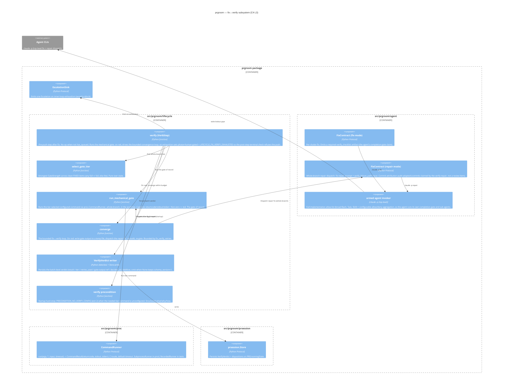

# prgroom CLI — C4 Level 3: Fix↔Verify

> **Up**: [index](index.md)
> **Source bead**: `agents-config-fca6.16`
> **Source design**: [design.md](design.md) — §6 (the verify gate), §3.4 (the fix↔verify convergence loop), §3.5 (the two retry caps)
> **Container**: `src/prgroom/lifecycle/` (the `verify` step + gate) reaching into `src/prgroom/agent/` (repair dispatch) and `src/prgroom/proc` (command runner)
> **Status**: **DESIGNED — partially implemented.** The `verify` step itself is not built: `packages/prgroom/src/prgroom/` has no `verify` step in `_build_pipeline` (`lifecycle/run.py`), no `VerifyVerdict` type, no `verify` field on `PRGroomingState`, no `[verify]` config table, and no `LIFECYCLE_FIX_VERIFY_EXHAUSTED` / `PRECONDITION_NO_VERIFY_CONFIG` error codes. Built so far: `GateStrength` with validated `Disposition.gate` (an invalid/absent gate on a `FIXED` item flips it to `failed` via `CONTRACT_FIX_AUDIT_FAILED`), and the outer PR-review retry budget (`pr_review_retries` / `LIFECYCLE_PR_REVIEW_EXHAUSTED`) guarded pre-push by `cap_guard` — see [`c4-l3-lifecycle.md`](c4-l3-lifecycle.md). This page documents the design the remaining implementation beads build against.

## Glossary

| Term | Meaning |
|---|---|
| `verify` step | The new pre-push `VerbStep` (§3 of the design reference) inserted between `fix` and `cap-guard`. Runs the mechanical gate, owns the bounded fix↔verify convergence loop, and refuses the push (flips `phase=human-gated`) when the inner retry budget is exhausted. |
| Mechanical gate | A deterministic command run — the repo's tests/build/lint via `proc.CommandRunner` — that confirms the whole branch is sound. The **gate of record**: authoritative over the fix agent's own claim. |
| Gate tier | `GateStrength` ∈ {`full`, `lite`}. The whole-branch tier is the **strongest** `Disposition.gate` across the clean `FIXED` items (any `full` ⇒ full, else `lite`). |
| `verify_checklist` | The fix agent's own completion-gate result, emitted as a **required** artifact in `FixOutput` — the agent's *claim*. Evidence + forcing-function; not byte-compared against the mechanical gate. |
| Repair dispatch | A whole-branch re-invocation of the fix agent fed the gate's failure output (`verify_failure_path`), used by the convergence loop to chase a red gate. |
| `fix_verify_retries` | The inner retry budget (default 2 ⇒ max 3 `opus[1m]` fix spends/cycle). Distinct from the outer `pr_review_retries`. |
| `VerifyVerdict` | The batch-level verdict persisted on `PRGroomingState` (result / tier / retries_used / gate-output ref / decided_at). |

## Purpose

Open the boundary of the **fix↔verify subsystem** and show its components. Answers: *what runs the mechanical gate? how does the bounded auto-re-fix loop converge or escalate? where does the fix agent's `verify_checklist` claim meet prgroom's authoritative gate? how does the `verify` step refuse a push?*

This subsystem is the trust-but-verify seam between the **fix agent** (an armed implementation agent that edits code and may regress it) and the **push** (which elicits the next review round). It fills the architecture gap the design reference §1 describes.

The `verify` step sits in the lifecycle pipeline: `cluster → fix → verify → cap-guard → push → reply → resolve → rereview`.

## Diagram



## Component notes

### `verify` step — the pre-push gate

`verify` is a `VerbStep` built by a `_verify_step(verbs)` factory mirroring `_cap_guard_step` (it closes over the deps surface). Its skeleton:

```python
def verify(ctx: RunContext) -> PRGroomingState:        # caller holds the per-PR lock
    if not has_queued_fix_commits(ctx):                # nothing to verify
        return ctx.state
    tier = select_gate_tier(ctx.state)                 # strongest gate across clean FIXED items
    retries = 0
    while True:
        result = run_mechanical_gate(ctx, tier)        # the gate of record
        if result.passed:
            ctx.state = write_verdict(ctx, PASSED, tier, retries)
            return ctx.state                           # fall through to cap-guard → push
        if retries >= ctx.config.fix_verify_retries:
            ctx.state = write_verdict(ctx, FAILED, tier, retries)
            ctx.state.phase = PRPhase.HUMAN_GATED
            ctx.state.last_error = ErrorCode.LIFECYCLE_FIX_VERIFY_EXHAUSTED.value
            ctx.state.lifecycle_escalation_filed = False   # let the loop-top flush one Sink event
            return ctx.state                           # post-step terminal check refuses the push
        path = write_gate_output(result)               # temp file for the repair agent
        ctx.state = dispatch_repair(ctx, verify_failure_path=path)  # whole-branch re-fix + re-audit
        retries += 1
```

The **decision to re-fix-or-escalate is made after the gate verdict** — a guard placed before `verify` would be blind to whether the work is good enough to push. Refusal uses the cap-guard mechanism exactly: set `phase=human-gated`, and the pipeline's post-step terminal check (`run.py:386-393`) breaks before `cap-guard`/`push`/`reply`/`resolve` run.

### Mechanical gate vs the agent's claim (trust-but-verify)

Two halves meet here:

- **The fix agent's claim** — `verify_checklist`, a required `FixOutput` artifact recording the agent's own completion-gate result. A missing/malformed checklist on a `FIXED` batch is a contract-audit failure (`CONTRACT_FIX_AUDIT_FAILED` → item `FAILED`). It is a forcing function (the contract compels the agent to gate itself) and evidence — **not** byte-compared.
- **prgroom's confirmation** — `run_mechanical_gate` runs the operator-configured tier command via `proc.CommandRunner`. This is authoritative. A divergence (agent claimed green, gate red) is resolved by the gate, which drives the convergence loop.

### The convergence loop and the repair dispatch

`converge` re-invokes the fix agent in **repair mode** — whole-branch, fed `verify_failure_path` (the gate's captured output). This differs from per-cluster fix: the failure is a branch property, not cluster-attributable, so the orphan/sha audit attributes the repair's commits to the verify-repair, not to a review item. The loop is bounded by `fix_verify_retries` (default 2); a verify-fail never pushes, so the outer `pr_review_retries` cannot bound it — hence the independent inner budget.

### Precondition hard-stop

`verify precondition` asserts at `run`/`fix` entry that **both** tier commands (`lite` and `full`) are configured (`[verify]` table in `.prgroom.toml`) — fail-fast, since the needed tier is unknown until `fix` selects it. Absence is `PRECONDITION_NO_VERIFY_CONFIG` (user-error, exit 2) with structured what/why/how — never a silent skip. Auto-detection of sensible defaults is deferred to `prgroom --doctor` (separate bead).

## Error codes

The `verify` step surfaces three codes (the design reference §3.6):

| Code | Tier (exit) | Phase | Blocking | Meaning |
|---|---|---|---|---|
| `LIFECYCLE_FIX_VERIFY_EXHAUSTED` | `LIFECYCLE_CAP` (0, graceful terminal) | → human-gated | yes (in `BlockingErrorCodes`) | inner `fix_verify_retries` budget spent, gate still red |
| `LIFECYCLE_PR_REVIEW_EXHAUSTED` | `LIFECYCLE_CAP` (0, graceful terminal) | → human-gated | yes (in `BlockingErrorCodes`) | outer sibling: PR-review retry budget (`pr_review_retries`) spent |
| `PRECONDITION_NO_VERIFY_CONFIG` | `PRECONDITION_USER_ERROR` (2) | unchanged | n/a | startup hard-stop: the tier's verify command is unconfigured |

## Testability notes

Every collaborator is behind a Protocol, so `verify` unit-tests against fakes: `proc.CommandRunner` → `RecordedRunner` (queued `CommandResult`s, including red/green/timeout/missing-binary), `FixContract` (repair) → a canned-output fake, `prsession.Store` → `InMemoryStore`, `EscalationSink` → an in-memory collector. The convergence loop is directly testable: feed a red-then-green `RecordedRunner` and assert `retries_used`; feed all-red and assert `LIFECYCLE_FIX_VERIFY_EXHAUSTED` + `phase=human-gated` after exactly `fix_verify_retries` repairs.

## What this diagram does NOT show

- **The outer `pr_review_retries` cap** — owned by `cap-guard` (see [`c4-l3-lifecycle.md`](c4-l3-lifecycle.md)) and the retry reframe (`agents-config-abn9.8.25`); `verify` runs before it.
- **The fix agent's internal orchestration** — its sub-agents/skills are the agent runtime's concern, not prgroom's (see [`c4-l3-agent-dispatch.md`](c4-l3-agent-dispatch.md)).
- **The `verify_checklist` JSON shape** and the repair-contract input deltas — fixed in [`data-view.md`](data-view.md) and [`c4-l3-agent-dispatch.md`](c4-l3-agent-dispatch.md).

## Cross-references

- **Lifecycle that hosts the step**: [`c4-l3-lifecycle.md`](c4-l3-lifecycle.md) — the pipeline `verify` slots into
- **State transitions**: [`state-machine.md`](state-machine.md) — the `fixes-pending → human-gated` verify-exhaustion edge
- **Data shapes**: [`data-view.md`](data-view.md) — `GateStrength`, `VerifyVerdict`, `verify_checklist`, the `status` `verify` block
- **Contracts**: [`c4-l3-agent-dispatch.md`](c4-l3-agent-dispatch.md) — armed agent, `verify_checklist`, repair dispatch
- **Source design**: [§6 The verify gate (trust-but-verify)](design.md)
