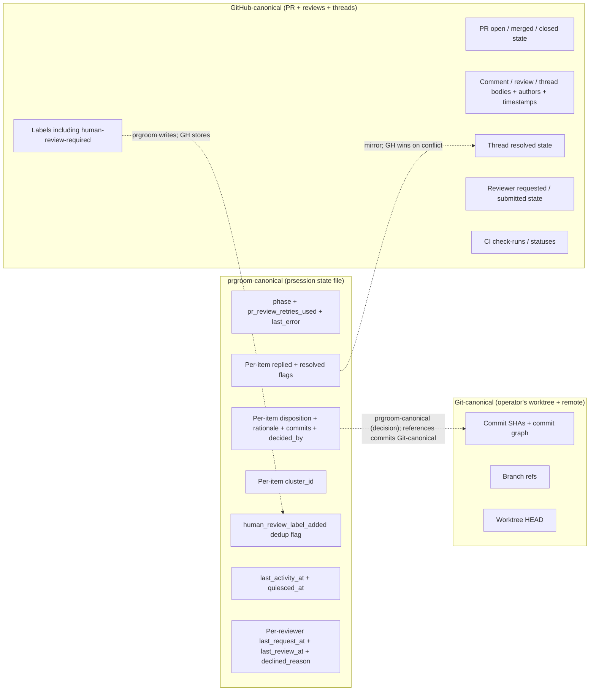

# prgroom CLI — Data View

> **Up**: [index](index.md)
> **Previous (reading order)**: [C4 L3 — Lifecycle](c4-l3-lifecycle.md)
> **Next (reading order)**: [C4 Deployment](c4-deployment.md)
> **Source bead**: `agents-config-fca6.12`
> **Source design**: [design.md](design.md) — §2 (state schema) + §4.5 (auto-merge eligibility / status output) + §5 (EscalationSink) + §7 (PR-memory channel); the verify gate, VerifyVerdict, GateStrength, and verify_checklist live in §6

> **Status**: **`VerifyVerdict` and the `verify` field/step are DESIGNED, not built.** `packages/prgroom/src/prgroom/prsession/state.py::PRGroomingState` has no `verify` field, the `VerifyVerdict` type does not exist in the package, and `LIFECYCLE_FIX_VERIFY_EXHAUSTED` is not built. Built to target: `GateStrength` with validated `Disposition.gate`, the `pr_review_retries_used` counter, and `LIFECYCLE_PR_REVIEW_EXHAUSTED`. This page documents the target schema — see [`c4-l3-verify.md`](c4-l3-verify.md).

## Glossary

| Term | Meaning |
|---|---|
| `PRGroomingState` | The root persistent entity (§2). One per PR. Lives in the `prsession.Store` file adapter as JSON at `$XDG_STATE_HOME/prgroom/<owner>-<repo>-<n>.json`. |
| Canonical ownership | Which system is the source of truth for a piece of data. prgroom mirrors much of GitHub's PR state into the prsession store, but GitHub remains canonical for review state; the store is canonical only for prgroom's own lifecycle metadata (`phase`, `pr_review_retries_used`, `disposition`, etc.). |
| `schema_version` | The integer carried on every `PRGroomingState`. MVP = `1`. Used by `src/prgroom/prsession` to dispatch read-time migrations or trip `STATE_SCHEMA_UNKNOWN`. |
| ER (Entity-Relationship) | The relational data view; here used for stateful entities with cardinalities. Mermaid `erDiagram`. |
| JSON contract | A flat dictionary shape exposed at a boundary (`prgroom status --json`, escalation events). Not a relational entity — represented inline as fenced JSON + a field table. |

## Purpose

Two complementary data views in one file:

1. **The persistent state schema** (`PRGroomingState` and its sub-entities) as an ER diagram. Shows the relationships, cardinalities, and key fields that drive the lifecycle. Source: §2.
2. **The boundary JSON contracts** — the shapes that leave the console-script's process boundary and become other systems' inputs:
   - `prgroom status --json` output (§4.5) — consumed by future merge-gate components (`gmxo`, `td39`) plus operator inspection
   - `Escalation` (§5) — consumed by `EscalationSink` adapters (stderr / file / bd)
3. **The canonical-ownership boundaries** — which data lives where, and which system is authoritative when state inevitably drifts.

The data view answers: *what shapes does prgroom read, write, and emit; which of those are its own truth vs mirrored from external truth?*

## Persistent state ER diagram

> **Diagram note**: The `VerifyVerdict` entity and the `PRGroomingState.verify` field are target-state (see Status above). `Disposition.gate: GateStrength` and the `pr_review_retries_used` field are built.

```mermaid
erDiagram
    PRGroomingState ||--|| PRRef                : "has 1"
    PRGroomingState ||--|| QuiescenceState      : "has 1"
    PRGroomingState ||--o{ ReviewerState        : "has 0..N (keyed by identity)"
    PRGroomingState ||--o{ ReviewItem           : "has 0..N (ordered list)"
    PRGroomingState ||--o| VerifyVerdict         : "has 0..1 (batch-level; None until verify)"
    PRGroomingState ||--o{ RoutedMemory          : "has 0..N (pending_memory queue; §7.3)"
    ReviewItem      ||--o| Disposition          : "has 0..1 (None until _fix)"
    ReviewItem      ||--|| Identity             : "has 1 (per-kind)"

    PRGroomingState {
        int     schema_version           "1 in MVP; bumped on incompatible change"
        PRPhase phase                    "idle | awaiting-review | fixes-pending | quiesced | human-gated | merged"
        int     pr_review_retries_used   "0-indexed count of fix-push retries consumed; bounded by pr_review_retries (default 5)"
        str     last_poll_sha            "last HEAD observed by _poll"
        str     last_pushed_head_sha     "last HEAD pushed by THIS CLI"
        str     last_rereviewed_sha      "resumable-rereview marker (§3.3 rereview)"
        str     last_review_invalidated_sha "resumable-rereview marker"
        datetime last_polled_at          "UTC"
        datetime last_activity_at        "UTC; last_activity_at for §4.1 idle_threshold"
        bool    human_review_label_added "§4.6 dedup; reset on non-human-gated end-of-cycle"
        str     last_error               "structured §3.6 code (str | None); clears on successful cycle completion"
        bool    lifecycle_escalation_filed "per-cycle dedup for lifecycle-tier EscalationSink emits"
        VerifyVerdict verify             "batch-level fix<->verify verdict (VerifyVerdict | None); additive, omit-when-None => schema_version stays 1"
    }

    PRRef {
        str owner   "GitHub owner / org"
        str repo    "GitHub repo name"
        int number  "PR number"
    }

    ReviewerState {
        str            identity         "gh login or bot id (dict key)"
        ReviewerKind   kind             "human | bot"
        ReviewerStatus status           "not_requested | requested | in_progress | review_found | declined"
        bool           required         "true gates G_REVIEWERS quiescence"
        datetime       last_request_at  "UTC; §4.1 review_start_timeout reference"
        datetime       last_review_at   "UTC (datetime | None); §4.1 review_finish_timeout reference"
        datetime       declined_at      "UTC (datetime | None); set on transition to declined"
        str            declined_reason  "str | None; user-declined | timeout-no-start | timeout-stalled"
    }

    ReviewItem {
        ItemKind kind              "review_thread | review_summary | issue_comment"
        str      author            "gh login of comment author"
        str      body_excerpt      "first 200 chars"
        datetime seen_at           "first observed by _poll"
        str      cluster_id        "set by _cluster; empty = unclustered"
        bool     replied           "set by _reply"
        bool     resolved          "review_thread only; set by _resolve"
        str      duplicate_of_gh_id "set if the cluster contract clustered as duplicate"
    }

    Identity {
        str gh_id               "gh's stable id; (kind, gh_id) is natural key"
        str thread_id           "GraphQL node id; review_thread only"
        int reply_to_comment_id "review_thread only"
        int issue_comment_id    "issue_comment only"
    }

    Disposition {
        DispositionKind kind             "fixed | already_addressed | skipped | deferred | wont_fix | escalated | failed"
        str             rationale        "required for skipped|deferred|wont_fix|failed; user-facing for soft kinds"
        list_str        commits          "list[str]; SHAs for fixed + already_addressed"
        str             response_path    "str | None; path to fix-agent-authored response text"
        GateStrength    gate             "full | lite — typed/validated; invalid/absent on a fixed item => CONTRACT_FIX_AUDIT_FAILED"
        bool            escalation_filed "escalated only; per-cycle dedup"
        datetime        decided_at       "UTC"
        str             decided_by       "agent CLI id (e.g. claude -p opus[1m]) or human:<login>"
    }

    VerifyVerdict {
        str          result          "passed | failed — mechanical gate-of-record outcome"
        GateStrength tier            "full | lite — gate strength actually run (whole-branch, strongest across clean FIXED items)"
        int          retries_used    "fix<->verify repair re-fix attempts consumed this cycle"
        str          gate_output_ref "path/excerpt of the last gate output (status + escalation)"
        datetime     decided_at      "UTC"
    }

    RoutedMemory {
        str classification       "taxonomy class; MVP routes CONTEXTUAL only"
        str content              "exactly one of content / path"
        str path                 ""
        str target_hint          "thread node-id => thread reply; else => ## Decisions"
        int retry                "(retry, source_item) = Decisions-block dedup key"
        str source_item_gh_id    ""
    }

    QuiescenceState {
        str      ci_state    "success | pending | failure | absent — G_CI gate input for last_pushed_head_sha"
        datetime quiesced_at "UTC (datetime | None); set when phase transitions to quiesced"
    }
```



### Cardinality notes

- `PRGroomingState` is the aggregate root; everything else is owned by it. There are no cross-aggregate relationships.
- `ReviewerState` dict keys (`identity` field) are unique per state — `dict[str, ReviewerState]` in Python. In MVP the dict typically holds 1-2 entries (`"copilot"`, maybe `"alice"`).
- `ReviewItem` list is ordered by `seen_at` (append-only growth as `_poll` discovers new comments).
- `Disposition` is an **optional** field on `ReviewItem` — `disposition: Disposition | None`, where `None` is the explicit "not yet processed" state. Once set, it's not unset (the lifecycle only forward-resolves dispositions).
- `Disposition.gate` is typed as `GateStrength` — a `StrEnum` with members `FULL = "full"` and `LITE = "lite"`. It is **validated**: a `FIXED` item whose `gate` is absent or not a valid `GateStrength` is a `CONTRACT_FIX_AUDIT_FAILED` (the item flips to `failed`). This makes `recommended_gate` load-bearing — the whole-branch tier is the strongest `gate` across clean `FIXED` items (any `full` ⇒ `full`, else `lite`). See [`c4-l3-verify.md`](c4-l3-verify.md).
- `VerifyVerdict` is an **optional batch-level** field on `PRGroomingState` — `verify: VerifyVerdict | None`, where `None` is the pre-verify state. It is whole-branch (not per-item), since the gate is whole-branch and `FAILED` items drop their `gate`. **Additive, omit-when-`None`** in JSON, so old state files load `None` and `schema_version` stays `1` (parallels the `pending_memory` precedent). `tier` is the `GateStrength` actually run; `retries_used` counts the fix↔verify repair attempts bounded by `fix_verify_retries`. See [`c4-l3-verify.md`](c4-l3-verify.md).
- `Identity` is shape-polymorphic by `kind`: only `review_thread` carries `thread_id` + `reply_to_comment_id`; only `issue_comment` carries `issue_comment_id`. `gh_id` is always populated. The §2 spec notes this is enforced by runtime validation, not by separate dataclass types (the single-dataclass + discriminator shape is the MVP default for JSON-serialization simplicity).
- **`ReviewerStatus` has no `approved` value, by design.** A submitted review — GitHub `APPROVED`, `CHANGES_REQUESTED`, or `COMMENTED` — all land the reviewer in `review_found` (§4.1). The approve-vs-changes distinction lives in the `ReviewItem`s the review produces (an approval yields zero actionable items, so quiescence trips via `G_DISPOSITIONS` + `G_NO_BLOCKERS`), not in the reviewer's status; and `G_REVIEWERS` only asks whether each Required reviewer reached a terminal verdict (`review_found | declined`), so a separate `approved` state would be redundant. The **merge-relevant** human approval is a different signal entirely — the `human-approved` label or a non-bot `APPROVED` review — owned by §4.4 and surfaced via `status --json` `auto_merge_eligible`, not by `ReviewerStatus`.

## Canonical-ownership boundaries

prgroom mirrors much of GitHub's PR state into the local prsession store. But mirroring is not authority — when the two disagree, GitHub wins for review state and prgroom wins for its own lifecycle metadata.



### Tie-breakers when state drifts

| Conflict | Winner | Resolution |
|---|---|---|
| `state.items[i].resolved == True` but GitHub thread is unresolved | GitHub | Next `_poll` observes; flips `resolved=False`; `_resolve` may re-resolve |
| `state.reviewers[r].status == in_progress` but no recent activity per `_poll` fetch | GitHub-observed | `evaluate_reviewer_timeouts` re-evaluates and may flip to `declined` |
| PR HEAD SHA != `state.last_poll_sha` | GitHub | `_poll` updates; pr_review_retries_used++ via SHA-transition attribution if `last_pushed_head_sha` doesn't match (bootstrap exception: an empty `last_poll_sha` only anchors the SHA, no increment — §3.4) |
| PR has `human-review-required` label but `state.human_review_label_added == False` | GitHub-observed | prgroom does NOT clear the flag mismatch — label is a write-only output from prgroom, not a read input (the label is consumed by `gmxo`/`td39`, not by prgroom itself) |
| `state.last_error` is set but a successful cycle just completed | prgroom | End-of-cycle resolver clears `last_error` (sets it to `None`) on writing a non-human-gated phase |

### Explicit non-ownership

- prgroom does NOT own commit content. The fix agent commits to the worktree; git owns the commit graph; prgroom only references commits by SHA in `disposition.commits`.
- prgroom does NOT own reviewer identity beyond the gh-login string. Whether `identity="copilot"` is actually GitHub Copilot or a custom bot or a typo is GitHub's problem.
- prgroom does NOT own the `human-review-required` label semantics. It writes the label; it does not read or wait on it. Future merge-gate components (`gmxo`, `td39`) consume the label as their merge-block signal.

## Boundary JSON contract #1 — `prgroom status --json` (§4.5)

> **Contract note**: The `verify` block in the example below is target-state (see Status above); `pr_review_retries_used` is the built state field.

The output of `prgroom status <pr> --json`. Computed per-query from `PRGroomingState` + a small live gh API enrichment (label state, PR-approval reviews). Stability commitment per §4.5: **adding fields is non-breaking; removing or renaming is breaking and requires a version-bumped envelope**.

```json
{
  "pr": 42,
  "phase": "quiesced",
  "last_error": "",
  "pr_review_retries_used": 1,
  "reviewers": [
    {"login": "github-copilot[bot]", "required": true, "is_bot": true, "status": "review_found", "declined_reason": ""},
    {"login": "alice", "required": false, "is_bot": false, "status": "in_progress", "declined_reason": ""}
  ],
  "ci_state": "success",
  "items_summary": {"fixed": 3, "already_addressed": 1, "wont_fix": 0, "escalated": 0, "failed": 0, "skipped": 0, "deferred": 0},
  "last_activity_at": "2026-05-25T14:32:11Z",
  "quiesced_at": "2026-05-25T14:42:11Z",
  "merge_gates": {
    "phase_is_quiesced": true,
    "last_error_clear": true,
    "no_blocker_items": true,
    "human_review_satisfied": false
  },
  "human_review": {
    "required": true,
    "satisfied_by": null,
    "candidates_seen": []
  },
  "verify": {
    "result": "failed",
    "tier": "full",
    "retries_used": 2,
    "last_error": "LIFECYCLE_FIX_VERIFY_EXHAUSTED"
  },
  "auto_merge_eligible": false
}
```

| Field | Source | Notes |
|---|---|---|
| `pr` | `state.pr.number` | |
| `phase` | `state.phase` | One of the 6 phase enum values |
| `last_error` | `state.last_error` | `None` (or empty) = clean |
| `pr_review_retries_used` | `state.pr_review_retries_used` | 0-indexed fix-push retry counter |
| `reviewers[]` | `state.reviewers` dict | Sorted by login for deterministic output |
| `ci_state` | `state.quiescence.ci_state` | `success` / `pending` / `failure` / `absent` |
| `items_summary` | aggregation over `state.items` | Counts per `disposition.kind` |
| `last_activity_at` | `state.last_activity_at` | RFC3339 UTC |
| `quiesced_at` | `state.quiescence.quiesced_at` | Empty string if not quiesced |
| `merge_gates.phase_is_quiesced` | `state.phase == PRPhase.QUIESCED` | Derived per-query |
| `merge_gates.last_error_clear` | `state.last_error` is `None` (or empty) | Derived per-query |
| `merge_gates.no_blocker_items` | no item with `disposition.kind ∈ {escalated, failed}` | Derived per-query |
| `merge_gates.human_review_satisfied` | `NOT human_review.required OR human_review.satisfied_by != null` | Derived per-query |
| `human_review.required` | `hasLabel("human-review-required")` from live gh fetch | Source: GitHub, not state |
| `human_review.satisfied_by` | first match: `"label"` if `hasLabel("human-approved")`; `"approval:<login>"` if any non-bot review is APPROVED; else `null` | Source: GitHub |
| `human_review.candidates_seen` | All examined PR-approval candidates with bot-filter outcome | For operator debuggability: "why didn't approval X count?" |
| `verify` | `state.verify` (`VerifyVerdict`) | Additive (non-breaking); omitted/`null` until the `verify` step runs. See below. |
| `verify.result` | `state.verify.result` | `passed` / `failed` |
| `verify.tier` | `state.verify.tier` | `full` / `lite` — the `GateStrength` actually run |
| `verify.retries_used` | `state.verify.retries_used` | fix↔verify repair attempts consumed this cycle |
| `verify.last_error` | `state.last_error` | exhaustion code (`LIFECYCLE_FIX_VERIFY_EXHAUSTED`) when the inner budget is spent; also surfaced at the top level |
| `auto_merge_eligible` | AND of the four `merge_gates` fields | Derived per-query |

### Stability and versioning

The shape above is the §4 stable contract. Consumers (`gmxo`, `td39`, operator scripts) may rely on it. Adding fields is non-breaking. Removing or renaming requires a version-bumped envelope (deferred to `gmxo`/`td39` brainstorm — not designed in MVP).

## Boundary JSON contract #2 — `Escalation` (§5)

Emitted by `escalate_if_needed` (per-item) and `request_human_review_if_needed` (lifecycle gate) via the `EscalationSink` Protocol. These live within `src/prgroom/lifecycle` (the §1 layout gives escalation no dedicated module). Three adapters consume the same shape:

```python

# src/prgroom/lifecycle (escalation sink — no dedicated module)
from dataclasses import dataclass
from enum import StrEnum
from typing import Protocol, runtime_checkable

from prgroom.prsession.state import ReviewItem
from prgroom.prsession.store import PRRef

class Severity(StrEnum):
    INFO = "info"
    WARN = "warn"
    BLOCK = "block"

@dataclass(frozen=True, slots=True)
class Escalation:
    pr: PRRef                          # copy of state.pr
    reason: str                        # free-form, public-safe
    severity: Severity                 # info | warn | block
    item: ReviewItem | None = None     # optional; the item that triggered the escalation

@runtime_checkable
class EscalationSink(Protocol):
    def emit(self, escalation: Escalation) -> None: ...  # best-effort; raises on sink failure
```

Wire-format example (`file` adapter — one JSON line per escalation):

```json
{
  "pr": {"owner": "scotthamilton77", "repo": "agents-config", "number": 42},
  "reason": "item escalated to human review — fix agent could not converge on cluster c3",
  "item": {
    "kind": "review_thread",
    "identity": {"gh_id": "PRR_kgABC123", "thread_id": "PRRT_kgABC456", "reply_to_comment_id": 789012},
    "author": "github-copilot[bot]",
    "body_excerpt": "Consider refactoring this loop to use a builder pattern...",
    "cluster_id": "c3",
    "disposition": {"kind": "escalated", "rationale": "design choice spans 3 files; outside agent's confident scope", "decided_at": "2026-05-25T14:30:00Z", "decided_by": "claude -p opus[1m]"}
  },
  "severity": "warn"
}
```

### Adapter behaviour per sink

| Sink | Wire format | Side-effects |
|---|---|---|
| **stderr** (default) | Pretty-print human-readable lines | Visible inline in operator's shell |
| **file** (`--escalation-file <path>`) | One JSON line per event (append-only) | External watchers / cron can tail |
| **bd** (`--bd-bead <id>` or `PRGROOM_BD_BEAD` env) | Adds `human` label + appends notes | Parallels current autonomous Skill A behaviour |

### Severity assignment

| Triggering condition | Severity |
|---|---|
| Per-item `disposition.kind == escalated` | `warn` |
| Per-item `disposition.kind == failed` (fix contract audit failure) | `warn` |
| `state.last_error == LIFECYCLE_FIX_VERIFY_EXHAUSTED` (inner fix↔verify retry budget spent) | `block` |
| `state.last_error == LIFECYCLE_PR_REVIEW_EXHAUSTED` (outer PR-review retry budget spent) | `block` |
| `state.last_error ∈ {STATE_CORRUPT, STATE_SCHEMA_UNKNOWN}` | `block` |
| Future: deferred-from-spec advisories | `info` |

### Sink failure handling

If `EscalationSink.emit(...)` raises (stderr write failure, bd-adapter API blip), the failure is swallowed (best-effort emit). The corresponding `escalation_filed` / `lifecycle_escalation_filed` flag is **NOT** set on sink error, so the next invocation re-attempts the emission for the same item / lifecycle gate. Persistent sink failures produce repeated retry attempts but never block lifecycle progression.

Sinks MUST be dedup-aware on the receiving end — bd-adapter uses label-only emit or content-hash dedup on notes; stderr accepts duplicates as extra log lines.

## Boundary JSON contract #3 — Fix-contract memory & recurrence (§7)

Two §7 PR-memory **boundary shapes** cross the prgroom ↔ fix-agent line, and neither is persisted: `recurrence` is *computed* at snapshot-assembly from disposition history (§7.2), and the fix output's `memory` *channel* declares routing intent, not state. The durable side is `state.pending_memory` (the `RoutedMemory` queue in the §2 ER above): `_fix` resolves the declared channel into `RoutedMemory` records and persists them there, then `_reply` drains and clears the queue (§7.3) — so the PR stays the durable store (§7.0) without losing a memo on a cycle that ends before `_reply`. Routing mechanics live in [`c4-l3-lifecycle.md`](c4-l3-lifecycle.md) (write path) and [`c4-l3-agent-dispatch.md`](c4-l3-agent-dispatch.md) (contract + audit); this section fixes only the boundary shapes.

### Snapshot input — per-item `recurrence` (prgroom → fix agent)

prgroom computes a deterministic `recurrence` for every item carrying a prior disposition and includes it in the complete-PR snapshot fed to the fix agent (§7.1). prgroom **detects**; the fix agent **interprets**.

```python

# computed at snapshot-assembly from disposition history; NOT a stored field
@dataclass(frozen=True, slots=True)
class Recurrence:
    reopened: bool            # prior disposition exists AND a new reviewer reply arrived on the same thread
    attempt_count: int        # times this item has been dispositioned (1 = first pass)
    prior_disposition: str    # most recent prior DispositionKind value
    prior_commits: list[str]  # SHAs from the most recent prior disposition; omitted from JSON when empty
    first_seen_retry: int     # retry the item was first observed
```

### Fix output — classified `memory` channel (fix agent → prgroom)

The fix output gains an optional `memory` channel (§5, §7.3). The agent *declares* memory; prgroom is the sole actuator of every PR write. MVP routes **`CONTEXTUAL` only, to the PR**; other classes are accepted-but-deferred (logged, not routed).

```json
"memory": [
  { "content": "<inline markdown>", "classification": "CONTEXTUAL" },
  { "path": "<file in memory_dir>", "classification": "CONTEXTUAL", "target_hint": "<thread node-id>" }
]
```

| Field | Meaning |
|---|---|
| `content` \| `path` | **Exactly one** per entry. `content` = inline markdown; `path` = a file in `memory_dir`. The carrier does **not** decide routing — `target_hint` does (next row). |
| `classification` | One of `UNIVERSAL \| PROJECT \| PLANNED \| HISTORICAL \| CONTEXTUAL`. MVP routes `CONTEXTUAL`; the rest accepted-but-deferred. |
| `target_hint` | Optional GraphQL thread node-id (the CONTEXTUAL thread-reply target). Absent ⇒ routes to the `## Decisions` block. |

### Fix output — `verify_checklist` artifact (fix agent → prgroom)

`FixOutput` carries a `verify_checklist` artifact — **required whenever the dispatch claims commits** (a batch with `FIXED` items, or a repair with non-empty `repair.commits`), its absence tolerated otherwise: the armed fix agent's own completion-gate claim (what it ran — tests/build/lint — and the result). It is a forcing function (the contract compels the agent to gate itself) and an audit trail; it is **not** byte-compared against prgroom's mechanical gate, which is independently authoritative (trust-but-verify). On a batch with `FIXED` items, a **missing or malformed** `verify_checklist` is a contract-audit failure (`CONTRACT_FIX_AUDIT_FAILED` ⇒ the item flips to `failed`); symmetrically, on a repair with non-empty `repair.commits`, a **missing or malformed** `verify_checklist` fails the repair's contract audit — the attempt consumes a retry (`retries_used` increments) and the branch re-gates as-is. The mechanical confirmation — `prgroom`'s `verify` step running the operator-configured tier command via `proc.CommandRunner`, whole-branch — is the gate of record; the verdict it persists is `VerifyVerdict` (above). Contract + audit mechanics live in [`c4-l3-verify.md`](c4-l3-verify.md) and [`c4-l3-agent-dispatch.md`](c4-l3-agent-dispatch.md).

The artifact is a **structured findings list**, grouped by the agent's inner fix → review → fix iterations (distinct from prgroom's outer PR-review loop), using the severity rubric shared with quality-reviewer, crit, and simplify:

```json
"verify_checklist": {
  "iterations": [
    {
      "reviews_run": ["quality-review", "simplify", "make ci-prgroom"],
      "findings": [
        { "severity": "MAJOR", "title": "unguarded array access in dispatch loop", "resolution": "addressed" },
        { "severity": "MINOR", "title": "stale import left after refactor", "resolution": "unresolved" }
      ]
    }
  ]
}
```

Schema-validity (a parseable object with ≥1 iteration; every finding carrying a valid severity — one of `BLOCKING`, `CRITICAL`, `MAJOR`, `MINOR` — and a valid resolution — one of `addressed`, `unresolved`) is part of the audit rule above — malformed follows the missing-checklist path. An `unresolved` finding of any severity is **not** an audit failure: the checklist is the agent's honest claim, and the mechanical gate alone decides whether the branch ships (see the readiness reconciliation spec, [`2026-07-16-prgroom-fix-verify-implementation-readiness.md`](../../specs/2026-07-16-prgroom-fix-verify-implementation-readiness.md) §3).

### Repair-dispatch input delta — `verify_failure_path` (prgroom → fix agent)

On a red gate, the convergence loop re-dispatches the fix agent in a **whole-branch repair** mode (bounded by `fix_verify_retries`). The repair-mode input gains an optional `verify_failure_path` — the temp file holding the failing gate's `stdout` / `stderr` / exit code — alongside a `fix-repair` prompt template. The commit-attribution audit is adapted so the repair's new commits are claimed by the verify-repair batch, not by any review item. None of this is persisted state; the only persistent residue is the updated `VerifyVerdict`. See [`c4-l3-verify.md`](c4-l3-verify.md).

## Auxiliary persistent data

Two append-only artifacts live alongside the per-PR state files:

| File | Path | Contents |
|---|---|---|
| Token-usage log | `$XDG_STATE_HOME/prgroom/usage.jsonl` | One line per agent invocation: `{ts, pr, contract, provider, model, input_tokens, output_tokens, duration_ms, outcome}`. MVP: capture only; no aggregation. |
| Escalation file log (optional) | `<path>` from `--escalation-file` | One JSON line per `Escalation` event. Used by external watchers. |

Neither file is part of `prsession.Store` — they are output streams owned by `src/prgroom/agent` and the `src/prgroom/lifecycle` escalation sink respectively.

## What this diagram does NOT show

- **Per-verb state-write atomicity contracts.** That's the [`c4-l3-prsession.md`](c4-l3-prsession.md) concern (stub) — the `prsession.Store` Protocol + mktemp+rename + flock semantics.
- **Schema migration plumbing.** Versions, migration registry, `STATE_SCHEMA_UNKNOWN` trip — see [`c4-l3-prsession.md`](c4-l3-prsession.md) (stub).
- **The actual GitHub API field shapes prgroom polls.** `src/prgroom/gh` wraps the `gh` subprocess; the per-endpoint payload shapes are the `gh` CLI's documented surface, not prgroom's contract.
- **Cross-PR enumeration data** — `prgroom sweep`'s output. Not designed at the data-contract level in MVP; `sweep` writes per-PR exit codes to its own stderr.
- **The §3.6 error-code registry itself.** This file references `last_error` as a string; the full code list with what/why/how lives in the design reference §3.6.

## Cross-references

- **Previous**: [C4 L3 — Lifecycle](c4-l3-lifecycle.md) — the components that read / write this data
- **Next (reading order)**: [C4 Deployment](c4-deployment.md) — where this data physically lives on disk
- **Related stubs**: [`c4-l3-prsession.md`](c4-l3-prsession.md) (state store adapters), [`c4-l3-agent-dispatch.md`](c4-l3-agent-dispatch.md) (token-usage emitter)
- **Source design**: [§2 prsession.Store interface + state schema](design.md), [§4.5 Auto-merge eligibility contract](design.md), [§5 Agent dispatch (named contracts)](design.md), [§7 PR memory management](design.md)
