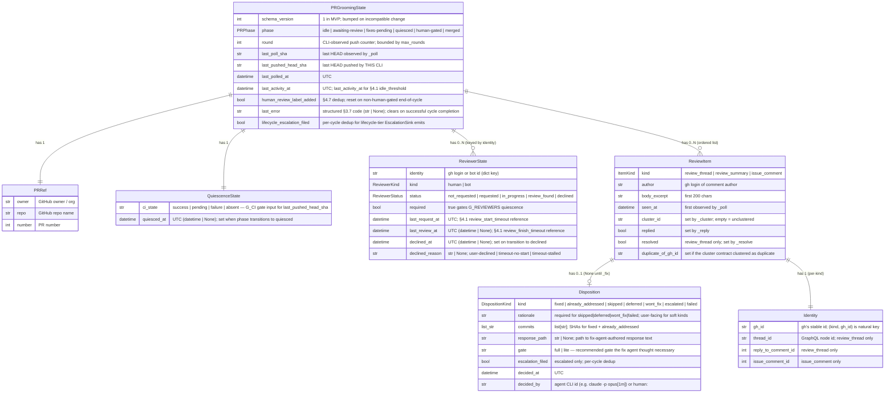
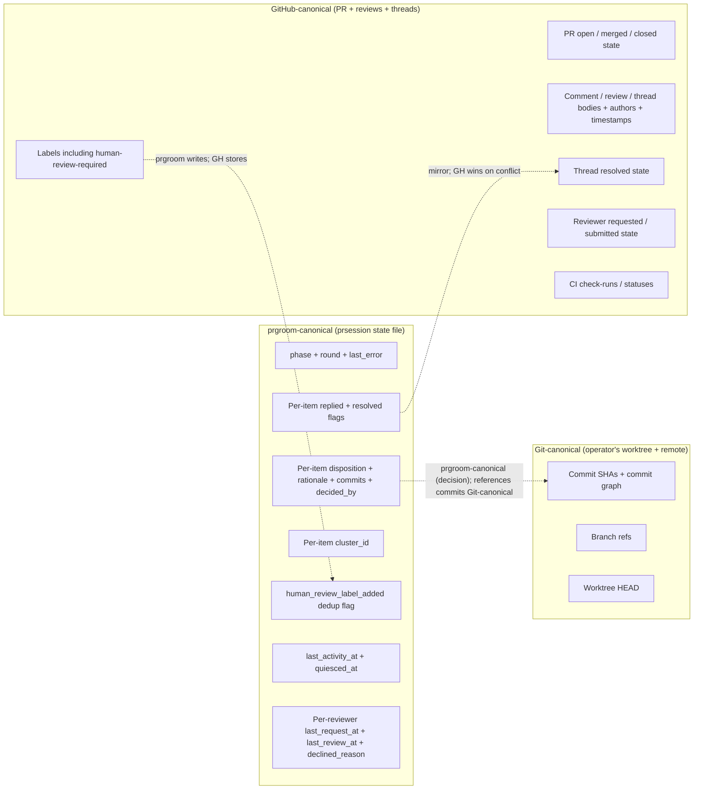

# prgroom CLI — Data View

> **Up**: [index](index.md)
> **Previous (reading order)**: [C4 L3 — Lifecycle](c4-l3-lifecycle.md)
> **Next (reading order)**: [C4 Deployment](c4-deployment.md)
> **Source bead**: `agents-config-fca6.12`
> **Source spec**: [`docs/plans/2026-05-12-prgroom-cli-design.md`](../../plans/2026-05-12-prgroom-cli-design.md) — Section 2 (state schema) + Section 4.6 (status output) + Section 5 (EscalationSink) + Section 8 (PR-memory channel + recurrence)

## Glossary

| Term | Meaning |
|---|---|
| `PRGroomingState` | The root persistent entity (§2). One per PR. Lives in the `prsession.Store` file adapter as JSON at `$XDG_STATE_HOME/prgroom/<owner>-<repo>-<n>.json`. |
| Canonical ownership | Which system is the source of truth for a piece of data. prgroom mirrors much of GitHub's PR state into the prsession store, but GitHub remains canonical for review state; the store is canonical only for prgroom's own lifecycle metadata (`phase`, `round`, `disposition`, etc.). |
| `schema_version` | The integer carried on every `PRGroomingState`. MVP = `1`. Used by `src/prgroom/prsession` to dispatch read-time migrations or trip `STATE_SCHEMA_UNKNOWN`. |
| ER (Entity-Relationship) | The relational data view; here used for stateful entities with cardinalities. Mermaid `erDiagram`. |
| JSON contract | A flat dictionary shape exposed at a boundary (`prgroom status --json`, escalation events). Not a relational entity — represented inline as fenced JSON + a field table. |

## Purpose

Two complementary data views in one file:

1. **The persistent state schema** (`PRGroomingState` and its sub-entities) as an ER diagram. Shows the relationships, cardinalities, and key fields that drive the lifecycle. Source: §2.
2. **The boundary JSON contracts** — the shapes that leave the console-script's process boundary and become other systems' inputs:
   - `prgroom status --json` output (§4.6) — consumed by future merge-gate components (`gmxo`, `td39`) plus operator inspection
   - `Escalation` (§5) — consumed by `EscalationSink` adapters (stderr / file / bd)
3. **The canonical-ownership boundaries** — which data lives where, and which system is authoritative when state inevitably drifts.

The data view answers: *what shapes does prgroom read, write, and emit; which of those are its own truth vs mirrored from external truth?*

## Persistent state ER diagram



### Cardinality notes

- `PRGroomingState` is the aggregate root; everything else is owned by it. There are no cross-aggregate relationships.
- `ReviewerState` dict keys (`identity` field) are unique per state — `dict[str, ReviewerState]` in Python. In MVP the dict typically holds 1-2 entries (`"copilot"`, maybe `"alice"`).
- `ReviewItem` list is ordered by `seen_at` (append-only growth as `_poll` discovers new comments).
- `Disposition` is an **optional** field on `ReviewItem` — `disposition: Disposition | None`, where `None` is the explicit "not yet processed" state. Once set, it's not unset (the lifecycle only forward-resolves dispositions).
- `Identity` is shape-polymorphic by `kind`: only `review_thread` carries `thread_id` + `reply_to_comment_id`; only `issue_comment` carries `issue_comment_id`. `gh_id` is always populated. The §2 spec notes this is enforced by runtime validation, not by separate dataclass types (the single-dataclass + discriminator shape is the MVP default for JSON-serialization simplicity).
- **`ReviewerStatus` has no `approved` value, by design.** A submitted review — GitHub `APPROVED`, `CHANGES_REQUESTED`, or `COMMENTED` — all land the reviewer in `review_found` (§4.1). The approve-vs-changes distinction lives in the `ReviewItem`s the review produces (an approval yields zero actionable items, so quiescence trips via `G_DISPOSITIONS` + `G_NO_BLOCKERS`), not in the reviewer's status; and `G_REVIEWERS` only asks whether each Required reviewer reached a terminal verdict (`review_found | declined`), so a separate `approved` state would be redundant. The **merge-relevant** human approval is a different signal entirely — the `human-approved` label or a non-bot `APPROVED` review — owned by §4.4 and surfaced via `status --json` `auto_merge_eligible`, not by `ReviewerStatus`.

## Canonical-ownership boundaries

prgroom mirrors much of GitHub's PR state into the local prsession store. But mirroring is not authority — when the two disagree, GitHub wins for review state and prgroom wins for its own lifecycle metadata.



### Tie-breakers when state drifts

| Conflict | Winner | Resolution |
|---|---|---|
| `state.items[i].resolved == True` but GitHub thread is unresolved | GitHub | Next `_poll` observes; flips `resolved=False`; `_resolve` may re-resolve |
| `state.reviewers[r].status == in_progress` but no recent activity per `_poll` fetch | GitHub-observed | `evaluate_reviewer_timeouts` re-evaluates and may flip to `declined` |
| PR HEAD SHA != `state.last_poll_sha` | GitHub | `_poll` updates; round++ via SHA-transition attribution if `last_pushed_head_sha` doesn't match |
| PR has `human-review-required` label but `state.human_review_label_added == False` | GitHub-observed | prgroom does NOT clear the flag mismatch — label is a write-only output from prgroom, not a read input (the label is consumed by `gmxo`/`td39`, not by prgroom itself) |
| `state.last_error` is set but a successful cycle just completed | prgroom | End-of-cycle resolver clears `last_error` (sets it to `None`) on writing a non-human-gated phase |

### Explicit non-ownership

- prgroom does NOT own commit content. The fix agent commits to the worktree; git owns the commit graph; prgroom only references commits by SHA in `disposition.commits`.
- prgroom does NOT own reviewer identity beyond the gh-login string. Whether `identity="copilot"` is actually GitHub Copilot or a custom bot or a typo is GitHub's problem.
- prgroom does NOT own the `human-review-required` label semantics. It writes the label; it does not read or wait on it. Future merge-gate components (`gmxo`, `td39`) consume the label as their merge-block signal.

## Boundary JSON contract #1 — `prgroom status --json` (§4.6)

The output of `prgroom status <pr> --json`. Computed per-query from `PRGroomingState` + a small live gh API enrichment (label state, PR-approval reviews). Stability commitment per §4.6: **adding fields is non-breaking; removing or renaming is breaking and requires a version-bumped envelope**.

```json
{
  "pr": 42,
  "phase": "quiesced",
  "last_error": "",
  "round": 2,
  "reviewers": [
    {"login": "github-copilot[bot]", "required": true, "is_bot": true, "status": "review_found", "declined_reason": ""},
    {"login": "alice", "required": false, "is_bot": false, "status": "in_progress", "declined_reason": ""}
  ],
  "ci_state": "success",
  "items_summary": {"fixed": 3, "already_addressed": 1, "wont_fix": 0, "escalated": 0, "failed": 0, "skipped": 0, "deferred": 0},
  "last_activity_at": "2026-05-25T14:32:11Z",
  "quiesced_at": "2026-05-25T14:42:11Z",
  "merge_gates": {
    "phase_is_quiesced": true,
    "last_error_clear": true,
    "no_blocker_items": true,
    "human_review_satisfied": false
  },
  "human_review": {
    "required": true,
    "satisfied_by": null,
    "candidates_seen": []
  },
  "auto_merge_eligible": false
}
```

| Field | Source | Notes |
|---|---|---|
| `pr` | `state.pr.number` | |
| `phase` | `state.phase` | One of the 6 phase enum values |
| `last_error` | `state.last_error` | `None` (or empty) = clean |
| `round` | `state.round` | CLI-observed push counter |
| `reviewers[]` | `state.reviewers` dict | Sorted by login for deterministic output |
| `ci_state` | `state.quiescence.ci_state` | `success` / `pending` / `failure` / `absent` |
| `items_summary` | aggregation over `state.items` | Counts per `disposition.kind` |
| `last_activity_at` | `state.last_activity_at` | RFC3339 UTC |
| `quiesced_at` | `state.quiescence.quiesced_at` | Empty string if not quiesced |
| `merge_gates.phase_is_quiesced` | `state.phase == PRPhase.QUIESCED` | Derived per-query |
| `merge_gates.last_error_clear` | `state.last_error` is `None` (or empty) | Derived per-query |
| `merge_gates.no_blocker_items` | no item with `disposition.kind ∈ {escalated, failed}` | Derived per-query |
| `merge_gates.human_review_satisfied` | `NOT human_review.required OR human_review.satisfied_by != null` | Derived per-query |
| `human_review.required` | `hasLabel("human-review-required")` from live gh fetch | Source: GitHub, not state |
| `human_review.satisfied_by` | first match: `"label"` if `hasLabel("human-approved")`; `"approval:<login>"` if any non-bot review is APPROVED; else `null` | Source: GitHub |
| `human_review.candidates_seen` | All examined PR-approval candidates with bot-filter outcome | For operator debuggability: "why didn't approval X count?" |
| `auto_merge_eligible` | AND of the four `merge_gates` fields | Derived per-query |

### Stability and versioning

The shape above is the §4 stable contract. Consumers (`gmxo`, `td39`, operator scripts) may rely on it. Adding fields is non-breaking. Removing or renaming requires a version-bumped envelope (deferred to `gmxo`/`td39` brainstorm — not designed in MVP).

## Boundary JSON contract #2 — `Escalation` (§5)

Emitted by `escalate_if_needed` (per-item) and `request_human_review_if_needed` (lifecycle gate) via the `EscalationSink` Protocol. These live within `src/prgroom/lifecycle` (the §1 layout gives escalation no dedicated module). Three adapters consume the same shape:

```python

# src/prgroom/lifecycle (escalation sink — no dedicated module)
from dataclasses import dataclass
from enum import StrEnum
from typing import Protocol, runtime_checkable

from prgroom.prsession.state import ReviewItem
from prgroom.prsession.store import PRRef

class Severity(StrEnum):
    INFO = "info"
    WARN = "warn"
    BLOCK = "block"

@dataclass(frozen=True, slots=True)
class Escalation:
    pr: PRRef                          # copy of state.pr
    reason: str                        # free-form, public-safe
    severity: Severity                 # info | warn | block
    item: ReviewItem | None = None     # optional; the item that triggered the escalation

@runtime_checkable
class EscalationSink(Protocol):
    def emit(self, escalation: Escalation) -> None: ...  # best-effort; raises on sink failure
```

Wire-format example (`file` adapter — one JSON line per escalation):

```json
{
  "pr": {"owner": "scotthamilton77", "repo": "agents-config", "number": 42},
  "reason": "item escalated to human review — fix agent could not converge on cluster c3",
  "item": {
    "kind": "review_thread",
    "identity": {"gh_id": "PRR_kgABC123", "thread_id": "PRRT_kgABC456", "reply_to_comment_id": 789012},
    "author": "github-copilot[bot]",
    "body_excerpt": "Consider refactoring this loop to use a builder pattern...",
    "cluster_id": "c3",
    "disposition": {"kind": "escalated", "rationale": "design choice spans 3 files; outside agent's confident scope", "decided_at": "2026-05-25T14:30:00Z", "decided_by": "claude -p opus[1m]"}
  },
  "severity": "warn"
}
```

### Adapter behaviour per sink

| Sink | Wire format | Side-effects |
|---|---|---|
| **stderr** (default) | Pretty-print human-readable lines | Visible inline in operator's shell |
| **file** (`--escalation-file <path>`) | One JSON line per event (append-only) | External watchers / cron can tail |
| **bd** (`--bd-bead <id>` or `PRGROOM_BD_BEAD` env) | Adds `human` label + appends notes | Parallels current autonomous Skill A behaviour |

### Severity assignment

| Triggering condition | Severity |
|---|---|
| Per-item `disposition.kind == escalated` | `warn` |
| Per-item `disposition.kind == failed` (fix contract audit failure) | `warn` |
| `state.last_error == LIFECYCLE_HARD_CAP_EXCEEDED` (§3.5) | `block` |
| `state.last_error ∈ {STATE_CORRUPT, STATE_SCHEMA_UNKNOWN}` | `block` |
| Future: deferred-from-spec advisories | `info` |

### Sink failure handling

If `EscalationSink.emit(...)` raises (stderr write failure, bd-adapter API blip), the failure is swallowed (best-effort emit). The corresponding `escalation_filed` / `lifecycle_escalation_filed` flag is **NOT** set on sink error, so the next invocation re-attempts the emission for the same item / lifecycle gate. Persistent sink failures produce repeated retry attempts but never block lifecycle progression.

Sinks MUST be dedup-aware on the receiving end — bd-adapter uses label-only emit or content-hash dedup on notes; stderr accepts duplicates as extra log lines.

## Boundary JSON contract #3 — Fix-contract memory & recurrence (§8)

Two §8 PR-memory shapes cross the prgroom ↔ fix-agent boundary. **Neither is persisted** — `recurrence` is *computed* at snapshot-assembly from disposition history (§8.2); `memory` is *routed to the PR* then discarded (the PR is the durable store, §8.0). The §2 persistent-state ER above is therefore **unchanged** by §8. Routing mechanics live in [`c4-l3-lifecycle.md`](c4-l3-lifecycle.md) (write path) and [`c4-l3-agent-dispatch.md`](c4-l3-agent-dispatch.md) (contract + audit); this section fixes only the shapes.

### Snapshot input — per-item `recurrence` (prgroom → fix agent)

prgroom computes a deterministic `recurrence` for every item carrying a prior disposition and includes it in the complete-PR snapshot fed to the fix agent (§8.1). prgroom **detects**; the fix agent **interprets**.

```python

# computed at snapshot-assembly from disposition history; NOT a stored field
@dataclass(frozen=True, slots=True)
class Recurrence:
    reopened: bool            # prior disposition exists AND a new reviewer reply arrived on the same thread
    attempt_count: int        # times this item has been dispositioned (1 = first pass)
    prior_disposition: str    # most recent prior DispositionKind value
    prior_commits: list[str]  # SHAs from the most recent prior disposition; omitted from JSON when empty
    first_seen_round: int     # round the item was first observed
```

### Fix output — classified `memory` channel (fix agent → prgroom)

The fix output gains an optional `memory` channel (§5, §8.3). The agent *declares* memory; prgroom is the sole actuator of every PR write. MVP routes **`CONTEXTUAL` only, to the PR**; other classes are accepted-but-deferred (logged, not routed).

```json
"memory": [
  { "content": "<inline markdown>", "classification": "CONTEXTUAL" },
  { "path": "<file in memory_dir>", "classification": "CONTEXTUAL", "target_hint": "<thread node-id>" }
]
```

| Field | Meaning |
|---|---|
| `content` \| `path` | **Exactly one** per entry. `content` = inline markdown; `path` = a file in `memory_dir`. The carrier does **not** decide routing — `target_hint` does (next row). |
| `classification` | One of `UNIVERSAL \| PROJECT \| PLANNED \| HISTORICAL \| CONTEXTUAL`. MVP routes `CONTEXTUAL`; the rest accepted-but-deferred. |
| `target_hint` | Optional GraphQL thread node-id (the CONTEXTUAL thread-reply target). Absent ⇒ routes to the `## Decisions` block. |

## Auxiliary persistent data

Two append-only artifacts live alongside the per-PR state files:

| File | Path | Contents |
|---|---|---|
| Token-usage log | `$XDG_STATE_HOME/prgroom/usage.jsonl` | One line per agent invocation: `{ts, pr, contract, provider, model, input_tokens, output_tokens, duration_ms, outcome}`. MVP: capture only; no aggregation. |
| Escalation file log (optional) | `<path>` from `--escalation-file` | One JSON line per `Escalation` event. Used by external watchers. |

Neither file is part of `prsession.Store` — they are output streams owned by `src/prgroom/agent` and the `src/prgroom/lifecycle` escalation sink respectively.

## What this diagram does NOT show

- **Per-verb state-write atomicity contracts.** That's the [`c4-l3-prsession.md`](c4-l3-prsession.md) concern (stub) — the `prsession.Store` Protocol + mktemp+rename + flock semantics.
- **Schema migration plumbing.** Versions, migration registry, `STATE_SCHEMA_UNKNOWN` trip — see [`c4-l3-prsession.md`](c4-l3-prsession.md) (stub).
- **The actual GitHub API field shapes prgroom polls.** `src/prgroom/gh` wraps the `gh` subprocess; the per-endpoint payload shapes are the `gh` CLI's documented surface, not prgroom's contract.
- **Cross-PR enumeration data** — `prgroom sweep`'s output. Not designed at the data-contract level in MVP; `sweep` writes per-PR exit codes to its own stderr.
- **The §3.7 error-code registry itself.** This file references `last_error` as a string; the full code list with what/why/how lives in source spec §3.7.

## Cross-references

- **Previous**: [C4 L3 — Lifecycle](c4-l3-lifecycle.md) — the components that read / write this data
- **Next (reading order)**: [C4 Deployment](c4-deployment.md) — where this data physically lives on disk
- **Related stubs**: [`c4-l3-prsession.md`](c4-l3-prsession.md) (state store adapters), [`c4-l3-agent-dispatch.md`](c4-l3-agent-dispatch.md) (token-usage emitter)
- **Source spec**: [Section 2 — `prsession.Store` interface + state schema](../../plans/2026-05-12-prgroom-cli-design.md), [Section 4.6 Auto-merge eligibility contract](../../plans/2026-05-12-prgroom-cli-design.md), [Section 5 — Agent dispatch internals](../../plans/2026-05-12-prgroom-cli-design.md) (EscalationSink section), [Section 8 — PR memory management](../../plans/2026-05-12-prgroom-cli-design.md)
