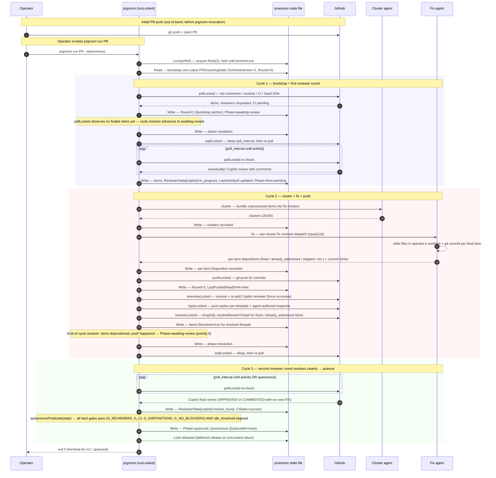
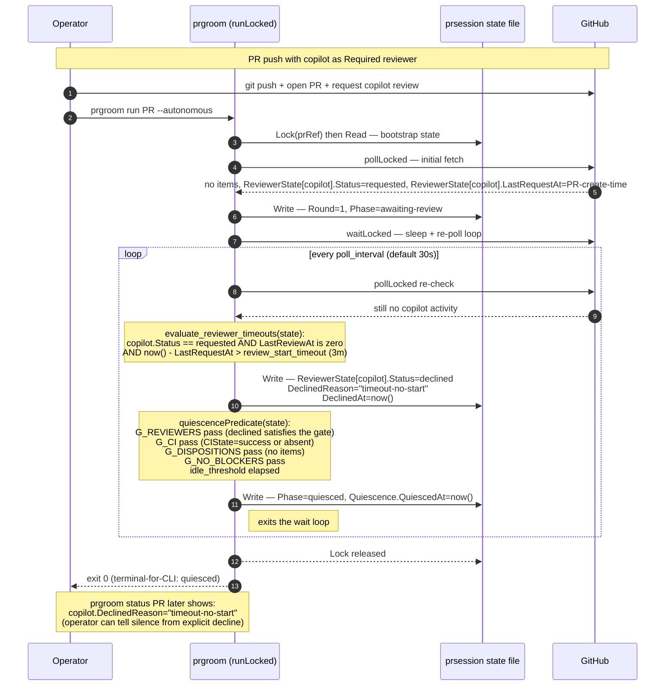
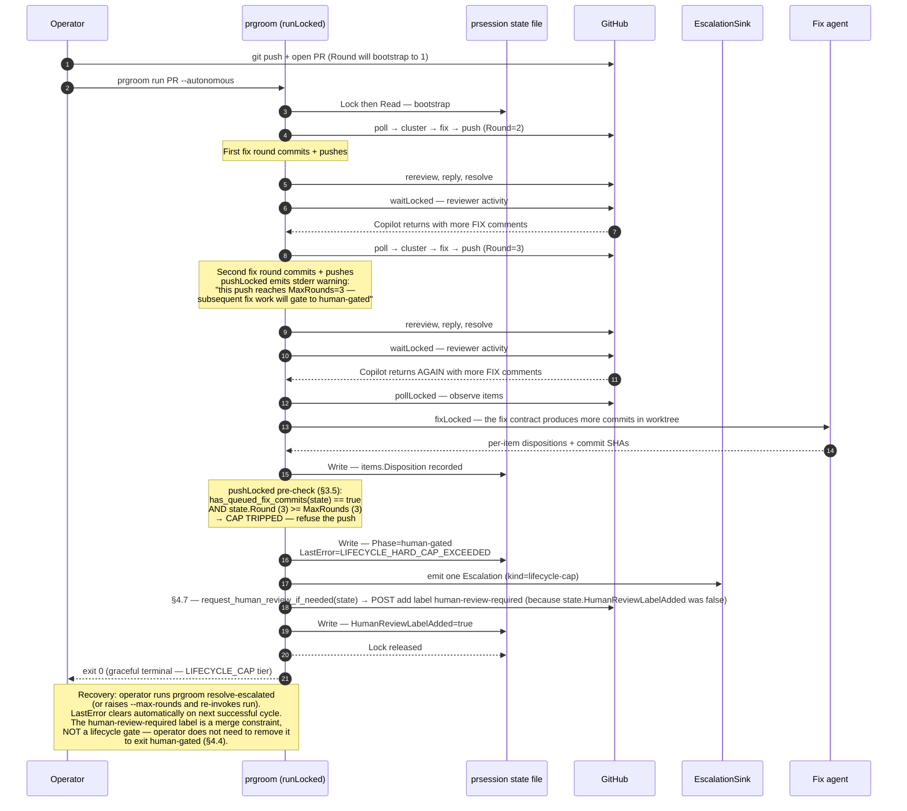
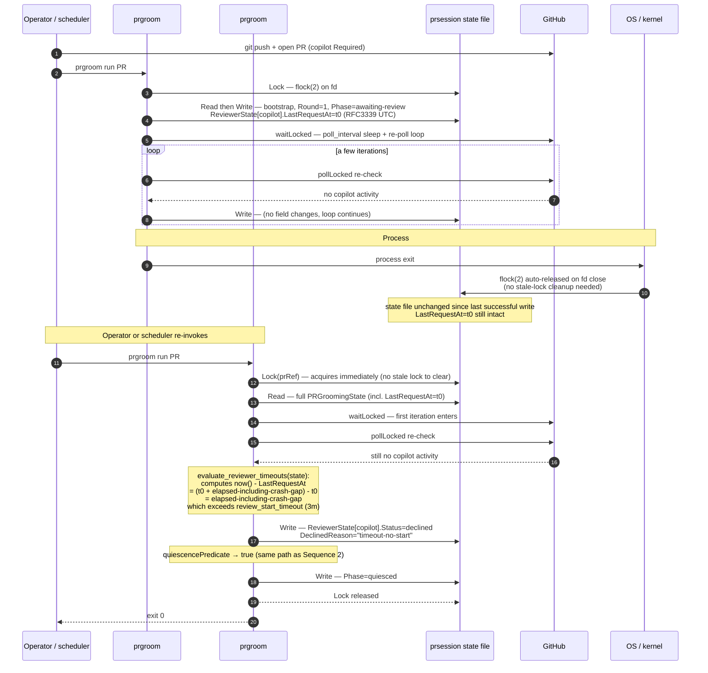

# prgroom CLI — Sequence Diagrams

> **Up**: [index](index.md)
> **Previous (reading order)**: [C4 L2 — Container](c4-l2-container.md)
> **Next (reading order)**: [State Machine](state-machine.md)
> **Source bead**: `agents-config-fca6.12`
> **Source spec**: [`docs/plans/2026-05-12-prgroom-cli-design.md`](../../plans/2026-05-12-prgroom-cli-design.md)

## Glossary

| Term | Meaning |
|---|---|
| Cycle | One pass through the lifecycle verbs (`poll → cluster → fix → push → [rereview] → reply → resolve`) followed by either `wait` or terminal exit. `runLocked` (§3.3) iterates cycles until quiescence or the hard cap. |
| Round | A counter of *review-eliciting pushes prgroom has performed or observed* on the PR. Bumped by `pushLocked` on a successful CLI push and by `pollLocked` on detection of an external push (SHA transition). Bounded by `MaxRounds` (§3.5). |
| Wake event | One of five conditions that exit `waitLocked` per §4.2: signal-cancel, poll-error, phase-moved, quiescence-trips, or (intentionally absent in MVP) hard wait-timeout. |
| Disposition | The fix contract agent's per-comment classification: `fixed`, `already_addressed`, `skipped`, `deferred`, `wont_fix`, `escalated`, `failed`. |
| `prsession.Store` | The per-PR state store interface (§2). The pseudonym `state` in the diagrams below is shorthand for an in-memory `PRGroomingState` value backed by the file adapter's `Read`/`Write` operations under `flock(2)`. |

## Purpose

Four sequence diagrams covering the canonical PR-grooming flows from operator push through to terminal exit:

1. **Happy path** — push → review → fix → push → quiesce
2. **Bot silence** — Copilot doesn't engage → `review_start_timeout` auto-decline → quiesce
3. **Hard cap** — three rounds without quiescence → human-gated + `human-review-required` label
4. **Resumability** — process crash mid-`waitLocked` → next invocation re-evaluates timeouts from stored UTC timestamps

Together they answer: *who calls whom, in what order, with what concurrency control, and where do the failure branches live?* Lifecycle-stage transitions, the strike-vs-non-strike taxonomy, and the full phase graph live in [`state-machine.md`](state-machine.md).

---

## Sequence 1 — Happy path

One PR's grooming session from initial push through to quiescence. Three cycles shown: the first triggered by the initial push, the second triggered by Copilot review comments, the third concluding with quiescence. Lock is acquired once by `Run` at the top of `runLocked` and released only on terminal exit (§3.3 line 814).

### Notes on the happy path

- **One lock per PR for the entire cycle.** `Run` acquires the `prsession.Store` lock once and holds it until terminal exit — minutes to hours depending on reviewer cadence. A concurrent `prgroom run` invocation on the same PR exits immediately with `PRECONDITION_LOCK_HELD` (exit 75). The `status` verb is the lock-free carve-out for diagnostic polling.
- **Round is incremented exactly once per push.** The bootstrap pollLocked sets `Round=1` to anchor the counter at the PR's currently observed HEAD; subsequent CLI pushes bump it via `pushLocked`; external pushes bump it via `pollLocked` SHA-transition attribution. The cap (default 3) counts CLI-observed rounds only — historical out-of-band pushes are invisible.
- **Quiescence is the four hard gates plus the idle timer.** `G_REVIEWERS` (all Required reviewers terminal), `G_CI` (CIState in {success, absent}), `G_DISPOSITIONS` (every item dispositioned), `G_NO_BLOCKERS` (no escalated / failed items). The idle timer (default 10m) is the soft "let it settle" buffer for slow human reviewers.
- **The fix agent owns its commits.** The fix contract agent runs `git commit` itself inside the operator's worktree; prgroom does the subsequent `git push`. prgroom does not commit, and the fix contract does not push.

---

## Sequence 2 — Bot silence (Copilot never engages)

Operator pushed the PR with Copilot requested as a Required reviewer. Copilot never engages within `review_start_timeout` (default 3m). `pollLocked`'s reviewer-timeout evaluator auto-declines Copilot, the quiescence predicate then trips, and prgroom exits cleanly. No fix work happens.

### Notes on the bot-silence path

- **`declined` satisfies `G_REVIEWERS`.** A Required reviewer can reach `declined` three ways: human explicit pass, `review_start_timeout` (this diagram), or `review_finish_timeout` (engaged but never produced a terminal review). All three count as gate-satisfying. The `DeclinedReason` is preserved for operator inspection.
- **No fix work happens.** With no items, the cycle skips cluster / fix / push / rereview / reply / resolve entirely. The first wake event after timeout is the quiescence trip.
- **Deadlines are derived, never stored.** `now() - LastRequestAt > review_start_timeout` is computed per-evaluation. This makes the path identical regardless of whether prgroom slept through the timeout in one process or across a crash gap (see Sequence 4).

---

## Sequence 3 — Hard cap (3 rounds without quiescence)

Operator pushed the PR (Round=1). Two prgroom-driven fix-push rounds raised it to Round=3. The third reviewer pass still produces FIX comments. The pre-push cap guard refuses the would-be fourth push, sets `Phase=human-gated`, emits an `EscalationSink` event, raises the `human-review-required` label on the PR, and exits cleanly (exit 0 — graceful terminal).

### Notes on the hard-cap path

- **The cap is checked pre-push, inside `runLocked`.** This way the would-be cap-tripping push is refused rather than uploaded. The commits the fix agent produced sit in the worktree (uncommitted-from-the-remote's-perspective) for the operator to inspect, push manually, or discard.
- **`LIFECYCLE_CAP` exits 0 (graceful terminal).** Distinct from runtime errors that exit non-zero — the cap-trip is a planned terminal outcome, not a failure of prgroom. The scheduler should not retry; the operator decides.
- **Auto-label is gated by `state.HumanReviewLabelAdded`.** prgroom sets the label exactly once per lifecycle gate; the flag is reset on successful cycle completion so subsequent gates can re-add it. The flag is not a re-entrancy mutex for the lifecycle — re-invoking `run` after operator action is the recovery path, not a label-state machine.
- **The label is a merge constraint, not a lifecycle gate.** Per §4.4 the `human-review-required` label tells `gmxo` / `td39` (future merge-gate consumers) to require human approval; it does NOT block prgroom from running another cycle. Operator clears `human-gated` by resolving the gating items, not by removing the label.

---

## Sequence 4 — Resumability (process crash mid-`waitLocked`)

prgroom is mid-`waitLocked` waiting for Copilot to engage. The process dies (operator Ctrl-C that doesn't honor signal handling, machine sleep, OOM kill — any cause). The state file's last successful write is intact. The operator (or scheduler) re-invokes `prgroom run`. Resumed `waitLocked` re-evaluates per-reviewer timeouts using `now() - LastRequestAt`, picking up exactly where the prior process left off — including across the crash gap.

### Notes on the resumability path

- **All §4 timestamps stored as absolute UTC (RFC3339).** `LastActivityAt`, `QuiescedAt`, `LastRequestAt`, `LastReviewAt`, `DeclinedAt`. Timeout *deadlines* are derived per-evaluation: `now() - LastRequestAt > review_start_timeout`. Storing absolute timestamps + deriving deadlines makes the crash gap automatically count.
- **`flock(2)` self-clears on process death.** The OS releases the file lock when the holding process exits via any path — clean exit, signal, kill, panic, power. No stale-lock detection code is needed. The error registry has no `STATE_LOCK_STALE` code by design.
- **Same outcome as if the process had never died.** PG2's behaviour is bit-for-bit identical to a hypothetical PG1 that had stayed alive through the same wall-clock interval. Resumability is a §4 invariant, not a separate recovery mode.
- **Config-change semantics are friendly.** If the operator raises `review_start_timeout` mid-flight (TOML edit), the next `pollLocked` evaluation reads the new value — a reviewer who would have been auto-declined at 3m gets the extension. Operator intent always wins because deadlines aren't frozen at start-time.

---

## Pending design that will reshape these flows

**An RCA / issue-analysis pass is under design** (tracked separately; not yet ratified, not in the parity MVP). It would *accompany the cluster pass* — assessing each review item's true scope, impact, and nature before fix dispatch — and feed richer context into the fix step, potentially gating which clusters are worth a fix attempt at all. Candidate shapes (to be settled in a dedicated brainstorm): extend the cluster contract's output schema with per-cluster RCA metadata, or insert a dedicated analysis step between `cluster` and `fix`. **When that lands, Sequences 1–3 will gain a pre-/intra-cluster analysis interaction and the `cluster → fix` handoff will change shape.** See [`c4-l3-agent-dispatch.md`](c4-l3-agent-dispatch.md) for the structural counterpart of this note.

## What these diagrams do NOT show

- **Phase transitions and the strike-vs-non-strike taxonomy.** The phase graph (`idle` ↔ `awaiting-review` ↔ `fixes-pending` ↔ `quiesced` / `human-gated` / `merged`) and the quiescence sub-states live in [`state-machine.md`](state-machine.md).
- **The full failure-tier registry.** All seven tiers (`PRECONDITION_*`, `RUNTIME_*`, `CONTRACT_*`, `STATE_*`, `LIFECYCLE_*`) with their exit codes, escalation, and scheduler-retry semantics live in source spec §§3.6–3.7. Sequence 3 shows the `LIFECYCLE_CAP` happy-path exit; the runtime tiers are not drawn here.
- **CAS aborts and retries inside `prsession.Store`.** The MVP `file` adapter uses `flock(2)` + atomic rename, not CAS — concurrent verbs on the same PR exit with `PRECONDITION_LOCK_HELD` rather than abort-and-retry. (PDLC orchestrator's `WorkTracker` uses CAS; prgroom's `prsession.Store` does not. Different shape for different needs.)
- **Per-item disposition mechanics inside the fix contract.** The disposition decisions (`fixed` / `already_addressed` / `skipped` / `deferred` / `wont_fix` / `escalated` / `failed`) and their evidence requirements live in source spec §5 (fix contract audit rules).
- **Component-level mechanics inside the prgroom binary.** See [`c4-l3-lifecycle.md`](c4-l3-lifecycle.md) for the components that execute these sequences.

## Cross-references

- **Companion structural views**: [`c4-l2-container.md`](c4-l2-container.md), [`c4-l3-lifecycle.md`](c4-l3-lifecycle.md)
- **Companion state view**: [`state-machine.md`](state-machine.md)
- **Companion data view**: [`data-view.md`](data-view.md)
- **Source spec**: source spec §§ [Section 3.3 `run` aggregate verb algorithm](../../plans/2026-05-12-prgroom-cli-design.md), [Section 3.5 Hard-cap behavior](../../plans/2026-05-12-prgroom-cli-design.md), [Section 4 Quiescence model](../../plans/2026-05-12-prgroom-cli-design.md), [Section 4.7 Auto-request human review](../../plans/2026-05-12-prgroom-cli-design.md)
