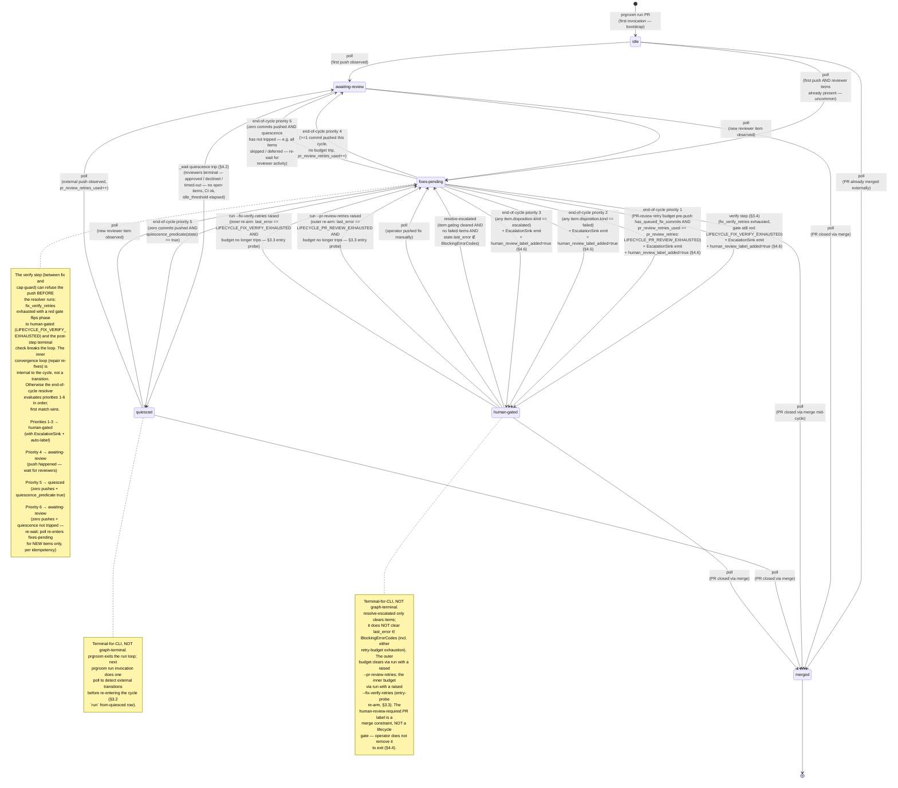
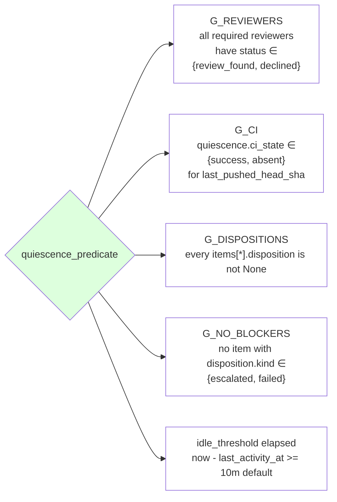

# prgroom CLI — State Machine

> **Up**: [index](index.md)
> **Previous (reading order)**: [Sequences](sequences.md)
> **Next (reading order)**: [C4 L3 — Lifecycle](c4-l3-lifecycle.md)
> **Source bead**: `agents-config-fca6.12`
> **Source design**: [design.md](design.md) — §3 (phase machine + pipeline), §4 (quiescence predicate), §7 (PR-memory routing side-effect)

> **Status**: **The `verify` step and the `pr_review_retries` / `fix_verify_retries` naming below are DESIGNED, not built.** `packages/prgroom/src/prgroom/lifecycle/run.py::_build_pipeline` is `cluster → fix → cap-guard → push → reply → resolve → rereview` — no `verify` step exists. The only built outer cap is `cap_guard` (`round >= max_rounds` → `phase=human-gated`, `last_error=LIFECYCLE_HARD_CAP_EXCEEDED`); the counter field on `PRGroomingState` is `round`, and the CLI flag is `--max-rounds` — not `pr_review_retries_used` / `--pr-review-retries`. There is no `fix_verify_retries`, `--fix-verify-retries`, `LIFECYCLE_FIX_VERIFY_EXHAUSTED`, or `LIFECYCLE_PR_REVIEW_EXHAUSTED` in the codebase today. This page documents the target reframe an implementation bead will build against — see [`c4-l3-verify.md`](c4-l3-verify.md).

## Glossary

| Term | Meaning |
|---|---|
| Phase | The single-field `PRPhase` value carried on `PRGroomingState` (§2 schema). One of: `idle`, `awaiting-review`, `fixes-pending`, `quiesced`, `human-gated`, `merged`. |
| Cycle | One pass through the lifecycle pipeline steps (`poll → cluster → fix → verify → cap-guard → push → reply → resolve → [rereview]`; `rereview` runs last, guarded) followed by either `wait` or terminal exit. `_run` (§3.3) iterates cycles. |
| End-of-cycle resolver | The function `resolve_end_of_cycle_phase` (§3.2) that, after each cycle, picks the next phase from `fixes-pending` by evaluating six conditions in strict priority order. |
| Round | The CLI-observed-push counter; bounded by the **PR-review retry budget** `pr_review_retries` (default 5 — initial push + up to 5 fix-push retries) per §3.5. |
| PR-review retry budget | The pre-push guard at §3.5: `has_queued_fix_commits(state) AND pr_review_retries_used >= pr_review_retries` → refuse push, set `phase=human-gated`, set `last_error=LIFECYCLE_PR_REVIEW_EXHAUSTED`. Bounds review-eliciting pushes across cycles. |
| `fix_verify_retries` | The inner fix↔verify retry budget (default 2 ⇒ max 3 fix spends/cycle) consumed by the convergence loop's whole-branch repair re-fixes; exhaustion (gate still red) sets `phase=human-gated`, `last_error=LIFECYCLE_FIX_VERIFY_EXHAUSTED`. See [`c4-l3-verify.md`](c4-l3-verify.md). |
| Quiescence predicate | The §4.1 boolean: all four hard gates (`G_REVIEWERS`, `G_CI`, `G_DISPOSITIONS`, `G_NO_BLOCKERS`) pass AND `now() - last_activity_at >= idle_threshold`. |
| Terminal-for-CLI | A phase where the CLI takes no further autonomous action; re-entry requires an external trigger observed by `poll`, an operator `resolve-escalated`, or — when the gate is a retry-budget exhaustion — a `run` with the relevant retry budget raised (`--pr-review-retries` for the outer cap, `--fix-verify-retries` for the inner cap; entry-probe re-arm, §3.5). `quiesced` and `human-gated` are terminal-for-CLI but NOT graph-terminal — `poll` can advance them. |
| Graph-terminal | A phase with no outgoing edges. `merged` only. |
| Blocking error codes | The closed set `{ LIFECYCLE_PR_REVIEW_EXHAUSTED, LIFECYCLE_FIX_VERIFY_EXHAUSTED, STATE_CORRUPT, STATE_SCHEMA_UNKNOWN, RUNTIME_GH_TERMINAL, RUNTIME_PUSH_REJECTED }` that `resolve-escalated` cannot clear by itself; see §3.2. |

## Purpose

The complete phase graph for one PR's grooming lifecycle. Every transition the CLI can perform, including:

- The forward happy-path edges (already visualised in [`sequences.md`](sequences.md))
- The `awaiting-review ↔ fixes-pending ↔ awaiting-review` push-and-iterate loop
- The §3.5 PR-review-retry-budget exit (`fixes-pending → human-gated`, `LIFECYCLE_PR_REVIEW_EXHAUSTED`)
- The §3.4 verify-exhaustion exit (`fixes-pending → human-gated`, `LIFECYCLE_FIX_VERIFY_EXHAUSTED`) — the `verify` step refusing the push when `fix_verify_retries` is spent and the gate is still red; see [`c4-l3-verify.md`](c4-l3-verify.md)
- The §3.2-priority-2 / -3 routes to `human-gated` (failed items, escalated items, runtime-terminal errors)
- The §4-quiescence trips into `quiesced` — from `fixes-pending` via end-of-cycle resolver priority 5, AND from `awaiting-review` via the `_wait` wake event (§4.2)
- The §4.6 human-review label addition (a side-effect on the `→ human-gated` edges, not a phase itself)
- The re-entry edges from `quiesced` and `human-gated` back into the loop (`poll` observes new activity; or, for a retry-budget-gated PR, a `run` with the relevant retry budget raised)
- The `→ merged` edges from every non-terminal phase
- Resurrection paths (operator-driven `resolve-escalated`, or the `run` retry-budget re-arm)

This is the visual companion to the design reference §3.1 (the ASCII phase graph) plus §3.2 (the phase × verb transition matrix) plus §4 (the quiescence predicate).

## Diagram

> **Diagram note**: The `verify`-triggered edge and the `pr_review_retries` / `fix_verify_retries` labels below are target-state (see Status above). The edge that exists today is the cap-guard trip: `fixes_pending --> human_gated` when `round >= max_rounds`, setting `last_error=LIFECYCLE_HARD_CAP_EXCEEDED`.

## Quiescence predicate (the gate behind `fixes-pending → quiesced`)

Two transitions reach `quiesced`, both gated by the same `quiescence_predicate(state) == true`: `fixes_pending --> quiesced` (end-of-cycle resolver, priority 5) and `awaiting_review --> quiesced` (`_wait` wake event, §4.2). The predicate is four hard gates AND the idle timer:

All five must be true (boolean AND). G_DISPOSITIONS and G_NO_BLOCKERS are sanity checks — structurally `_fix` should have dispositioned every item by the time the resolver runs, and the §3.2 priority cascade routes escalated / failed items to `human-gated` before the predicate is even evaluated. They appear in the predicate for defence-in-depth, not because they're expected to fire.

A required reviewer can reach `declined` three ways, all gate-satisfying: human explicit pass (`declined_reason="user-declined"`), `review_start_timeout` (Copilot was requested but never engaged), or `review_finish_timeout` (Copilot engaged but never produced a terminal review).

## Reverse-direction edges (the loops worth memorising)

Three classes of edge re-enter the lifecycle from non-active phases. None of them are "rewinds" — each is a real transition with full state-write semantics, just like any forward edge.

| From | To | Trigger | Notes |
|---|---|---|---|
| `quiesced` | `fixes_pending` | `poll` observes new reviewer item | Common: PR sat at quiesced, human reviewer left a final nit |
| `quiesced` | `awaiting_review` | `poll` observes external push (SHA changed) | pr_review_retries_used++; `_push`'s ReviewerState flip semantics apply (§3.4) |
| `human_gated` | `fixes_pending` | `resolve-escalated` flips item disposition AND no failed items AND `last_error ∉ BlockingErrorCodes` | Most common recovery path |
| `human_gated` | `fixes_pending` | `poll` observes operator-pushed fix | Operator resolved out-of-band |
| `human_gated` | `fixes_pending` | `run` entry probe: `last_error == LIFECYCLE_PR_REVIEW_EXHAUSTED` AND budget no longer trips (operator raised `--pr-review-retries`) | Outer re-arm; orthogonal to escalation clearance — clears the PR-review-retry-budget gate that `resolve-escalated` cannot |
| `human_gated` | `fixes_pending` | `run` entry probe: `last_error == LIFECYCLE_FIX_VERIFY_EXHAUSTED` AND budget no longer trips (operator raised `--fix-verify-retries`) | Inner re-arm; clears the fix↔verify-budget gate — see [`c4-l3-verify.md`](c4-l3-verify.md) |

## Auto-label side-effect (§4.6)

Every transition INTO `human_gated` from `fixes_pending` triggers `request_human_review_if_needed(state)` from within `_run`, which POSTs a `human-review-required` label to the PR via the gh adapter and sets `state.human_review_label_added = True`. The flag is reset on the next successful end-of-cycle resolution that writes a non-`human-gated` phase, so subsequent gates within the same lifecycle can re-add the label cleanly.

The label is a **merge constraint** consumed by future merge-gate components (`gmxo`, `td39`), NOT a lifecycle gate consumed by prgroom itself. Per §4.4, prgroom does NOT check or wait on the label; operators do not need to remove it to exit `human-gated`.

## PR-memory routing side-effect (§7.3)

Parallel to the auto-label side-effect: at `reply` time the cycle routes CONTEXTUAL fix-agent memory to the PR — thread-tied notes as thread replies, thread-less PR-wide decisions merged into the sentinel-bounded `## Decisions` block via a `gh` PATCH of the PR body (an API edit, **not** a git commit, **not** a phase change). It is idempotent (keyed by `(retry, source-item)`) and, like the auto-label, is an outward side-effect on the cycle, not a state-machine transition.

## Failure tiers and `state.last_error`

The state machine intentionally collapses the rich §3.6 failure-tier taxonomy (`PRECONDITION_*` / `RUNTIME_*` / `CONTRACT_*` / `STATE_*` / `LIFECYCLE_*`) into a single observation: *did the failure put us in `human-gated`?*

> **Table note**: The two `LIFECYCLE_CAP` rows below use target-state names (`LIFECYCLE_PR_REVIEW_EXHAUSTED`, `LIFECYCLE_FIX_VERIFY_EXHAUSTED`). The only `LIFECYCLE_CAP` code built today is `LIFECYCLE_HARD_CAP_EXCEEDED`, raised by `cap_guard` when `round >= max_rounds` (see Status above).

| Tier | Phase outcome | `state.last_error` | Note |
|---|---|---|---|
| `PRECONDITION_SELFHEAL` | unchanged | unchanged | self-healed; proceeds |
| `PRECONDITION_USER_ERROR` | unchanged | unchanged | aborts; user fixes invocation |
| `PRECONDITION_NO_WORK` | unchanged | unchanged | exit-0 success-no-op |
| `RUNTIME_TRANSIENT` | unchanged | set | scheduler retries |
| `RUNTIME_TERMINAL_USER` | → `human-gated` | set | requires operator action |
| `RUNTIME_CANCELLED` | unchanged | unchanged | signal-cancel; non-retryable |
| `CONTRACT_AUDIT_FAILED` | → `human-gated` (via priority 2) | NOT set (per-item `disposition.rationale` is the source of truth) | the run loop continues through the cycle; resolver promotes |
| `STATE_CORRUPT` | → `human-gated` | set | operator inspects state file |
| `LIFECYCLE_CAP` (`LIFECYCLE_PR_REVIEW_EXHAUSTED`) | → `human-gated` | set | outer review-retry budget spent; clears via `run` + raised `--pr-review-retries` (entry-probe re-arm, §3.5/§3.3); resolve escalations separately if the gate also carries them |
| `LIFECYCLE_CAP` (`LIFECYCLE_FIX_VERIFY_EXHAUSTED`) | → `human-gated` | set | inner fix↔verify budget spent, gate still red; clears via `run` + raised `--fix-verify-retries` (entry-probe re-arm, §3.5/§3.3); see [`c4-l3-verify.md`](c4-l3-verify.md) |

`state.last_error` clears automatically on the next successful end-of-cycle resolution that writes any phase other than `human-gated`. For a retry-budget-gated PR that success path is reached by the §3.3 entry-probe re-arm (operator raised `--pr-review-retries` for the outer budget, `--fix-verify-retries` for the inner), which re-enters the cycle; for other gates, by `poll` observing external resolution. No `clear-error` verb is needed.

## What this diagram does NOT show

- **Per-cycle mechanics inside `_run`.** How the orchestrator actually advances from one phase to the next within a cycle lives in [`sequences.md`](sequences.md) and [`c4-l3-lifecycle.md`](c4-l3-lifecycle.md).
- **Per-item disposition transitions.** Each `items[*].disposition.kind` has its own micro-state machine (`None → fixed | already_addressed | skipped | deferred | wont_fix | escalated | failed`) decided by the fix contract; not drawn here.
- **Per-reviewer status transitions.** Each `reviewers[r].status` value (`not_requested → requested → in_progress → review_found | declined`) has its own micro-state machine driven by `_poll`'s engagement detection (§4.1); not drawn here.
- **Lock contention as state.** `PRECONDITION_LOCK_HELD` (exit 75) is a transient API outcome, not a phase. A locked PR's phase is whatever the lock-holder last wrote.
- **Scheduler-side retry policy.** What the scheduler does after a `RUNTIME_TRANSIENT` (exit 75) or `RUNTIME_CANCELLED` (exit 130/143) exit lives outside the state machine — see the design reference §3.6.

## Cross-references

- **Companion sequence**: [`sequences.md`](sequences.md) — runtime ordering of these transitions across four canonical flows
- **Companion structure**: [`c4-l3-lifecycle.md`](c4-l3-lifecycle.md) — components inside the package that execute transitions
- **Companion data**: [`data-view.md`](data-view.md) — where the phase, pr_review_retries_used counter, reviewer state, and quiescence state live in `PRGroomingState`
- **Source design**: [§3.1 Phase state graph](design.md), [§3.2 Phase × verb transition matrix](design.md), [§3.5 The two retry caps](design.md), [§4 Quiescence model](design.md)
- **fix↔verify subsystem**: [design.md](design.md) §6 (the verify gate) + §3.4–§3.5 (the convergence loop + the two retry caps); [c4-l3-verify.md](c4-l3-verify.md) is the fix↔verify L3 component view
