# prgroom CLI — State Machine

> **Up**: [index](index.md)
> **Previous (reading order)**: [Sequences](sequences.md)
> **Next (reading order)**: [C4 L3 — Lifecycle](c4-l3-lifecycle.md)
> **Source bead**: `agents-config-fca6.12`
> **Source spec**: [`docs/plans/2026-05-12-prgroom-cli-design.md`](../../plans/2026-05-12-prgroom-cli-design.md) — Section 3 (phase machine) + Section 4 (quiescence predicate)

## Glossary

| Term | Meaning |
|---|---|
| Phase | The single-field `PRPhase` value carried on `PRGroomingState` (§2 schema). One of: `idle`, `awaiting-review`, `fixes-pending`, `quiesced`, `human-gated`, `merged`. |
| Cycle | One pass through the lifecycle verbs (`poll → cluster → fix → push → [rereview] → reply → resolve`) followed by either `wait` or terminal exit. `runLocked` (§3.3) iterates cycles. |
| End-of-cycle resolver | The function `resolve_end_of_cycle_phase` (§3.2) that, after each cycle, picks the next phase from `fixes-pending` by evaluating six conditions in strict priority order. |
| Round | The CLI-observed-push counter; bounded by `MaxRounds` (default 3) per §3.5. |
| Hard cap | The pre-push guard at §3.5: `has_queued_fix_commits(state) AND Round >= MaxRounds` → refuse push, set `Phase=human-gated`, set `LastError=LIFECYCLE_HARD_CAP_EXCEEDED`. |
| Quiescence predicate | The §4.1 boolean: all four hard gates (`G_REVIEWERS`, `G_CI`, `G_DISPOSITIONS`, `G_NO_BLOCKERS`) pass AND `now() - LastActivityAt >= idle_threshold`. |
| Terminal-for-CLI | A phase where the CLI takes no further autonomous action; re-entry requires an external trigger observed by `poll`, or an operator `resolve-escalated`. `quiesced` and `human-gated` are terminal-for-CLI but NOT graph-terminal — `poll` can advance them. |
| Graph-terminal | A phase with no outgoing edges. `merged` only. |
| Blocking error codes | The closed set `{ LIFECYCLE_HARD_CAP_EXCEEDED, STATE_CORRUPT, STATE_SCHEMA_UNKNOWN, RUNTIME_GH_TERMINAL, RUNTIME_PUSH_REJECTED }` that `resolve-escalated` cannot clear by itself; see §3.2. |

## Purpose

The complete phase graph for one PR's grooming lifecycle. Every transition the CLI can perform, including:

- The forward happy-path edges (already visualised in [`sequences.md`](sequences.md))
- The `awaiting-review ↔ fixes-pending ↔ awaiting-review` push-and-iterate loop
- The §3.5 hard-cap exit (`fixes-pending → human-gated`)
- The §3.2-priority-2 / -3 routes to `human-gated` (failed items, escalated items, runtime-terminal errors)
- The §4-quiescence trip (`fixes-pending → quiesced` via end-of-cycle resolver priority 5)
- The §4.7 human-review label addition (a side-effect on the `→ human-gated` edges, not a phase itself)
- The re-entry edges from `quiesced` and `human-gated` back into the loop (`poll` observes new activity)
- The `→ merged` edges from every non-terminal phase
- Resurrection paths (operator-driven `resolve-escalated`)

This is the visual companion to source spec §3.1 (the ASCII phase graph) plus §3.2 (the phase × verb transition matrix) plus §4 (the quiescence predicate).

## Diagram

```mermaid
stateDiagram-v2
    direction TB

    state "awaiting-review" as awaiting_review
    state "fixes-pending" as fixes_pending
    state "human-gated" as human_gated

    [*] --> idle : prgroom run <pr><br/>(first invocation; bootstrap)

    idle --> awaiting_review : poll<br/>(first push observed)
    idle --> fixes_pending : poll<br/>(first push AND reviewer items<br/>already present — uncommon)
    idle --> merged : poll<br/>(PR already merged externally)

    awaiting_review --> fixes_pending : poll<br/>(new reviewer item observed)
    awaiting_review --> merged : poll<br/>(PR closed via merge)

    fixes_pending --> awaiting_review : end-of-cycle priority 4<br/>(>=1 commit pushed this cycle,<br/>no cap trip, Round++)
    fixes_pending --> quiesced : end-of-cycle priority 5<br/>(zero commits pushed AND<br/>quiescencePredicate(state) == true)
    fixes_pending --> fixes_pending : end-of-cycle priority 6<br/>(zero commits pushed AND<br/>quiescence has not tripped —<br/>e.g., all items skipped / deferred)
    fixes_pending --> human_gated : end-of-cycle priority 1<br/>(hard cap pre-push:<br/>has_queued_fix_commits AND<br/>Round >= MaxRounds)<br/>+ EscalationSink emit<br/>+ HumanReviewLabelAdded=true (§4.7)
    fixes_pending --> human_gated : end-of-cycle priority 2<br/>(any item.Disposition.Kind == failed)<br/>+ EscalationSink emit<br/>+ HumanReviewLabelAdded=true (§4.7)
    fixes_pending --> human_gated : end-of-cycle priority 3<br/>(any item.Disposition.Kind == escalated)<br/>+ EscalationSink emit<br/>+ HumanReviewLabelAdded=true (§4.7)
    fixes_pending --> merged : poll<br/>(PR closed via merge mid-cycle)

    quiesced --> fixes_pending : poll<br/>(new reviewer item observed)
    quiesced --> awaiting_review : poll<br/>(external push observed,<br/>Round++)
    quiesced --> merged : poll<br/>(PR closed via merge)

    human_gated --> fixes_pending : resolve-escalated<br/>(item gating cleared AND<br/>no failed items AND<br/>state.LastError ∉ BlockingErrorCodes)
    human_gated --> fixes_pending : poll<br/>(operator pushed fix manually)
    human_gated --> merged : poll<br/>(PR closed via merge)

    merged --> [*]

    note right of fixes_pending
        End-of-cycle resolver evaluates
        priorities 1-6 in order; first match wins.

        Priorities 1-3 → human-gated
        (with EscalationSink + auto-label)

        Priority 4 → awaiting-review
        (push happened — wait for reviewers)

        Priority 5 → quiesced
        (zero pushes + quiescencePredicate true)

        Priority 6 → fixes-pending (stay)
        (zero pushes + quiescence not tripped)
    end note

    note right of quiesced
        Terminal-for-CLI, NOT graph-terminal.
        prgroom exits the run loop; next
        prgroom run invocation does one
        poll to detect external transitions
        before re-entering the cycle (§3.2
        `run` from-quiesced row).
    end note

    note right of human_gated
        Terminal-for-CLI, NOT graph-terminal.
        resolve-escalated only clears items;
        it does NOT clear LastError ∈
        BlockingErrorCodes. The
        human-review-required PR label is a
        merge constraint, NOT a lifecycle
        gate — operator does not remove it
        to exit (§4.4).
    end note
```



## Quiescence predicate (the gate behind `fixes-pending → quiesced`)

The single transition `fixes_pending --> quiesced` (priority 5) fires when `quiescencePredicate(state) == true`. The predicate is four hard gates AND the idle timer:

```mermaid
flowchart LR
    Q{quiescencePredicate}
    G1[G_REVIEWERS<br/>all Required reviewers<br/>have Status ∈<br/>{review_found, declined}]
    G2[G_CI<br/>Quiescence.CIState ∈<br/>{success, absent}<br/>for LastPushedHeadSHA]
    G3[G_DISPOSITIONS<br/>every Items[*].Disposition != nil]
    G4[G_NO_BLOCKERS<br/>no item with Disposition.Kind ∈<br/>{escalated, failed}]
    G5[idle_threshold elapsed<br/>now - LastActivityAt >= 10m default]

    Q --> G1
    Q --> G2
    Q --> G3
    Q --> G4
    Q --> G5

    style Q fill:#ddffdd
    style G1 fill:#fff
    style G2 fill:#fff
    style G3 fill:#fff
    style G4 fill:#fff
    style G5 fill:#fff
```

All five must be true (boolean AND). G_DISPOSITIONS and G_NO_BLOCKERS are sanity checks — structurally `fixLocked` should have dispositioned every item by the time the resolver runs, and the §3.2 priority cascade routes escalated / failed items to `human-gated` before the predicate is even evaluated. They appear in the predicate for defence-in-depth, not because they're expected to fire.

A Required reviewer can reach `declined` three ways, all gate-satisfying: human explicit pass (`DeclinedReason="user-declined"`), `review_start_timeout` (Copilot was requested but never engaged), or `review_finish_timeout` (Copilot engaged but never produced a terminal review).

## Reverse-direction edges (the loops worth memorising)

Three classes of edge re-enter the lifecycle from non-active phases. None of them are "rewinds" — each is a real transition with full state-write semantics, just like any forward edge.

| From | To | Trigger | Notes |
|---|---|---|---|
| `quiesced` | `fixes_pending` | `poll` observes new reviewer item | Common: PR sat at quiesced, human reviewer left a final nit |
| `quiesced` | `awaiting_review` | `poll` observes external push (SHA changed) | Round++; `pushLocked`'s ReviewerState flip semantics apply (§3.4) |
| `human_gated` | `fixes_pending` | `resolve-escalated` flips item disposition AND no failed items AND `LastError ∉ BlockingErrorCodes` | Most common recovery path |
| `human_gated` | `fixes_pending` | `poll` observes operator-pushed fix | Operator resolved out-of-band |

## Auto-label side-effect (§4.7)

Every transition INTO `human_gated` from `fixes_pending` triggers `request_human_review_if_needed(state)` from within `runLocked`, which POSTs a `human-review-required` label to the PR via the gh API and sets `state.HumanReviewLabelAdded = true`. The flag is reset on the next successful end-of-cycle resolution that writes a non-`human-gated` phase, so subsequent gates within the same lifecycle can re-add the label cleanly.

The label is a **merge constraint** consumed by future merge-gate components (`gmxo`, `td39`), NOT a lifecycle gate consumed by prgroom itself. Per §4.4, prgroom does NOT check or wait on the label; operators do not need to remove it to exit `human-gated`.

## Failure tiers and `state.LastError`

The state machine intentionally collapses the rich §3.6 failure-tier taxonomy (`PRECONDITION_*` / `RUNTIME_*` / `CONTRACT_*` / `STATE_*` / `LIFECYCLE_*`) into a single observation: *did the failure put us in `human-gated`?*

| Tier | Phase outcome | `state.LastError` | Note |
|---|---|---|---|
| `PRECONDITION_SELFHEAL` | unchanged | unchanged | self-healed; proceeds |
| `PRECONDITION_USER_ERROR` | unchanged | unchanged | aborts; user fixes invocation |
| `PRECONDITION_NO_WORK` | unchanged | unchanged | exit-0 success-no-op |
| `RUNTIME_TRANSIENT` | unchanged | set | scheduler retries |
| `RUNTIME_TERMINAL_USER` | → `human-gated` | set | requires operator action |
| `RUNTIME_CANCELLED` | unchanged | unchanged | signal-cancel; non-retryable |
| `CONTRACT_AUDIT_FAILED` | → `human-gated` (via priority 2) | NOT set (per-item `Disposition.Rationale` is the source of truth) | the run loop continues through the cycle; resolver promotes |
| `STATE_CORRUPT` | → `human-gated` | set | operator inspects state file |
| `LIFECYCLE_CAP` | → `human-gated` | set | resolve outstanding escalations OR raise cap |

`state.LastError` clears automatically on the next successful end-of-cycle resolution that writes any phase other than `human-gated`. No `clear-error` verb is needed.

## Pending rework (fca6.11)

The phase graph above reflects the current blocking-model spec (§3 as ratified). fca6.11 is open to rework §3.3 (the `run` aggregate) and §4.2 (`waitLocked`) toward a tick-based model where each tick = one cycle and the lock is held briefly per tick. The phase graph itself is unaffected by that rework — the 6 phases stay, the edges stay, the priorities stay. What changes is whether `runLocked` chains cycles inside one process invocation (current spec) or whether the scheduler drives one cycle per tick (proposed). When fca6.11 lands, this artifact's edges remain valid; only the "where the lock lives" annotation changes.

## What this diagram does NOT show

- **Per-cycle mechanics inside `runLocked`.** How the orchestrator actually advances from one phase to the next within a cycle lives in [`sequences.md`](sequences.md) and [`c4-l3-lifecycle.md`](c4-l3-lifecycle.md).
- **Per-item disposition transitions.** Each `Items[*].Disposition.Kind` has its own micro-state machine (`nil → fixed | already_addressed | skipped | deferred | wont_fix | escalated | failed`) decided by Contract B; not drawn here.
- **Per-reviewer Status transitions.** Each `Reviewers[r].Status` value (`not_requested → requested → in_progress → review_found | declined`) has its own micro-state machine driven by `pollLocked`'s engagement detection (§4.1); not drawn here.
- **Lock contention as state.** `PRECONDITION_LOCK_HELD` (exit 75) is a transient API outcome, not a phase. A locked PR's phase is whatever the lock-holder last wrote.
- **Scheduler-side retry policy.** What the scheduler does after a `RUNTIME_TRANSIENT` (exit 75) or `RUNTIME_CANCELLED` (exit 130/143) exit lives outside the state machine — see source spec §3.6.

## Cross-references

- **Companion sequence**: [`sequences.md`](sequences.md) — runtime ordering of these transitions across four canonical flows
- **Companion structure**: [`c4-l3-lifecycle.md`](c4-l3-lifecycle.md) — components inside the binary that execute transitions
- **Companion data**: [`data-view.md`](data-view.md) — where the phase, Round counter, reviewer state, and quiescence state live in `PRGroomingState`
- **Source spec**: [Section 3.1 Phase state graph](../../plans/2026-05-12-prgroom-cli-design.md), [Section 3.2 Phase × verb transition matrix](../../plans/2026-05-12-prgroom-cli-design.md), [Section 3.5 Hard-cap behavior](../../plans/2026-05-12-prgroom-cli-design.md), [Section 4 Quiescence model](../../plans/2026-05-12-prgroom-cli-design.md)
