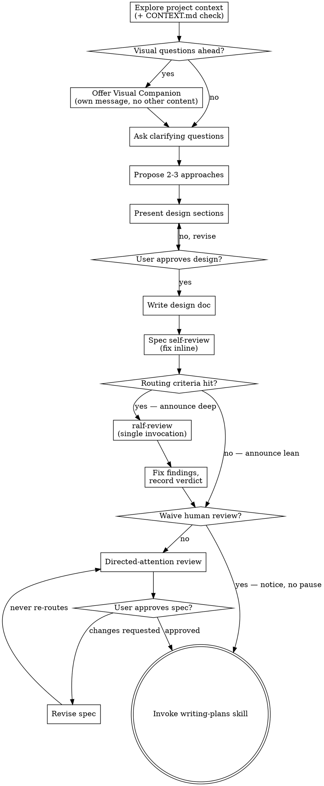

# Brainstorm-Pipeline Streamlining Implementation Plan

> **For agentic workers:** Implement this plan task-by-task; dispatch one fresh
> subagent per task. This is a prose-only change to skill bodies — the
> `test-driven-development` cycle does not apply; each task instead ends with
> mechanical verification steps (exact grep commands with expected output) and a
> commit. Steps use checkbox (`- [ ]`) syntax for tracking.

**Goal:** Land the interim brainstorm-pipeline streamlining (review-depth routing, attention-gate waiver, glossary-discipline trigger, single-pause execution handoff) in the three shared skill bodies, per `docs/specs/2026-07-11-brainstorm-pipeline-streamlining.md` (bead `agents-config-r14bn`).

**Architecture:** Prose edits only, confined to `src/user/.agents/skills/{brainstorming,writing-plans,grill-with-docs}/SKILL.md`. The deep-review engine stays the `ralf-review` skill invoked by name. Shipped prose carries no repo paths and no tracker IDs, and every harness-dependent feature is capability-conditional (spec §5).

**Tech Stack:** Markdown skill bodies; graphviz dot for the process digraph; bash smoke-test gate (unchanged, run as regression evidence).

---

### Task 1: brainstorming SKILL.md — checklist, digraph, glossary trigger, routing + attention gate

**Files:**
- Modify: `src/user/.agents/skills/brainstorming/SKILL.md`

- [ ] **Step 1: Replace checklist items** (section `## Checklist`). Replace item 1, replace item 8, renumber the tail. The full new list:

```markdown
1. **Explore project context** — check files, docs, recent commits; check for `CONTEXT.md` / `CONTEXT-MAP.md` and, if present, activate the glossary discipline (see The Process below)
2. **Offer visual companion** (if topic will involve visual questions) — this is its own message, not combined with a clarifying question. See the Visual Companion section below.
3. **Ask clarifying questions** — one at a time, understand purpose/constraints/success criteria
4. **Propose 2-3 approaches** — with trade-offs and your recommendation
5. **Present design** — in sections scaled to their complexity, get user approval after each section
6. **Write design doc** — save to `docs/superpowers/specs/YYYY-MM-DD-<topic>-design.md` and commit
7. **Spec self-review** — quick inline check for placeholders, contradictions, ambiguity, scope (see below)
8. **Review-depth routing** — assess the spec against the routing criteria; announce lean or deep; deep runs `ralf-review` once and fixes findings (see below)
9. **Attention routing** — decide whether the user's review is needed: waive with a notice, or direct their attention to specific sections (see below)
10. **Transition to implementation** — invoke writing-plans skill to create implementation plan
```

- [ ] **Step 2: Replace the process-flow digraph** (section `## Process Flow`, the full ```dot block). New block:



- [ ] **Step 3: Add the glossary-discipline bullets** to `## The Process` → `**Understanding the idea:**`, immediately after the first bullet ("Check out the current project state first (files, docs, recent commits)"):

```markdown
- Check for `CONTEXT.md` (or `CONTEXT-MAP.md` in multi-context repos). When present,
  announce it ("`CONTEXT.md` found — glossary discipline active") and adopt the
  grill-with-docs skill's glossary discipline inline for the rest of the brainstorm:
  challenge the user's terms against the glossary, propose precise canonical terms
  for fuzzy language, and update `CONTEXT.md` as terms resolve — glossary entries
  only, no implementation details, per the glossary format that travels with the
  grill-with-docs skill. Do not adopt grill-with-docs' ADR-offering step.
- When no `CONTEXT.md` exists but the design coins load-bearing domain terms, offer
  once — at spec-write time, folded into the attention-routing message, never as its
  own blocking question — to start a `CONTEXT.md` per grill-with-docs. The offer
  lapses if not taken up and does not repeat.
```

- [ ] **Step 4: Replace the `**User Review Gate:**` block** (in `## After the Design`, between `**Spec Self-Review:**` and `**Implementation:**` — the paragraph, the quoted "Spec written and committed…" message, and the "Wait for the user's response…" paragraph) with:

```markdown
**Review-Depth Routing:**
After the spec self-review, assess the written spec against these routing criteria:

- multiple interacting components or subsystems;
- new or materially changed public contracts (APIs, schemas, file formats, skill
  or workflow contracts other agents rely on);
- security- or auth-adjacent surface;
- data migration or other hard-to-reverse operations;
- novel domain concepts introduced by this design;
- a genuinely balanced trade-off resolved by judgment during the brainstorm.

No criterion hit → announce `Review routing: lean (no criteria hit)` and continue
to Attention Routing.

Any criterion hit → announce `Review routing: deep (criteria: <names>)` and invoke
the `ralf-review` skill **exactly once**: target = the spec file; review criteria =
the design's stated goals plus its acceptance criteria (goals-only when the spec
carries none); cycle cap = that skill's default. Fix what the findings allow
inline, but the recorded verdict is final: inline fixes improve the artifact the
user receives — they never upgrade the verdict, and ralf-review is never re-invoked
to earn a better score. Attention Routing reads the recorded verdict (its Score
only; the report's recommended-action field stays advisory).

Where the harness cannot dispatch an independent reviewer (no subagent or
agent-dispatch primitive), the deep route is unavailable: criteria-hit specs go
straight to directed-attention review — the gate below fails closed.

**Attention Routing:**
Decide whether the user's review of the written spec is needed. The conversational
design-approval gate above (the HARD-GATE enforcement point) is untouched — only
this post-write review stop is waivable. Waive it only when ALL of:

- **(a) Review outcome clean** — deep review was either not warranted (lean route)
  or ended in a recorded `PASS`. Any other verdict parks for the user, with the
  verdict and residual concerns attached.
- **(b) No divergence** — nothing in the written spec goes beyond what the user
  approved conversationally: no post-approval design changes, and no material
  assumptions or trade-offs the user has not seen (however the project marks them).
- **(c) Frontier-tier session** — the session model is frontier-tier: currently
  Claude Opus or above (Opus 4.x, Fable/Mythos 5) or an equivalent top-tier foreign
  model. Read the tier from the runtime's declared model identity (the harness
  states the powering model in the session context); if no identity is declared,
  this condition fails. This is a qualification check on whatever model the user
  already chose — never an instruction to select or escalate to a premium model.

When unsure about any condition, do not waive. Announce the decision both ways:

- **Waived:** post a compact notice — a one-paragraph summary of what the spec
  commits to, plus "if you look anywhere, look at <section>" pointing at the least
  conventional decision — then proceed directly to the writing-plans transition.
  No question, no pause.
- **Not waived:** post a directed-attention request — 2–5 bullets, each naming a
  specific section, why it may surprise the user or carry risk, and what judgment
  is being asked of them. Never a bare "please review."

User-directed revisions do not re-enter deep review: when the user requests changes
at a directed-attention stop, revise and return to the same attention stop — the
user is engaged, and approving their own requested changes is the review. The user
can always direct another deep review explicitly.
```

- [ ] **Step 5: Verify structure and portability**

Run: `grep -c "User Review Gate" src/user/.agents/skills/brainstorming/SKILL.md`
Expected: `0`

Run: `grep -c "Review routing:" src/user/.agents/skills/brainstorming/SKILL.md`
Expected: `2` (lean + deep announce lines)

Run: `grep -c "Routing criteria hit?" src/user/.agents/skills/brainstorming/SKILL.md`
Expected: `3` (node declaration + two edges)

Run: `grep -nE "vaac|owqa|qn0g|abn9|r14bn|src/user/|agents-config" src/user/.agents/skills/brainstorming/SKILL.md`
Expected: no output (no tracker IDs or repo paths in shipped prose)

- [ ] **Step 6: Commit**

```bash
git add src/user/.agents/skills/brainstorming/SKILL.md
git commit -m "feat(brainstorming): review-depth routing, attention-gate waiver, glossary-discipline trigger"
```

---

### Task 2: writing-plans SKILL.md — plan review gate + execution-handoff replacement

**Files:**
- Modify: `src/user/.agents/skills/writing-plans/SKILL.md`

- [ ] **Step 1: Insert a `## Plan Review Gate` section** between `## Self-Review` and `## Execution Handoff`:

```markdown
## Plan Review Gate

After the plan self-review, run the same two-step gate the brainstorming skill
defines for specs, flavored for plans.

**Routing criteria:** the plan deviates from the spec; scope was discovered during
planning that the spec does not cover; the plan contains irreversible or migration
steps; the task graph is large or has subtle ordering constraints. No criterion
hit → announce `Review routing: lean (no criteria hit)`. Any hit → announce
`Review routing: deep (criteria: <names>)` and invoke the `ralf-review` skill
**exactly once** — target = the plan file; review criteria = coverage of the spec
plus this skill's quality bar (no placeholders, type consistency, exact paths);
cycle cap = that skill's default. Fix findings inline; the recorded verdict is
final and is never re-earned by re-invocation. Where the harness cannot dispatch
an independent reviewer, the deep route is unavailable and the gate fails closed.

**Attention routing:** apply the brainstorming skill's Attention Routing verbatim
to the plan — waiver conditions (a) recorded outcome clean, (b) no divergence from
the spec and the approved design, (c) frontier-tier session per the declaration in
the brainstorming skill's Attention Routing section (a deliberate cross-skill
read; both skills deploy together). A plan that silently absorbed a surprising
change never auto-proceeds. Waived or approved → Execution Handoff. Changes
requested → revise the plan and return to the attention stop, never back through
routing.
```

- [ ] **Step 2: Replace the entire `## Execution Handoff` section** (heading through end of file, including the "Which approach?" block and both `**If … chosen:**` branches) with:

```markdown
## Execution Handoff

Do not ask which execution approach to use. State a recommendation with one line
of reasoning:

- **Subagent-driven per-task dispatch** — the default where the harness supports
  independent dispatch: one fresh subagent per task, each receiving the task,
  required context, and instructions to use the `test-driven-development` skill;
  review output between tasks.
- **Workflow-orchestrated execution** — where the harness additionally supports
  workflow orchestration and the task graph is large or parallelizable.
- **Inline execution** — sequential in-session with per-task checkpoints
  (`test-driven-development` red → green → refactor → commit per task); for
  trivially small plans, and the degraded default on runtimes without independent
  dispatch.

Then recommend a clean-context start — compact the session or begin a fresh one,
so execution starts free of planning residue — and emit a copyable kickoff prompt
filled with the session's actual artifact locations (project conventions override
shipped defaults), varying the body with the recommended mode. Subagent-mode
template:

> Execute the implementation plan at `<plan-file path>` (spec: `<spec-file path>`).
> Work on a feature branch in an isolated worktree. Dispatch one fresh subagent
> per task; each task follows the test-driven-development skill. Start at Task 1.

This is the pipeline's single terminal pause: everything is pre-decided, and the
prompt exists to be handed to the user, who chooses when and where to clear
context and start execution.
```

- [ ] **Step 3: Verify structure and portability**

Run: `grep -c "Which approach?" src/user/.agents/skills/writing-plans/SKILL.md`
Expected: `0`

Run: `grep -c "If Subagent-Driven chosen\|If Inline Execution chosen" src/user/.agents/skills/writing-plans/SKILL.md`
Expected: `0`

Run: `grep -c "## Plan Review Gate" src/user/.agents/skills/writing-plans/SKILL.md`
Expected: `1`

Run: `grep -nE "vaac|owqa|qn0g|abn9|r14bn|src/user/|agents-config" src/user/.agents/skills/writing-plans/SKILL.md`
Expected: no output

- [ ] **Step 4: Commit**

```bash
git add src/user/.agents/skills/writing-plans/SKILL.md
git commit -m "feat(writing-plans): plan review gate + recommendation-style execution handoff with kickoff prompt"
```

---

### Task 3: grill-with-docs SKILL.md — cross-reference line

**Files:**
- Modify: `src/user/.agents/skills/grill-with-docs/SKILL.md`

- [ ] **Step 1: Insert a cross-reference note** immediately after the `<supporting-info>` opening tag (before `## Domain awareness`):

```markdown
Note: the brainstorming skill adopts this skill's glossary discipline inline
(challenge terms, sharpen language, update `CONTEXT.md`) whenever a `CONTEXT.md`
exists at brainstorm time. grill-with-docs remains the standalone deep session for
stress-testing an existing plan.
```

- [ ] **Step 2: Verify**

Run: `grep -c "brainstorming skill adopts" src/user/.agents/skills/grill-with-docs/SKILL.md`
Expected: `1`

- [ ] **Step 3: Commit**

```bash
git add src/user/.agents/skills/grill-with-docs/SKILL.md
git commit -m "docs(grill-with-docs): cross-reference the brainstorming glossary-discipline trigger"
```

---

### Task 4: Regression evidence

**Files:** none modified.

- [ ] **Step 1: Run the repo smoke-test gate** (from the worktree root; helper scripts are untouched, so this is regression evidence):

Run: `find src/user/.agents/skills src/user/.claude/hooks -name '*_test.sh' -print0 | sort -z | xargs -0 -I{} sh -c 'echo "[TEST] $1"; bash "$1" || exit 1' _ {}`
Expected: every `[TEST]` line followed by pass output; exit code 0.

- [ ] **Step 2: Cross-file consistency check** — the checklist, digraph, and prose must agree (spec §9 AC7):

Run: `grep -c "Attention Routing" src/user/.agents/skills/brainstorming/SKILL.md`
Expected: `≥ 3` (checklist reference, prose heading, writing-plans-facing declaration text lives here)

Run: `grep -c "Attention Routing" src/user/.agents/skills/writing-plans/SKILL.md`
Expected: `≥ 1` (the cross-skill citation)
