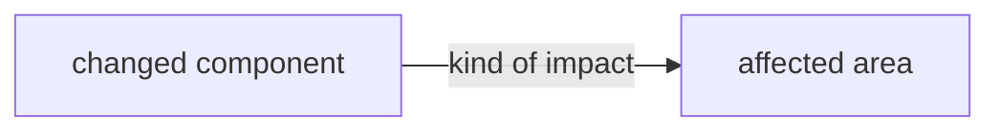
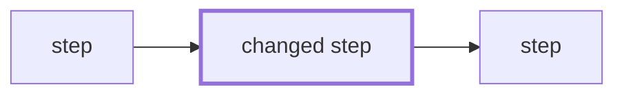

# Change-record templates, round 2

Date: 2026-10-10. Status: proposal. Supersedes the shape in `docs/reference/2026-10-08-change-record-proposal-r1.md` (round 1). The diagnosis and external survey there still stand and are not repeated.

The companion mock is `docs/reference/2026-10-10-change-record-mock-r2.html`. It renders PRs #846, #843, #839 and #838 in this shape, with #843 carrying a full review-campaign record.

## What changed since round 1, and why

| Owner feedback | Change in this round |
| --- | --- |
| The prose still reads like a model wrote it. | A writing rule block, below, written as checks a reader can apply. The examples were rewritten to it. The test is: would a release note for a competent stranger say it this way? |
| Risk should be a table. "Mitigation" was cryptic. "Rollback" did not help. | Risk is a four-column table: what could go wrong, who or what is exposed, how we know it did not, what to do if it did. Recovery replaces rollback and is written only when it is more than a revert. The diagrams move into an expandable detail under the table. |
| A PATH workaround sat inside Verification as if it were a check. Confidence-eroding facts need their own place, high up. | A **Heads-up** section directly under the summary. It lists anything that should lower a reader's confidence: environment workarounds, a review that judged an earlier head, evidence that lives off-repo, an attestation that is not a human review. "None." is allowed and must be written. |
| The review campaign needs a table: which reviewers ran, how many rounds, findings and fixes. And an expandable list of every finding with its disposition, reason and fix commit. | Verification gains a campaign table (reviewer × round) and a per-round findings detail with id, plain-words summary, disposition, reason and commit. The data comes from the posted verdicts and the author's replies, both of which already carry it. |
| The other agent's executive summary was concise. Each section could carry an expandable detail. | Every above-the-fold section may carry one `<details>` block. Where this fits expands to a scope breakdown of the owning item: done before, this PR, remaining. Risk expands to the blast-radius diagrams. Changes expands to design reasoning. |
| Show the blast radius as diagrams: architecture reach, and impact on product or user task flows. | Two diagrams in the Risk detail, as fenced Mermaid blocks, which GitHub renders in a PR body with no tooling. One is a reach graph from the changed component outward, with each edge labelled by what kind of impact. The other is the affected task flow with the changed steps marked. |
| "Sources at the PR's final head" is redundant with the changed-files list. | Dropped. Evidence cites a test name, a measurement or a review id, never a file list. |
| The other agent's commit message is good, but put the work item at the top under the title. | Adopted the Why / Change / Verification body. The work item appears twice, once for each reader. The first body line is a plain sentence naming it with a gloss, for the human. A `Work-item:` trailer in the last paragraph carries the id for git, because `git interpret-trailers` reads only the last paragraph. The tracker id also stays in the title, inside brackets at the end, so a one-line log still shows it. The squash commit uses this message, not the PR body. |
| The other agent's reply format is good. | Adopted: Outcome / Change / Verification, three lines. Outcomes are Fixed, Superseded, Rejected, Deferred. |

Kept from round 1, because the owner said so: the work item id in the title; the ancestry tree with prior and concurrent PRs; topical Changes; Discovered work including unfiled and parallel work; the Criteria table.

Dropped from round 1: making the PR body the squash commit body. The other agent's objection holds. A PR body now carries tables, folds and a bot-owned Decisions block, none of which belong in `git log`. The squash setting becomes `PR_TITLE` and `BLANK`, and the merge supplies the compact commit message from the PR's own fold through `gh pr merge --body-file`.

## Writing rules

These are checks, not advice. Apply them to the summary, Heads-up, Risk and Changes. Below the fold, apply the first four.

1. **A stranger can read it.** The reader knows software and has never seen this repository. Every work item, criterion, decision, section and PR number carries a gloss in parentheses on first use. Every house term is defined in the sentence that first uses it, or replaced with a common word. "Lens" becomes "reviewer". "Dead run" becomes "a run that dies mid-reasoning". "Seat" becomes "reviewer slot".
2. **Problem, then change, then what remains.** The summary opens with the problem a user or agent had. The second sentence says what is true now. The last says what is still open. No history of how the text got here.
3. **One clause per sentence.** No sentence carries a subordinate "which" or "that" clause longer than five words. Split it.
4. **Say the number, then what it means.** "27 of 27 scenario answers matched the key" is a number. Follow it with the meaning: "a reader given only the doctrine files reaches the right dispatch every time".
5. **Verbs do the work.** "The gate refuses", "the emitter writes", "the test fails without the change". Not "there is a refusal when".
6. **No commentary about the document.** Nothing says "this section describes". Nothing says "note that".
7. **A caveat is a Heads-up row, not a clause.** If a sentence wants a "but" or an "although", the second half is a Heads-up row.

## The PR body

```markdown
<Summary, no heading. Problem, then what is true now, then what remains.
Three to five sentences. Every id glossed.>

## Heads-up
- <Anything that should lower a reader's confidence. One sentence each.>
- None.    ← write this when there is nothing

## Where this fits
agents-config-9k9        Harness rework (milestone)
└ agents-config-9k9.408  review-panel routing pins (owning item)
    this PR: slice A of three
Builds on: #803 (the model routing table). Concurrent: #777 (edits the same skill file), #774 (the next slice).
<details><summary>Scope of the owning item</summary>

| Slice | What it covers | Status |
| --- | --- | --- |
| A | ... | this PR |
| B | ... | not started |
| C | ... | #774, open |
</details>

## Risk
| What could go wrong | Who or what is exposed | How we know it did not | What to do if it did |
| --- | --- | --- | --- |
| <failure, in plain words> | <users, agents, projects, data> | <test, measurement, review> | <recovery if more than a revert; else "Revert."> |
<details><summary>Blast radius</summary>




</details>

## Changes
- **<Topic>.** <What is different now, in words.>
<details><summary>Design notes</summary>
<Why this approach. Rejected alternatives and why.>
</details>

## Discovered work
| Item | Status | What it is | Why not in this PR |
| --- | --- | --- | --- |
| agents-config-9k9.470 | filed | <gloss> | <reason> |
| not filed | — | <what was noticed> | <reason it was not filed> |
| #777 | in flight, informed | <what this PR told that PR> | <the other PR owns it> |

---

## Verification
- `make ci`: exit 0, run standalone from the worktree root at <head sha>.
- Not run: <what, and why>. ("None.")

### Review campaign
| Reviewer | Rounds | Findings | Fixed | Rejected | Deferred |
| --- | --- | --- | --- | --- | --- |
| correctness (Codex, frontier) | 1–4 | 3 | 3 | 0 | 0 |
Terminal-clean at <sha>. Approval is a machine attestation of that head.
<details><summary>Findings by round</summary>

| Round | Id | Finding, in plain words | Disposition | Reason | Commit |
| --- | --- | --- | --- | --- | --- |
</details>

## Criteria
| Criterion | What it promises | Evidence |
| --- | --- | --- |

<details><summary>Proposed commit message</summary>

```text
<the commit message, exactly as the merge will use it>
```
</details>

<!-- prgroom:decisions:start --> … <!-- prgroom:decisions:end -->   (bot-owned, never authored)

🤖 Generated with Claude Code · <session url>
```

Variants by commit type:

| Type | Heads-up | Risk | Where this fits detail | Discovered work | Review campaign | Criteria |
| --- | --- | --- | --- | --- | --- | --- |
| `feat`, `fix`, `refactor`, `perf`, `test` | required | table required; diagrams when the change reaches outside its own package | when the owning item has more than one slice | required | when a round ran; otherwise a Heads-up row says none ran | required |
| `spec` | required | table required; blast radius is the items the spec will mint | required | required | when a round ran | one line: attacked or not, and the record |
| `docs`, `chore` (prose) | required | one row | optional | optional | when a round ran | omitted |
| Dependabot and release bots | untouched | | | | | |

Rules for the sections:

- **Heads-up** comes before context on purpose. A reader who stops after the summary still sees what weakens it.
- **Where this fits** is generated, not written. The tree comes from walking `work show` up the parent field. Prior and concurrent PRs come from the PR body's own references and from `gh pr list` on the same paths. The scope table comes from the owning item's acceptance field and its children. The agent writes only the one line naming which slice this is.
- **Risk** rows describe failures a user or agent would notice, not code paths. "How we know" names a specific check and what it showed. "What to do" is "Revert." unless a revert leaves something behind, such as a ledger entry or a spec amendment.
- **Discovered work** has three row kinds: filed (with the item id), not filed (with the reason), and in flight (another PR this one informed, and how). The third kind is where parallel agents' coordination becomes visible.
- **Verification** names a gate, its exit status and where it ran. The campaign table has one row per reviewer that ran. The findings detail has one row per finding across every round, with its disposition and the commit that answered it.
- **Criteria** restates each criterion in plain words. The evidence column names a test, a measurement or a review id.

## The commit message

```text
<type>(<component>): <what is true after this merges> [<short tracker id>]

Work item <full tracker id>, <what the item is for>.

Why
<The problem and who it affected. Two or three sentences.>

Change
<What is different now. Three or four sentences. No file names unless the
reader must go there.>

Verification
<The decisive check and its observed result. What was not run.>

Work-item: <full tracker id>
Co-authored-by: <model> <noreply@anthropic.com>
Claude-Session: <url>
```

- Subject at most 100 characters. The component is the thing a reader would grep for: `review-panel`, `installer`, `grillui`, `acceptance-criteria`. The tracker id goes in brackets at the end so a one-line log still carries it.
- The work item appears twice, once per reader. The first body line is a sentence for the human: the full id, a comma, and what the item is for. It is prose, not a `Key: value` line, so no tool mistakes it for a trailer. The `Work-item:` trailer in the last paragraph is for git. `git interpret-trailers --parse` and changelog tools read only that paragraph, so a tagged line anywhere else is invisible to them.
- Body between 80 and 150 words. A trivial change may omit the body. The trailers stay.
- The trailers are `Work-item`, `Co-authored-by` and `Claude-Session`. One `Work-item` line per item the commit delivers. Evidence never goes in a trailer.
- The PR carries this message in its own fold. The merge uses it: `gh pr merge --squash --body-file <file>`, with the repository squash setting changed to `PR_TITLE` and `BLANK` so GitHub concatenates nothing.

## The review reply

```text
Outcome: Fixed | Superseded | Rejected | Deferred.
Change: <What is different now, in one or two sentences.> (<commit>)
Verification: <The check and what it showed. For a prose fix, the lint or the
re-read. For a rejection, the evidence against the finding.>
```

- 40 to 90 words. One reply per finding that changed code or prose, and one per rejection. A deferral names the item that inherits it.
- **Superseded** is for a finding whose target no longer exists because the design was restated. It is not "Fixed". Say what disappeared and show it is gone.
- **Rejected** gives the evidence. "The test the finding asks for already exists at `<name>` and covers that case" is evidence. "We disagree" is not.
- Campaign status is stated once, in the PR's Verification section. It does not repeat in each reply.
- The gloss rule applies: `fails A17 (the three-attempt bound)`, never `fails A17`.

## Where it lives, revised

The other agent proposes extending `readable-prose` with the templates as references. Round 1 proposed a new sibling skill. The difference is small and the owner can pick either. The argument for the sibling: `readable-prose` is about sentences and loads when a spec is drafted; the templates are about shape and load when a PR, commit or reply is written, and they carry a generator. The argument for extending: one fewer artifact through the admission gate. Either way the generator for Where this fits and Discovered work is the one piece of code, and it belongs beside whichever skill owns the templates.

Repository settings, in either case: squash title `PR_TITLE`, squash message `BLANK`.

## The pipeline

The PR body is a rendering, never the source. The source is a JSON change record, validated by a JSON Schema, written before anything reaches GitHub.

### Where the record lives

- The record is posted as a PR-level comment, not in the body. Each PR comment has its own 65,536-character cap, so the body budget is untouched. The comment is a single collapsed fold opening with a marker: `<!-- change-record v1 pr=<n> rev=<k> sha256=<digest> -->`.
- The record comment is append-only. A revised description is a new record comment with the next `rev`, then a body re-render. The comment sequence is the description's history, which the body does not carry.
- The body carries one pointer line to the comment id and revision it was rendered from. `lint` reads the newest marked comment and fails when the body's pointer is older. That catches a hand-edited description.
- Verdict envelopes stay in prgroom's verdict comments. The pipeline never writes a review comment. `campaign` reads the envelopes; `render` carries the prgroom Decisions sentinel block byte-for-byte.

### The rewrite pass

Adopted from the GPT rewriter brief (`docs/reference/2026-10-10-gpt-prose-rewriter-implementation-brief.md`):

- The editor receives the whole record plus the list of editable sections and returns per-section replacements, never a rewritten record or body. An empty list is valid. It may return questions instead of text for a section it cannot rewrite without inventing a fact.
- Editable sections are the schema's `x-rewritable` fields. Everything else is protected: ids, ancestry, urls, commands, shas, counts, statuses, criterion obligations, dispositions, attribution, sentinel blocks. The commit subject's wording is editable; its type, component and bracketed id are not.
- Every replacement names the record digest and the section digest it was written against. `apply-prose` refuses a stale or malformed response without touching the record.
- `apply-prose` runs the facts-preserved check on each replacement, then shows the author the diff. The author accepts, rejects, or makes the smallest correction. Accepted text becomes the next record revision. One pass, no retry loop; a heavily corrected replacement is re-linted, not re-sent.
- The meaning check is the author's, not the script's. The script cannot tell "the gate reported exit 0" from "the change is verified"; the author reads for claim strengthening, dropped exceptions and erased deferred work. The brief's instruction text for the editor states those three as prohibitions.
- The editor is a Codex dispatch. The request is a file; the invoking shell redirects stdout to the response file, because the Codex sandbox cannot write.

Not adopted, and why:

- `preserved_fact_ids` and `meaning_notes` in the response. The protected-value check is mechanical and the diff is the author's evidence. An editor's assertion about its own edit adds nothing a reader can check.
- A separate audit record of rejected proposals. Rejected text is dropped; accepted text is the next record revision, and the record comments are already the history. Add an audit file only if the editor needs tuning.
- The 36-run model experiment (three configurations, four PRs, three repetitions, human rubric). Start on `gpt-6-luna` at low effort, the brief's own recommendation. Count author corrections per PR on the first ten real PRs. Step up to medium, then to `gpt-6.1-sol`, only if corrections do not fall. Ten real PRs is cheaper than thirty-six staged runs and measures the thing we care about.

GPT round-2 template points closed by the owner's choice of this template: the work item appears as a sentence at the top and a `Work-item:` trailer at the bottom, not a single body field; the record is machine-readable JSON in a marked comment, with `lint`, `render` and `campaign` as its consumers; the title carries the short id in brackets at the end, not as the scope.
