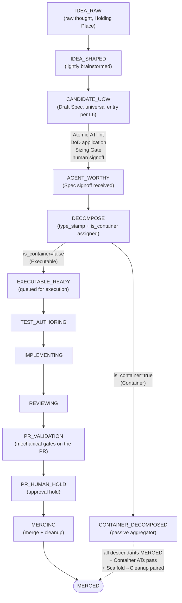

# PDLC Orchestrator Core & Foundations — Design

**Source bead**: `agents-config-wgclw.2`
**Parent milestone**: `agents-config-wgclw` (M0 — Discipline-layer rearchitecture)
**Companion spec**: `docs/specs/2026-05-19-pdlc-state-machine-design.md`
**Glossary**: `CONTEXT.md` (Objective, Idea, UoW, Candidate UoW, etc.)
**Date**: 2026-05-23
**Status**: Design draft — pending review and implementation planning

## Purpose

This spec defines the architecture for the Orchestrator that drives the
PDLC FSM. It commits to:

1. The **Objective primitive** that the Orchestrator tracks across the
   entire lifecycle (Idea → Merged), unifying what the FSM spec calls
   Ideas, Candidate UoWs, Containers, and Executables.
2. The **state-ownership boundary** between the Orchestrator and the
   work-tracker (bd today; pluggable adapter tomorrow).
3. The **process model** for the Orchestrator (CLI-driven tick) and the
   **Session** primitive for worker invocations.
4. The **WorkTracker protocol** — rich, prescriptive, needs-driven —
   that the bd adapter (and any future adapter) must implement.
5. The **OrchestratorStateRepo** — what FSM-specific state the
   Orchestrator owns, with storage deferred to implementation.
6. The **project-config schema** — its layering, validation discipline,
   and the contract it carries.
7. The **CLI surface** — `pdlc tick` plus management and override
   commands for observability and emergency control.

The PDLC FSM design spec (companion document) defines *what* states
exist, their personas, gates, and failure routing. This spec defines
*who owns what*, *how state is driven*, and *what the Orchestrator code
is shaped against*. Together they constitute the foundation for
wgclw.3 through wgclw.6 (Design Phase, Execution Pipeline, Integration,
Autopsy).

## Architectural Laws (extending the PDLC FSM spec)

The PDLC FSM spec laid down five Immutable Architectural Laws. This
spec adds three more, equally load-bearing for the Orchestrator's
correctness:

### L6 — Universal Entry Point

Every Objective enters the FSM at `CANDIDATE_UOW` (the lifecycle stage
formerly numbered 3). The Idea stages — `IDEA_RAW` and `IDEA_SHAPED` —
are *optional pre-entry stages* hosted in the Holding Place. **Direct
entry into any later stage is prohibited.** There is no escape hatch
for "trivial" work that bypasses the `CANDIDATE_UOW` exit gate — the
Atomic-AT linter, DoD application, Sizing Gate, and human signoff all
run regardless of how the Objective was created.

The gates are the discipline; the entry point is a convenience.

### L7 — Orchestrator-Tracker State Separation

The work-tracker is the source of truth for *what Objectives exist*,
their identity, hierarchy, dependencies, spec content, and coarse
lifecycle status (open / in_progress / closed / blocked / deferred).

The Orchestrator is the source of truth for *what lifecycle stage each
Objective is at*, strike counters per gate, transition logs,
frozen-branch markers, and gate-pass commit SHAs.

Neither side may write the other's domain unilaterally. Conflicts are
resolved by a per-domain canonical-ownership rule (the tracker wins on
structural edits; the Orchestrator wins on `objective_lifecycle_state`).
The connection between the two stores is by Objective ID only.

### L8 — Protocol Prescribes, Adapters Conform

The WorkTracker protocol is shaped by Orchestrator needs, not by the
minimum common denominator of available trackers. An adapter that
cannot implement the full protocol — including methods that may require
the adapter to synthesise behaviour from its tracker's primitives —
does not qualify as a PDLC WorkTracker. There are no capability flags
in the Orchestrator code. Orchestrator logic treats the protocol as
fully provided.

## The Objective Primitive

Every entity the Orchestrator tracks is an Objective. The same record
moves through the FSM stages; only its stage-specific *name* and the
*shape of its content* change.

### Attributes

```
Objective {
  id                                # tracker-assigned identifier
  parent_id                         # Optional[ObjectiveID]; null for top-level
  children_ids                      # Set[ObjectiveID]; populated at DECOMPOSE
                                    #   if is_container=true
  lifecycle_stage                   # one of the named stage constants;
                                    #   see "Lifecycle Stage Constants" table below
  lifecycle_status                  # projection onto tracker:
                                    #   open / in_progress / closed / blocked / deferred
  priority                          # mirrored from tracker; PriorityLevel 0..4
                                    #   (0=critical, 2=medium, 4=backlog)
  is_container                      # bool; assigned at DECOMPOSE alongside type_stamp.
                                    #   Some type_stamp values (Epic, Feature-with-
                                    #   children) default to is_container=true; rules
                                    #   key off this boolean, not type_stamp string
                                    #   matching
  type_stamp                        # Optional; assigned at DECOMPOSE:
                                    #   Executable (Story / Task / Chore / Bug / ...)
                                    #   Container  (Epic / Feature / ...)
  draft_spec                        # the Draft Spec body; opaque to Orchestrator;
                                    #   shape defined elsewhere
  provenance {                      # all nullable
    originating_idea_id   : Optional[ObjectiveID]   # set at Idea→UoW promotion
    decomposition_of      : Optional[ObjectiveID]   # set for children of a Container
    discovered_from       : Optional[ObjectiveID]   # set for sibling captures discovered
                                                    #   mid-implementation
    autopsy_route         : Optional[Route]         # set for routes 4 / 5 spawns
  }
  objective_lifecycle_state {       # Orchestrator-owned; not in tracker
    strike_counts         : Dict[LifecycleStage, int]
    transition_log        : Append[TransitionEntry]
    frozen_branch_ref     : Optional[CommitSHAChain]
    gate_pass_shas        : Dict[GateID, CommitSHA]
    bucket                : Optional[Bucket]   # Now / Next / Later / Library;
                                               #   Idea-stage property
                                               #   (IDEA_RAW / IDEA_SHAPED only)
  }
}
```

### Lifecycle Stage Constants

The Orchestrator's `lifecycle_stage` field uses **named English constants**
throughout — in code, data, logs, audit trails, and prose. Numeric stage
IDs (1 through 11) appear only as a low-attention **ordering hint** in
tables; they are not used in code or persisted state. The same constants
appear in CONTEXT.md as the canonical glossary entries.

| Constant | Ordering hint | Conversational name | CONTEXT.md entry |
|---|---|---|---|
| `IDEA_RAW` | 1 | Idea | Idea |
| `IDEA_SHAPED` | 2 | Shaped Idea | Shaped Idea |
| `CANDIDATE_UOW` | 3 | Candidate UoW (Draft Spec) | Candidate UoW |
| `AGENT_WORTHY` | 4 | Agent-Worthy | Agent-Worthy |
| `DECOMPOSE` | 5 | (in Decomposition) | Decomposition |
| `EXECUTABLE_READY` | 6 | Agent-Ready Executable | Agent-Ready |
| `CONTAINER_DECOMPOSED` | 6′ | Decomposed Container | Container + Container Closure |
| `TEST_AUTHORING` | 7 | Test-Authoring | Test-Author Agent |
| `IMPLEMENTING` | 8 | Implementation | Implementer Agent |
| `REVIEWING` | 9 | Review | Review |
| `PR_VALIDATION` | 10A | PR Mechanical Validation | PR Mechanical Validation |
| `PR_HUMAN_HOLD` | 10B | Human Approval Hold | Human Approval Hold |
| `MERGING` | 10C | Merge + Cleanup | Merge + Cleanup |
| `AUTOPSY` | 11 | Autopsy | Autopsy |
| `MERGED` | terminal | Merged (happy) | Merged |
| `KILLED` | terminal | Killed (with Epitaph) | Killed |
| `PARKED` | terminal-ish | Parked in Library awaiting blocking dep | Parked |

`6′` (the apostrophed variant for Decomposed Container) is a labelling
artifact carried from the PDLC FSM design spec; it has no meaning in
code beyond the explicit `CONTAINER_DECOMPOSED` constant.

### Happy-path flowchart

The single-Objective happy path from raw thought to merged code. Side
branches, retries, the 3-strike circuit breaker, Autopsy routing, and
container-closure aggregation are intentionally omitted — they live in
the PDLC FSM design spec and in the dedicated HLD multi-view artifacts
bead. This diagram is the orientation poster, not the complete map.



### Hierarchy

`parent_id` and `children_ids` form a directed acyclic graph over
Objectives. The graph is recursive — children may themselves be
Containers with their own children. Container Closure bubbles upward:
a parent Container cannot reach Merged until every descendant reaches
Merged, every Container-Level AT passes, and every Scaffold AT has
been paired with a successful Cleanup AT (per the FSM spec).

The tracker is the source of truth for the structural graph; the
Orchestrator's view mirrors it. Reparenting and child creation flow
through the tracker first; the Orchestrator picks them up via the
Discovery Sweep on the next tick.

### Idea-less Objectives

Many Objectives have no originating Idea
(`provenance.originating_idea_id = null`). They are created directly at
`CANDIDATE_UOW` by:

- A human or agent invoking the tracker's create primitive for obvious
  work (bug with clean repro, chore, dependency bump).
- Sibling captures discovered mid-implementation — work that would have
  been on the parent's original plan but was not anticipated; classified
  via the sibling test and filed as a child of the in-flight parent
  Objective with `provenance.discovered_from` set.
- Programmatic creation by formulas, hygiene sweeps, or Autopsy routes 4
  and 5 (debt-Ideas and tooling-Ideas).

The Orchestrator treats Idea-less Objectives identically to Idea-promoted
ones from `CANDIDATE_UOW` onward. The provenance backreference is the
only difference; the FSM gates, strike counters, and lifecycle are
uniform.

## State Ownership

Two stores, two domains, two canonical authorities:

### Work-tracker domain (bd today)

| State | Notes |
|---|---|
| Objective identity | id, type, title, parent_id, children_ids |
| Spec content | Draft Spec body, Decomposition Plan |
| Lifecycle status | open / in_progress / closed / blocked / deferred |
| Priority | PriorityLevel 0..4; mirrored onto Objective; tracker authoritative |
| Dependencies | typed; both directions; with reasons |
| Audit notes | append-only human-readable trail |
| Metadata channel | typed bag for lifecycle-stage projection markers, etc. |

### Orchestrator domain (Orchestrator's own store)

| State | Notes |
|---|---|
| Lifecycle stage | one of the Lifecycle Stage Constants |
| Strike counters | per gate where strikes apply (`TEST_AUTHORING`, `IMPLEMENTING`, `REVIEWING`, `PR_VALIDATION`) |
| Transition log | append-only; lifecycle-stage transitions with reason and gate evidence |
| Frozen-branch markers | set on `AUTOPSY` entry; lifted only on `pdlc objectives unfreeze` |
| Gate-pass SHAs | per gate; commit SHA at which gate last passed |
| Bucket | Now / Next / Later / Library — Idea-stage property; meaningful only for `IDEA_RAW` / `IDEA_SHAPED` (`null` for all later stages) |
| Session records | one per worker invocation; see Sessions below |

### Canonical-ownership rule

- **Tracker wins on structural edits.** Reparenting, child creation,
  dependency add/remove, spec body changes — the tracker is authoritative.
  The Orchestrator mirrors these via the Discovery Sweep.
- **Orchestrator wins on `objective_lifecycle_state`.** Lifecycle-stage
  advancement, strike increments, frozen-branch markers, gate-pass SHAs
  — these live only in the OrchestratorStateRepo. The tracker carries a
  coarse projection (open / in_progress / closed) the Orchestrator
  writes back during reconcile.

### Out-of-band edit reconciliation

If a human edits the tracker directly between ticks (closes a bd,
reparents, manually marks killed), the next tick's Discovery Sweep
detects the change and updates the Orchestrator's view. Specific
reconcile rules:

- Tracker `closed` while Orchestrator `lifecycle_stage` is pre-terminal →
  Orchestrator records the Objective as `KILLED` with reason
  "manual-close-via-tracker" in the transition_log. Any in-flight
  Session is killed; strikes are not counted.
- Tracker reparenting → Orchestrator mirrors the new `parent_id` without
  resetting `objective_lifecycle_state`.
- Tracker spec body changed during `TEST_AUTHORING` / `IMPLEMENTING` /
  `REVIEWING` / `PR_VALIDATION` → flagged as an Advisory in the
  transition_log; does not auto-rollback (humans get a diff-aware
  warning at the next health check).

Storage location for the OrchestratorStateRepo is **deferred to
implementation**. Candidates include a SQLite sidecar, flat YAML files
under `.pdlc/state/`, or labels-on-bead for the bd adapter. The spec
commits only to the canonical-ownership rule and the entity shape.

## The Process Model: CLI-driven Tick

The Orchestrator is a CLI tool named `pdlc`. It has no daemon process.
Each invocation of `pdlc tick` reads state, dispatches and reaps
worker sessions, advances lifecycle stages whose gates have passed,
and exits. The same code path serves both cron-driven and human-invoked
ticks.

### Tick algorithm (high-level)

```
pdlc tick:
  acquire single-writer lock (.pdlc/tick.lock)
  DISCOVER:
    query WorkTracker for Objectives created or changed since last marker
    for each unknown Objective:
      initialise OrchestratorStateRepo entry at lifecycle_stage=CANDIDATE_UOW
      run CANDIDATE_UOW exit gates (Atomic-AT lint, DoD application, Sizing Gate)
      record outcome
  RECONCILE:
    for each Objective known to both stores:
      if tracker lifecycle_status conflicts with Orchestrator lifecycle_stage
      → apply reconciliation rules above
  REAP:
    for each Session with status running:
      check process state and report file
      if exited and report present:
        verify gate evidence
        advance lifecycle_stage or record strike
        if strike == 3: route to AUTOPSY (freeze branch; spawn RCA Sessions)
      if process gone and no report: mark crashed; record strike
  DISPATCH:
    for each Objective at a worker-driven lifecycle_stage with no in-flight Session:
      write Session record with status pending (BEFORE fork)
      fork detached subprocess for the appropriate persona
      update Session record to status running with PID and start_ts
  PERSIST:
    flush OrchestratorStateRepo writes
    write new last-seen Discovery marker
  release lock; exit
```

The single-writer lock prevents concurrent ticks from corrupting state.
Lock acquisition that fails (a tick is already in progress) exits
non-zero with a clear message — cron will simply skip that interval.

### Tick triggering

- **Cron-driven** in production (cadence in project-config).
- **Human-invoked** for testing, debugging, dry-run preview, and
  one-off advancement after manual intervention.
- **Post-Session hook (future, optional)** — a worker exit could
  trigger an immediate tick to reduce dispatch latency. Not required;
  cron cadence is the contract.

`pdlc tick` exits fast (sub-second) when there is nothing to do.

### `--dry-run` mode

`pdlc tick --dry-run` reads state and reports the dispatches, reaps,
and lifecycle-stage advancements it would have performed, without
mutating any state. Safe to run concurrently with real ticks (read-only).

## The Session Primitive

A Session is a first-class entity representing one worker invocation.
It has its own identity, lifecycle, and audit record.

### Shape

```
Session {
  id                  # session-<uuid>
  objective_id        # the Objective this Session is working on
  lifecycle_stage     # one of TEST_AUTHORING / IMPLEMENTING / REVIEWING /
                      #   PR_VALIDATION / AUTOPSY — the gate this Session
                      #   targets
  persona             # Test-Author / Implementer / Reviewer / RCA / etc.
  attempt_number      # 1..3; corresponds to the strike counter for this stage
  pid                 # OS process id; null until status == running
  started_at
  ended_at            # nullable until exit
  status              # pending → running → exited → reaped (or crashed)
  exit_code           # nullable until exit
  log_path            # worker stdout/stderr
  report_path         # structured gate-evidence YAML
  worktree_path       # where the worker is making changes
}
```

### Lifecycle

1. **pending** — record written to OrchestratorStateRepo BEFORE fork
2. **running** — subprocess forked; PID populated; updated atomically
3. **exited** — process has terminated; awaiting reap
4. **reaped** — Orchestrator has read the report, verified gate evidence,
   advanced `objective_lifecycle_state` (or recorded strike)
5. **crashed** — process gone but no report file present, or report
   malformed; recorded as strike with reason

The pending-before-fork ordering means a crash between write and fork
leaves a reconcilable record — the next tick treats `pending` Sessions
older than a small threshold as crashed.

### Worker authority

Per the FSM spec's persona definitions, each persona has tight authority
boundaries (Test-Author: test files only + signature-only stubs;
Implementer: production paths only; Reviewer: tools and new tests only).
The Orchestrator does not enforce these in code — they are enforced by
the gate verifications (AST checks, file-touch audits) at Session reap.

## The Discovery Sweep

The Discovery Sweep is the sole binding between "the tracker has this
Objective" and "the Orchestrator drives this Objective." It runs on
every tick.

Algorithm:

```
DISCOVER():
  marker = OrchestratorStateRepo.last_seen_marker
  changes = WorkTracker.discover_since(marker)
  for each ObjectiveRecord o in changes:
    if o.id not in OrchestratorStateRepo:
      # New Objective — initialise at CANDIDATE_UOW (universal entry, per L6)
      OrchestratorStateRepo.create(o.id, lifecycle_stage=CANDIDATE_UOW, ...)
      run_candidate_uow_gates(o.id)
    else:
      # Existing Objective — only structural fields may have changed
      OrchestratorStateRepo.mirror_structural(o.id, o)
  OrchestratorStateRepo.last_seen_marker = changes.new_marker
```

The marker is an adapter-specific opaque token (e.g., a timestamp for
bd, a cursor for a hypothetical Jira adapter). The Orchestrator does
not interpret it.

If the tracker cannot reliably provide "changes since marker" semantics,
the adapter must synthesise them — e.g., by polling all Objectives and
diffing against the Orchestrator's known set. This is the adapter's
job; the Orchestrator's contract assumes the semantics.

## The WorkTracker Protocol

The protocol is **prescriptive of Orchestrator needs** (L8). Adapters
must implement the full protocol; no capability flags or degradation
paths exist in Orchestrator code. The protocol is grouped by workflow
domain.

### Domain 1 — Discovery & state

- `discover_since(marker) -> (changes: list[ObjectiveRecord], new_marker: Token)`
- `get_objective(id) -> ObjectiveRecord` (full record including spec,
  deps, audit notes, metadata)
- `resolve_provenance(id) -> ProvenanceBundle` (originating Idea,
  decomposition_of, discovered_from, autopsy_route — whichever apply)

### Domain 2 — Lifecycle

- `set_lifecycle_status(id, status, reason) -> None`
- `set_killed(id, epitaph) -> None`
- `append_audit_note(id, text) -> None`

### Domain 3 — Hierarchy

- `list_children(id) -> list[ObjectiveID]`
- `walk_parent_chain(id) -> list[ObjectiveID]`
- `reparent(id, new_parent_id, reason) -> None`
- `create_objective(parent_id, type, title, body, provenance) -> ObjectiveID`

### Domain 4 — Dependencies

- `list_dependencies(id, direction) -> list[Dependency]` (direction:
  blocks-this | blocked-by-this)
- `add_dependency(blocker_id, blocked_id, reason) -> None`
- `remove_dependency(blocker_id, blocked_id, reason) -> None`
- `query_unblocked(id) -> bool`

### Domain 5 — Search & surfacing

- `find_by_criteria(criteria: StructuredQuery) -> list[ObjectiveRecord]`
  (composable predicates — by type, by parent, by lifecycle, by dep
  state, by label-or-equivalent metadata, by `lifecycle_stage` projection)
- `bulk_get(ids: list[ObjectiveID]) -> list[ObjectiveRecord]`

### Domain 6 — Spec content

- `get_spec(id) -> SpecBlob`
- `update_spec(id, blob, reason) -> None`

### Domain 7 — Metadata channel

- `get_metadata(id, key) -> Optional[Value]`
- `set_metadata(id, key, value, reason) -> None`
- `list_metadata_keys(id) -> list[str]`

The metadata channel is typed (string keys; string-or-structured
values) but its semantics are Orchestrator-defined — adapters store
and retrieve transparently. Adapters MAY implement it natively
(bd labels, Jira custom fields) or as a sidecar (a structured
notes-comment, a metadata table) — the Orchestrator does not care.

### Adapter conformance

The bd adapter (delivered as part of wgclw.2's implementation
children) is the reference implementation. A fixture-test corpus
exercises every domain against an isolated bd instance. Future
adapters (Jira, GitHub) ship only after passing the same corpus.

## The OrchestratorStateRepo

The store the Orchestrator owns. Holds:

- One **Objective lifecycle-state record** per Objective (see Objective
  attributes, `objective_lifecycle_state` block).
- **Session records** keyed by session_id, with reverse index by
  objective_id.
- The **last-seen Discovery marker**.
- The **transition log** (append-only; per-Objective and per-Session).
- A **last-groomed timestamp** for the Holding Place (drives the
  Grooming Nag).

Storage is **deferred to implementation children**. Acceptance criteria:

- Survives process crashes; partial writes do not corrupt state.
- Single-writer enforced (matches the single-writer tick lock).
- Append-only operations (transition_log) are crash-safe.
- Queryable for `pdlc sessions list` and `pdlc objectives show` without
  full scans on large project history.

Likely implementations: SQLite (chosen for the bd adapter's reference
implementation), or flat YAML/JSON under `.pdlc/state/` (simpler but
worse at scale). The implementation child should make this call.

## The Project-Config Schema

### File layout — single entry, includes for modular bodies

`project-config.toml` is the single entry point. It includes additional
files for modular sections:

```toml
# project-config.toml (root)
[project]
name = "agents-config"
default-formula = "implement-feature"

[orchestrator]
include = ["orchestrator/personas.toml", "orchestrator/reviewers.toml"]
tick-cadence-seconds = 60
worktree-base = ".pdlc/worktrees"

# ... gates, coverage, lint-autofix, etc. as today
```

Included files live alongside the root or in well-known sub-paths;
they are TOML, with the same schema validation as the root.

### Precedence ladder for overrides

`per-Objective > per-persona > global default`.

Per-Objective overrides flow via the WorkTracker's metadata channel.
The existing `coverage-threshold-<n>` label-on-bead pattern is one
example; the schema generalises this to typed metadata keys.

Per-persona overrides live in the persona definition (a future
implementation concern).

Global defaults live in `project-config.toml` and its includes.

### Validation discipline — hard-fail

The config loader validates against a Pydantic-style schema at
Orchestrator startup and on every `pdlc tick` invocation. Validation
failures cause the Orchestrator to refuse to tick, with a precise
pointer to the offending line. Silent degradation is prohibited.

`pdlc config show` dumps the resolved configuration (after include
resolution and override layering) for debugging.

### Scope — what lives in project-config

- Gate command bindings (build, typecheck, lint, test) — already exists
- Coverage thresholds — already exists
- Reviewer Agent list and per-Reviewer toolbox config — new
- Sizing Gate weights and thresholds — new
- `approval_required` global default — new
- Aging-nag thresholds (Grooming, Stage-10B human approval hold) — new
- Worker persona registry (or pointers to persona files) — new
- Worker model selection per persona — new (extends existing
  foreign-cli section)
- Tracker adapter selection + adapter-specific connection config — new
- Tick cadence — new
- Worktree base location — new
- Holding Place backing-store selection — new
- Autopsy resolution-route configuration (which routes are enabled,
  default-suggested route conditions) — new

### What does NOT live in project-config

- FSM stage definitions (those are in code; the FSM is universal)
- Per-Objective state (in the tracker or OrchestratorStateRepo)
- Strike counts (OrchestratorStateRepo)
- Worker prompts / persona behaviour (persona files, not config)

## The CLI Surface

| Group | Command | Purpose |
|---|---|---|
| Tick | `pdlc tick [--dry-run] [--verbose] [--objective <id>]` | run one tick |
| Sessions (read) | `pdlc sessions list [--objective <id>]` | list pending / running sessions |
| | `pdlc sessions show <session-id>` | full session record |
| | `pdlc sessions log <session-id>` | cat the log file |
| | `pdlc sessions tail <session-id>` | follow the log file |
| Sessions (write) | `pdlc sessions kill <session-id> [--resubmit]` | SIGTERM the worker; optionally re-dispatch without burning a strike |
| | `pdlc sessions kill --all` | emergency stop — every running session |
| Objectives (read) | `pdlc objectives list` | every Objective with `lifecycle_stage` + active session |
| | `pdlc objectives show <id>` | full `objective_lifecycle_state` + provenance + transition_log |
| | `pdlc objectives log <id>` | transition log only |
| Objectives (override) | `pdlc objectives advance <id> --to <stage> --reason <text> --force` | force-advance `lifecycle_stage`; audit-logged |
| | `pdlc objectives reset-strikes <id> --stage <s> --reason <text> --force` | reset strikes; audit-logged |
| | `pdlc objectives unfreeze <id> --reason <text> --force` | lift Autopsy frozen-branch lock; audit-logged |
| Operations | `pdlc reconcile` | run a Discovery Sweep + reconcile pass on demand |
| | `pdlc health` | one-screen status report |
| | `pdlc config show` | dump resolved configuration |

All override commands require `--force`. All override commands write
an audit record to the relevant Objective's transition_log so the
intervention is visible to any future Architecture RCA Agent.

## Worker Dispatch — Async (Option B)

The tick dispatches workers as detached subprocesses, then exits. The
*next* tick reaps completed Sessions. This is the only supported
mode; synchronous tick-blocks-on-worker is not implemented.

Implications:

- Workers run independently between ticks.
- Long-running workers (full-suite tests, model inference) do not
  block the tick.
- The Orchestrator survives if a worker hangs (the next tick reaps it
  by timeout; the offending Session is recorded as crashed with reason
  "worker-timeout").
- Process supervision (zombie reaping, log capture, signal handling)
  is the Orchestrator's responsibility — concentrated in a small,
  testable Session-supervision module.

The exact subprocess invocation pattern (which AI CLI is called for
each persona, what arguments are passed) is **deferred to implementation
children**.

## Acceptance Criteria

Per the source bead's DoD:

1. **Orchestrator process model defined and the state-machine engine
   prototyped to traverse a fixture FSM.** ✅ (this spec defines the
   model; the prototype is wgclw.2's implementation child)
2. **Work-tracker abstraction with bd adapter passes a fixture test
   corpus.** ✅ (protocol defined here; bd adapter and corpus are
   implementation children)
3. **Project-config schema documented; loader passes fixture tests.**
   ✅ (schema defined here; loader and validator are implementation
   children)
4. **Build passes. Typecheck passes. Tests pass.** (Universal — applies
   to implementation children, not this design doc.)

## Deferred to Implementation Children

The following are mentioned but not designed here; each becomes a
child bead under wgclw.2:

- **OrchestratorStateRepo backing store** — SQLite vs flat files vs
  labels-on-bead choice; schema migration story.
- **WorkTracker bd adapter** — concrete implementation against bd's
  current CLI; fixture-test corpus that proves protocol conformance.
- **Project-config loader and validator** — Pydantic schema, include
  resolution, override layering, hard-fail error reporting.
- **Worker persona dispatch contract** — how the Orchestrator addresses
  Test-Author / Implementer / Reviewer / RCA personas; where persona
  definitions live; what the persona invocation contract looks like.
- **Gate-evidence YAML schema** — the worker-report-v1-style structured
  output that workers write and the reap step consumes.
- **Session supervision module** — process forking, zombie reaping,
  log capture, signal handling, timeout enforcement.
- **CLI implementation** — the actual `pdlc` argparse / click /
  typer layout; output formatting; JSON-output modes for scripting.
- **Discovery Sweep marker semantics for bd** — whether timestamp,
  Dolt cursor, or a separate ledger.
- **Holding Place backing store** — bd-as-default vs separate flat-file
  store vs explicit decision.

## Out of Scope (explicit)

These are wholly outside wgclw.2 and live in other epics or remain
deferred:

- **FSM stage definitions and gate logic** — defined in the PDLC FSM
  spec (companion document) and implemented across wgclw.3 (Design
  Phase), wgclw.4 (Execution Pipeline), wgclw.5 (Integration), wgclw.6
  (Autopsy).
- **Persona behavioural prompts** — what the Test-Author, Implementer,
  Reviewer agents actually do prompted with what context. Persona
  files, not orchestrator core.
- **Reviewer Toolbox specifics** — which lint rules, complexity
  thresholds, security tools are wired into each Reviewer Agent.
  Project-config concern, not Orchestrator core.
- **Bead formulas and molecule mechanics** — these are the existing bd
  adapter's internals. The Orchestrator does not know about them; the
  bd adapter may choose to use them (or replace them) to execute its
  side of the WorkTracker protocol.
- **Library-parked Idea aging or pruning** — post-MVP; not required
  for wgclw.2.
- **Dreaming Process** — post-MVP background graph-edge maintenance;
  feeds Grooming and work-pull. Mentioned in AGENTS.md.
- **Visual AT Analysis Engine** — post-MVP visual graph rendering.

## Glossary additions made to CONTEXT.md by this spec

- **Objective** — new entry as the umbrella primitive.
- **Idea** — updated to cross-reference Objective at `IDEA_RAW`.
- **Candidate UoW** — updated to cross-reference Objective at
  `CANDIDATE_UOW` and to note the universal-entry-point discipline (L6).
- **Lifecycle stage constants** — each named constant from the
  Lifecycle Stage Constants table (e.g. `IDEA_RAW`, `CANDIDATE_UOW`,
  `IMPLEMENTING`, `PR_MERGED`, `KILLED`) is added as its own glossary
  entry pointing back to this spec.
