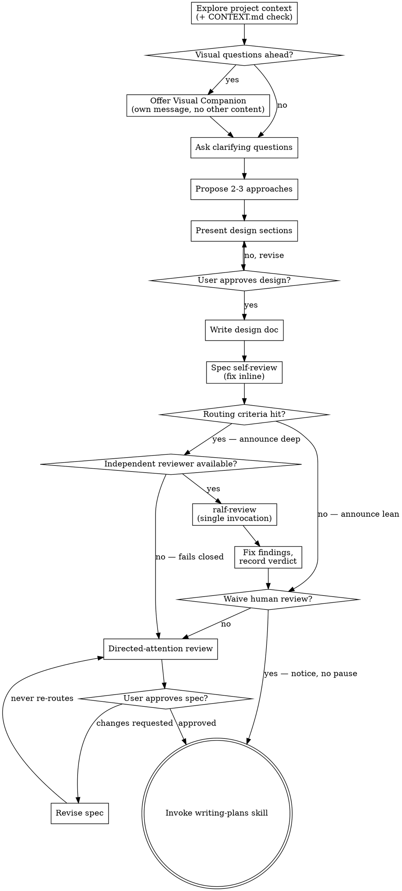

<!--
Source: oss-snapshots/superpowers/brainstorming/
Upstream: https://github.com/obra/superpowers @ f2cbfbefebbfef77321e4c9abc9e949826bea9d7 (v5.1.0)
Last sync: 2026-05-23
Drift policy: accept-periodic-resync. Byte-identical copy of upstream at initial import; the in-tree copy is now authoritative and may diverge. To inspect drift, diff against oss-snapshots/superpowers/brainstorming/.
-->

# Brainstorming Ideas Into Designs

Help turn ideas into fully formed designs and specs through natural collaborative dialogue.

Start by understanding the current project context, then ask questions one at a time to refine the idea. Once you understand what you're building, present the design and get user approval.

<HARD-GATE>
Do NOT invoke any implementation skill, write any code, scaffold any project, or take any implementation action until you have presented a design and the user has approved it. This applies to EVERY project regardless of perceived simplicity.
</HARD-GATE>

## Anti-Pattern: "This Is Too Simple To Need A Design"

Every project goes through this process. A todo list, a single-function utility, a config change — all of them. "Simple" projects are where unexamined assumptions cause the most wasted work. The design can be short (a few sentences for truly simple projects), but you MUST present it and get approval.

## Checklist

You MUST create a task for each of these items and complete them in order:

1. **Explore project context** — check files, docs, recent commits; check for `CONTEXT.md` / `CONTEXT-MAP.md` and, if present, activate the glossary discipline (see The Process below)
2. **Offer visual companion** (if topic will involve visual questions) — this is its own message, not combined with a clarifying question. See the Visual Companion section below.
3. **Ask clarifying questions** — one at a time, understand purpose/constraints/success criteria
4. **Propose 2-3 approaches** — with trade-offs and your recommendation
5. **Present design** — in sections scaled to their complexity, get user approval after each section
6. **Write design doc** — save to `docs/superpowers/specs/YYYY-MM-DD-<topic>-design.md` and commit
7. **Spec self-review** — quick inline check for placeholders, contradictions, ambiguity, scope (see below)
8. **Review-depth routing** — assess the spec against the routing criteria; announce lean or deep; deep runs `ralf-review` once and fixes findings (see below)
9. **Attention routing** — decide whether the user's review is needed: waive with a notice, or direct their attention to specific sections (see below)
10. **Transition to implementation** — invoke writing-plans skill to create implementation plan; this is the only post-brainstorm implementation handoff (`ralf-review`, invoked in step 8, does not recur here)

## Process Flow

**The terminal state is invoking writing-plans.** Do NOT invoke frontend-design, mcp-builder, or any other implementation skill. The ONLY skill you invoke after brainstorming is writing-plans.

## The Process

**Understanding the idea:**

- Check out the current project state first (files, docs, recent commits)
- Check for `CONTEXT.md` (or `CONTEXT-MAP.md` in multi-context repos). When present,
  announce the file actually found ("`CONTEXT.md` found — glossary discipline active",
  or "`CONTEXT-MAP.md` found — glossary discipline active" for a multi-context repo)
  and adopt the grill-with-docs skill's glossary discipline inline for the rest of the
  brainstorm: challenge the user's terms against the glossary, propose precise canonical
  terms for fuzzy language, and update the glossary as terms resolve — in a single-context
  repo that is the root `CONTEXT.md`; in a multi-context repo, resolve via `CONTEXT-MAP.md`
  to the context(s) the design touches and update that context's `CONTEXT.md`. Glossary
  entries only, no implementation details, per the glossary format that travels with the
  grill-with-docs skill. Do not adopt grill-with-docs' ADR-offering step.
- When no `CONTEXT.md` exists but the design coins load-bearing domain terms, offer
  once — at spec-write time, folded into the attention-routing message, never as its
  own blocking question — to start a `CONTEXT.md` per grill-with-docs. The offer
  lapses if not taken up and does not repeat.
- Before asking detailed questions, assess scope: if the request describes multiple independent subsystems (e.g., "build a platform with chat, file storage, billing, and analytics"), flag this immediately. Don't spend questions refining details of a project that needs to be decomposed first.
- If the project is too large for a single spec, help the user decompose into sub-projects: what are the independent pieces, how do they relate, what order should they be built? Then brainstorm the first sub-project through the normal design flow. Each sub-project gets its own spec → plan → implementation cycle.
- For appropriately-scoped projects, ask questions one at a time to refine the idea
- Prefer multiple choice questions when possible, but open-ended is fine too
- Only one question per message - if a topic needs more exploration, break it into multiple questions
- Focus on understanding: purpose, constraints, success criteria

**Exploring approaches:**

- Propose 2-3 different approaches with trade-offs
- Present options conversationally with your recommendation and reasoning
- Lead with your recommended option and explain why

**Presenting the design:**

- Once you believe you understand what you're building, present the design
- Scale each section to its complexity: a few sentences if straightforward, up to 200-300 words if nuanced
- Ask after each section whether it looks right so far
- Cover: architecture, components, data flow, error handling, testing
- Be ready to go back and clarify if something doesn't make sense

**Design for isolation and clarity:**

- Break the system into smaller units that each have one clear purpose, communicate through well-defined interfaces, and can be understood and tested independently
- For each unit, you should be able to answer: what does it do, how do you use it, and what does it depend on?
- Can someone understand what a unit does without reading its internals? Can you change the internals without breaking consumers? If not, the boundaries need work.
- Smaller, well-bounded units are also easier for you to work with - you reason better about code you can hold in context at once, and your edits are more reliable when files are focused. When a file grows large, that's often a signal that it's doing too much.

**Working in existing codebases:**

- Explore the current structure before proposing changes. Follow existing patterns.
- Where existing code has problems that affect the work (e.g., a file that's grown too large, unclear boundaries, tangled responsibilities), include targeted improvements as part of the design - the way a good developer improves code they're working in.
- Don't propose unrelated refactoring. Stay focused on what serves the current goal.

## After the Design

**Documentation:**

- Write the validated design (spec) to `docs/superpowers/specs/YYYY-MM-DD-<topic>-design.md`
  - (User preferences for spec location override this default)
- Use elements-of-style:writing-clearly-and-concisely skill if available
- Commit the design document to git

**Spec Self-Review:**
After writing the spec document, look at it with fresh eyes:

1. **Placeholder scan:** Any "TBD", "TODO", incomplete sections, or vague requirements? Fix them.
2. **Internal consistency:** Do any sections contradict each other? Does the architecture match the feature descriptions?
3. **Scope check:** Is this focused enough for a single implementation plan, or does it need decomposition?
4. **Ambiguity check:** Could any requirement be interpreted two different ways? If so, pick one and make it explicit.

Fix any issues inline. No need to re-review — just fix and move on.

**Review-Depth Routing:**
After the spec self-review, assess the written spec against these routing criteria:

- multiple interacting components or subsystems;
- new or materially changed public contracts (APIs, schemas, file formats, skill
  or workflow contracts other agents rely on);
- security- or auth-adjacent surface;
- data migration or other hard-to-reverse operations;
- novel domain concepts introduced by this design;
- a genuinely balanced trade-off resolved by judgment during the brainstorm.

No criterion hit → announce `Review routing: lean (no criteria hit)` and continue
to Attention Routing.

Any criterion hit → announce `Review routing: deep (criteria: <names>)` and invoke
the `ralf-review` skill **exactly once**: target = the spec file; review criteria =
the design's stated goals plus its acceptance criteria (goals-only when the spec
carries none); cycle cap = that skill's default. Fix what the findings allow
inline, but the recorded verdict is final: inline fixes improve the artifact the
user receives — they never upgrade the verdict, and ralf-review is never re-invoked
to earn a better score. Attention Routing reads the recorded verdict (its Score
only; the report's recommended-action field stays advisory).

Where the harness cannot dispatch an independent reviewer (no subagent or
agent-dispatch primitive), the deep route is unavailable: criteria-hit specs go
straight to directed-attention review — the gate below fails closed.

**Attention Routing:**
Decide whether the user's review of the written spec is needed. The conversational
design-approval gate above (the HARD-GATE enforcement point) is untouched — only
this post-write review stop is waivable. Waive it only when ALL of:

- **(a) Review outcome clean** — deep review was either not warranted (lean route)
  or ended in a recorded `PASS`. Any other verdict parks for the user, with the
  verdict and residual concerns attached.
- **(b) No divergence** — nothing in the written spec goes beyond what the user
  approved conversationally: no post-approval design changes, and no material
  assumptions or trade-offs the user has not seen (however the project marks them).
- **(c) Frontier-tier session** — the session model is frontier-tier: currently
  Claude Opus or above (Opus 4.x, Fable/Mythos 5) or an equivalent top-tier foreign
  model. Read the tier from the runtime's declared model identity (the harness
  states the powering model in the session context); if no identity is declared,
  this condition fails. This is a qualification check on whatever model the user
  already chose — never an instruction to select or escalate to a premium model.

When unsure about any condition, do not waive. Announce the decision both ways:

- **Waived:** post a compact notice — a one-paragraph summary of what the spec
  commits to, plus "if you look anywhere, look at <section>" pointing at the least
  conventional decision — then proceed directly to the writing-plans transition.
  No question, no pause.
- **Not waived:** post a directed-attention request — 2–5 bullets, each naming a
  specific section, why it may surprise the user or carry risk, and what judgment
  is being asked of them. Never a bare "please review."

User-directed revisions do not re-enter deep review: when the user requests changes
at a directed-attention stop, revise and return to the same attention stop — the
user is engaged, and approving their own requested changes is the review. The user
can always direct another deep review explicitly.

**Implementation:**

- Invoke the writing-plans skill to create a detailed implementation plan
- Do NOT invoke any other skill. writing-plans is the next step.

**Tracked work handoff (if the project uses a work tracker):**

- End the design doc with a `## Continuations` section naming each follow-on
  work item to create (noun/title/acceptance criteria), or the literal
  `- none — this spec is the deliverable`.
- When the design doc's PR merges: mint those continuation items in the
  tracker as children under the still-open tracked objective per that
  section, then release the claim on the objective (status back to
  open/unclaimed). Mint-before-anything-closes — successors exist before
  anything closes or releases. Never leave the tracked objective claimed
  behind a merged design doc.

## Key Principles

- **One question at a time** - Don't overwhelm with multiple questions
- **Multiple choice preferred** - Easier to answer than open-ended when possible
- **YAGNI ruthlessly** - Remove unnecessary features from all designs
- **Explore alternatives** - Always propose 2-3 approaches before settling
- **Incremental validation** - Present design, get approval before moving on
- **Be flexible** - Go back and clarify when something doesn't make sense

## Visual Companion

A browser-based companion for showing mockups, diagrams, and visual options during brainstorming. Available as a tool — not a mode. Accepting the companion means it's available for questions that benefit from visual treatment; it does NOT mean every question goes through the browser.

**Offering the companion:** When you anticipate that upcoming questions will involve visual content (mockups, layouts, diagrams), offer it once for consent:
> "Some of what we're working on might be easier to explain if I can show it to you in a web browser. I can put together mockups, diagrams, comparisons, and other visuals as we go. This feature is still new and can be token-intensive. Want to try it? (Requires opening a local URL)"

**This offer MUST be its own message.** Do not combine it with clarifying questions, context summaries, or any other content. The message should contain ONLY the offer above and nothing else. Wait for the user's response before continuing. If they decline, proceed with text-only brainstorming.

**Per-question decision:** Even after the user accepts, decide FOR EACH QUESTION whether to use the browser or the terminal. The test: **would the user understand this better by seeing it than reading it?**

- **Use the browser** for content that IS visual — mockups, wireframes, layout comparisons, architecture diagrams, side-by-side visual designs
- **Use the terminal** for content that is text — requirements questions, conceptual choices, tradeoff lists, A/B/C/D text options, scope decisions

A question about a UI topic is not automatically a visual question. "What does personality mean in this context?" is a conceptual question — use the terminal. "Which wizard layout works better?" is a visual question — use the browser.

If they agree to the companion, read the detailed guide before proceeding:
`skills/brainstorming/visual-companion.md`
