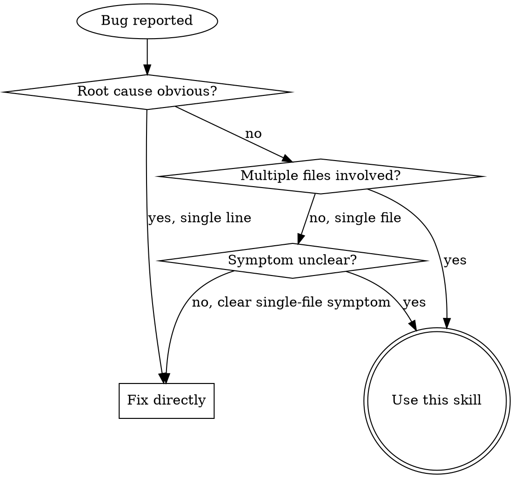
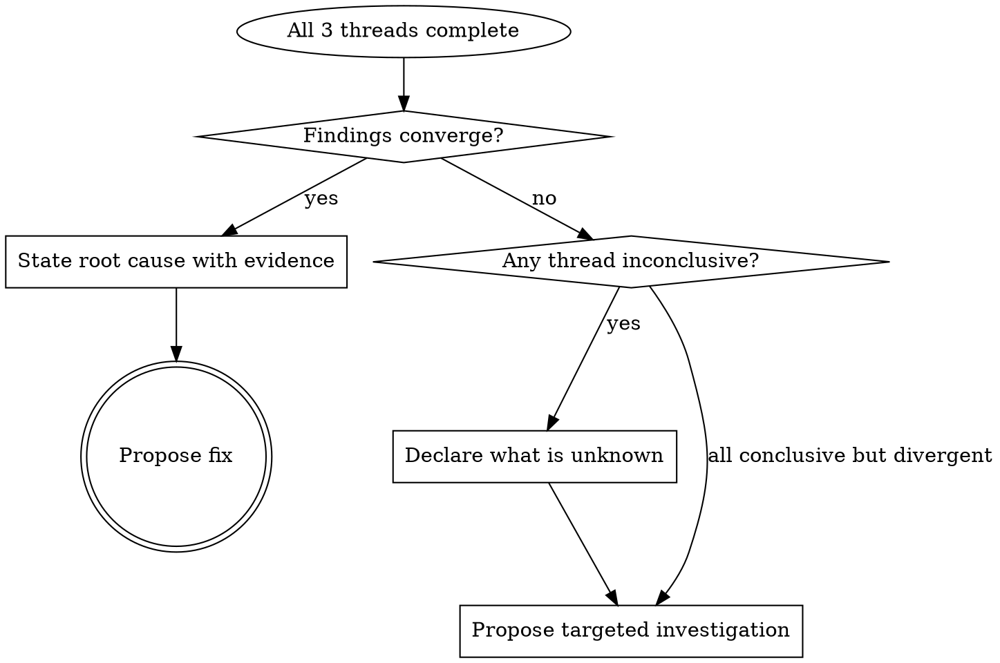

<!--
Source: oss-snapshots/superpowers/systematic-debugging/
Upstream: https://github.com/obra/superpowers @ f2cbfbefebbfef77321e4c9abc9e949826bea9d7 (v5.1.0)
Last sync: 2026-05-24
Note: cx6.7.12 amalgamation lift (selective patterns lifted; see `Patterns lifted:` below)
Drift policy: selective-amalgamation. bugfix is the canonical in-tree path with its own parallel-evidence design; upstream is consulted for pattern lifts only, never wholesale resync. Iron Law framing and 4-phase structure intentionally diverge.
Patterns lifted: 3-strike fix-failure escalation; multi-component boundary instrumentation.
-->

# Bugfix

**Core principle:** Gather evidence from three angles in parallel, synthesize into a root cause analysis, THEN fix. Sequential investigation wastes hours — parallel evidence gathering catches what single-threaded debugging misses. Use ultrathink for deep reasoning during synthesis.

**Iron Law:** `NO FIX WITHOUT PARALLEL EVIDENCE FIRST`

## When to Use



**Use when:**
- Bug involves multiple files or layers
- Symptom doesn't point to a single obvious root cause
- Intermittent failures, race conditions, or data-dependent bugs
- You've already tried one fix and it didn't work

**Don't use when:**
- Root cause is obvious from the error message (typo, missing import, syntax error)
- Single-file, single-function bug with clear stack trace
- Build/config errors with explicit messages

## The Three Threads

Before proposing ANY fix, spawn three parallel tasks. All three MUST complete before you synthesize.

### Thread 1: Git Archaeology

```
Search git log for the last 20 commits touching the affected files.
For each relevant commit: summarize WHAT changed and WHO changed it.
Flag any commits that could have introduced the bug.
Return: Timeline of changes with annotations.
```

**Why this matters:** The bug was introduced by a change. Finding that change often reveals the root cause instantly.

### Thread 2: Reproduce with a Failing Test

```
Write a minimal failing test that reproduces the exact symptom described.
Run the test. Confirm it fails with the expected error.
If you cannot reproduce: say so. Do NOT write a test that tests something else.
Return: The test code AND the failure output.
```

**Why this matters:** A failing test proves you understand the symptom. If you can't reproduce it, you don't understand it yet.

### Thread 3: Data Flow Trace

```
Read all relevant source files from entry point to failure point.
Trace the data flow: what values enter, how they transform, where they exit.
Identify where the data could become invalid.
Return: Annotated data flow showing the path and suspect points.
```

**Why this matters:** Reading code reveals assumptions. Combined with git history and test results, it pinpoints where assumptions break.

**Multi-layer systems — instrument boundaries.** When the bug spans components (CI → build → signing; API → service → DB; client → gateway → worker), reading source alone is not enough. Before forming a hypothesis, add diagnostic instrumentation at EACH component boundary and run once to gather evidence showing *which* layer fails:

```
For each component boundary:
  - Log what data enters the component
  - Log what data exits the component
  - Verify environment/config propagation
  - Capture state at the layer transition
```

Then analyze the evidence to identify the failing layer BEFORE investigating that component in depth. This guards against fixing the first component that looks suspicious when the break is actually one boundary earlier.

Spawn all three threads as parallel subagent tasks in a single message. Each thread is independent — no shared state between them. **WAIT for all three to complete.** Do not proceed to synthesis if any thread is still running.

## Synthesis Gate

Once all three threads return, synthesize their findings:

1. **Correlate:** Does the git history show a change that aligns with the data flow suspect points?
2. **Confirm:** Does the failing test reproduce the exact symptom from the suspect path?
3. **Converge:** Do all three threads point to the same root cause?



**Honesty clause:** If a thread's findings are inconclusive, say so. "Git history shows no relevant changes in the last 20 commits" is a valid finding. "I couldn't reproduce the failure" is a valid finding. Do NOT speculate to fill gaps.

**Fallback:** If root cause remains unclear after synthesis, document findings (what each thread ruled out, what remains unexplained) and escalate to the user with a targeted investigation proposal.

## Implementation Phase

Only after synthesis identifies a root cause:

1. **Propose the fix** — explain what you'll change and why, citing evidence from the threads
2. **Implement the fix** — single focused change addressing the root cause
3. **Run the failing test** — confirm it now passes
4. **Run the full test suite** — confirm no regressions
5. **Commit only if ALL tests pass** — no partial commits, no "fix later" promises

### If the fix doesn't work

- STOP. Count how many fixes you've attempted on this bug.
- **If < 3:** Return to the Synthesis Gate. The failed fix is new evidence — re-correlate the threads with that data and form a new hypothesis. Do NOT stack a second fix on top of the first.
- **If ≥ 3:** STOP and question the architecture. Three failed fixes is an architectural signal, not a hypothesis signal — the abstraction is wrong, not the theory. Watch for these patterns:
  - Each fix reveals new shared state, coupling, or symptoms in a *different* place
  - Each fix requires "massive refactoring" to land cleanly
  - Each fix creates new symptoms elsewhere
  - You find yourself thinking "one more attempt should do it"
- **Escalate to the user before fix #4.** Surface the failed attempts, the pattern, and a proposed architectural question. This is not a failed hypothesis — it's a wrong design.

## Red Flags — STOP and Recheck

If you catch yourself:
- Proposing a fix before all three threads complete
- Skipping the test thread because "I already understand the bug"
- Skipping git archaeology because "it's probably not a recent change"
- Writing a test that passes instead of fails
- Speculating about root cause when a thread was inconclusive
- Making multiple changes instead of a single focused fix
- Committing with failing tests ("only unrelated tests fail")
- Treating a user's diagnosis as confirmed without thread evidence
- Skipping threads because "production is down"
- **"One more fix attempt" after 2+ failed fixes** — 3+ failures means architectural problem, not a hypothesis problem
- Fixing the first suspicious component in a multi-layer system without instrumenting boundaries to confirm WHERE the break is

**ALL of these mean: STOP. You are skipping the process.**

## Common Rationalizations

| Excuse | Reality |
|--------|---------|
| "I can see the bug, skip the threads" | You see a symptom. Threads reveal root cause. |
| "Git history won't help here" | 80% of bugs trace to a recent change. Check anyway. |
| "Can't write a failing test for this" | If you can't reproduce it, you don't understand it. |
| "Two threads are enough" | Three angles catch what two miss. Run all three. |
| "Threads are overkill for this bug" | Sequential debugging wastes more time. Parallel is faster. |
| "I'll synthesize as threads come in" | Partial synthesis leads to premature conclusions. Wait for all three. |
| "The test isn't failing the right way" | Then you don't understand the symptom yet. Fix the test first. |
| "One fix should handle this" | Verify with the failing test. Don't trust your intuition. |
| "User already identified the root cause" | Their diagnosis is one data point, not confirmation. Threads verify or refute it. |
| "Production is down, no time for process" | A wrong fix in production is worse than a 10-minute investigation. Parallel is fast. |

## Quick Reference

| Phase | Action | Output |
|-------|--------|--------|
| **Dispatch** | Spawn 3 parallel tasks | Git timeline, failing test, data flow trace |
| **Synthesize** | Correlate findings from all 3 | Root cause with evidence, or honest gaps |
| **Fix** | Single change at root cause | Implementation addressing evidence |
| **Verify** | Run failing test + full suite | Green across the board |
| **Commit** | Only if all tests pass | Clean commit with context |

## Verification Checklist

Before claiming the bug is fixed:
- [ ] All three threads completed (none skipped)
- [ ] Synthesis explicitly correlates findings from all threads
- [ ] Root cause stated with evidence, not speculation
- [ ] Fix addresses root cause, not just symptom
- [ ] Original failing test now passes
- [ ] Full test suite passes with no regressions
- [ ] Commit includes only the focused fix

