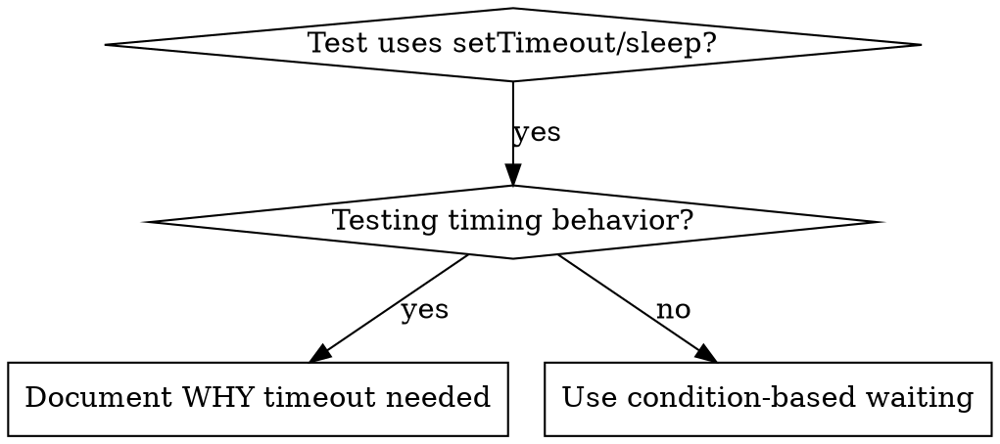

# Condition-Based Waiting

## Core Principle

Wait for the actual condition you care about, not a guess about how long it takes.

## When to Use



**Use when:**

- Tests have arbitrary delays (`setTimeout`, `sleep`, `time.sleep()`)
- Tests are flaky (pass sometimes, fail under load)
- Tests timeout when run in parallel
- Waiting for async operations to complete

**Don't use when:**

- Testing actual timing behavior (debounce, throttle intervals)
- Always document WHY if using arbitrary timeout

## Core Pattern

```typescript
// BEFORE: Guessing at timing
await new Promise((r) => setTimeout(r, 50));
const result = getResult();
expect(result).toBeDefined();

// AFTER: Waiting for condition
await waitFor(() => getResult() !== undefined);
const result = getResult();
expect(result).toBeDefined();
```

## Quick Patterns

| Scenario          | Pattern                                              |
| ----------------- | ---------------------------------------------------- |
| Wait for event    | `waitFor(() => events.find(e => e.type === 'DONE'))` |
| Wait for state    | `waitFor(() => machine.state === 'ready')`           |
| Wait for count    | `waitFor(() => items.length >= 5)`                   |
| Wait for file     | `waitFor(() => fs.existsSync(path))`                 |
| Complex condition | `waitFor(() => obj.ready && obj.value > 10)`         |

## Implementation

Generic polling function — poll condition, timeout with descriptive error:

```typescript
async function waitFor<T>(
  condition: () => T | undefined | null | false,
  description: string,
  timeoutMs = 5000
): Promise<T>
```

See @example.ts for complete implementation with domain-specific helpers (`waitForEvent`, `waitForEventCount`, `waitForEventMatch`).

## Common Mistakes

| Mistake | Symptom | Fix |
| --- | --- | --- |
| Polling too fast (`setTimeout(check, 1)`) | CPU spike, event loop starvation | Poll every 10ms |
| No timeout on polling loop | Test hangs forever if condition never met | Always include timeout with descriptive error message |
| Caching state before loop | Condition never sees updated value | Call getter inside loop for fresh data each iteration |
| Vague timeout error message | "Timeout" with no context on what failed | Include condition description and elapsed time in error |

## When Arbitrary Timeout IS Correct

```typescript
// Tool ticks every 100ms - need 2 ticks to verify partial output
await waitForEvent(manager, 'TOOL_STARTED'); // First: wait for condition
await new Promise((r) => setTimeout(r, 200)); // Then: wait for timed behavior
// 200ms = 2 ticks at 100ms intervals - documented and justified
```

**Requirements:**

1. First wait for triggering condition
2. Based on known timing (not guessing)
3. Comment explaining WHY

## Red Flags / Rationalizations

| What you hear | Why it is wrong | What to do instead |
| --- | --- | --- |
| "Just add a 500ms sleep, it works on my machine" | Timing varies across machines, CI, load | Poll for the actual condition |
| "The flaky test only fails sometimes, increase the timeout" | Longer timeout masks the race condition, slows the suite | Find what state you are actually waiting for and poll it |
| "We need sleep here because the event loop needs to flush" | If you need a microtask flush, use `await Promise.resolve()` or `process.nextTick` | Use the correct flush mechanism, not arbitrary delay |
| "It is only 50ms, it will not slow anything down" | 50ms x 200 tests = 10 seconds; it adds up fast | Condition-based waits resolve as soon as ready |
| "The API needs time to process" | The API has a detectable state change when done | Poll for the response, state, or side-effect |

## Verification Checklist

Before marking a timing fix complete:

- [ ] No arbitrary `setTimeout`/`sleep` without a comment explaining known timing requirement
- [ ] Every `waitFor` call includes a descriptive `description` parameter
- [ ] Every `waitFor` call has a finite timeout (no infinite polling)
- [ ] Condition function reads fresh state on each poll (no stale closures)
- [ ] Tests pass reliably in 10 consecutive runs, not just once
- [ ] Tests pass under parallel execution (`--parallel` / `--concurrent`)
- [ ] Any remaining arbitrary timeouts document the known interval they depend on
