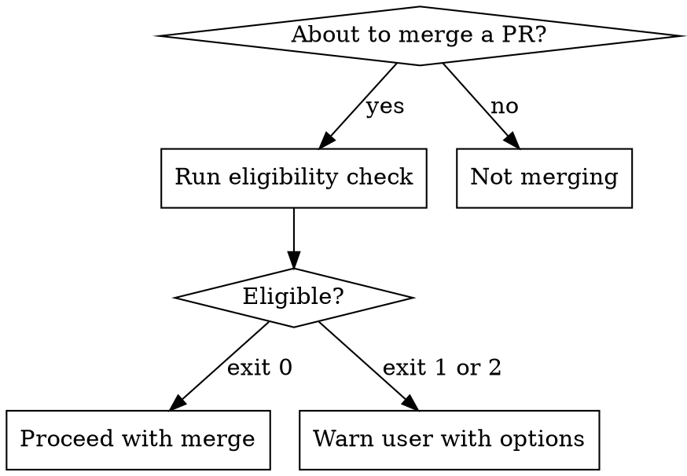

# Merge Guard

Prevents merging a PR while automated reviews are in progress or review comments remain unseen. Acts as a pre-merge gate -- run the eligibility check, interpret the result, and either proceed or warn the user.

## When to Use



**Triggers:** Any action that merges a PR -- `gh pr merge`, merge buttons, `git merge` of a PR branch.

**Don't use when:**
- Merging local branches unrelated to a PR
- PR has no automated reviewers configured
- User has already explicitly said "force merge" in this conversation

## The Process

### Step 1: Determine PR Context

Identify the `owner/repo` and PR number from:
1. Explicit argument or conversation context
2. Current branch: `gh pr view --json number,url`

Track how many review comments you have already seen and triaged in this conversation. If unsure, use 0.

### Step 2: Run Eligibility Check

```bash
${CLAUDE_SKILL_DIR}/check-merge-eligibility.sh <owner/repo> <pr-number> <comments-seen>
```

The script checks three things:
1. **Pending reviewers** -- anyone still in the requested reviewers list
2. **Copilot review status** -- requested, work started, review completed
3. **Comment count vs seen** -- total PR comments minus what the agent has triaged

### Step 3: Interpret Result

| Exit Code | Status | Meaning |
|-----------|--------|---------|
| 0 | `eligible` | All clear -- no pending automated reviews, all comments triaged |
| 1 | `review_in_progress` | Copilot was requested but hasn't completed its review |
| 2 | `unseen_comments` | Review comments exist that the agent hasn't triaged |
| 3 | (error) | Script failure -- report error, do not merge |

**On exit 0:** Proceed with the merge. If `pending_reviewers` in the JSON is non-empty, mention the human reviewers but do not block.

**On exit 1 or 2:** Block the merge and warn the user (see below).

### Step 4: When Blocked

Do NOT silently refuse. Present the situation and options:

> "Hold on -- [reason from JSON `details` field]. Merging now would discard that feedback.
>
> Options:
> 1. **Wait** -- I'll monitor for the review to complete (uses `wait-for-pr-comments` skill)
> 2. **Force merge** -- Merge anyway, skipping the pending review
>
> What would you like to do?"

- **User chooses wait:** Invoke the `wait-for-pr-comments` skill, then re-run eligibility check before merging
- **User chooses force merge:** Proceed without further objection

### Human Reviewers

If `pending_reviewers` contains non-Copilot names, mention them in the warning as informational -- do not hard-block for human reviewers. The user decides whether to wait for humans.

## Decision Matrix

| Copilot Requested | Review Complete | Comments Seen | Action |
|---|---|---|---|
| No | N/A | N/A | Proceed |
| Yes | No | N/A | **Block** -- review in progress |
| Yes | Yes | All triaged | Proceed |
| Yes | Yes | Unseen exist | **Block** -- triage first |

## Agent Judgment on "Comments Seen"

You are responsible for tracking how many review comments you've processed. Count comments you have:
- Read and addressed (fixed or reported to user)
- Read and explicitly deferred with user approval
- Read as part of `wait-for-pr-comments` triage

Do NOT count: comments you saw in a previous conversation, comments you "know about" but haven't read, or comments on a different PR.

When in doubt, pass 0 -- better to block and verify than to merge over unseen feedback.

## Red Flags

| Thought | Reality |
|---------|---------|
| "Copilot is slow, just merge" | Copilot reviews arrive within minutes. Worth waiting. |
| "I already saw some comments, close enough" | Partial triage isn't full triage. Run the check. |
| "The user seems impatient" | Present options, let them choose. Don't assume. |
| "It's a tiny PR, review won't matter" | Small PRs still get useful feedback. Follow the process. |
| "I'll check after merging" | After merge, review feedback is wasted. Check before. |
| "The script errored, probably fine" | Exit 3 means unknown state. Do not merge. Report the error. |
