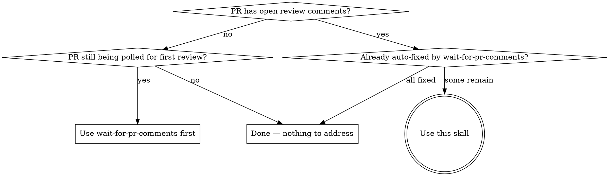

# resolve-pr-comments

Address open PR review comments via per-comment subagents: clarify only when judgment can't, dispatch one subagent per fix, gate per fix and again before push, reply to every comment with rationale, resolve only what was actually FIXED.

**Core principle:** One subagent per comment. Quality gate per fix, then a final gate. Resolve only FIXED — the reviewer decides on the rest.

**MERGE PROHIBITION:** Resolving every conversation is NOT authorization to merge. Merge only on explicit user say-so this session ("merge it", "ship it", "go ahead and merge").

## When to Use



- Open review comments (Copilot, human, or both) ready to triage
- Hand-off from `wait-for-pr-comments` after skipped/ambiguous items
- User asks to "address PR comments", "resolve review feedback", or similar

**Don't use when:**
- PR is still being polled for first review (use `wait-for-pr-comments`)
- PR is draft, merged, or closed
- Comments are on a sibling PR (one PR per invocation)

## ID Vocabulary

GitHub uses several identifiers — wrong one breaks the call.

| ID | Source | Used for |
|----|--------|----------|
| Thread `id` (opaque node ID) | GraphQL `reviewThreads.nodes.id` | `resolveReviewThread` mutation |
| Review-comment `databaseId` (numeric) | GraphQL `reviewThreads.nodes.comments.nodes.databaseId` or REST `id` | Inline REST replies (`/pulls/<n>/comments/<id>/replies`) |
| Review-comment node `id` (opaque) | GraphQL `comments.nodes.id` | GraphQL mutations on comments (rare here) |
| Review `id` (opaque node ID) | GraphQL `reviews.nodes.id` | Referencing a top-level review summary — no reply/resolve API |
| Issue-comment `id` (numeric) | `gh pr view --comments` / REST `/issues/<n>/comments` | Top-level PR conversation comments — no threads |

## The Process

Six phases. Orchestrator (you) does inventory, triage, dispatch, final gate, reply/resolve. Implementation lives in per-comment subagents.

### Phase 1: Inventory

Pull EVERY open thread — inline AND top-level review summaries. Skipping one looks like you ignored the reviewer.

Three feedback surfaces, three commands:

```bash
# Source A: top-level issue comments on the PR (PR conversation tab)
gh pr view <number> --comments
# or: gh api repos/{owner}/{repo}/issues/<number>/comments

# Source B: inline review comments (REST — gives numeric databaseIds for replies)
gh api repos/{owner}/{repo}/pulls/<number>/comments

# Source C: review threads (+ resolution state) AND review summaries (GraphQL)
# Call with $threadsAfter=<cursor-or-empty> and $reviewsAfter=<cursor-or-empty>; loop both connections until pageInfo.hasNextPage is false.
gh api graphql -f query='
  query($owner:String!,$repo:String!,$number:Int!,$threadsAfter:String,$reviewsAfter:String){
    repository(owner:$owner,name:$repo){
      pullRequest(number:$number){
        reviewThreads(first:100, after:$threadsAfter){
          pageInfo{ hasNextPage endCursor }
          nodes{
            id isResolved isOutdated
            comments(first:100){
              pageInfo{ hasNextPage endCursor }
              nodes{ databaseId body path line author{login} }
            }
          }
        }
        reviews(first:100, after:$reviewsAfter){
          pageInfo{ hasNextPage endCursor }
          nodes{ id state body author{login} submittedAt }
        }
      }
    }
  }' -F owner=<owner> -F repo=<repo> -F number=<number> -F threadsAfter=<cursor-or-empty> -F reviewsAfter=<cursor-or-empty>
```

- **Review threads** (Source C) — inline review comments grouped by thread. Can be resolved.
- **Review summaries** (Source C, `reviews.nodes` with non-empty `body`) — top-level review bodies submitted alongside inline comments. Cannot be resolved.
- **Top-level issue comments** (Source A) — PR conversation tab. Cannot be resolved; have no threads.
- **Pagination (loop all three connections):** `reviewThreads`, inner `comments`, and `reviews` all expose `pageInfo{hasNextPage, endCursor}`. Pass `endCursor` as the next `after` until `hasNextPage` is false. Don't silently truncate.
- **Outdated threads** (`isOutdated: true` after rebase): low-priority — reply acknowledging, resolve only if the underlying concern was actually addressed.

**Build an explicit, discriminated inventory** covering every feedback item you may need to answer in Phase 5. Use a `kind` discriminator and kind-specific IDs — never overload a single `comment_id`:

| Field | `kind: "review_thread"` | `kind: "review_summary"` | `kind: "issue_comment"` |
|-------|------------------------|--------------------------|-------------------------|
| `thread_id` | GraphQL `reviewThreads.nodes.id` | — | — |
| `reply_to_comment_id` | latest `comments.nodes.databaseId` in thread (reply target) | — | — |
| `review_id` | — | `reviews.nodes.id` | — |
| `issue_comment_id` | — | — | REST `id` from Source A |
| `author`, `body`, `location` | as available | as available (location usually null) | as available (location null) |
| `isResolved`, `isOutdated` | yes | — | — |

- **Review threads:** one inventory item per non-resolved thread. `reply_to_comment_id` is the most recent comment's `databaseId` (the reply endpoint threads against the latest comment).
- **Review summaries:** one item per `reviews.nodes` with non-empty `body`. Treat the review body as the "comment"; reply via `gh pr comment` (no thread to resolve).
- **Issue comments:** one item per `gh pr view --comments` entry that isn't part of a review thread. Reply via `gh pr comment` referencing the original.

Drop already-resolved threads from the active working set (but keep IDs handy for bookkeeping).

### Phase 2: Triage Per Comment

Classify each comment. **Bias toward judgment** — escalation is expensive and breaks flow.

| Classification | Action |
|----------------|--------|
| Clear + actionable | Dispatch subagent (Phase 3) |
| Ambiguous, resolvable from code/context | Read the code, decide, then dispatch |
| Ambiguous, requires human judgment | Batch into ONE question covering all unclear items |
| Out of scope, disagreed, deferred | Plan a reasoned reply for Phase 5 — do NOT dispatch |
| Trivial (typo, magic number, single-line) | Inline fix permitted; still goes through Phase 5 |
| Duplicate / same root cause | Pick one as primary; cross-reference others in their replies |

Escalate only when code, context, and standard judgment cannot resolve it.

### Phase 3: Per-Comment Subagent Dispatch

For each actionable comment, dispatch ONE subagent. Each subagent must:

1. **Plan** scoped to this comment only — no scope creep
2. **Execute**:
   - Significant work (refactor, multi-file, new logic, behavior change) → `ralf-it` skill
   - Trivial work (typo, constant rename, missing null check) → direct implementation
3. **Per-fix completion gate** (mandatory for non-trivial; skip for obvious one-liners):
   - `code-reviewer` agent → address findings
   - `code-simplifier` agent → address findings
   - `verify-checklist` skill → build, typecheck, lint, relevant tests pass — evidence in report
4. **Commit** locally: `fix(<scope>): <summary> (PR #<n> comment <comment_id>)`
5. **Report back**: comment_id, fix summary, commit SHA, verification evidence, deviations

**Serialization:** Subagents touching overlapping files run sequentially. Independent files may run in parallel.

**Mid-flight changes:** New comments arrive during Phase 3 → finish in-flight subagents, re-inventory before Phase 4. PR closed/merged mid-flight (`gh pr view --json state`) → STOP, report local commits, ask user.

### Phase 4: Final Verification + Push

Once all subagents have reported:

1. Run `verify-checklist` again across the combined work, with evidence
2. If verification fails: diagnose, fix, re-verify. Do NOT push a broken state.
3. Push to the PR branch:
   ```bash
   git push
   ```
4. **Push fails (non-fast-forward):** PR base advanced. Pull-rebase against the PR base, re-run verify-checklist, push again. **Do NOT use `--force` or `--force-with-lease` without explicit user authorization** — force-push on a PR can clobber co-author commits.
5. Capture the new head SHA for replies.

### Phase 5: Reply + Resolve

Reply to EVERY item in the original inventory — FIXED and SKIPPED, every `kind`. Silence reads as ignoring the reviewer. Response path depends on `kind`:

| `kind` | Reply endpoint | Resolvable? |
|--------|---------------|-------------|
| `review_thread` | `POST /pulls/<n>/comments/<reply_to_comment_id>/replies` | Yes — `resolveReviewThread` mutation if FIXED |
| `review_summary` | `gh pr comment <n> --body "..."` (reference the review in the body) | No — no resolve API |
| `issue_comment` | `gh pr comment <n> --body "..."` (reference `<issue_comment_id>` in the body) | No — no threads, no resolve |

**`review_thread` — FIXED:**
```bash
# 1. Reply on the thread
gh api repos/{owner}/{repo}/pulls/<number>/comments/<reply_to_comment_id>/replies \
  -F body="Fixed in <sha>: <one-line summary>."

# 2. Resolve (variable-bound mutation)
gh api graphql -f query='
  mutation($id:ID!){
    resolveReviewThread(input:{threadId:$id}){
      thread{ isResolved }
    }
  }' -F id=<thread_id>
```

**`review_thread` — SKIPPED** (out of scope, disagreed, deferred):
```bash
# Reply with rationale — do NOT resolve
gh api repos/{owner}/{repo}/pulls/<number>/comments/<reply_to_comment_id>/replies \
  -F body="Not addressed in this PR: <reason>. <follow-up if any, e.g., tracked in bd-xxx>."
```
Reviewer decides whether to accept. Resolving on their behalf erases their voice.

**`review_summary` — FIXED or SKIPPED:**
```bash
# No thread to resolve. Reference the review in the body so the exchange is discoverable.
gh pr comment <number> --body "Re: review by @<author> (<submittedAt>): <Fixed in <sha>: ...> OR <Not addressed: <reason>.>"
```

**`issue_comment` — FIXED or SKIPPED:**
```bash
# Issue comments have no /replies endpoint. Cross-reference the original comment in the reply body.
gh pr comment <number> --body "Re: @<author>'s comment (https://github.com/{owner}/{repo}/pull/<n>#issuecomment-<issue_comment_id>): <Fixed in <sha>: ...> OR <Not addressed: <reason>.>"
```

**Resolve only `review_thread` items with status FIXED.** Never resolve on the reviewer's behalf when SKIPPED, and `review_summary`/`issue_comment` have no resolve concept at all.

### Phase 6: Final Report

```markdown
## PR Comment Resolution Complete

**PR:** #<number> — "<title>"
**Head SHA after push:** `<sha>`

### Summary
- Total comments: <n>
- Fixed + resolved: <n>
- Skipped (reply only): <n>
- Escalated to user: <n>

### Per-comment status
- **@<author>** (<location>): <one-line> → Fixed in `<sha>` / Skipped: <reason> / Escalated

### Follow-up
- Beads created for skipped items: bd-xxx, bd-yyy
- Next: await reviewer response. **Do NOT merge** without explicit user authorization.
```

## Quick Reference

| Step | Command |
|------|---------|
| Issue comments (Source A) | `gh pr view <n> --comments` |
| Inline review comments (Source B, REST) | `gh api repos/{owner}/{repo}/pulls/<n>/comments` |
| Threads + summaries paginated (Source C, GraphQL) | `gh api graphql -f query='query($owner:String!,$repo:String!,$number:Int!,$threadsAfter:String,$reviewsAfter:String){...reviewThreads(first:100,after:$threadsAfter){pageInfo{hasNextPage endCursor} nodes{id isResolved isOutdated comments(first:100){pageInfo{hasNextPage endCursor} nodes{databaseId body path line author{login}}}}} reviews(first:100,after:$reviewsAfter){pageInfo{hasNextPage endCursor} nodes{id state body author{login}}}...}' -F owner=<o> -F repo=<r> -F number=<n> -F threadsAfter=<cursor-or-empty> -F reviewsAfter=<cursor-or-empty>` |
| Reply to `review_thread` | `gh api repos/{owner}/{repo}/pulls/<n>/comments/<reply_to_comment_id>/replies -F body=...` |
| Resolve `review_thread` | `gh api graphql -f query='mutation($id:ID!){resolveReviewThread(input:{threadId:$id}){thread{isResolved}}}' -F id=<thread_id>` |
| Reply to `review_summary` / `issue_comment` | `gh pr comment <n> --body "..."` (no resolve) |
| Check PR state mid-flight | `gh pr view <n> --json state,mergeable,headRefOid` |

## Red Flags

If you catch yourself doing any of these, STOP — you are deviating from the process.

| Rationalization | Why it's wrong |
|-----------------|----------------|
| "I'll bundle these 5 fixes into one subagent — faster" | Per-comment dispatch keeps the gate honest. Bundling hides regressions. |
| "I'll resolve the skipped ones — closed in my mind" | Not closed in the reviewer's mind. Resolve FIXED only. |
| "I'll push first, verify after" | Reviewers don't want to chase a broken commit. Verify, then push. |
| "I'll skip the per-fix gate to save time" | Final gate doesn't replace per-fix. Both are required for non-trivial work. |
| "Final verify-checklist is overkill — each fix passed" | Combined fixes interact. Final gate catches cross-fix regressions. |
| "This ambiguity is too much trouble — I'll ask the user" | Read the code. Decide. Escalate only on real architectural forks. |
| "All threads resolved → I should merge" | **Never merge without explicit authorization in the current session.** |
| "Top-level review needs a resolve too" | Summaries have no thread — comment-only. Resolve will error. |
| "Issue comments and review summaries are basically the same" | Different sources and IDs. `issue_comment` → `issues/<n>/comments`; `review_summary` → `reviews.nodes`. Keep `kind` explicit. |
| "One comment_id field is enough for all feedback sources" | Overloading hides bugs in Phase 5. Store `thread_id`, `reply_to_comment_id`, `review_id`, `issue_comment_id` separately by `kind`. |
| "reviews(first:50) without pagination is fine" | Active PRs can exceed 50 reviews. `reviews` also needs `pageInfo + after` loops. |
| "I'll skip replies on skipped items — silence is fine" | Silence reads as ignoring the reviewer. Always reply with rationale. |
| "Push got rejected — I'll just `--force-with-lease`" | Force-push without authorization is hard-to-reverse on shared state. Pull-rebase. |
| "Only 100 threads max, no need to paginate" | Active reviews can exceed that. Always check `hasNextPage`. |
| "I'll parallelize all subagents" | Serialize overlapping files; only independent files run in parallel. |
| "New comments arrived mid-flight — I'll handle them next time" | Re-inventory after Phase 3; address in the same run. |
| "Reply with 'Done.' — short and sweet" | Each reply must explain what changed (+ SHA) or why skipped. |
| "Inline `<id>` directly into the GraphQL mutation" | Use `-F id=<thread_id>` with `mutation($id:ID!)` — variable binding only. |

## Related Skills

- **`wait-for-pr-comments`** — runs FIRST, polls and auto-fixes the unambiguous slice. This skill picks up what's left.
- **`ralf-it`** — invoked INSIDE per-comment subagents for significant work; owns its own planning and refinement.
- **`verify-checklist`** — per-fix (inside subagents) AND once at the end (orchestrator).
