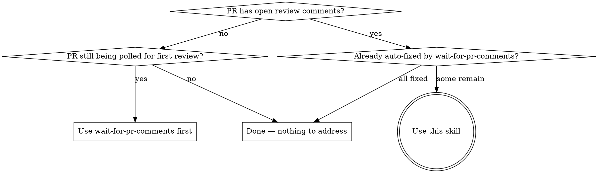

# resolve-pr-comments

Address open PR review comments via per-comment subagents: clarify only when judgment can't, dispatch one subagent per fix, gate per fix and again before push, reply to every comment with rationale, resolve only what was actually FIXED.

**Core principle:** One subagent per comment. Quality gate per fix, then a final gate. Resolve only FIXED — the reviewer decides on the rest.

**MERGE PROHIBITION:** Resolving every conversation is NOT authorization to merge. Merge only on explicit user say-so this session ("merge it", "ship it", "go ahead and merge").

## When to Use



- Open review comments (Copilot, human, or both) ready to triage
- Hand-off from `wait-for-pr-comments` after skipped/ambiguous items
- User asks to "address PR comments", "resolve review feedback", or similar

**Don't use when:**
- PR is still being polled for first review (use `wait-for-pr-comments`)
- PR is draft, merged, or closed
- Comments are on a sibling PR (one PR per invocation)

## ID Vocabulary

GitHub uses three identifiers — wrong one breaks the call.

| ID | Source | Used for |
|----|--------|----------|
| Thread `id` (opaque node ID) | GraphQL `reviewThreads.nodes.id` | `resolveReviewThread` mutation |
| Comment `databaseId` (numeric) | GraphQL `comments.nodes.databaseId` or REST `id` | REST replies, REST cross-references |
| Comment node `id` (opaque) | GraphQL `comments.nodes.id` | GraphQL mutations on comments (rare here) |

`<thread_id>` = node ID. `<comment_id>` = numeric `databaseId`.

## The Process

Six phases. Orchestrator (you) does inventory, triage, dispatch, final gate, reply/resolve. Implementation lives in per-comment subagents.

### Phase 1: Inventory

Pull EVERY open thread — inline AND top-level review summaries. Skipping one looks like you ignored the reviewer.

```bash
# Top-level issue comments on the PR
gh pr view <number> --comments

# Inline review comments (REST — gives numeric comment IDs for replies)
gh api repos/{owner}/{repo}/pulls/<number>/comments

# Review threads with thread IDs + resolution state (GraphQL — required for resolve)
# First call: pass -F after="" (or omit; `$after: String` is nullable). Subsequent calls pass endCursor.
gh api graphql -f query='
  query($owner:String!,$repo:String!,$number:Int!,$after:String){
    repository(owner:$owner,name:$repo){
      pullRequest(number:$number){
        reviewThreads(first:100, after:$after){
          pageInfo{ hasNextPage endCursor }
          nodes{
            id isResolved isOutdated
            comments(first:100){
              pageInfo{ hasNextPage endCursor }
              nodes{ databaseId body path line author{login} }
            }
          }
        }
        reviews(first:50){
          nodes{ id state body author{login} submittedAt }
        }
      }
    }
  }' -F owner=<owner> -F repo=<repo> -F number=<number> -F after=<cursor-or-empty>
```

- **Top-level review summaries** live on `reviews.nodes` (non-empty `body`), NOT on `reviewThreads`.
- **Thread pagination:** loop while `reviewThreads.pageInfo.hasNextPage` is true, passing `endCursor` as the next `after`. Don't silently truncate.
- **Per-thread comment pagination:** `comments(first:100)` covers almost every real thread; if `comments.pageInfo.hasNextPage` is true for any thread, paginate that thread separately with the same pattern — you need the latest `databaseId` to reply.
- **Outdated threads** (`isOutdated: true` after rebase): low-priority — reply acknowledging, resolve only if the underlying concern was actually addressed.

Build a working list: `{ thread_id, comment_id, author, location, body, isResolved, isOutdated }`. Drop already-resolved.

### Phase 2: Triage Per Comment

Classify each comment. **Bias toward judgment** — escalation is expensive and breaks flow.

| Classification | Action |
|----------------|--------|
| Clear + actionable | Dispatch subagent (Phase 3) |
| Ambiguous, resolvable from code/context | Read the code, decide, then dispatch |
| Ambiguous, requires human judgment | Batch into ONE question covering all unclear items |
| Out of scope, disagreed, deferred | Plan a reasoned reply for Phase 5 — do NOT dispatch |
| Trivial (typo, magic number, single-line) | Inline fix permitted; still goes through Phase 5 |
| Duplicate / same root cause | Pick one as primary; cross-reference others in their replies |

Escalate only when code, context, and standard judgment cannot resolve it.

### Phase 3: Per-Comment Subagent Dispatch

For each actionable comment, dispatch ONE subagent. Each subagent must:

1. **Plan** scoped to this comment only — no scope creep
2. **Execute**:
   - Significant work (refactor, multi-file, new logic, behavior change) → `ralf-it` skill
   - Trivial work (typo, constant rename, missing null check) → direct implementation
3. **Per-fix completion gate** (mandatory for non-trivial; skip for obvious one-liners):
   - `code-reviewer` agent → address findings
   - `code-simplifier` agent → address findings
   - `verify-checklist` skill → build, typecheck, lint, relevant tests pass — evidence in report
4. **Commit** locally: `fix(<scope>): <summary> (PR #<n> comment <comment_id>)`
5. **Report back**: comment_id, fix summary, commit SHA, verification evidence, deviations

**Serialization:** Subagents touching overlapping files run sequentially. Independent files may run in parallel.

**Mid-flight changes:** New comments arrive during Phase 3 → finish in-flight subagents, re-inventory before Phase 4. PR closed/merged mid-flight (`gh pr view --json state`) → STOP, report local commits, ask user.

### Phase 4: Final Verification + Push

Once all subagents have reported:

1. Run `verify-checklist` again across the combined work, with evidence
2. If verification fails: diagnose, fix, re-verify. Do NOT push a broken state.
3. Push to the PR branch:
   ```bash
   git push
   ```
4. **Push fails (non-fast-forward):** PR base advanced. Pull-rebase against the PR base, re-run verify-checklist, push again. **Do NOT use `--force` or `--force-with-lease` without explicit user authorization** — force-push on a PR can clobber co-author commits.
5. Capture the new head SHA for replies.

### Phase 5: Reply + Resolve

Reply to EVERY comment in the original inventory — fixed AND skipped. Silence reads as ignoring the reviewer.

**FIXED — inline review comment:**
```bash
# 1. Reply on the comment thread
gh api repos/{owner}/{repo}/pulls/<number>/comments/<comment_id>/replies \
  -F body="Fixed in <sha>: <one-line summary>."

# 2. Resolve the conversation (variable-bound mutation)
gh api graphql -f query='
  mutation($id:ID!){
    resolveReviewThread(input:{threadId:$id}){
      thread{ isResolved }
    }
  }' -F id=<thread_id>
```

**FIXED — top-level review summary** (lives on `reviews.nodes`, no thread):
```bash
gh pr comment <number> --body "Addressed in <sha>: <summary>."
# No resolve — top-level reviews have no resolvable thread.
```

**SKIPPED — inline** (out of scope, disagreed, deferred):
```bash
# Reply with rationale — do NOT resolve
gh api repos/{owner}/{repo}/pulls/<number>/comments/<comment_id>/replies \
  -F body="Not addressed in this PR: <reason>. <follow-up if any, e.g., tracked in bd-xxx>."
```
Reviewer decides whether to accept. Resolving on their behalf erases their voice.

**SKIPPED — top-level:** same `gh pr comment` form with rationale; no resolve regardless.

### Phase 6: Final Report

```markdown
## PR Comment Resolution Complete

**PR:** #<number> — "<title>"
**Head SHA after push:** `<sha>`

### Summary
- Total comments: <n>
- Fixed + resolved: <n>
- Skipped (reply only): <n>
- Escalated to user: <n>

### Per-comment status
- **@<author>** (<location>): <one-line> → Fixed in `<sha>` / Skipped: <reason> / Escalated

### Follow-up
- Beads created for skipped items: bd-xxx, bd-yyy
- Next: await reviewer response. **Do NOT merge** without explicit user authorization.
```

## Quick Reference

| Step | Command |
|------|---------|
| Top-level + summary comments | `gh pr view <n> --comments` |
| Inline comments (REST) | `gh api repos/{owner}/{repo}/pulls/<n>/comments` |
| Threads + IDs (GraphQL) | `gh api graphql -f query='query($owner:String!,$repo:String!,$number:Int!,$after:String){...reviewThreads(first:100,after:$after){pageInfo{hasNextPage endCursor} nodes{id isResolved isOutdated comments(first:100){pageInfo{hasNextPage endCursor} nodes{databaseId body path line author{login}}}}} reviews(first:50){nodes{id state body author{login}}}...}' -F owner=<o> -F repo=<r> -F number=<n> -F after=<cursor-or-empty>` |
| Reply to inline comment | `gh api repos/{owner}/{repo}/pulls/<n>/comments/<comment_id>/replies -F body=...` |
| Resolve thread | `gh api graphql -f query='mutation($id:ID!){resolveReviewThread(input:{threadId:$id}){thread{isResolved}}}' -F id=<thread_id>` |
| Top-level reply (no resolve) | `gh pr comment <n> --body "..."` |
| Check PR state mid-flight | `gh pr view <n> --json state,mergeable,headRefOid` |

## Red Flags

If you catch yourself doing any of these, STOP — you are deviating from the process.

| Rationalization | Why it's wrong |
|-----------------|----------------|
| "I'll bundle these 5 fixes into one subagent — faster" | Per-comment dispatch keeps the gate honest. Bundling hides regressions. |
| "I'll resolve the skipped ones — closed in my mind" | Not closed in the reviewer's mind. Resolve FIXED only. |
| "I'll push first, verify after" | Reviewers don't want to chase a broken commit. Verify, then push. |
| "I'll skip the per-fix gate to save time" | Final gate doesn't replace per-fix. Both are required for non-trivial work. |
| "Final verify-checklist is overkill — each fix passed" | Combined fixes interact. Final gate catches cross-fix regressions. |
| "This ambiguity is too much trouble — I'll ask the user" | Read the code. Decide. Escalate only on real architectural forks. |
| "All threads resolved → I should merge" | **Never merge without explicit authorization in the current session.** |
| "Top-level review needs a resolve too" | Summaries have no thread — comment-only. Resolve will error. |
| "I'll skip replies on skipped items — silence is fine" | Silence reads as ignoring the reviewer. Always reply with rationale. |
| "Push got rejected — I'll just `--force-with-lease`" | Force-push without authorization is hard-to-reverse on shared state. Pull-rebase. |
| "Only 100 threads max, no need to paginate" | Active reviews can exceed that. Always check `hasNextPage`. |
| "I'll parallelize all subagents" | Serialize overlapping files; only independent files run in parallel. |
| "New comments arrived mid-flight — I'll handle them next time" | Re-inventory after Phase 3; address in the same run. |
| "Reply with 'Done.' — short and sweet" | Each reply must explain what changed (+ SHA) or why skipped. |
| "Inline `<id>` directly into the GraphQL mutation" | Use `-F id=<thread_id>` with `mutation($id:ID!)` — variable binding only. |

## Related Skills

- **`wait-for-pr-comments`** — runs FIRST, polls and auto-fixes the unambiguous slice. This skill picks up what's left.
- **`ralf-it`** — invoked INSIDE per-comment subagents for significant work; owns its own planning and refinement.
- **`verify-checklist`** — per-fix (inside subagents) AND once at the end (orchestrator).
