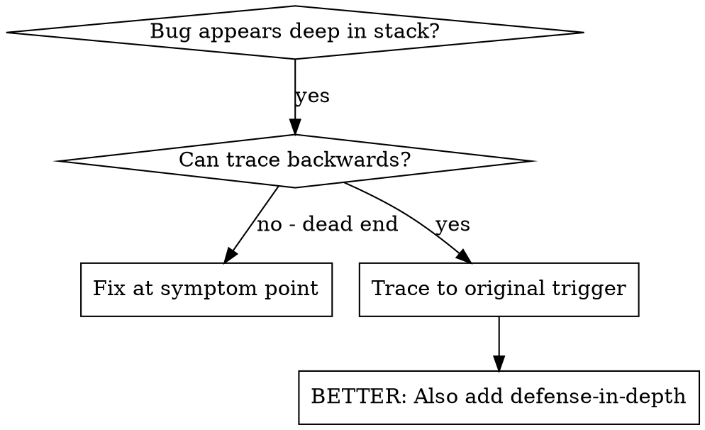

# Root Cause Tracing

## Core Principle

**Trace backward through the call chain until you find the original trigger, then fix at the source.** Never fix where the error appears — that is treating a symptom. Use ultrathink for deep causal reasoning.

## When to Use



**Use when:**

- Error happens deep in execution (not at entry point)
- Stack trace shows long call chain
- Unclear where invalid data originated
- Need to find which test/code triggers the problem

**Do NOT use when:**

- Error is at the entry point with an obvious cause
- Stack trace is one level deep and the fix is clear
- Problem is a simple typo or syntax error

## The Tracing Process

### 1. Observe the Symptom

```
Error: git init failed in /Users/jesse/project/packages/core
```

### 2. Find Immediate Cause

**What code directly causes this?**

```typescript
await execFileAsync('git', ['init'], { cwd: projectDir });
```

### 3. Ask: What Called This?

```typescript
WorktreeManager.createSessionWorktree(projectDir, sessionId)
  → called by Session.initializeWorkspace()
  → called by Session.create()
  → called by test at Project.create()
```

### 4. Keep Tracing Up

**What value was passed?**

- `projectDir = ''` (empty string!)
- Empty string as `cwd` resolves to `process.cwd()`
- That's the source code directory!

### 5. Find Original Trigger

**Where did empty string come from?**

```typescript
const context = setupCoreTest(); // Returns { tempDir: '' }
Project.create('name', context.tempDir); // Accessed before beforeEach!
```

## Adding Stack Traces

When you can't trace manually, add instrumentation:

```typescript
// Before the problematic operation
async function gitInit(directory: string) {
  const stack = new Error().stack;
  console.error('DEBUG git init:', {
    directory,
    cwd: process.cwd(),
    nodeEnv: process.env.NODE_ENV,
    stack,
  });

  await execFileAsync('git', ['init'], { cwd: directory });
}
```

**Tips for effective instrumentation:**

- **Use `console.error()`** in tests, not logger — logger output may be suppressed
- **Log before** the dangerous operation, not just after it fails
- **Include context:** directory, cwd, environment variables, timestamps
- **Capture stack:** `new Error().stack` shows the complete call chain

**Run and capture:**

```bash
npm test 2>&1 | grep 'DEBUG git init'
```

**Analyze stack traces:**

- Look for test file names
- Find the line number triggering the call
- Identify the pattern (same test? same parameter?)

## Finding Which Test Causes Pollution

If something appears during tests but you don't know which test:

Use the bisection script at `${CLAUDE_SKILL_DIR}/find-polluter.sh`:

```bash
./find-polluter.sh '.git' 'src/**/*.test.ts'
```

Runs tests one-by-one, stops at first polluter. See script for usage.

## Real Example: Empty projectDir

**Symptom:** `.git` created in `packages/core/` (source code)

**Trace chain:**

1. `git init` runs in `process.cwd()` — empty cwd parameter
2. WorktreeManager called with empty projectDir
3. Session.create() passed empty string
4. Test accessed `context.tempDir` before beforeEach
5. setupCoreTest() returns `{ tempDir: '' }` initially

**Root cause:** Top-level variable initialization accessing empty value

**Fix:** Made tempDir a getter that throws if accessed before beforeEach

**Also added defense-in-depth:**

- Layer 1: Project.create() validates directory
- Layer 2: WorkspaceManager validates not empty
- Layer 3: NODE_ENV guard refuses git init outside tmpdir
- Layer 4: Stack trace logging before git init

## Key Principle

**NEVER fix just where the error appears.** Trace back to find the original trigger. Once found, fix at the source AND add validation at each layer you traced through so the bug becomes impossible.

## Red Flags: Rationalizations to Resist

| Rationalization | Why It's Wrong |
|---|---|
| "I can see the fix right here" | You're looking at the symptom, not the cause |
| "Adding a null check will handle it" | Null checks at the crash site mask upstream bugs |
| "The error message tells me what to do" | Error messages describe symptoms, not sources |
| "It's faster to just fix it here" | Faster now, but the same class of bug will recur |
| "The stack trace is too deep to follow" | Add instrumentation — that's what it's for |
| "It only fails in this one test" | The test is exposing a real code path problem |
| "A try/catch will make it safe" | Swallowing errors hides root causes from future debugging |

## Verification Checklist

Before marking the fix complete:

- [ ] Traced the full call chain from symptom to original trigger
- [ ] Fix is applied at the source, not at the symptom point
- [ ] Defense-in-depth: added validation at intermediate layers
- [ ] Invalid state is now impossible (not just caught)
- [ ] Removed all temporary debug instrumentation
- [ ] Existing tests pass with the fix applied
- [ ] Added or updated tests that would catch this class of bug
