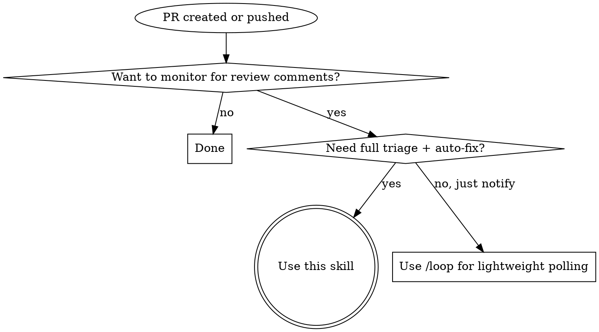

# wait-for-pr-comments

Poll a PR for review comments, auto-fix what's unambiguous, report the rest. One PR per invocation, one re-poll after fixes, then hand back to user.

## When to Use



## When NOT to Use

- PR is a draft not ready for review
- You need to monitor multiple PRs simultaneously (one PR per invocation)
- CI/CD status checks are the concern, not human review comments
- PR is already merged or closed

## Arguments

**Positional:** `/wait-for-pr-comments [interval] [max-duration]`

| Argument | Default | Format | Constraint |
|----------|---------|--------|------------|
| interval | `1m` | `Nm` where N >= 1 | Minimum 1m (cron granularity) |
| max-duration | `7m` | `Nm` where N >= 1 | Total polling window per round |

**Parsing rules:**
- Single arg → interval (e.g., `/wait-for-pr-comments 2m`)
- Two args → interval, max-duration (e.g., `/wait-for-pr-comments 2m 10m`)
- No args → defaults `1m 7m`
- Sub-minute intervals are not supported

**Iteration count:** `ceil(max-duration / interval)` — e.g., `7m / 1m = 7 iterations`.

## The Process

Five phases. Always cancel cron jobs before exiting any phase on error.

### Phase 1: PR Detection

Determine PR number from (in order):
1. Explicit argument — PR number or URL passed to the skill
2. Current branch — `gh pr view --json number,title,url`
3. Hook-injected context — pattern match `PR activity detected: #<number>`
4. If no PR found → report error and stop

### Phase 2: Initial Polling

1. Record baseline comment count:
   ```
   gh api repos/{owner}/{repo}/pulls/{number}/comments --jq 'length'
   ```
2. Convert interval to cron expression:

   | Interval | Cron Expression |
   |----------|-----------------|
   | `1m` | `*/1 * * * *` |
   | `2m` | `*/2 * * * *` |
   | `5m` | `*/5 * * * *` |

3. Calculate max iterations: `ceil(max-duration / interval)`
4. Create cron job via `CronCreate` with this prompt template:

```
PR comment check for #<number>.
Started: <ISO-8601 timestamp>. Interval: <N>m. Max duration: <M>m.
Baseline: <count> review comments.

Step 1: Calculate iteration from elapsed time:
  iteration = floor((now - start_time) / interval) + 1
  max_iterations = ceil(max_duration / interval)

Step 2: Run: gh api repos/{owner}/{repo}/pulls/{number}/comments --jq 'length'

Step 3: If count > baseline — new comments found.
  Look up this job's ID via CronList, cancel with CronDelete,
  fetch new comments, invoke wait-for-pr-comments triage.

Step 4: If count == baseline AND iteration >= max_iterations:
  Look up this job's ID via CronList, cancel with CronDelete,
  report no comments — PR is ready to merge.

Step 5: If count == baseline AND iteration < max_iterations:
  Do nothing — wait for next cron fire.
```

**Key behaviors:**
- Iteration tracking is stateless — each fire computes iteration from wall-clock elapsed time
- Job self-cancellation — prompt instructs Claude to `CronList` then `CronDelete` (avoids needing job ID at creation time)
- Cron fires only when REPL is idle (not mid-query) — skill returns control between polls

### Phase 3: Triage & Fix

1. Fetch new comments: `gh api repos/{owner}/{repo}/pulls/{number}/comments`
2. Filter to comments created after baseline timestamp
3. For each comment: assess if fixable unambiguously
4. Fix what can be fixed, record what was skipped and why
5. Commit and push fixes
6. Proceed to Phase 4

### Phase 4: Re-poll (single round)

1. Record new baseline (post-fix comment count)
2. Create new cron job with same interval/duration
3. New comments during re-poll are **reported but NOT auto-fixed** (prevents recursive loops)
4. When complete → cancel cron, proceed to Phase 5

### Phase 5: Final Report

Always deliver a structured report. See Report Templates below.

## Report Templates

**Variant 1 — Clean pass (no comments):**

```markdown
## PR Comment Watch Complete

**PR:** #<number> — "<title>"
**Monitored:** <N> polls over <duration>
**Result:** No review comments received

Ready to merge.
```

**Variant 2 — All fixed, re-poll clean:**

```markdown
## PR Comment Watch Complete

**PR:** #<number> — "<title>"

### Fixed (<count>)
- **@<author>** (<location>): "<comment summary>" → <what was done>

### Status
- Fixes pushed in commit `<sha>`
- Re-poll: No new comments after <duration>

All review feedback addressed. Ready to merge.
```

**Variant 3 — Items need attention:**

```markdown
## PR Comment Watch Complete

**PR:** #<number> — "<title>"

### Fixed (<count>)
- **@<author>** (<location>): "<comment summary>" → <what was done>

### Skipped (<count>)
- **@<author>** (<location>): "<comment summary>" → <reason skipped>

### New During Re-poll (<count>)
- **@<author>** (<location>): "<comment summary>"

### Status
- Fixes pushed in commit `<sha>`
- Re-poll: <status>

What would you like to do about the remaining items?
```

## Error Handling

| Scenario | Action |
|----------|--------|
| No PR found for current branch | Report error, stop |
| `gh auth` failure | Report auth error, stop |
| Commit fails (pre-commit hook, merge conflict) | Report error details, skip push, go to final report |
| `git push` fails (auth, remote rejection) | Report error, include local commit SHA for manual push |
| PR closed or merged during polling | Detect via `gh pr view --json state`, report and stop |
| CronCreate/CronDelete unavailable | Report tool unavailability, stop |

Always cancel active cron jobs before stopping on error.

## Hook Auto-Trigger

A PostToolUse hook script (`detect-pr-push.sh`) watches for:
- `gh pr create` with a PR URL in stdout
- `git push` on a branch with an open PR

When matched, it outputs context for Claude:
```
PR activity detected: #<number> (<url>). Run /wait-for-pr-comments to monitor for review comments.
```

The hook **suggests** invocation — it does not force it. User retains control.

Hook configuration lives in `settings.json.template` under the `hooks.PostToolUse` key. The script is Claude-specific but ships in shared `.agents/skills/` to avoid install clobber; it is inert in non-Claude environments.

## Quick Reference

| Situation | Action |
|-----------|--------|
| PR just created | Skill auto-suggested via hook, or invoke manually |
| Pushed fixes to existing PR | Same — hook detects push, suggests skill |
| Want longer polling window | `/wait-for-pr-comments 1m 15m` |
| Want less frequent checks | `/wait-for-pr-comments 5m 15m` |
| New comments found during initial poll | Auto-triage and fix unambiguous items |
| New comments found during re-poll | Report only, do not auto-fix |
| All comments fixed, re-poll clean | Report ready to merge |
| Some comments skipped | Report with reasons, ask user what to do |
| Error at any phase | Cancel cron, report error, stop |

## Red Flags

If you catch yourself doing any of these, STOP — you are deviating from the process.

| Rationalization | Why it's wrong |
|-----------------|----------------|
| "I'll fix this ambiguous comment anyway" | Ambiguous = needs human decision. Report it, don't guess. |
| "Re-poll found issues, I'll fix those too" | Re-poll comments are report-only. No recursive fix loops. |
| "I'll skip re-poll since all comments were trivial" | Always re-poll after pushing fixes. Reviewers may respond. |
| "I'll keep polling past max-duration" | Respect the time bound. Report and hand back to user. |
| "No need to cancel the cron job, it'll expire" | Always explicitly cancel. Stale cron jobs waste resources. |
| "I'll monitor multiple PRs at once" | One PR per invocation. Suggest parallel invocations instead. |
| "The push failed but I'll continue anyway" | Report the failure with commit SHA so user can push manually. |
