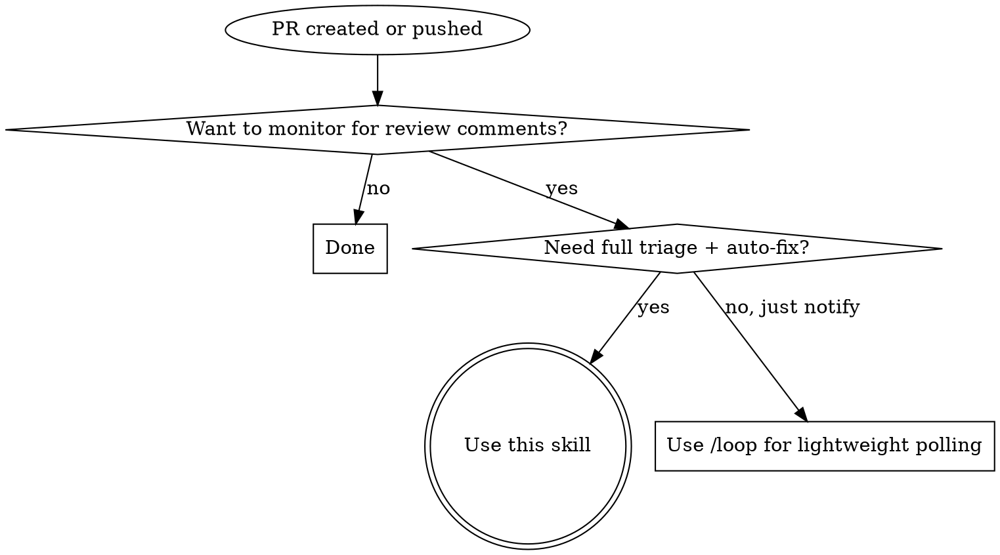

# wait-for-pr-comments

Poll a PR for review comments, auto-fix what's unambiguous, report the rest. Copilot-aware: monitors Copilot review lifecycle via background bash scripts — zero Anthropic API tokens consumed during polling.

## When to Use



**Don't use when:**
- PR is a draft not ready for review
- Monitoring multiple PRs in one invocation (invoke separately per PR)
- CI/CD status checks are the concern, not review comments
- PR is already merged or closed

## Arguments

**Positional:** `/wait-for-pr-comments [interval] [max-duration]`

| Argument | Default | Format | Constraint |
|----------|---------|--------|------------|
| interval | `1m` | `Nm` where N >= 1 | Minimum 1m |
| max-duration | `7m` | `Nm` where N >= 1 | Total re-poll window |

Note: `interval`/`max-duration` apply to the **re-poll phase** (Phase 4) after fixes are pushed. Copilot monitoring uses fixed intervals regardless.

## The Process

Five phases. Phases 2 and 4 run bash scripts in the background (non-blocking, zero API tokens). If Copilot never shows up as a reviewer, the skill aborts and reports — no fallback polling.

### Phase 1: PR Detection

Determine PR number and owner/repo from (in order):
1. Explicit argument — PR number or URL passed to the skill
2. Current branch — `gh pr view --json number,url` (extract owner/repo from URL)
3. Hook-injected context — pattern match `PR activity detected: #<number>`
4. If no PR found → report error and stop

### Phase 2: Copilot Monitoring (Background Script)

1. **Quick check** — determine if Copilot is already requested:
   ```
   gh api repos/{owner}/{repo}/issues/{number}/events \
     --jq '[.[] | select(
       .event == "review_requested" and
       .requested_reviewer.login and
       (.requested_reviewer.login | test("copilot"; "i"))
     )] | length'
   ```

2. **Launch polling script** in background:
   ```
   Bash(command: "${CLAUDE_SKILL_DIR}/poll-copilot-review.sh {owner/repo} {number} [--skip-request-check]",
        run_in_background: true)
   ```
   Pass `--skip-request-check` if the quick check returned count > 0.

3. **Announce** to user:
   > "Copilot review monitoring is active for PR #N. You can keep working — I'll alert you when feedback arrives. **Don't merge or clean up the worktree/branch yet.**"

4. **When the script completes**, read its stdout and check exit code:

   | Exit code | Status | Action |
   |-----------|--------|--------|
   | 0 | `copilot_review_found` | Parse JSON → proceed to Phase 3 (Triage & Fix) |
   | 1 | `copilot_review_timeout` | → Phase 5 (Final Report, timeout variant) |
   | 2 | `copilot_not_requested` | → Phase 5 (Final Report, no-show variant) |
   | 3 | Error | → Phase 5 (Final Report, error details from stderr) |

### Phase 3: Triage & Fix

The script JSON output contains `reviews`, `inline_comments`, and `human_comments`.

1. Process Copilot review body and inline comments from the JSON
2. Process any human reviewer comments from the JSON `human_comments` array
3. For each item (Copilot + human): assess if fixable unambiguously
4. Fix what can be fixed, record what was skipped and why
5. Commit and push fixes
6. Proceed to Phase 4 (Re-poll)

**Error handling:**
- Commit fails: report error with details, skip push, go to final report
- `git push` fails: report error, include local commit SHA for manual push
- PR closed/merged: detect via `gh pr view --json state`, report and stop

### Phase 4: Re-poll (Background Script)

After pushing fixes, monitor for follow-up comments.

1. Record baseline: `gh api repos/{owner}/{repo}/pulls/{number}/comments --jq 'length'`
2. Convert arguments to seconds: `interval_secs = N * 60`, `max_duration_secs = M * 60`
3. **Launch re-poll script** in background:
   ```
   Bash(command: "${CLAUDE_SKILL_DIR}/poll-new-comments.sh {owner/repo} {number} {baseline} {interval_secs} {max_duration_secs}",
        run_in_background: true)
   ```
4. **When the script completes**, read its stdout:

   | Exit code | Status | Action |
   |-----------|--------|--------|
   | 0 | `new_comments_found` | Report new comments (do NOT auto-fix) → Phase 5 |
   | 1 | `no_new_comments` | Report clean → Phase 5 |
   | 3 | Error | Report error → Phase 5 |

New comments during re-poll are **reported but NOT auto-fixed** (prevents recursive loops).

### Phase 5: Final Report

Deliver a structured report using the templates below.

## Guard Behavior

While any background polling script is running, if the user asks to:
- Merge the PR
- Delete the branch or worktree
- Close the PR
- "Clean up" anything related to this PR

**Do not silently comply.** Interject:

> "Hold on — Copilot review monitoring is still active for PR #N. The review could arrive any moment. Merging now means discarding that feedback. Still want to proceed?"

Once the script completes (any outcome), the guard is lifted.

## Report Templates

**Variant 1 — All fixed, re-poll clean:**

```markdown
## PR Comment Watch Complete

**PR:** #<number> — "<title>"

### Fixed (<count>)
- **@<author>** (<location>): "<comment summary>" → <what was done>

### Status
- Fixes pushed in commit `<sha>`
- Re-poll: No new comments after <duration>

All review feedback addressed. Ready to merge.
```

**Variant 2 — Items need attention:**

```markdown
## PR Comment Watch Complete

**PR:** #<number> — "<title>"

### Fixed (<count>)
- **@<author>** (<location>): "<comment summary>" → <what was done>

### Skipped (<count>)
- **@<author>** (<location>): "<comment summary>" → <reason skipped>

### New During Re-poll (<count>)
- **@<author>** (<location>): "<comment summary>"

### Status
- Fixes pushed in commit `<sha>`
- Re-poll: <status>

What would you like to do about the remaining items?
```

**Variant 3 — Copilot review received:**

```markdown
## PR Comment Watch Complete

**PR:** #<number> — "<title>"

### Copilot Review
<Copilot review body>

### Copilot Inline Comments (<count>)
- **<file>** line <N>: "<comment>"

### Fixed (<count>)
- **@<author>** (<location>): "<comment summary>" → <what was done>

### Skipped (<count>)
- **@<author>** (<location>): "<comment summary>" → <reason skipped>

What would you like to do about the remaining items?
```

**Variant 4 — Copilot no-show:**

```markdown
## PR Comment Watch Complete

**PR:** #<number> — "<title>"
**Copilot status:** Not added as a reviewer within 1 minute

Copilot review was never requested for this PR. Add Copilot as a reviewer and re-run, or proceed without automated review.
```

**Variant 5 — Copilot timeout:**

```markdown
## PR Comment Watch Complete

**PR:** #<number> — "<title>"
**Copilot status:** No review received after 10 minutes

Copilot may still be queued. Check the PR reviews manually or re-request the review.
```

## Error Handling

| Scenario | Action |
|----------|--------|
| No PR found for current branch | Report error, stop |
| `gh auth` failure | Report auth error, stop |
| Polling script exits with code 3 | Report error from stderr, stop |
| Commit fails (pre-commit hook, merge conflict) | Report error details, skip push, go to final report |
| `git push` fails (auth, remote rejection) | Report error, include local commit SHA for manual push |
| PR closed or merged during polling | Script detects and exits early; report and stop |

## Hook Auto-Trigger

A PostToolUse hook script (`detect-pr-push.sh`) watches for:
- `gh pr create` with a PR URL in stdout
- `git push` on a branch with an open PR

When matched, it outputs context for Claude:
```
PR activity detected: #<number> (<url>). Run /wait-for-pr-comments to monitor for review comments.
```

The hook **suggests** invocation — it does not force it. User retains control. Configuration lives in `settings.json.template` under `hooks.PostToolUse`.

## Quick Reference

| Situation | Action |
|-----------|--------|
| PR just created | Skill auto-suggested via hook, or invoke manually |
| Pushed fixes to existing PR | Hook detects push, suggests skill |
| Copilot already assigned at skill start | Pass `--skip-request-check` to polling script |
| Copilot not assigned within 1 min | Script exits code 2 — report no-show, stop |
| User wants to merge while script running | Warn — Copilot review may be imminent |
| Copilot review found | Script exits code 0 — parse JSON, triage & fix |
| Copilot review timeout (10 min) | Script exits code 1 — report timeout |
| New comments found during re-poll | Report only, do not auto-fix |
| All comments fixed, re-poll clean | Report ready to merge |
| Error at any phase | Report error, stop |

## Red Flags

If you catch yourself doing any of these, STOP — you are deviating from the process.

| Rationalization | Why it's wrong |
|-----------------|----------------|
| "I'll fix this ambiguous comment anyway" | Ambiguous = needs human decision. Report it, don't guess. |
| "Re-poll found issues, I'll fix those too" | Re-poll comments are report-only. No recursive fix loops. |
| "I'll skip re-poll since all comments were trivial" | Always re-poll after pushing fixes. Reviewers may respond. |
| "I'll keep polling past max-duration" | Respect the time bound. Report and hand back to user. |
| "I'll poll Copilot inline instead of the background script" | That blocks the user and wastes API tokens. Background scripts are required. |
| "I'll monitor multiple PRs at once" | One PR per invocation. Suggest parallel invocations instead. |
| "The push failed but I'll continue anyway" | Report the failure with commit SHA so user can push manually. |
| "Copilot hasn't reviewed yet, the user wants to merge" | Script is still running — issue the guard warning. |
| "Phase C timed out so it's safe to merge" | Report the timeout and ask the user — don't authorize merging on their behalf. |
| "Copilot was a no-show, I'll poll for human comments instead" | No fallback. Report the no-show and stop. The user decides what's next. |
