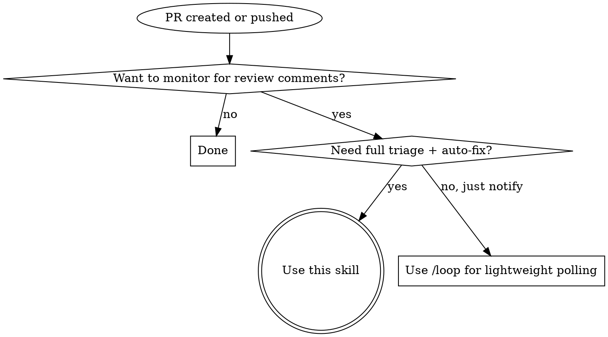

# wait-for-pr-comments

Poll a PR for review comments, triage them, and report results. Copilot-aware: monitors Copilot review lifecycle via background bash scripts — zero Anthropic API tokens consumed during polling.

**Scope boundary (critical):** this skill's auto-fix bucket is narrow by design — zero-risk mechanical trivia only. If a comment requires judgment, touches multiple files, asks for a refactor, or changes behavior, surface it in the Phase 5 report with a pointer to [`resolve-pr-comments`](../resolve-pr-comments/SKILL.md) — do NOT auto-fix it here.

## When to Use



**Don't use when:**

- PR is a draft not ready for review
- Monitoring multiple PRs in one invocation (invoke separately per PR)
- CI/CD status checks are the concern, not review comments
- PR is already merged or closed

## The Process

Five phases. Phases 2 and 4 run bash scripts in the background (non-blocking, zero API tokens). If Copilot never shows up as a reviewer, the skill aborts and reports — no fallback polling. Phase 4 uses a fixed 30-second window (3 × 10s polls) to detect whether Copilot will re-review after fixes are pushed.

### Phase 1: PR Detection

Determine PR number and owner/repo from (in order):

1. Explicit argument — PR number or URL passed to the skill
2. Current branch — `gh pr view --json number,url` (extract owner/repo from URL)
3. Hook-injected context — pattern match `PR activity detected: #<number>`
4. If no PR found → report error and stop

### Phase 2: Copilot Monitoring (Background Script)

1. **Quick check** — determine if Copilot is already requested:

   ```
   gh api repos/{owner}/{repo}/issues/{number}/events \
     --jq '[.[] | select(
       .event == "review_requested" and
       .requested_reviewer.login and
       (.requested_reviewer.login | test("copilot"; "i"))
     )] | length'
   ```

2. **Launch polling script** in background:

   ```
   Bash(command: "${CLAUDE_SKILL_DIR}/poll-copilot-review.sh {owner/repo} {number} [--skip-request-check]",
        run_in_background: true)
   ```

   Pass `--skip-request-check` if the quick check returned count > 0.

3. **Announce** to user:

   > "Copilot review monitoring is active for PR #N. You can keep working — I'll alert you when feedback arrives. **Don't merge or clean up the worktree/branch yet.**"

4. **When the script completes**, read its stdout and check exit code:

   | Exit code | Status                   | Action                                              |
   | --------- | ------------------------ | --------------------------------------------------- |
   | 0         | `copilot_review_found`   | Parse JSON → proceed to Phase 3 (Triage & Fix)      |
   | 1         | `copilot_review_timeout` | → Phase 5 (Final Report, timeout variant)           |
   | 2         | `copilot_not_requested`  | → Phase 5 (Final Report, no-show variant)           |
   | 3         | Error                    | → Phase 5 (Final Report, error details from stderr) |

### Phase 3: Triage & Fix

The script JSON output contains `reviews`, `inline_comments`, and `human_comments`.

1. Process Copilot review body and inline comments from the JSON
2. Process any human reviewer comments from the JSON `human_comments` array
3. **Classify each item into one of three buckets:**

   | Bucket          | Criteria                                                                                                                                                                                                          | Action in this skill                                                                                 |
   | --------------- | ----------------------------------------------------------------------------------------------------------------------------------------------------------------------------------------------------------------- | ---------------------------------------------------------------------------------------------------- |
   | **Mechanical**  | Typo fix, rename, magic-number → named constant, comment-only edit — single file, **no new runtime behavior** (no new guards, branches, error paths, call sites, or module side effects)                          | Auto-fix inline                                                                                      |
   | **Non-trivial** | Requires judgment, touches multiple files, asks for a refactor or extraction, adds new helpers, changes behavior, or adds a new import/dependency (imports can execute top-level module code in Python, JS, etc.) | **HAND OFF** — skip the fix, record as skipped with reason `"non-trivial — use resolve-pr-comments"` |
   | **Ambiguous**   | Unclear what the reviewer wants, conflicting guidance, or an architectural question                                                                                                                               | Skip with a rationale; surface in Phase 5 for user judgment                                          |

4. Auto-fix **only** the Mechanical bucket. **If any Mechanical items were fixed**, commit + push them (use a single commit). If **zero** Mechanical items remain after classification, skip commit + push entirely and go straight to the report. Never commit anything for Non-trivial or Ambiguous items.
5. Record Non-trivial and Ambiguous items in the skipped list. If any Non-trivial items exist, the Phase 5 report **MUST** recommend `resolve-pr-comments` as the hand-off.
6. Proceed to Phase 4 (Re-review Detection).

**Error handling:**

- Commit fails: report error with details, skip push, go to final report
- `git push` fails: report error, include local commit SHA for manual push
- PR closed/merged: detect via `gh pr view --json state`, report and stop

### Phase 4: Copilot Re-review Detection (Background Script)

After pushing fixes, check whether Copilot will perform a second review pass. Copilot does not automatically re-review on new commits — this phase detects if one was explicitly re-requested (e.g., via `gh pr edit {number} --add-reviewer "@copilot"`).

1. **Get last commit timestamp:**

   ```
   gh api repos/{owner}/{repo}/pulls/{number}/commits \
     --jq '.[-1].commit.author.date'
   ```

2. **Launch re-review detection script** in background:

   ```
   Bash(command: "${CLAUDE_SKILL_DIR}/poll-copilot-rereview-start.sh {owner/repo} {number} {last-commit-timestamp}",
        run_in_background: true)
   ```

   The script polls every 10 seconds for 60 seconds, looking for a `copilot_work_started` event that postdates the last commit timestamp.

3. **When the script completes**, check exit code:

   | Exit code | Status                     | Action                                                                                                                              |
   | --------- | -------------------------- | ----------------------------------------------------------------------------------------------------------------------------------- |
   | 0         | `copilot_rereview_started` | Launch `poll-copilot-review.sh {owner/repo} {number} --skip-request-check` in background → when complete, triage results as Phase 3 |
   | 1         | `no_rereview_started`      | → Phase 5 (no re-review variant)                                                                                                    |
   | 3         | Error                      | → Phase 5 (error variant)                                                                                                           |

### Phase 5: Final Report

Deliver a structured report using the templates below.

## Guard Behavior

While any background polling script is running, if the user asks to:

- Merge the PR
- Delete the branch or worktree
- Close the PR
- "Clean up" anything related to this PR

**Do not silently comply.** Interject:

> "Hold on — Copilot review monitoring is still active for PR #N. The review could arrive any moment. Merging now means discarding that feedback. Still want to proceed?"

Once the script completes (any outcome), the guard is lifted.

## Report Templates

**Enforcement:** if any Non-trivial items were skipped in Phase 3, the report you emit (Variants 2 or 3) MUST include the `resolve-pr-comments` hand-off pointer — the templates below already carry it in the "remaining items?" line. Variant 1 only applies when the Non-trivial bucket was empty.

**Variant 1 — All fixed, no Copilot re-review:**

```markdown
## PR Comment Watch Complete

**PR:** #<number> — "<title>"

### Fixed (<count>)

- **@<author>** (<location>): "<comment summary>" → <what was done>

### Status

- Fixes pushed: `<sha>` — OR, if zero Mechanical items, write "No Mechanical fixes applied; all items handed off or skipped"
- Copilot re-review: None detected within 30s window

All review feedback addressed. Ready to merge.
```

**Variant 2 — Items need attention:**

```markdown
## PR Comment Watch Complete

**PR:** #<number> — "<title>"

### Fixed (<count>)

- **@<author>** (<location>): "<comment summary>" → <what was done>

### Skipped (<count>)

- **@<author>** (<location>): "<comment summary>" → <reason skipped>

### Status

- Fixes pushed: `<sha>` — OR, if zero Mechanical items, write "No Mechanical fixes applied; all items handed off or skipped"
- Copilot re-review: <status>

What would you like to do about the remaining items? For any items marked "non-trivial — use resolve-pr-comments", invoke the `resolve-pr-comments` skill to run the structured per-comment workflow (subagent-per-fix, full quality gate, reply + resolve on GitHub).
```

**Variant 3 — Copilot review received:**

```markdown
## PR Comment Watch Complete

**PR:** #<number> — "<title>"

### Copilot Review

<Copilot review body>

### Copilot Inline Comments (<count>)

- **<file>** line <N>: "<comment>"

### Fixed (<count>)

- **@<author>** (<location>): "<comment summary>" → <what was done>

### Skipped (<count>)

- **@<author>** (<location>): "<comment summary>" → <reason skipped>

What would you like to do about the remaining items? For any items marked "non-trivial — use resolve-pr-comments", invoke the `resolve-pr-comments` skill to run the structured per-comment workflow (subagent-per-fix, full quality gate, reply + resolve on GitHub).
```

**Variant 4 — Copilot no-show:**

```markdown
## PR Comment Watch Complete

**PR:** #<number> — "<title>"
**Copilot status:** Not added as a reviewer within 1 minute

Copilot review was never requested for this PR. Add Copilot as a reviewer and re-run, or proceed without automated review.
```

**Variant 5 — Copilot timeout:**

```markdown
## PR Comment Watch Complete

**PR:** #<number> — "<title>"
**Copilot status:** No review received after 10 minutes

Copilot may still be queued. Check the PR reviews manually or re-request the review.
```

## Error Handling

| Scenario                                       | Action                                                 |
| ---------------------------------------------- | ------------------------------------------------------ |
| No PR found for current branch                 | Report error, stop                                     |
| `gh auth` failure                              | Report auth error, stop                                |
| Polling script exits with code 3               | Report error from stderr, stop                         |
| Commit fails (pre-commit hook, merge conflict) | Report error details, skip push, go to final report    |
| `git push` fails (auth, remote rejection)      | Report error, include local commit SHA for manual push |
| PR closed or merged during polling             | Script detects and exits early; report and stop        |

## Hook Auto-Trigger

A PostToolUse hook script (`detect-pr-push.sh`) watches for:

- `gh pr create` with a PR URL in stdout
- `git push` on a branch with an open PR

When matched, it outputs context for Claude:

```
PR activity detected: #<number> (<url>). Run /wait-for-pr-comments to monitor for review comments.
```

The hook **suggests** invocation — it does not force it. User retains control. Configuration lives in `settings.json.template` under `hooks.PostToolUse`.

## Quick Reference

| Situation                                                                                | Action                                                                   |
| ---------------------------------------------------------------------------------------- | ------------------------------------------------------------------------ |
| PR just created                                                                          | Skill auto-suggested via hook, or invoke manually                        |
| Pushed fixes to existing PR                                                              | Hook detects push, suggests skill                                        |
| Copilot already assigned at skill start                                                  | Pass `--skip-request-check` to polling script                            |
| Copilot not assigned within 1 min                                                        | Script exits code 2 — report no-show, stop                               |
| User wants to merge while script running                                                 | Warn — Copilot review may be imminent                                    |
| Copilot review found                                                                     | Script exits code 0 — parse JSON, triage & fix                           |
| Comment is mechanical (typo / rename / constant / comment-only; no new runtime behavior) | Auto-fix in Phase 3                                                      |
| Comment is non-trivial (refactor, multi-file, behavior change)                           | Skip + hand off to `resolve-pr-comments` in Phase 5 report               |
| Comment is ambiguous                                                                     | Skip with rationale; surface in Phase 5 for user judgment                |
| Copilot review timeout (10 min)                                                          | Script exits code 1 — report timeout                                     |
| Copilot re-review starts within 30s                                                      | Launch `poll-copilot-review.sh --skip-request-check` → triage as Phase 3 |
| No Copilot re-review within 30s                                                          | Report no re-review detected, proceed to Phase 5                         |
| Error at any phase                                                                       | Report error, stop                                                       |

## Red Flags

If you catch yourself doing any of these, STOP — you are deviating from the process.

| Rationalization                                               | Why it's wrong                                                                                                                             |
| ------------------------------------------------------------- | ------------------------------------------------------------------------------------------------------------------------------------------ |
| "I'll fix this ambiguous comment anyway"                      | Ambiguous = needs human decision. Report it, don't guess.                                                                                  |
| "This refactor is small, I'll just do it here"                | Refactors are non-trivial by definition. Hand off to `resolve-pr-comments`. Mechanical is narrowly defined — see the Phase 3 bucket table. |
| "Extraction feels safe enough — fix inline"                   | If it crosses functions/files or changes behavior, it's not mechanical. Hand off.                                                          |
| "Multi-file change but the edits are tiny — fits mechanical"  | Multi-file = not mechanical, regardless of size. Hand off.                                                                                 |
| "I'll skip Phase 4 since the fixes were trivial"              | Always run Phase 4 after pushing fixes — a re-review may have been requested.                                                              |
| "I'll keep polling past the 30s window"                       | Fixed window is fixed. Report no re-review and hand back to user.                                                                          |
| "I'll poll Copilot inline instead of the background script"   | That blocks the user and wastes API tokens. Background scripts are required.                                                               |
| "I'll monitor multiple PRs at once"                           | One PR per invocation. Suggest parallel invocations instead.                                                                               |
| "The push failed but I'll continue anyway"                    | Report the failure with commit SHA so user can push manually.                                                                              |
| "Copilot hasn't reviewed yet, the user wants to merge"        | Script is still running — issue the guard warning.                                                                                         |
| "Phase C timed out so it's safe to merge"                     | Report the timeout and ask the user — don't authorize merging on their behalf.                                                             |
| "Copilot was a no-show, I'll poll for human comments instead" | No fallback. Report the no-show and stop. The user decides what's next.                                                                    |

## Related Skills

- **[`resolve-pr-comments`](../resolve-pr-comments/SKILL.md)** — structured per-comment workflow: one subagent per comment, full quality gate, reply + resolve on GitHub. Rule of thumb: if you're about to read the comment a second time to figure out what it means, or you're reaching for an editor to plan the change, it belongs there, not here.
