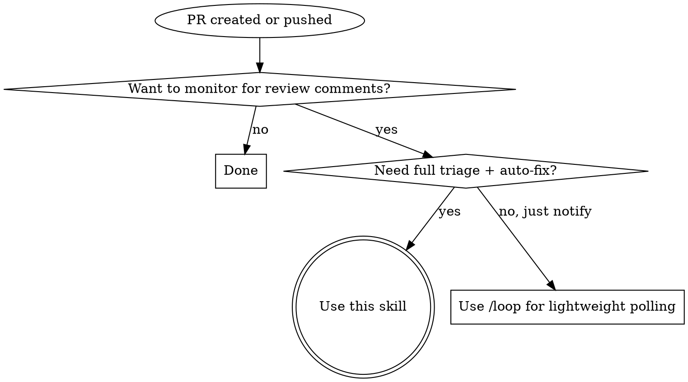

# wait-for-pr-comments

Poll a PR for review comments, auto-fix what's unambiguous, report the rest. Copilot-aware: monitors Copilot review request, start, and completion via background agents — user retains control throughout.

## When to Use



**Don't use when:**
- PR is a draft not ready for review
- Monitoring multiple PRs in one invocation (invoke separately per PR)
- CI/CD status checks are the concern, not review comments
- PR is already merged or closed

## Arguments

**Positional:** `/wait-for-pr-comments [interval] [max-duration]`

| Argument | Default | Format | Constraint |
|----------|---------|--------|------------|
| interval | `1m` | `Nm` where N >= 1 | Minimum 1m (cron granularity) |
| max-duration | `7m` | `Nm` where N >= 1 | Total polling window per round |

Note: `interval`/`max-duration` apply to the **re-poll phase** (Phase 5) after fixes are pushed. Copilot monitoring phases use fixed intervals regardless of these arguments.

## The Process

Six phases. Phase 3 runs via background agent (non-blocking). If Copilot never shows up as a reviewer, the skill aborts and reports — no fallback polling. Always cancel cron jobs before exiting any phase on error.

### Phase 1: PR Detection

Determine PR number from (in order):
1. Explicit argument — PR number or URL passed to the skill
2. Current branch — `gh pr view --json number,title,url`
3. Hook-injected context — pattern match `PR activity detected: #<number>`
4. If no PR found → report error and stop

### Phase 2: Copilot Reviewer Check

Immediately after PR detection, check if Copilot is already assigned:

```
gh api repos/{owner}/{repo}/pulls/{number}/requested_reviewers \
  --jq '[.users[].login] | map(select(test("copilot"; "i"))) | length'
```

- **Count > 0**: Copilot already requested → dispatch Phase 3 background agent starting at Sub-phase B (skip request detection)
- **Count == 0**: Dispatch Phase 3 background agent starting at Sub-phase A

In both cases, announce to the user:

> "Copilot review monitoring is active for PR #<number>. You can keep working — I'll alert you when feedback arrives. **Don't merge or clean up the worktree/branch yet.**"

### Phase 3: Background — Copilot Monitoring

Dispatch **one named background agent** (e.g., `copilot-monitor-<number>`) with `run_in_background: true`.

The agent runs three sequential sub-phases:

---

**Sub-phase A — Request detection (20s × 3, max 1 minute)**

```
Poll up to 3 times for Copilot being added as a reviewer.
Between each check: sleep 20 seconds (Bash: sleep 20).

Check: gh api repos/{owner}/{repo}/pulls/{number}/requested_reviewers \
         --jq '[.users[].login] | map(select(test("copilot"; "i"))) | length'

- count > 0: proceed to Sub-phase B
- After 3 checks with count == 0: report "copilot_not_requested" and exit
```

If the background agent exits with `copilot_not_requested` → Phase 6 (Final Report, no-show variant). **No fallback polling.** Copilot was a no-show — tell the user and stop.

---

**Sub-phase B — Start detection (20s × 3, max 1 minute)**

```
Poll up to 3 times for a copilot_work_started event.
Between each check: sleep 20 seconds (Bash: sleep 20).

Check: gh api repos/{owner}/{repo}/issues/{number}/events \
         --jq '[.[] | select(.event == "copilot_work_started")] | length'

- count > 0: proceed to Sub-phase C immediately
- After 3 checks: proceed to Sub-phase C regardless
```

---

**Sub-phase C — Review detection (30s × 20, max 10 minutes)**

```
Poll up to 20 times for a Copilot review in /pulls/{number}/reviews.
Between each check: sleep 30 seconds (Bash: sleep 30).

Check: gh api repos/{owner}/{repo}/pulls/{number}/reviews \
         --jq '[.[] | select(
           (.user.type == "Bot") and
           (.user.login | test("copilot"; "i")) and
           (.state == "COMMENTED")
         )] | length'

- count > 0:
    Fetch review body:
      gh api repos/{owner}/{repo}/pulls/{number}/reviews \
        --jq '.[] | select((.user.type == "Bot") and (.user.login | test("copilot"; "i")))'
    Fetch inline comments:
      gh api repos/{owner}/{repo}/pulls/{number}/comments \
        --jq '[.[] | select(.user.login | test("copilot"; "i"))]'
    Report "copilot_review_found" with the full data and exit.

- After 20 checks with count == 0: report "copilot_review_timeout"
```

---

When the background agent completes:
- `copilot_review_found` → Phase 4 (Triage & Fix)
- `copilot_review_timeout` → Phase 6 (Final Report, timeout variant)
- `copilot_not_requested` → Phase 6 (Final Report, no-show variant)

### Phase 4: Triage & Fix (Copilot review path)

1. Process Copilot review body and inline comments from Phase 3 results
2. Also fetch any human reviewer comments:
   ```
   gh api repos/{owner}/{repo}/pulls/{number}/comments \
     --jq '[.[] | select(.user.login | test("copilot"; "i") | not)]'
   ```
3. For each item (Copilot + human): assess if fixable unambiguously
4. Fix what can be fixed, record what was skipped and why
5. Commit and push fixes
6. Proceed to Phase 5 (Re-poll)

**Error handling:**
- Commit fails: report error with details, skip push, go to final report
- `git push` fails: report error, include local commit SHA for manual push
- PR closed/merged during polling: detect via `gh pr view --json state`, report and stop

### Phase 5: Re-poll (single round)

After pushing fixes, monitor for follow-up comments from any reviewer (Copilot or human).

1. Record new baseline: current comment count via `gh api repos/{owner}/{repo}/pulls/{number}/comments --jq 'length'`
2. Convert `interval` to cron: `Nm` → `*/N * * * *`
3. Calculate max iterations: `ceil(max-duration / interval)`
4. Create cron job via `CronCreate` with prompt:

```
Re-poll for PR #<number> after fixes pushed.
Started: <ISO-8601>. Interval: <N>m. Max duration: <M>m. Baseline: <count>.

Step 1: iteration = floor((now - start_time) / interval) + 1

Step 2: Run: gh api repos/{owner}/{repo}/pulls/{number}/comments --jq 'length'

Step 3: count > baseline → CronList + CronDelete this job, report new comments (do NOT auto-fix).

Step 4: count == baseline AND iteration >= max_iterations → CronList + CronDelete, report clean.

Step 5: count == baseline AND iteration < max_iterations → wait for next fire.
```

New comments during re-poll are **reported but NOT auto-fixed** (prevents recursive loops). When complete → cancel cron, proceed to Phase 6.

### Phase 6: Final Report

Deliver a structured report using the templates below.

## Guard Behavior

While any background monitoring agent is active, if the user asks to:
- Merge the PR
- Delete the branch or worktree
- Close the PR
- "Clean up" anything related to this PR

**Do not silently comply.** Interject:

> "Hold on — Copilot review monitoring is still active for PR #<number>. The review could arrive any moment. Merging now means discarding that feedback. Still want to proceed?"

Track background agent status in session memory. Once the background agent reports back (any outcome), the guard is lifted.

## Report Templates

**Variant 1 — All fixed, re-poll clean:**

```markdown
## PR Comment Watch Complete

**PR:** #<number> — "<title>"

### Fixed (<count>)
- **@<author>** (<location>): "<comment summary>" → <what was done>

### Status
- Fixes pushed in commit `<sha>`
- Re-poll: No new comments after <duration>

All review feedback addressed. Ready to merge.
```

**Variant 2 — Items need attention:**

```markdown
## PR Comment Watch Complete

**PR:** #<number> — "<title>"

### Fixed (<count>)
- **@<author>** (<location>): "<comment summary>" → <what was done>

### Skipped (<count>)
- **@<author>** (<location>): "<comment summary>" → <reason skipped>

### New During Re-poll (<count>)
- **@<author>** (<location>): "<comment summary>"

### Status
- Fixes pushed in commit `<sha>`
- Re-poll: <status>

What would you like to do about the remaining items?
```

**Variant 3 — Copilot review received:**

```markdown
## PR Comment Watch Complete

**PR:** #<number> — "<title>"

### Copilot Review
<Copilot review body>

### Copilot Inline Comments (<count>)
- **<file>** line <N>: "<comment>"

### Fixed (<count>)
- **@<author>** (<location>): "<comment summary>" → <what was done>

### Skipped (<count>)
- **@<author>** (<location>): "<comment summary>" → <reason skipped>

What would you like to do about the remaining items?
```

**Variant 4 — Copilot no-show (not requested within 1 minute):**

```markdown
## PR Comment Watch Complete

**PR:** #<number> — "<title>"
**Copilot status:** Not added as a reviewer within 1 minute

Copilot review was never requested for this PR. Add Copilot as a reviewer and re-run, or proceed without automated review.
```

**Variant 5 — Copilot timeout (requested but no review after 10 minutes):**

```markdown
## PR Comment Watch Complete

**PR:** #<number> — "<title>"
**Copilot status:** No review received after 10 minutes

Copilot may still be queued. Check `/pulls/{number}/reviews` manually or re-request the review.
```

## Error Handling

| Scenario | Action |
|----------|--------|
| No PR found for current branch | Report error, stop |
| `gh auth` failure | Report auth error, stop |
| Commit fails (pre-commit hook, merge conflict) | Report error details, skip push, go to final report |
| `git push` fails (auth, remote rejection) | Report error, include local commit SHA for manual push |
| PR closed or merged during polling | Detect via `gh pr view --json state`, report and stop |
| CronCreate/CronDelete unavailable | Report tool unavailability, stop |
| Background agent unavailable | Fall back to CronCreate for Copilot polling phases |
| Copilot not requested within 1 minute | Report no-show, abort polling, hand back to user |
| Copilot review not received after 10 minutes | Report timeout variant, hand back to user |

Always cancel active cron jobs before stopping on error.

## Hook Auto-Trigger

A PostToolUse hook script (`detect-pr-push.sh`) watches for:
- `gh pr create` with a PR URL in stdout
- `git push` on a branch with an open PR

When matched, it outputs context for Claude:
```
PR activity detected: #<number> (<url>). Run /wait-for-pr-comments to monitor for review comments.
```

The hook **suggests** invocation — it does not force it. User retains control. Configuration lives in `settings.json.template` under `hooks.PostToolUse`.

## Quick Reference

| Situation | Action |
|-----------|--------|
| PR just created | Skill auto-suggested via hook, or invoke manually |
| Pushed fixes to existing PR | Hook detects push, suggests skill |
| Copilot assigned as reviewer | Enters Copilot-aware monitoring (Phase 3) |
| Copilot already assigned at skill start | Skips request detection, starts at Sub-phase B |
| Copilot not assigned within 1 min | Report no-show, abort — no fallback polling |
| User wants to merge while monitoring active | Warn — Copilot review may be imminent |
| Copilot review found in /pulls/{n}/reviews | Triage review body + inline comments |
| Copilot review timeout (10 min) | Report timeout, ask user how to proceed |
| New comments found in initial poll | Auto-triage and fix unambiguous items |
| New comments found during re-poll | Report only, do not auto-fix |
| All comments fixed, re-poll clean | Report ready to merge |
| Some comments skipped | Report with reasons, ask user what to do |
| Error at any phase | Cancel cron, report error, stop |

## Red Flags

If you catch yourself doing any of these, STOP — you are deviating from the process.

| Rationalization | Why it's wrong |
|-----------------|----------------|
| "I'll fix this ambiguous comment anyway" | Ambiguous = needs human decision. Report it, don't guess. |
| "Re-poll found issues, I'll fix those too" | Re-poll comments are report-only. No recursive fix loops. |
| "I'll skip re-poll since all comments were trivial" | Always re-poll after pushing fixes. Reviewers may respond. |
| "I'll keep polling past max-duration" | Respect the time bound. Report and hand back to user. |
| "No need to cancel the cron job, it'll expire" | Always explicitly cancel. Stale cron jobs waste resources. |
| "I'll monitor multiple PRs at once" | One PR per invocation. Suggest parallel invocations instead. |
| "The push failed but I'll continue anyway" | Report the failure with commit SHA so user can push manually. |
| "Copilot hasn't reviewed yet, the user wants to merge" | Monitoring is still active — issue the guard warning. |
| "I'll poll Copilot synchronously instead of background agent" | That blocks the user. Background agents are required for Copilot phases. |
| "copilot_work_started never appeared, so Copilot isn't working" | Proceed to Sub-phase C anyway — the event may have already fired before the skill ran. |
| "Phase C timed out so it's safe to merge" | Report the timeout and ask the user — don't authorize merging on their behalf. |
| "Copilot was a no-show, I'll poll for human comments instead" | No fallback. Report the no-show and stop. The user decides what's next. |
