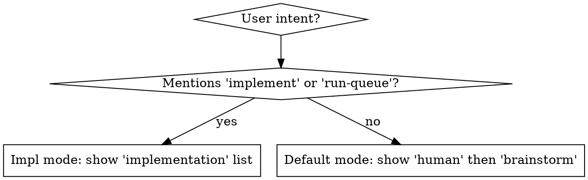

# whats-next

Surface the right work list for the current user intent. Two modes; one skill.

## Step 1: Collect data

Run the helper script to fetch, filter, and resolve ancestry in one pass.
Default limit is 10 per section. Pass `--limit 0` if the user asks for all or more.

```bash
python3 "${CLAUDE_SKILL_DIR}/collect.py"
# or, when user asks for more/all:
python3 "${CLAUDE_SKILL_DIR}/collect.py" --limit 0
```

The script returns a JSON object:

```json
{
  "project_prefix": "agents-config",   // or null if not detected
  "limit":          10,                 // applied limit (0 = no limit)
  "totals": {
    "human":          0,
    "brainstorm":     42,
    "implementation": 6
  },
  "human":          [ ...beads ],       // open beads with label 'human'
  "brainstorm":     [ ...beads ],       // ready, not impl-ready/merge-gate/human/mol-id
  "implementation": [ ...beads ]        // ready + implementation-ready label
}
```

Each bead entry (already prefix-stripped and ancestry split):
```json
{
  "id":         "agents-config-ffxh",
  "short_id":   "ffxh",
  "priority":   1,
  "title":      "...",
  "labels":     [...],
  "feature":    "vaac",
  "epic_chain": "7bk → 7bk.20 → 7bk.13"
}
```

- `id` — full bead ID (use for `bd` commands, linking, or any operation that needs the canonical ID)
- `short_id` — prefix-stripped ID; **use this for all display**
- `feature` — root ancestor short ID, or `""` if the bead has no parent
- `epic_chain` — intermediate ancestors joined with ` → `, or `""` if none beyond feature

All lists are pre-sorted: **priority ascending (P0 first), then `created_at` ascending**.

## Step 2: Select lists by mode



**Default mode:** render `human` under **Needs your attention**, then `brainstorm` under **Ready to brainstorm**. Skip any section whose list is empty.

**Implementation mode:** render `implementation` under **Ready to implement** only. Skip the human list.

If the user did NOT explicitly ask for implementation, you should not show it.  If they asked for implementation but the list is empty, show the section with a message like "All clear — no open beads ready for implementation."

## Step 3: Present

IDs are already prefix-stripped — use `short_id`, `feature`, and `epic_chain` directly.

Format each list as a table:

| P | Feature | Epic chain | Bead | Title |
|---|---------|------------|------|-------|

- **P** — priority digit
- **Feature** — `feature` field; blank if empty
- **Epic chain** — `epic_chain` field; blank if empty
- **Bead** — `short_id`
- **Title** — full bead title, untruncated

Example:
```
| P | Feature | Epic chain             | Bead | Title                                        |
|---|---------|------------------------|------|----------------------------------------------|
| 1 | vaac    | 7bk → 7bk.20 → 7bk.13  | ffxh | Audit-trail-required closure for human beads |
| 1 | qn0g    | qn0g.1                 | owqa | Add brainstorm-readiness gate                |
| 1 | abn9    |                        | d3s1 | Reconcile persona vs orchestration           |
| 1 |         |                        | abn9 | Milestone M1 — Stabilize and ship            |
| 2 | abn9    |                        | bf6  | Externalize long bead specs to docs/beads/   |
```

Close with a summary line. If the displayed count equals the total, just:
`Ready: N beads`

If truncated (displayed < total for any shown section), show per-section counts:
`Showing top 10 of 42 brainstorm, 6 of 6 implementation. Pass \`--limit 0\` to see all.`

If every section is empty: `All clear — no open beads ready for attention.`

## NOT For

- `run-queue` autonomous processing — it calls `bd ready --label implementation-ready` directly
- Checking a specific bead — use `bd show <id>`
