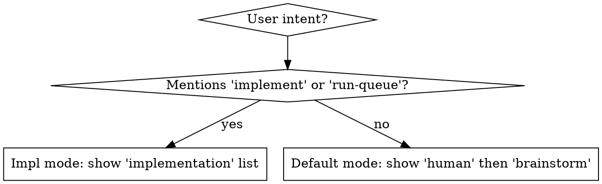

# whats-next

Surface the right work list for the current user intent. Two modes; one skill.

## Step 1: Collect data

Run the helper script to fetch, filter, and resolve ancestry in one pass:

```bash
python3 "${CLAUDE_SKILL_DIR}/collect.py"
```

The script returns a JSON object:

```json
{
  "project_prefix": "agents-config",   // or null if not detected
  "human":          [ ...beads ],       // open beads with label 'human'
  "brainstorm":     [ ...beads ],       // ready, not impl-ready/merge-gate/human/mol-id
  "implementation": [ ...beads ]        // ready + implementation-ready label
}
```

Each bead entry:
```json
{
  "id":         "agents-config-ffxh",
  "priority":   1,
  "title":      "...",
  "status":     "open",
  "labels":     [...],
  "created_at": "...",
  "ancestry":   ["agents-config-abn9", "agents-config-7bk.13"]  // root-first
}
```

Both lists are pre-sorted: **priority ascending (P0 first), then `created_at` ascending**.

## Step 2: Select lists by mode



**Default mode:** render `human` under **Needs your attention**, then `brainstorm` under **Ready to brainstorm**. Skip any section whose list is empty.

**Implementation mode:** render `implementation` under **Ready to implement** only. Skip the human list.

## Step 3: Present

Strip the `project_prefix` value (plus the trailing `-`) from the start of every ID before display. If the ID does not start with the prefix, show it as-is.

Format each list as a table:

| P | Feature / Epic chain | Bead | Title |
|---|---------------------|------|-------|

- **P** — priority digit
- **Feature / Epic chain** — the bead's `ancestry` array joined with ` → ` (IDs with prefix stripped); blank if ancestry is empty
- **Bead** — the bead's own ID (prefix stripped)
- **Title** — full bead title, untruncated

Example:
```
| P | Feature / Epic chain | Bead     | Title                                          |
|---|----------------------|----------|------------------------------------------------|
| 1 | abn9 → 7bk.13        | ffxh     | Audit-trail-required closure for human beads   |
| 1 | qn0g.1               | owqa     | Add brainstorm-readiness gate                  |
| 1 |                      | abn9     | Milestone M1 — Stabilize and ship              |
| 2 | abn9                 | bf6      | Externalize long bead specs to docs/beads/     |
```

Close with: `Ready: N beads`

If every section is empty: `All clear — no open beads ready for attention.`

## NOT For

- `run-queue` autonomous processing — it calls `bd ready --label implementation-ready` directly
- Checking a specific bead — use `bd show <id>`
