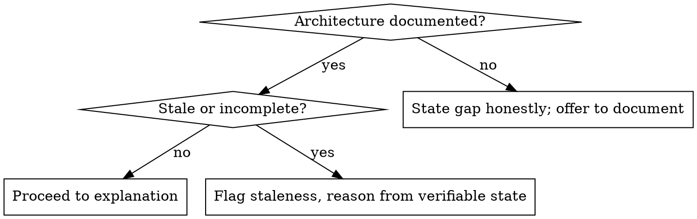
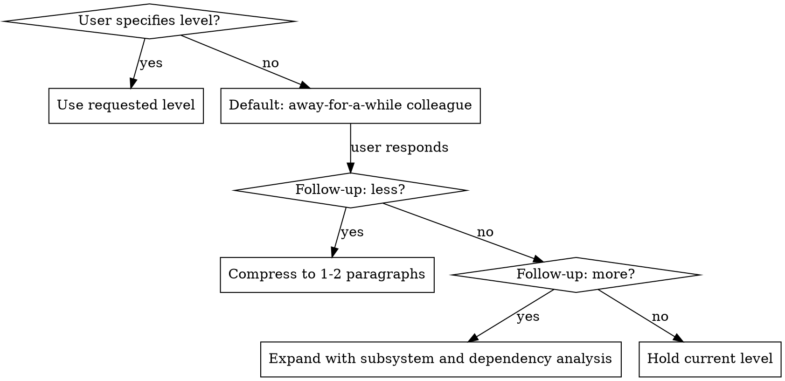

# Where Does This Fit

## Overview

Explains where a specific work item sits in the project's larger architecture, goals, and feature structure. Surfaces conflicts, ambiguities, and inconsistencies the user may need to resolve before proceeding. Leaves both the user and the agent better-informed for brainstorming, deciding, and implementing.

## Step 0: Pre-Flight — Is Architecture Documented?

Before explaining anything, verify the project's goals and architecture are available and current.

**Probe in order:**
1. `AGENTS.md` / `CLAUDE.md` in the project root — does it contain high-level goals, active milestones, and architecture overview?
2. Referenced in-project docs (`docs/specs/`, `docs/plans/`, ADRs referenced from AGENTS.md)
3. Graphify knowledge graph (`graphify-out/GRAPH_REPORT.md` if present)



**If documentation is insufficient:** Do not fabricate context. State the problem clearly:

> "The project's architecture and goals aren't documented clearly enough for me to give you a confident big-picture answer. Before proceeding, we should capture this — the right place is AGENTS.md. Want me to help draft a high-level goals and architecture section? That unlocks this skill for every future question."

**If stale:** Flag it, name the stale element, and reason only from what you can verify. Do not silently treat outdated milestones or closed epics as current.

## Step 1: Gather Work Item and Context

```bash
bd show <id> --json          # Work item details, parent, priority, labels
bd show <parent-id> --json   # Parent epic/feature if present
bd list --parent <epic-id>   # Sibling work (what surrounds this item)
```

Also read the relevant section of AGENTS.md (milestone table, architecture overview).

Use `graphify query "<item title or concept>"` if a graphify graph is present — it surfaces structural relationships grep cannot.

## Step 2: Construct the Explanation

Default audience: **someone familiar with the project in general but who has been away long enough that the structural context is no longer obvious.** This produces a few paragraphs — not a line, not a dissertation.

Address these four layers in order:

| Layer | Question to answer |
|---|---|
| **Project context** | Which goal or active milestone does this serve? Where is it on the roadmap? |
| **Feature/epic context** | What parent container owns this? What sibling work surrounds it? |
| **Functional impact** | Which system areas, subsystems, workflows, or user-facing behaviors does this touch or change? |
| **Conflicts / ambiguities / inconsistencies** | What needs human attention before proceeding? |

The fourth layer is not optional — it is often the most valuable part. Surface it even if there is nothing to flag (say so briefly).

## Step 3: Calibrate Detail Level



| Level | Shape |
|---|---|
| **Brief** | 1-2 paragraphs — just "what fits where" |
| **Default** | 3-5 paragraphs covering all four layers |
| **Deep dive** | Full structural analysis: dependency chains, subsystem interactions, risk surface, open sibling work |

Adjust on follow-up without re-reading everything from scratch.

## Caveman Mode Exception

When the session is in caveman mode, **relax caveman compression for the big-picture explanation itself.** A compressed big-picture explanation defeats its own purpose — this skill exists to produce clarity, and clarity requires complete sentences.

**Apply caveman brevity to:** preamble, confirmations, wrap-up, any text outside the explanation body.

**Do NOT apply caveman compression to:** the explanation paragraphs, conflict/ambiguity callouts, or architecture gap disclosures.

## Conflict and Ambiguity Callouts

Surface these separately, clearly labeled:

> **Conflict:** [work item scope contradicts a stated project goal or milestone boundary]
>
> **Ambiguity:** [unclear how this work connects to the larger picture; multiple valid interpretations]
>
> **Inconsistency:** [parent container says one thing; work item implies another]
>
> **Staleness:** [referenced milestone, goal, or epic appears closed or superseded]

If nothing to flag: close with one sentence — "No conflicts or ambiguities found in the current documentation."

## Common Mistakes

| Mistake | Fix |
|---|---|
| Fabricating architectural context when docs are sparse | State the gap; offer to document it — never invent what isn't there |
| Starting from the item and staying there | Always start from the project goal and work DOWN to the item |
| Skipping the conflict/ambiguity layer | It's the most useful part — always include it, even to say "none found" |
| Over-compressing in caveman mode | Big-picture clarity beats token savings; relax caveman for the explanation body |
| Treating stale AGENTS.md as ground truth | Verify against `bd show` for milestone/epic status; flag discrepancies |
| Giving a deep dive by default | Default is "been away a while" — a few paragraphs, not an essay |
