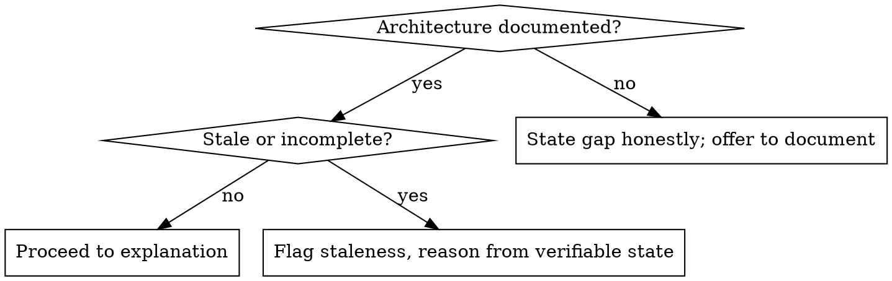
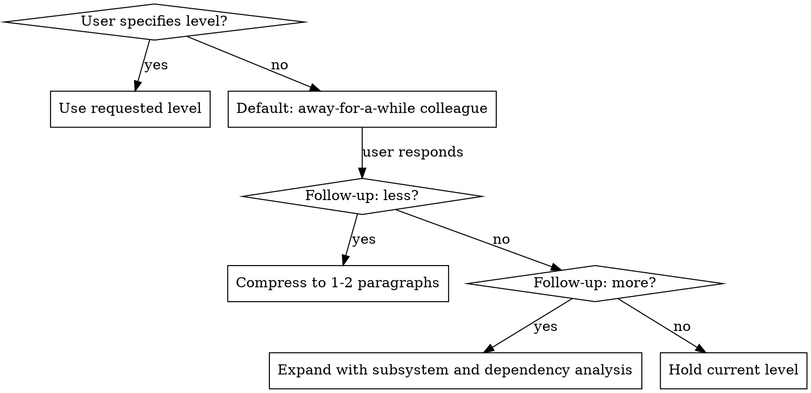

# Where Does This Fit

## Overview

Explains where a specific work item sits in the project's larger architecture, goals, and feature structure. Surfaces conflicts, ambiguities, and inconsistencies the user may need to resolve before proceeding. Leaves both the user and the agent better-informed for brainstorming, deciding, and implementing.

## Step 0: Pre-flight — is architecture documented?

Before explaining anything, verify the project's goals and architecture are available and current.

**Probe in order:**

1. `AGENTS.md` / `CLAUDE.md` in the project root — does it carry high-level goals, active work, and an architecture overview?
2. Referenced in-project docs — specs, ADRs, and architecture pages the orientation file points at.
3. A knowledge graph, if the project builds one.


```dot
digraph preflight {
    "Architecture documented?" [shape=diamond];
    "Stale or incomplete?" [shape=diamond];
    "Proceed to explanation" [shape=box];
    "Flag staleness, reason from verifiable state" [shape=box];
    "State gap honestly; offer to document" [shape=box];

    "Architecture documented?" -> "Stale or incomplete?" [label="yes"];
    "Architecture documented?" -> "State gap honestly; offer to document" [label="no"];
    "Stale or incomplete?" -> "Flag staleness, reason from verifiable state" [label="yes"];
    "Stale or incomplete?" -> "Proceed to explanation" [label="no"];
}
```

**If documentation is insufficient:** do not fabricate context. State the problem clearly:

> "The project's architecture and goals aren't documented clearly enough for me to give you a confident big-picture answer. Before proceeding, we should capture this — the right place is AGENTS.md. Want me to help draft a high-level goals and architecture section? That unlocks this skill for every future question."

**If stale:** flag it, name the stale element, and reason only from what you can verify. Do not silently treat outdated milestones or closed epics as current.

## Step 1: Gather the work item and its context

```bash
work show <id> <parent-id>    # the item and its container, in one call
work list --parent <epic-id>  # the sibling work that surrounds it
```

Then read the project's own orientation file for its stated goals and architecture. Read what it says today rather than what you remember it saying — a project's structure section is exactly the prose that rots.

A knowledge graph, where one exists, surfaces structural relationships grep cannot. Treat it as a **snapshot someone built at some past moment, not an index that follows the tree**: a graph built before a refactor still names the files that refactor deleted. Verify anything it reports against the working tree before asserting it, or rebuild it first.

## Step 2: Construct the explanation

Default audience: **someone familiar with the project in general but who has been away long enough that the structural context is no longer obvious.** That produces a few paragraphs — not a line, not a dissertation.

Address these four layers in order:

| Layer | Question to answer |
|---|---|
| **Project context** | Which goal or active milestone does this serve? Where is it on the roadmap? |
| **Feature/epic context** | What parent container owns this? What sibling work surrounds it? |
| **Functional impact** | Which system areas, subsystems, workflows, or user-facing behaviours does this touch or change? |
| **Conflicts / ambiguities / inconsistencies** | What needs human attention before proceeding? |

The fourth layer is not optional — it is often the most valuable part. Surface it even if there is nothing to flag (say so briefly).

## Step 3: Calibrate detail level


```dot
digraph detail {
    "User specifies level?" [shape=diamond];
    "Use requested level" [shape=box];
    "Default: away-for-a-while colleague" [shape=box];
    "Follow-up: less?" [shape=diamond];
    "Compress to 1-2 paragraphs" [shape=box];
    "Follow-up: more?" [shape=diamond];
    "Expand with subsystem and dependency analysis" [shape=box];
    "Hold current level" [shape=box];

    "User specifies level?" -> "Use requested level" [label="yes"];
    "User specifies level?" -> "Default: away-for-a-while colleague" [label="no"];
    "Default: away-for-a-while colleague" -> "Follow-up: less?" [label="user responds"];
    "Follow-up: less?" -> "Compress to 1-2 paragraphs" [label="yes"];
    "Follow-up: less?" -> "Follow-up: more?" [label="no"];
    "Follow-up: more?" -> "Expand with subsystem and dependency analysis" [label="yes"];
    "Follow-up: more?" -> "Hold current level" [label="no"];
}
```

| Level | Shape |
|---|---|
| **Brief** | 1-2 paragraphs — just "what fits where" |
| **Default** | 3-5 paragraphs covering all four layers |
| **Deep dive** | Full structural analysis: dependency chains, subsystem interactions, risk surface, open sibling work |

Adjust on follow-up without re-reading everything from scratch.

If the session is running under a brevity or compression mode, apply it to the preamble, confirmations and wrap-up — **never to the explanation body or the conflict callouts.** A compressed big-picture explanation defeats its own purpose; clarity here requires complete sentences.

## Conflict and ambiguity callouts

Surface these separately, clearly labelled:

> **Conflict:** [work item scope contradicts a stated project goal or milestone boundary]
>
> **Ambiguity:** [unclear how this work connects to the larger picture; multiple valid interpretations]
>
> **Inconsistency:** [parent container says one thing; work item implies another]
>
> **Staleness:** [referenced milestone, goal, or epic appears closed or superseded]

If there is nothing to flag, close with one sentence: "No conflicts or ambiguities found in the current documentation."

## Common mistakes

| Mistake | Fix |
|---|---|
| Fabricating architectural context when docs are sparse | State the gap; offer to document it — never invent what isn't there |
| Starting from the item and staying there | Always start from the project goal and work DOWN to the item |
| Skipping the conflict/ambiguity layer | It's the most useful part — always include it, even to say "none found" |
| Treating a stale orientation file as ground truth | Verify container and milestone status with `work show`; flag discrepancies |
| Trusting a knowledge graph that predates the tree | Check its claims against the working tree, or rebuild it |
| Giving a deep dive by default | Default is "been away a while" — a few paragraphs, not an essay |
