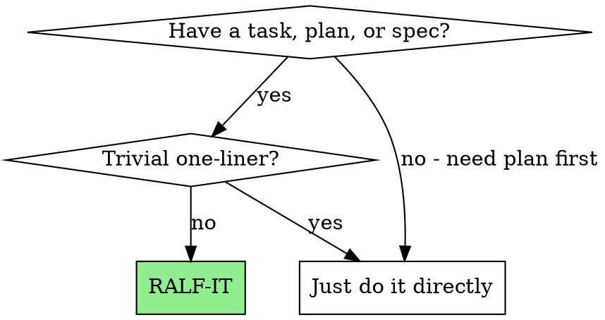
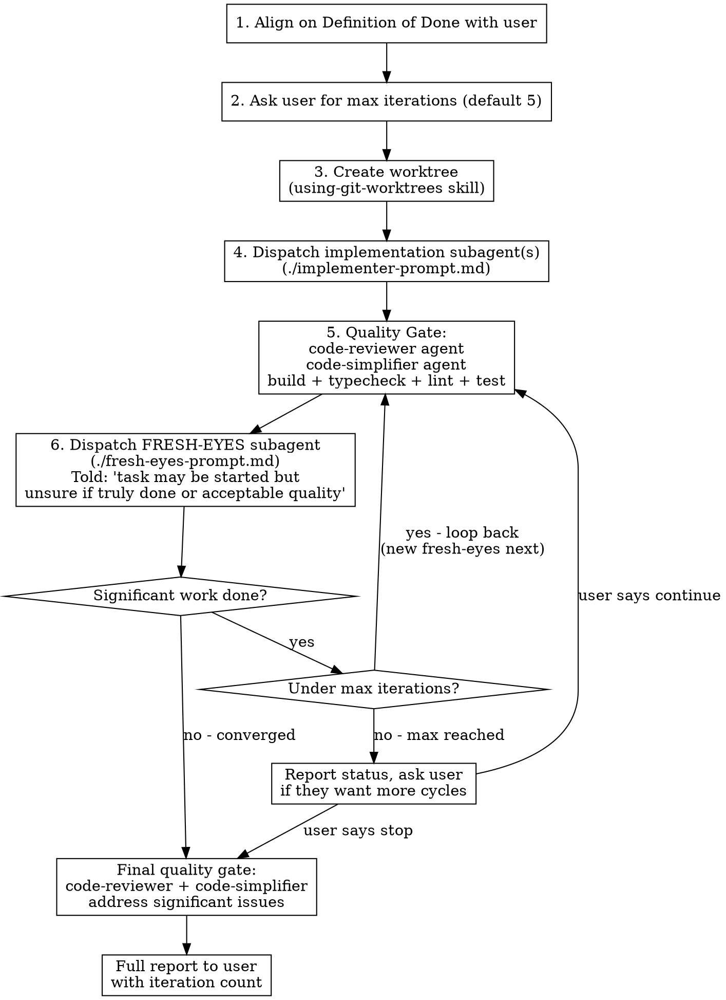

# RALF-IT: Refine, Assess, Loop, Finalize

Execute work through iterative refinement cycles where each cycle dispatches a fresh-eyes subagent to find and fix what the previous pass missed. Produces substantially higher quality than single-pass execution.

**Core principle:** Fresh subagent per refinement cycle + quality gates between cycles = converging on excellence.

**Announce at start:** "I'm using RALF-IT to execute this with iterative refinement."

## When to Use



- Implementation of features, bug fixes, refactors
- Executing written plans or design specs
- Any task where quality matters more than speed
- Multi-file changes where things can fall through cracks

**Don't use for:** Config tweaks, typo fixes, single-line changes, pure research/exploration.

## The Process



## Step-by-Step

### Step 1: Align on Definition of Done

Before touching code, ensure crystal clarity on the outcome:

1. Read the task/plan/spec completely
2. State back to the user: "Here's what I understand the Definition of Done to be: [list]"
3. Include acceptance criteria: build passes, typecheck passes, tests pass, plus task-specific criteria
4. Get explicit user confirmation before proceeding

**If the input is a bead/issue:** Read it with `bd show <id>` and extract acceptance criteria.
**If the input is a plan file:** Read it and summarize the expected deliverables.
**If the input is verbal:** Restate it precisely and confirm.

### Step 2: Ask for Iteration Count

```
How many RALF iterations would you like? (default: 5)

Each iteration dispatches a fresh-eyes subagent to find and fix
what previous passes missed. Most tasks converge in 2-3 cycles.
Early exit if the fresh-eyes subagent finds nothing significant.
```

Store the answer as `MAX_ITERATIONS`. Proceed with default if user says "default" or doesn't specify.

### Step 3: Create Worktree

**REQUIRED SUB-SKILL:** Use superpowers:using-git-worktrees

Create an isolated worktree for all RALF work. All subagents work in this worktree.

### Step 4: Dispatch Implementation Subagent(s)

Dispatch one or more subagents to execute the initial implementation using `./implementer-prompt.md`.

- For plans with multiple independent tasks, dispatch per task (sequentially, not parallel — avoid conflicts)
- For single tasks, dispatch one implementer
- Subagents should follow TDD, commit their work, and self-review

Wait for all implementation to complete before proceeding.

### Step 5: Quality Gate

Run these in sequence:

1. **code-reviewer agent** — Full code review against the spec/plan
2. **code-simplifier agent** — Simplify and refine for clarity
3. **Build quality checks** — `pnpm build && pnpm typecheck && pnpm lint` (or project equivalent)
4. **Tests** — Run the relevant test suite

If the code-reviewer or code-simplifier finds significant issues, have them fix what they can. Record what was found for the fresh-eyes subagent.

### Step 6: Dispatch Fresh-Eyes Subagent

This is the core RALF innovation. Dispatch a **brand new** subagent using `./fresh-eyes-prompt.md`.

Key properties of the fresh-eyes dispatch:
- **New subagent** — no context from previous implementation (fresh perspective)
- **Told the task may be incomplete** — not told "verify this is done," but rather "this may have been started, assess and complete it"
- **No iteration count exposed** — do NOT tell the subagent which iteration it is or how many have run. Knowing "iteration 3 of 5" biases toward shallower assessment ("others already checked this"). The controller tracks iterations internally; the subagent should approach every assessment as if it's the first.
- **Given the original spec/plan** — not the previous agent's summary
- **Empowered to change anything** — not just review, but fix

The fresh-eyes subagent reports back:
- What it found (issues, gaps, incomplete work)
- What it changed
- Whether it considers the work complete
- Any remaining concerns

### Step 7: Evaluate and Loop

Set `iteration = 1` before the first fresh-eyes dispatch. After each fresh-eyes report:

```
IF fresh-eyes found nothing significant AND reports work complete:
    → Exit loop early. Proceed to Final Review.

IF fresh-eyes did significant work:
    IF iteration < MAX_ITERATIONS:
        → iteration += 1
        → Go to Step 5 (Quality Gate) with new fresh-eyes next
    ELSE:
        → Report to user: "Reached {MAX_ITERATIONS} iterations.
           Last fresh-eyes subagent still found significant work:
           [summary of what was found/fixed].
           Want to run more cycles?"
        → If user says yes: increase MAX_ITERATIONS, continue loop
        → If user says no: proceed to Final Review
```

**"Significant work"** means: the fresh-eyes subagent made functional changes, fixed bugs, added missing functionality, or addressed gaps in test coverage. Cosmetic-only changes (formatting, minor renames) do NOT count as significant.

### Step 8: Final Review

After the loop exits:

1. Run **code-reviewer agent** one final time
2. Run **code-simplifier agent** one final time
3. Address any significant issues they surface
4. Run full build + typecheck + lint + test one more time

### Step 9: Report

Present a complete report to the user:

```markdown
## RALF-IT Complete

**Task:** [description]
**Iterations:** [N] of [MAX] (early exit: yes/no)
**Definition of Done:** [met/not met, with details]

### Iteration Summary
- **Initial implementation:** [what was built]
- **Iteration 1:** [what fresh-eyes found and fixed]
- **Iteration 2:** [what fresh-eyes found and fixed]
- ...

### Quality Status
- Build: PASS/FAIL
- Typecheck: PASS/FAIL
- Lint: PASS/FAIL
- Tests: PASS/FAIL ([N] tests)
- Code review: [summary]

### Files Changed
[list of files]

### Remaining Concerns
[any issues the user should be aware of]
```

After reporting, use **superpowers:finishing-a-development-branch** to present merge/PR options.

## Prompt Templates

- `./implementer-prompt.md` — Dispatch initial implementation subagent(s)
- `./fresh-eyes-prompt.md` — Dispatch fresh-eyes refinement subagent

## Quick Reference

| Situation | Action |
|-----------|--------|
| User gives a plan | Read it, align on DoD, RALF-IT |
| User gives a bead ID | `bd show`, extract criteria, RALF-IT |
| User gives verbal task | Restate DoD, confirm, RALF-IT |
| Fresh-eyes finds nothing | Early exit, proceed to final review |
| Max iterations reached | Report to user, ask to continue |
| Fresh-eyes only cosmetic | Counts as converged, exit loop |
| Build/test fails in gate | Fix before dispatching fresh-eyes |
| Task is trivial | Don't use RALF-IT, just do it |

## Red Flags

**Never:**
- Skip Definition of Done alignment (the whole point is knowing when you're done)
- Reuse a subagent for fresh-eyes (must be brand new, no prior context)
- Tell the fresh-eyes subagent which iteration it is (biases toward shallower assessment)
- Tell the fresh-eyes subagent "just verify this is done" (tell it "this may be incomplete, assess and complete")
- Skip quality gates between iterations (that's where issues surface)
- Count cosmetic-only changes as "significant work" (inflates iteration count)
- Run fresh-eyes subagents in parallel (they'd conflict)
- Skip the final review pass (last chance to catch issues)
- Exceed max iterations without asking the user

**Always:**
- Get DoD confirmation before starting
- Use a worktree for isolation
- Give fresh-eyes the ORIGINAL spec, not the previous agent's summary
- Track iteration count and report it
- Exit early when converged (don't waste iterations)

## Integration

**Required workflow skills:**
- **superpowers:using-git-worktrees** — REQUIRED: Isolated workspace
- **superpowers:finishing-a-development-branch** — REQUIRED: After RALF completes

**Quality gate agents:**
- **superpowers:code-reviewer** — Code review between iterations
- **code-simplifier:code-simplifier** — Code simplification between iterations

**Subagents should use:**
- **superpowers:test-driven-development** — TDD for implementation

**RALF-IT replaces these for complex work:**
- **superpowers:subagent-driven-development** — RALF-IT adds iterative refinement on top
- **superpowers:executing-plans** — RALF-IT adds fresh-eyes cycles

## Why This Works

Single-pass development has a fundamental flaw: the implementing agent is blind to its own assumptions. It builds a mental model, codes to that model, and reviews against that same model. Bugs and gaps that fit the model are invisible.

Fresh-eyes subagents break this cycle. Each new subagent:
- Has no knowledge of shortcuts taken
- Reads the spec with fresh understanding
- Notices gaps the previous agent rationalized away
- Isn't anchored to "but I already built it this way"

Empirically, most tasks converge in 2-3 iterations. The first fresh-eyes pass catches the most issues. Subsequent passes catch progressively less, until convergence.
