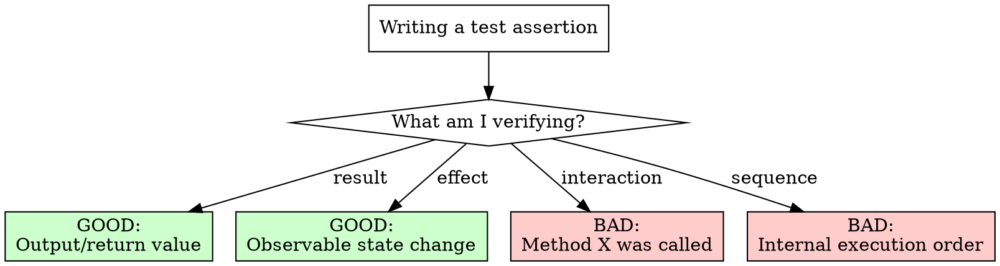
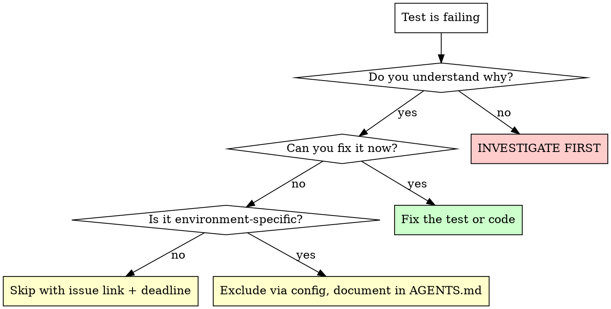

# Writing Unit Tests

## Overview

Good tests verify behavior, not implementation. Bad tests cement complexity and break on every refactor.

**Core principle:** If you can't test it simply, the code needs refactoring—not more mocks.

**Violating the letter of these rules is violating the spirit of good testing.**

## The Iron Laws

```
1. TEST BEHAVIOR, NOT IMPLEMENTATION
2. REFUSE TO TEST UNTESTABLE CODE—REFACTOR FIRST
3. MOCKS ARE A SMELL, NOT A SOLUTION
```

## When to Push Back

**REFUSE to write tests when:**

- Function has 5+ dependencies requiring mocks
- Function has 10+ conditionals or early returns
- Test setup exceeds 20 lines of mock configuration
- You're testing "did method X get called" instead of "did it produce correct output"

**What to say:**

> "This code isn't testable in its current form. Writing tests would cement the complexity. Let's refactor into smaller units first, then test each unit simply."

**No exceptions:**
- Not for "90% coverage by EOD"
- Not for "tech lead approved it"
- Not for "it's already in production"
- Not for "just add a quick test"

Untestable code + tests = two problems instead of one.

## Behavior vs Implementation



### Good: Behavior Tests

```typescript
it('returns full name when no nickname', () => {
  const user = { firstName: 'Jane', lastName: 'Doe' };
  expect(formatDisplayName(user)).toBe('Jane Doe');
});

it('returns nickname when present', () => {
  const user = { firstName: 'Jane', lastName: 'Doe', nickname: 'JD' };
  expect(formatDisplayName(user)).toBe('JD');
});
```

Tests actual output. Survives any refactor that preserves behavior.

### Bad: Implementation Tests

```typescript
it('should call validator.validate with card', async () => {
  mockValidator.validate.mockResolvedValue(true);
  await processor.processPayment(100, card);
  expect(mockValidator.validate).toHaveBeenCalledWith(card);
});
```

Tests that code calls a method. Breaks on any internal change. Proves nothing about correctness.

## Test Doubles: Mocks vs Fakes vs Spies

| Type | What It Does | When to Use |
|------|--------------|-------------|
| **Fake** | Simple working implementation | Default choice—database → in-memory map |
| **Stub** | Returns canned responses | External services with predictable responses |
| **Spy** | Records calls to real object | Verifying side effects (analytics, logging) |
| **Mock** | Verifies specific calls | Almost never—last resort |

### Prefer Fakes

```typescript
// GOOD: Fake implementation
const users = new Map<string, User>();
const fakeDb = {
  findById: async (id: string) => users.get(id) ?? null
};

it('returns user display name', async () => {
  users.set('123', { firstName: 'Jane', lastName: 'Doe' });
  const name = await service.getDisplayName('123');
  expect(name).toBe('Jane Doe');
});
```

### Avoid Mock Forests

```typescript
// BAD: Mock everything
let mockDb: jest.Mocked<Database>;
let mockCache: jest.Mocked<CacheService>;
let mockLogger: jest.Mocked<Logger>;
let mockMetrics: jest.Mocked<MetricsService>;

beforeEach(() => {
  mockDb = { users: { findById: jest.fn() } } as any;
  mockCache = { get: jest.fn(), set: jest.fn() } as any;
  mockLogger = { info: jest.fn(), warn: jest.fn() } as any;
  mockMetrics = { track: jest.fn() } as any;
  // 20 lines of setup before any test
});
```

If you need 4+ mocks, the code is too coupled. Refactor it.

## When Mocks ARE Appropriate

1. **External services you don't control** (payment gateways, third-party APIs)
2. **Non-deterministic behavior** (time, random, network)
3. **Expensive operations** (only when fakes aren't feasible)

Even then, prefer integration tests with test accounts over mocks.

## Test Isolation

Each test must:
- Set up its own state
- Not depend on other tests running first
- Not leave state that affects other tests
- Pass when run alone or in any order

```typescript
// BAD: Shared mutable state
let counter = 0;
beforeEach(() => { counter++; });

it('test 1', () => { expect(counter).toBe(1); }); // Passes first
it('test 2', () => { expect(counter).toBe(1); }); // Fails!

// GOOD: Fresh state per test
it('test 1', () => {
  const counter = createCounter();
  counter.increment();
  expect(counter.value).toBe(1);
});
```

## Business Logic vs Incidentals

**Test business logic:**
- Calculation correctness
- Validation rules
- State transitions
- Business rule enforcement

**Don't test incidentals:**
- Logging calls
- Metric tracking
- Cache key formats
- Internal method call order

```typescript
// GOOD: Tests business rule
it('caps commission at 50% of sales', () => {
  const commission = calculateCommission(1000, { rate: 0.8 });
  expect(commission).toBe(500); // Capped, not 800
});

// BAD: Tests logging
it('should log when processing', async () => {
  await processOrder(order);
  expect(mockLogger.info).toHaveBeenCalledWith('Processing order');
});
```

## Refactoring for Testability

When code is untestable, decompose it:

```typescript
// BEFORE: Untestable monolith
async function processOrder(order, db, cache, logger, metrics, notifications) {
  // 200 lines mixing everything
}

// AFTER: Testable units
function validateOrder(order: Order): ValidationResult { /* pure */ }
function calculateTotal(items: Item[], discount: number): number { /* pure */ }
function applyDiscounts(order: Order, rules: DiscountRule[]): Order { /* pure */ }

// Integration just wires them together
async function processOrder(order: Order, deps: OrderDeps): Promise<Result> {
  const validation = validateOrder(order);
  if (!validation.valid) return { error: validation.error };

  const total = calculateTotal(order.items, order.discount);
  // etc.
}
```

Each pure function is trivial to test. Integration test verifies wiring.

## Common Rationalizations

| Excuse | Reality |
|--------|---------|
| "Team pattern requires mocking everything" | Bad patterns don't become good through repetition. Push back. |
| "Need 90% coverage by EOD" | Coverage without behavior verification is theater. |
| "Tech lead wrote it, just add tests" | Authority doesn't make untestable code testable. |
| "It's already in production" | Sunk cost. Cementing bad design costs more long-term. |
| "Just a quick test" | Quick bad test = permanent maintenance burden. |
| "Mock tests are team standard" | Standards can be wrong. Demonstrate better alternatives. |
| "Don't have time to refactor" | Time to write mock forest > time to extract pure function. |

## Red Flags - STOP

If you're about to:
- Write `expect(mock.method).toHaveBeenCalledWith(...)` as main assertion
- Create 4+ mocks in beforeEach
- Write 20+ lines of test setup
- Test that internal methods were called in order
- Add tests to code you know is poorly structured
- Follow a "team pattern" that tests implementation

**STOP. Propose refactoring instead.**

## Test Suppression and Exclusion

Skipping tests is sometimes necessary, but often hides bugs—both current and future. Treat every skip as technical debt that accrues interest.

### When Skipping IS Appropriate

| Scenario | Example | Required Action |
|----------|---------|-----------------|
| **Environment limitation** | IPC tests fail in sandbox | Document in AGENTS.md, exclude via pattern |
| **Flaky external dependency** | Third-party API rate limits | Fix the flakiness, skip temporarily with issue link |
| **WIP during development** | TDD red phase | Remove skip before PR merge |
| **Known platform bug** | OS-specific failure with upstream fix pending | Link to upstream issue, set reminder |

### When Skipping is HIDING BUGS

**Never skip tests to:**
- Make CI green for a deadline
- Avoid investigating a failure you don't understand
- "Fix later" without a concrete plan
- Work around code that "shouldn't fail but does"
- Ignore failures that only happen "sometimes"

```typescript
// DANGEROUS: Hiding a real bug
it.skip('processes payment correctly', () => {
  // Started failing last week, skip for now
});

// DANGEROUS: Flaky test ignored instead of fixed
it.skip('handles concurrent requests', () => {
  // Works locally, fails in CI sometimes
});
```

Both of these are time bombs. The "flaky" test might be catching a real race condition.

### Skip Hygiene

**Every skipped test MUST have:**

1. **A reason in the test name or comment**
2. **A tracking issue or TODO with owner**
3. **A condition for re-enabling**

```typescript
// GOOD: Documented skip with actionable context
it.skip('connects via Unix socket (sandbox blocks EPERM)', () => {
  // See AGENTS.md §sandbox_testing
  // Re-enable: run with INTEGRATION_TESTS=1 outside sandbox
});

// GOOD: Skip with issue link
describe.skip('Stripe webhook handling', () => {
  // Skip: Stripe test mode rate-limited, see #1234
  // Re-enable: when we set up dedicated test account
});

// BAD: Mystery skip
it.skip('validates user input', () => {
  // No explanation—is this broken? obsolete? platform-specific?
});
```

### Skip Patterns by Test Runner

```typescript
// Vitest/Jest - conditional skip
it.skipIf(!process.env.INTEGRATION_TESTS)('requires real database', ...)
it.runIf(process.platform === 'linux')('Linux-specific behavior', ...)

// Vitest/Jest - unconditional (use sparingly)
it.skip('reason in name: broken upstream #123', ...)
describe.skip('Feature X: blocked by #456', ...)

// Jest only - todo marker (clearer intent than skip)
it.todo('should handle edge case Y')
```

### Exclusion via Test Configuration

For systematic exclusions (not one-off skips):

```typescript
// vitest.config.ts - exclude patterns
export default defineConfig({
  test: {
    exclude: [
      '**/node_modules/**',
      '**/{ipc,daemon-client}.test.ts', // Sandbox limitation, see AGENTS.md
    ],
  },
});
```

Document exclusion patterns in AGENTS.md or a test README—don't hide them in config.

### Red Flags for Test Suppression

| Red Flag | What It Usually Means |
|----------|----------------------|
| Skip count increasing over time | Tests are being abandoned, not fixed |
| Skips without explanations | No one knows if they're still relevant |
| Skips older than 3 months | Either fix or delete—stale skips rot |
| `skip` added in same PR as code change | Possibly hiding a regression |
| Skipping "flaky" tests | Often real bugs with non-deterministic triggers |
| Bulk skips before deadline | Tech debt explosion incoming |

### Before You Skip: Decision Tree



**Never skip a test you don't understand.** That's not fixing—it's hiding.

## Verification Checklist

Before submitting tests:

- [ ] Tests verify outputs/behavior, not method calls
- [ ] Each test name describes the behavior being verified
- [ ] Tests use fakes over mocks where possible
- [ ] No test depends on another test's execution
- [ ] Setup is under 10 lines per test
- [ ] Would these tests survive an internal refactor?
- [ ] Any skipped tests have documented reasons and tracking issues

Can't check all boxes? Refactor the code or the tests.
